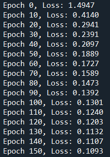
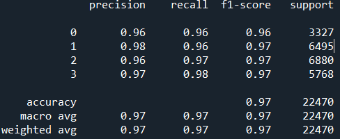
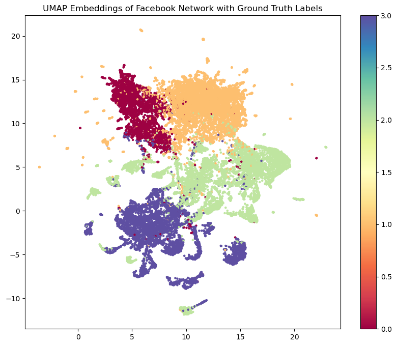

# GCN Model for Facebook Dataset
**Author:** Hemil Nikesh Shah, 47851672.

## Project Overview

In this project, we develop a GCN model to classify nodes within a social network graph. The dataset contains features for each user (node), edges representing relationships, and target labels indicating the category of each node. The goal is to train the GCN to correctly predict these categories, utilizing graph structure and node-level features

## Algorithm Workflow

## 1. Dataset Loading:

Load the graph data, including node features, edges, and target labels.

## 2. Pre-processing:

Ensure that edges are properly formatted, and self-loops are added to stabilize training.

## 3. GCN Model Forward Pass:

Perform graph convolutions over node features using three GCN layers.

Use ReLU activations after the first two layers for non-linearity.

Output layer generates logits for multi-class classification.

## 4. Training:

Use Cross-Entropy Loss for multi-class classification.

Adam Optimizer with a learning rate of 0.01 and weight decay of 5e-4.

Train for 160 epochs and monitor the loss every 10 epochs.

## 5. Prediction and Evaluation:

Evaluate the model using accuracy score and classification report from sklearn.

Generate predictions by selecting the class with the highest logit value.

## 6. Visualization:

Use UMAP to visualize the learned embeddings and analyze cluster separation.

## 7. Model Architecture

The GCN model consists of 3 layers:

GCNConv 1: Input layer with size matching the number of input features (128)

GCNConv 2: Hidden layer with 64 hidden units

GCNConv 3: Output layer matching the number of unique classes

Activation Function: ReLU is applied after the first two layers to introduce non-linearity.

Optimizer: Adam with a learning rate of 0.01 and weight decay of 5e-4.

Loss Function: CrossEntropyLoss for multi-class classification.

## 8. Results and Performance

The model shows a steady decrease in loss, indicating successful learning. By the end of 160 epochs, the loss converges to 0.1093.

## 9. Evaluation Results

The model achieves high accuracy on the node classification task. Below are the performance metrics:

Overall Accuracy: 96%

Macro Average: Precision = 0.96, Recall = 0.95, F1-Score = 0.95
Weighted Average: Precision = 0.96, Recall = 0.96, F1-Score = 0.96

The results indicate that the model performs well across all classes with minimal variance in precision, recall, and F1-score.

## 10. Embedding Visualization

Using UMAP, we project the high-dimensional embeddings into a 2D space for visualization.This visualization helps confirm that the model has learned meaningful representations for the node categories.

