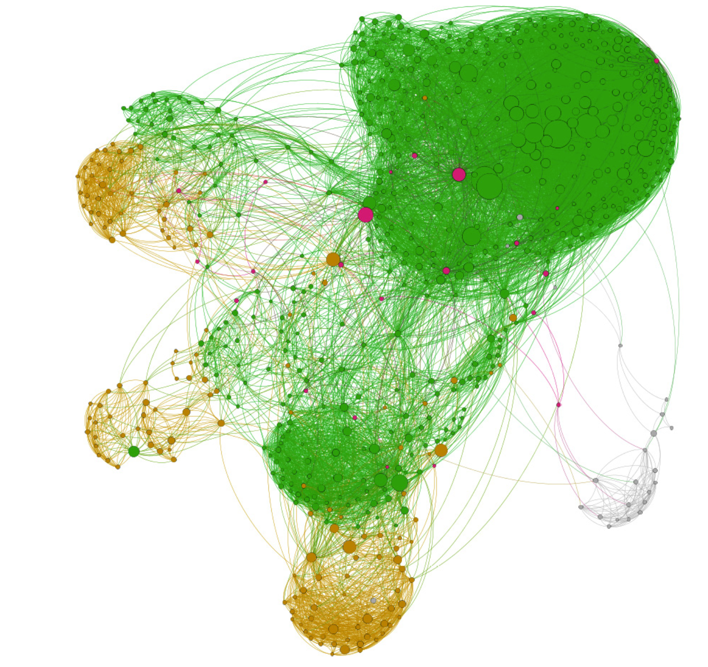
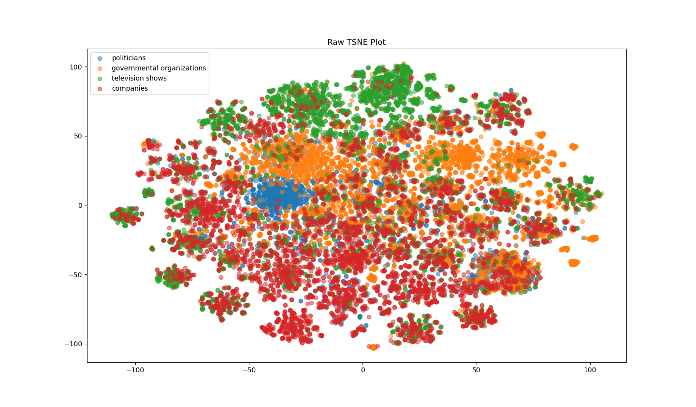
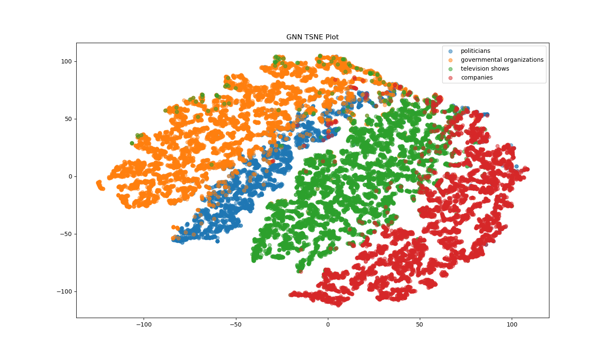

# Multi-Layer Graph Neural Network For Categorisation of Facebook Large Page-Page Network Dataset
Course: COMP3710 Pattern Recognition
Author: Liam Mulhern (S4742847)
Date: 26/10/2024

## Project Specification

Creates a multi-layer graph neural network (GNN) model for semi supervised multi-class node classification using Facebook Large Page-Page Network dataset with 93.2% Accuracy. This report includes TSNE embeddings plot before and after model training providing a brief interpretation and discussion of results.

## Dependencies

- `python 3.11`
- `pytorch 2.4.1`
- `pytorch geometric 2.4`
- `matplotlib`
- `numpy`
- `scipy`
- `networkx`

## Files

- `dataset.py`: Contains the data loader for loading and preprocessing the Facebook Large Page-Page (FLPP) Network dataset.
- `main.py`: Entry point for GNN classification with CLI arguments.
- `modules.py`: Contains the source code for the GNN model components.
- `train.py`: Contains the source code for training, validating, testing and saving the model. The model is imported from “modules.py” and the data loader is imported from “dataset.py”. Losses and metrics are plotted during training.
- `predict.py`: Runs inference on the trained GNN classification model. Prints out results and provides visualisations of TSNE embeddings.
- `utils.py`: Utility functions used for model implementation.

### Auxiliary Files

- `runner.sh`: SLURM shell script for training model
- `tests.py`: Unit tests for python files
- `gnn_classifier.csv`: Output csv at each epoch of model training

## Execution

> [!IMPORTANT]
> It is recommended that a python environment is utilsed for managing dependencies such a conda.

For help, execute the following shell command:

```bash
conda activate torch

python main.py --help
```

# Discussion

## Dataset

The [Facebook Large Page-Page Network](https://snap.stanford.edu/data/facebook-large-page-page-network.html) dataset is utilised, where nodes represent official Facebook pages while the links are mutual likes between sites. The sites are categorised into:
1. Politicians
2. Governmental Organizations
3. Television Chows
4. Companies

The dataset was pre-processed into a 3 numpy arrays:
- edges: The undirected graph connections between nodes in the dataset formatted as tuples from the start node to the end node.
- features: The features of each of the nodes stored in a 128 dimensions vector created from textual descriptions written by the owners of these pages.
- targets: The categorisation target of each node.

The dataset has 22470 nodes with a 128 dimension feature set, sourced from [Graph Mining Datasets](https://graphmining.ai/datasets/ptg/facebook.npz).

The network is visually represented as the following graph where colour represents the category and size reperesents the degree of the node.

- Green: Companies
- Yellow: Governmental Organizations
- Magenta: Politicians
- Grey: Television Shows



## Graph Neural Network (GNN) Model

### Theoretical Overview

Graphs typically have up to four types of attributes that can be utilised to extrapolate a prediction:

1. Nodes: The distinct vertices in the graph carrying contextual information.
2. Edges: The edges connecting neighbouring nodes.
3. Context: The features present at a node.
4. Connectivity: The global connections of the graph and how nodes, and implicitly features, interact with one another.

Thus, a GNN implements a method of taking a graph and applying an optimisable transformation on these attributes which preserves its symmetries and edges.

### Realised Implementation

The GNN implemented in `modules.py` makes use of 2 multilayer perceptrons to embed the trained graph attributes for classification. For each of the nodes, edges, and features the MLP is applied returning a learned embedding for the graph given the target classification.

A GNN layer is constructed from a sparse layer which applies a linear transformation to the graph attributes and reapplies them to the graph adjacency matrix. These sparse layers are then trained to synthesise the data to the classification estimation.

The first sparse layer takes the 128 dimension feature vector as input and outputs an embedded 16 dimension hidden layer. The second sparse layer takes the embedded 16 dimension vector as input and embeds it into the 4 classification layers of the dataset.

Between the two sparse layers is a relu activated function that clamps the output space of the GNN. A log softmax is then applied to the classified space so cross entropy loss and the probabilistic outcome can be calculated by taking the exponential of the output.

## Training Hyperparameters

- Learning Rate: 1e-3
- Epochs: 100
- Batch Size: 200
- Optimisation Strategy: Adaptive Moment Estimation (Adam)
- Loss Type: Cross Entropy

## Results

### GNN Pre-Training FLPP TSNE

Before computing the trained GNN model the following scatter plot displaying the t-distributed stochastic neighbour embedding of the 4 categories was generated.



This figure clearly exhibits little to no correlation in group clustering based on category. This implies that given a node's feature vector the model's ability to categorise the data point is visibly random beyond the visualisations seeded clustering.

### GNN Post-Training FLPP TSNE

After training the GNN model on the FLPP dataset it is clear that the post training TSNE features a strong correlation between grouped categorised groups. This is visible through the like-neighbour clustering 



### GNN Training Accuracy and Loss


## Conclusion


# References

[1] https://distill.pub/2021/gnn-intro/
[2]
