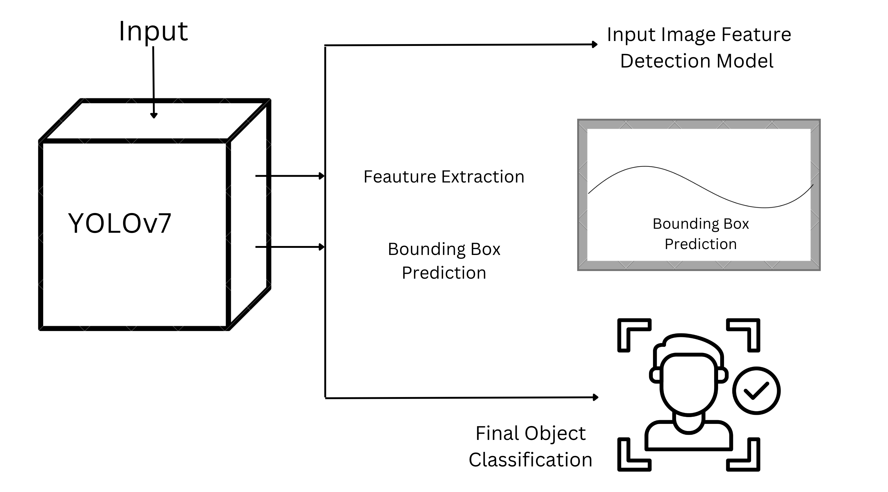

# Lesion Detection on ISIC Dataset with YOLOv7

## Description:

> This project aims to detect lesions in dermoscopic images from the ISIC 2017/2018 dataset using the YOLOv7 object detection model. The primary goal is to implement a solution that achieves a minimum Intersection Over Union (IoU) of 0.8 on the test set, ensuring reliable detection and localization of lesions within each image. Additionally, the model is expected to achieve a suitable accuracy for lesion classification, enhancing the utility of this approach for real-world applications in skin cancer detection.

## Problem Statement:

> The primary objective of this project is to detect lesions in dermoscopic images from the ISIC 2017/2018 dataset using the YOLOv7 model, aiming for an Intersection Over Union (IoU) of at least 0.8. Accurate lesion detection is essential for early skin cancer diagnosis, especially for aggressive forms like melanoma, where early treatment significantly improves outcomes. Automated detection systems can streamline the diagnostic process, reduce errors, and support dermatologists in more efficient, accurate diagnoses, potentially enhancing patient survival rates.

## Algorithm Explanation:

> YOLOv7 is a state-of-the-art, single-stage object detection model that processes entire images in a single forward pass, enabling real-time detection with high accuracy. It achieves this by optimizing network architecture and training strategies, resulting in faster inference speeds and improved precision compared to previous models.

## YOLOv7 Architecture:

## References

- "Skin Cancer Detection Using Convolutional Neural Networks: A Systematic Review," *National Center for Biotechnology Information (NCBI)*, https://pmc.ncbi.nlm.nih.gov/articles/PMC9324455/

