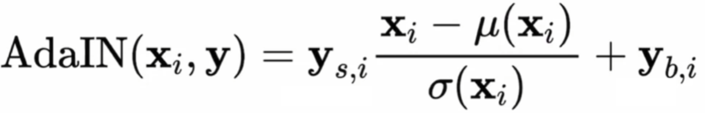

# StyleGAN Training from Scratch using the ADNI Dataset

This repository discusses the **training data augmentation**, **module development**, and the overall **training process** for the original StyleGAN model. Although more advanced models such as **StyleGAN2** and **StyleGAN3** have since been introduced, the original **StyleGAN** was chosen for this project due to its pioneering role in integrating the **style-based architecture** into generative adversarial networks (GANs).

For more details on the architecture, please refer to the original paper: [A Style-Based Generator Architecture for Generative Adversarial Networks](https://arxiv.org/abs/1812.04948).

## Table of Contents
- [Data Set](#data-set)
- [File Structure](#file-structure)
- [Model Architecture](#model-architecture)
- [StyleGAN Advantages](#stylegan-advantages)
- [StyleGAN Disadvantages](#stylegan-disadvantages)
- [Data Augmentation](#data-augmentation)
- [Training Process](#training)
  - [Test Run 1](#test-run-1)
  - [Test Run 2](#test-run-2)
- [Training Results](#training-results)
- [Training Loss](#training-loss)
- [T-SNE Plot](#t-sne-plot)
- [Cosine Similarity](#cosine-similarity)
- [FID Score](#fid-score)
- [Dependencies](#dependencies)
- [References](#references)

## Data Set

For this training, the **Alzheimer's Disease Neuroimaging Initiative (ADNI)** dataset was used. The dataset consists of MRI brain scans of patients with **Alzheimer's Disease (AD)** and **Normal Controls (NC)**. All images are in grayscale and have a resolution of **256 x 256 pixels**.

<p align="center">
 <div style="display: inline-block; text-align: center;">
 <p><strong>AD Image</strong></p>
 
 </div>

 <div style="display: inline-block; text-align: center;">
 <p><strong>NC Image</strong></p>
 
 </div>
</p>

The dataset contains approximately **30,000 images** in total, with **20,000** images allocated for training and **10,000** for testing. For the training of my StyleGAN, I exclusively used the training images, and they were sufficient to generate clear MRI brain scans.

## File Structure

This repository consists of the following five major files:
- **`dataset.py`**: Responsible for all data augmentation and batch loading.
- **`model.py`**: Defines the model architecture implemented using PyTorch. A large section of this was taken from Abd Elilah TAUIL's blog, which can be found in references. 
- **`params.py`**: Contains important parameters for the model.
- **`train.py`**: Defines the training loop and training function.
- **`predict.py`**: Implements a class for loading models and generating images.

## Model Architecture

<p align="center">
 
</p>

The StyleGAN model architecture is similar to the GAN with a few changes. The GAN model relied on an adversarial network that trained a Generator and a Discriminator to progressively improve the image generation outputs. However, a major issue with the GAN model was its proneness to overfitting, model collapse, and lack of diversity in the output images.

Some significant changes were made relative to the GAN model.

### Introduction of the Mapping Network

This network maps the latent space **$z$** with another latent space $w$. This allows more control over the generated images by influencing different layers of the generator with styles.

### Adaptive Instance Normalization (AdaIN)

<p align="center">
 
</p>

Adaptive Instance Normalization (AdaIN) adjusts the **mean** ( $\mu(x_i)$ ) and **variance**( $\sigma(x_i)$ ) of the input features (like an image) based on the style you want to apply.

### Mixing Regularization

This technique passes multiple latent vectors to different style layers, preventing overfitting and helping the model generalize styles better.

### Gradient Penalty

Some components of the model, such as the discriminator, were taken directly from the ProGAN paper. In addition, a gradient penalty module was created based on the **Wasserstein GAN with Gradient Penalty** paper.

```python
def gradient_penalty(disc, real, fake, alpha, train_step, device="CPU"):

    BATCH_SIZE, C, H, W = real.shape
 beta = torch.rand((BATCH_SIZE, 1, 1, 1)).repeat(1, C, H, W).to(device)
 interpolated_images = real * beta + fake.detach() * (1 - beta)
 interpolated_images.requires_grad_(True)
    
 mixed_scores = disc(interpolated_images, alpha, train_step)
 gradient = torch.autograd.grad(
        inputs=interpolated_images,
        outputs=mixed_scores,
        grad_outputs=torch.ones_like(mixed_scores),
        create_graph=True,
        retain_graph=True,
 )[0]
    
 gradient = gradient.view(gradient.shape[0], -1)
 gradient_norm = gradient.norm(2, dim=1)
 gradient_penalty = torch.mean((gradient_norm - 1) ** 2)
    
    return gradient_penalty
```

The model implementation was heavily inspired by a digital Ocean blog by [Abd Elilah TAUIL](https://blog.paperspace.com/author/abd/).

## StyleGAN Advantages

- High-Quality Image Generation: Produces highly realistic and detailed images
- Control Over Image Style: The StyleGAN is better at generalising styles due to its style mapping module 
- Progressive Training: Generator and Discriminator are initially trained on smaller images, and the list is slowly increased. This provided faster training

## StyleGAN Disadvantages

- Computationally Expensive: Requires large GPUs and long training times, particularly with larger image sizes
- Hard to extend to different modalities: It is difficult to adapt for video, audio, or non-image tasks.
- Highly Dependent on the data set used: It can be difficult to generate images which differ significantly from the training data

## Data Augmentation

```Python
augmentation_transforms = transforms.Compose([
 transforms.Grayscale(num_output_channels=1),
 transforms.Resize((image_size, image_size)),
 transforms.RandomHorizontalFlip(),
 Transforms.ToTensor()
])
```

To reduce overfitting, the following augmentations were applied. Random horizontal flips were performed, but vertical flips were excluded.

Additionally, the images were converted to grayscale with a single channel to improve training efficiency.

The image size was progressively adjusted throughout training, starting from 4x4 and scaling up to 256x256 per batch. This process will be discussed in detail in the following section.

## Training 

Due to the length and intensity of training, the model was trained on an external H100 GPU. The 2 data classes AD and NC were trained separately, in order to allow us to intentionally generate each class. 

### Test run 1 

The initial run had a wide range of issues. For this model, I attempted to directly generate 256 x 256 images, which manifested poorly as the model did not converge resulting in unrecognisable images. 

<p align="center">
 
</p>

This issue occurred due to an error in the data augmentation and generator setup. During this test run, the input image was processed with 3 channels, and augmentations such as saturation adjustments, blurring, and discolouration were applied. This led the model to mistakenly interpret the image as coloured. Additionally, using 3 channels caused the generator and discriminator to converge more slowly, contributing to the poor image quality observed above.

**Adjustments:**

1. The generator and data augmenter we set to only output greyscale images with single channels
2. The image sizes were progressively increased `IMAGE_SIZES = [4, 8, 16, 32, 64, 128, 256]`


### Test run 2

The images produced after the initial test 2 were significantly better. However, there was still one major problem related to GPU resource allocation. 

It was noticed that during the training CPU usage would remain relatively low and would occasionally drop off.

<p align="center">
 
</p>


This indicated that there was room to further utilise the CPU or that the model was being bottlenecked in a particular location. A similar problem was faced with the GPU utilisation, where particularly in the earlier image sizes **(4 to 64)**, the GPU was being underutilised. 

<p align="center">
 
</p>

**Adjustments:**
1. To further utilise the CPU the number of workers used in the data loader was increased from **6 -> 10**
2. In addition the batch sizes were doubled for each image size 

`BATCH_SIZES = {4: 256, 8: 128, 16: 64, 32: 32, 64: 16, 128: 8, 256: 4}`

`BATCH_SIZES = {4: 512, 8: 256, 16: 128, 32: 64, 64: 32, 128: 16, 256: 8}`

## Training Results 

The following plots show the progressive output from the generator at each image size, slowly increasing from 4, 8, 16, 32, 64, 128 and finally 256. In the earlier stages, the images appear highly pixelated due to the low resolution. Some blurring was unintentionally introduced by the image scaling software used during processing.

<p align="center">
 
</p>

<p align="center">
 
</p>


After training was completed each of these models was used to generate images. 

2 things of note:
1. These output images are highly detailed (of the same standard as the input dataset)
2. There is high diversity suggesting that the model did not experience mode collapse

<h2>AD Generated Images</h2>
<p align="center">
 
 
 
 
 
</p>


<h2>NC Generated Images</h2>
<p align="center">
 
 
 
 
 
</p>

## Training Loss

In the training process of my GAN, both the discriminator loss and generator loss show distinct patterns of spikes throughout the training cycle. These spikes are not random; they incrementally increase and correspond to specific points during the training where the model transitions to a higher-resolution image size. Each time the model completes a training stage, the image resolution is doubled. This causes an immediate and notable increase in both the discriminator and generator losses.

<p align="center">
 
</p>

At each of these transitions, the model starts training on images of a larger size, requiring the generator to produce higher-resolution images and the discriminator to evaluate them with higher detail.

<p align="center">
 
</p>

This incremental increase in the loss spikes can be clearly seen in the AD loss function graph. Arrows in the graph highlight the key points where the image size is doubled (e.g., from 32x32 to 64x64, and so on).

<h2>Model Benchmarking</h2>

## T-SNE Plot

<p align="center">
 
</p>

<p align="center">
 
</p>

The t-SNE plot was generated using the style codes from each model, which were then processed through TensorFlow's t-SNE function to visualize the clustering of these codes. Below, we present both a 2D t-SNE plot (with 2 components) and a 3D version (with 3 components). These plots show a clear distinction between two well-separated clusters, which suggests that the model has successfully developed a well-structured W space. This structure reflects the model's ability to identify and represent the two different styles in the dataset—likely corresponding to the Alzheimer's Disease (AD) and Normal Control (NC) brain images. Additionally, the clustering is evidence that the model has effectively generalized these styles, demonstrating its ability to distinguish between the two categories in the latent space.

### Cosine Similarity

On top of the t-SNE plot, the mean style code was calculated, and the cosine similarity between the AD and NC style vectors was computed. The resulting value of **0.0102** is close to zero, indicating that the vectors are nearly orthogonal in the W space. This suggests that the model has effectively learned to distinguish between the two styles (AD and NC).

Although these two styles—AD and NC—are very similar and sometimes indistinguishable by untrained professionals, the StyleGAN model, being trained specifically to recognize only these two styles, exaggerates the differences between them in the latent space. This further supports that the StyleGAN has successfully captured the subtle differences between the two categories, despite the minimal visual distinctions in the dataset.

### FID Score 

FID (Fréchet Inception Distance) is a metric used to evaluate the quality of images generated by the model. It compares the statistical distribution of real and generated images, where lower values indicate better quality. In this project, the Clean FID score was used to ensure a more consistent and reliable evaluation.

**Clean FID AD Score: 32.00**

**Clean FID NC Score: 39.58**

For this evaluation, 3000 real images and 3000 generated images were used for both the AD and NC models. A score around 30 is considered relatively good, as it suggests the generated images are reasonably close to the real ones. The original StyleGAN paper achieved an FID of 4.4159, however, it is difficult to compair these values directly as the paper used the FFHQ data set with 50000 images.

The AD model achieved a slightly better score, indicating that the images generated for the Alzheimer's Disease category are closer to the real data distribution compared to the NC (Normal Control) images. However, both scores suggest that the models are producing relatively good-quality images.

## Dependencies

- Python 3.7+
- PyTorch 1.10+
- CUDA (for GPU support)
- torchvision
- numpy
- tqdm
- matplotlib
- scikit-learn
- Pillow

## References 

- **Karras, Tero, et al.** "A Style-Based Generator Architecture for Generative Adversarial Networks." _arXiv preprint arXiv:1812.04948_ (2018). [Paper Link] (https://arxiv.org/abs/1812.04948)
- **Abd Elilah TAUIL.** "StyleGAN from Scratch: A Guide for Beginners." [Digital Ocean Blog](https://blog.paperspace.com/author/abd/)
- **Gulrajani, Ishaan, et al.** ["Improved Training of Wasserstein GANs."](https://arxiv.org/abs/1704.00028) _arXiv preprint arXiv:1704.00028_ (2017) 
- Alzheimer's Disease Neuroimaging Initiative [(ADNI)](http://adni.loni.usc.edu/)
