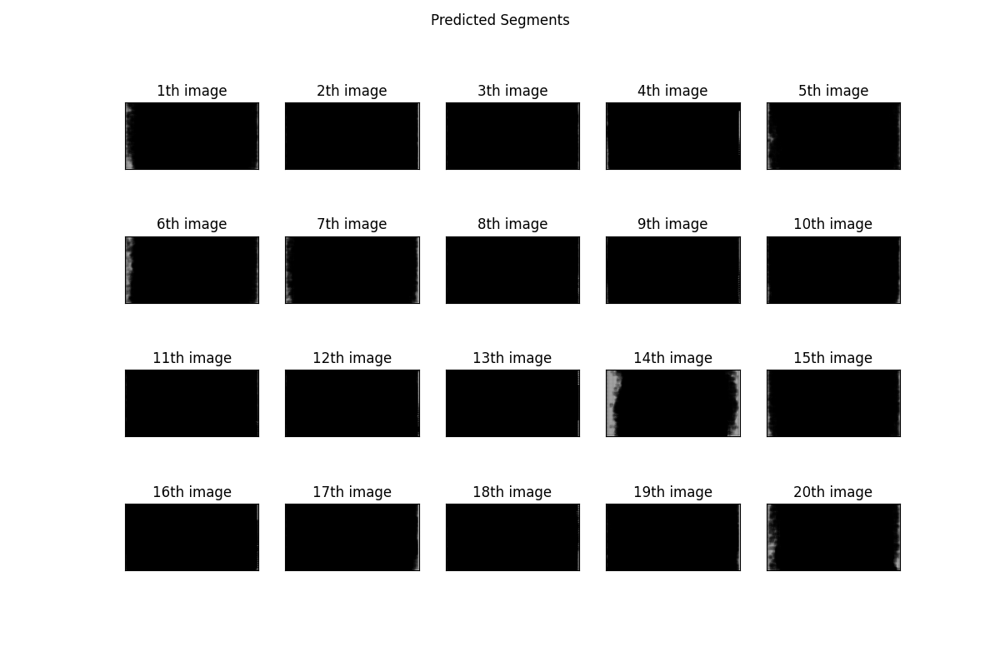

# UNet Image Segmentation Solution

This is a solution to the first assignment problem, of segmenting NIFTI(1)
medical images using a [UNet](https://en.wikipedia.org/wiki/U-Net).  This uses a
dataset called 'HipMRI', which has slices of MRI scans along with segments of
how the slices should be divided.

The goal of this algorithm is to create a segmentation of the prostate given
only the MRI slice.  It is trained on a dataset of (image, prostate segment)
pairs and then is designed to be able to output a prostate segment based on the
image.  Pytorch is used for tensor manipulation and ML utilities.  We can see
the following examples of input images, their corresponding prostate segments,
and the model's outputs.

Prepocessing steps for the algorithm include:

1. normalising the image inputs to between -1 and 1, and
2. pulling the prostate segment (5) from the original segment images,
which are integer bitmaps of what class belongs where in the image.

## Running

To run this model, set up your Python environment according to the packages in
`requirements.txt`.  This is designed to run on Rangpur by default, but please
change the `DATASET_ROOT` variable in `dataset.py` to a location that suits
another environment if you wish to run it somewhere else.
