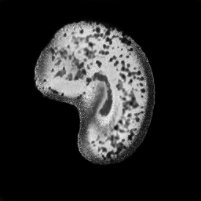

# StyleGAN for ADNI (Alzheimer's Disease Neuroimaging Initiative)

#### COMP3710 - Pattern Analysis 2024
**Task 8** - Generative model of the ADNI brain dataset using StyleGAN (blend of 1 and 2).<br>
**Author:** Ethan Laskowski (46984863)

## Project Overview

### Description: 
This project implements a StyleGAN-based generative model to produce synthetic brain MRI images using the ADNI (Alzheimer's Disease Neuroimaging Initiative) dataset. The goal is to create a GAN that can generate realistic-looking brain scans, which could be valuable for medical research, particularly in the study of Alzheimer's Disease, where real samples are limited.

### How it Works: 
The StyleGAN architecture consists of three main components: a Mapping Network, a Generator, and a Discriminator. The Mapping Network transforms a latent vector into a style space, allowing better control over generated features. The Generator then uses this style vector and progressively learns to create images through a series of convolutional layers, starting from a learned constant. The Discriminator, meanwhile, distinguishes between real and generated images, providing feedback to improve the Generator's output over time. A Cyclic Learning Rate and additional regularization techniques, like Path Length Penalty and Gradient Penalty, ensure stable training.

### Visualisation: 
Below is a visual representation of the generated images' progression throughout different training epochs, illustrating the improvement in quality and realism.

<p align="center">
    
    
    
    
    
    <br>
    Generated Images after 2, 6, 30, 75 and 150 epochs - shows progression of training.
</p>

## Table of Contents

1. [Project Structure](#project-structure)
2. [Dependencies](#dependencies)
3. [Installation](#installation)
4. [Usage](#usage)
5. [Dataset](#dataset)
6. [Data Setup and Preprocessing](#data-preprocessing)
7. [Model Architecture](#model-architecture)
8. [Training Process](#training-process)
9. [Results](#results)
10. [Analysis of Results](#Analysis-of-Results)
11. [Performance Metrics](#performance-metrics)
12. [Analysis of Performance Metrics](#Analysis-of-Performance-Metrics)
13. [Style Space Plot and Discussion](#Style-space)
14. [References](#references)

## Project Structure

The project consists of several key files:

- [`train.py`](train.py): Main training script for the Stable Diffusion model
- [`generate_images.py`](generate_images.py): Script for generating new images from trained model, alongside loss plots.
- [`modules.py`](modules.py): Contains Generator, Discriminator, MappingNetwork and other models.
- [`utils.py`](utils.py): Utility functions for getting noise, converting latent space to style space etc
- [`dataset.py`](dataset.py): Loads ADNI data.
- [`constants.py`](constants.py): Constants defined across all files.

## Dependencies
- Both Linux and Windows are supported.
- 64-bit Python 3.10 or later installation. Anaconda3 is recommended due to its intra-library compatibility installation.
- Additional libaries include -

    |  Libaries       |Version           |
    |-----------------|------------------|
    |  pytorch        |2.0.1             |
    |  torchvision    |0.15.2            |
    |  pytorch-cuda   |11.8              |
    |  cudatoolkit    |10.1              |
    |  numpy          |1.22.3            |
    |  matplotlib     |3.7.2             |
    |  tqdm           |4.66.1            |

    Note: Libaries may use newer version. If using conda, install pytorch, torchvision and cuda [together](https://pytorch.org).
- The training was performed on NVIDIA A100 40GB vGPU with 128GB of DRAM.

## Installation

To set up the project, follow these steps:

1. Clone the repository
2. Install the required packages:

```bash
pip install -r requirements.txt
```

## Usage

### Training

Single usage as shown below (does not support cmd args parsing). Refer to [constants.py](constants.py) for resetting parameters. \
The network is trained from scratch, and generator loss, discriminator loss, gradient penalty and path length penalty
are printed for each batch completion, every epoch
```
> python train.py

Python 3.10.13
Device:  cuda

  0%|          | 0/954 [00:00<?, ?it/s]
  0%|          | 0/954 [00:01<?, ?it/s, gp=0.992, loss_critic=10.1, loss_gen=6.17, plp=0.01]
  0%|          | 1/954 [00:01<19:10,  1.21s/it, gp=0.992, discrim_loss=10.1, gen_loss=6.17, plp=0.01]
  0%|          | 1/954 [00:01<19:10,  1.21s/it, gp=0.986, discrim_loss=9.1, gen_loss=5.98, plp=0.01] 
  0%|          | 2/954 [00:01<14:34,  1.09it/s, gp=0.986, discrim_loss=9.1, gen_loss=5.98, plp=0.01]
  0%|          | 2/954 [00:02<14:34,  1.09it/s, gp=0.978, discrim_loss=8.67, gen_loss=6.38, plp=0.01]
  0%|          | 3/954 [00:02<13:06,  1.21it/s, gp=0.978, discrim_loss=8.67, gen_loss=6.38, plp=0.01]
  0%|          | 3/954 [00:03<13:06,  1.21it/s, gp=0.97, discrim_loss=8.32, gen_loss=5.66, plp=0.01] 
  0%|          | 4/954 [00:03<12:22,  1.28it/s, gp=0.97, discrim_loss=8.32, gen_loss=5.66, plp=0.01]
  0%|          | 4/954 [00:04<12:22,  1.28it/s, gp=0.963, discrim_loss=8.03, gen_loss=6.58, plp=0.01]
  1%|          | 5/954 [00:04<11:57,  1.32it/s, gp=0.963, discrim_loss=8.03, gen_loss=6.58, plp=0.01]
  1%|          | 5/954 [00:04<11:57,  1.32it/s, gp=0.955, discrim_loss=7.63, gen_loss=4.7, plp=0.01] 
  1%|          | 6/954 [00:04<11:43,  1.35it/s, gp=0.955, discrim_loss=7.63, gen_loss=4.7, plp=0.01]
  1%|          | 6/954 [00:05<11:43,  1.35it/s, gp=0.943, discrim_loss=7.35, gen_loss=5.52, plp=0.01]
  1%|          | 7/954 [00:05<11:34,  1.36it/s, gp=0.943, discrim_loss=7.35, gen_loss=5.52, plp=0.01]
```
Sample images are generated and saved every 2 epochs and are stored as outlined in preprocessing.
Models are saved every 4 epochs and are stored as outlined in preprocessing.
Plot for the generator and discriminator loss over all iterations are saved at the end of training.

## Dataset
The Alzheimer's Disease Neuroimaging Initiative (ADNI) is a large-scale, longitudinal research study designed to develop \
clinical, imaging, genetic, and biochemical biomarkers for the early detection and progression of Alzheimer's Disease (AD). \
Launched in 2004, ADNI is funded by both public and private organizations and aims to provide a comprehensive dataset that \
supports research on Alzheimer's disease, mild cognitive impairment (MCI), and cognitive normal aging. \
The dataset specification can be found below.

|  Attributes     | Values           |
|-----------------|------------------|
|  Total images   | 30520            |
|  Image size     | 256x240          |
|  Image color    | Grayscale        |

More information is available from https://adni.loni.usc.edu/

## Data Preprocessing

The ADNI dataset should be organised in the following structure:

```
home/
    groups/
        comp3710/
            ADNI/
                AD_NC/
                   train/
                        AD/
                        NC/
                    test/
                        AD/
                        NC/ 
```
Note that the data is loaded in as a folder - being the AD_NC folder.

Where AD represents Alzheimer's Disease samples and NC represents Normal Control samples. 

Any model checkpoints will need to be placed in their appropriate folder:
```
Models/
    Gen/
    Discriminator/
    MappingNetwork
```

Any images will be saved in the following folder:
'''
saved_examples/
    256x256/
'''
256x256 can be replaced with any image size if the dataloader resizes the images to this size accordingly.

### Data augmentation

Here are some image samples before augmentation.
<p align="center">
    
    
    
    
    
    <br>
    Images before Augmentation
</p>


**Resize**: The imported images were resized to 256x256 from their abnormal 240x256 shape. \
**RandomVerticalFlip**: The images were flipped vertically randomly at 50% probability to introduce variabiliity in data - preventing overfitting. \
**Normalise**: Images were normalised with mean 0.5 and standard deviation of 0.5 for each channel to convert to [0, 1] data range.  \
**Grayscale**: Since the default import for img dataset is 3 channels, when using 1 channel the images are transformed to grayscale.

Few examples of images after augmentation is shown in the figure below.

<p align="center">
    
    
    
    
    
    <br>
    Images after Augmentation
</p>


## Model Architecture
StyleGAN1 (2019) is a generative adversarial network (GAN) developed by NVIDIA, designed to generate high-resolution images \
with a focus on disentangled and controllable image synthesis. A key innovation is the style-based generator, which uses a \
mapping network to transform latent vectors into style vectors, allowing for fine control over features like pose, texture, \
and shape across different levels of detail.

StyleGAN2 (2020) builds on this, addressing issues like "droplet artifacts" in the generated images by redesigning normalization \
and architectural components, including weight demodulation. It improves image quality and training stability, producing more \
realistic and diverse outputs with enhanced control over style attributes and better detail consistency.

<p align="center">
    
    <br>
    Overall StyleGAN architecture
</p>


### Generator Network
The generator network is divided into two sub-networks; the mapping network and the synthesis network. Both of these networks
are learnable and are optimised by the Adam optimiser in the code implementation.

**1. Mapping Network:**
Initialized using z_dim (latent space) and w_dim (style vector) as parameters, the mapping network consists of eight EqualizedLinear layer, that equalizes the learning rate, with ReLU as their activation function. Latent space dimension is initialized using pixel norm.

The mapping network converts latent space vectors (z) (which are just Gaussian noise - which is used as the basis of image generation (via the Generator) in non-style GAN)
into a new space, the style space (or W). The problem with the latent space vectors is that they are entangled, meaning a single change to z can result in a whole host
of changes in the generated image. Conversely, the style space (W) is (ideally) a disentangled feature space, where a change to a style space vector corresponds to a
particular feature change. This mapping network is a learnable network and, consequently, gets increasingly better at converting to style vectors which are
disentangled, allowing for better differentiation. These style space vectors are used as noise injections throughout the architecture, as outlined below.

**2. Synthesis Network:**
The synthesis network is where the actual image generation happens, building images step by step from low to high resolution. It is composed of several blocks that progressively refine the image resolution. The key innovations here include the use of style modulation, adaptive instance normalization (AdaIN), and noise injection.

**2.1. Progressive Structure**
Progressive Growing: The synthesis network starts with a small learned constant (of size 4x4 in this code implementation) and then progressively
increases the resolution by doubling it with each successive block. 


**2.2. Style Modulation with AdaIN**
Gaussian distribution noise is converted to normalised, modulated style vectors via equalised layers and through the use of Adaptive Instance Normalisation (AdaIN). AdaIN computes the mean and standard deviation of the non-style vectors and then uses these parameters to standardise the non-style vector. From there, the known "scaling" and "shifting" functions of the style space, learned through the Mapping Network are applied to the noise. Hence, the noise becomes a style vector, which is applied to the input to allow for finer control over features.

**2.3. Noise Injection**
At each resolution, random noise is added directly to the feature maps, introducing stochastic variations. This helps the model generate images with subtle details like hair strands or skin textures. The style vectors provide global control over image features. However, with only style vectors, the generated images are minimally diverse. Hence, noise injection enables the generation of fine, localised details - creating enhanced diversity. Each block has its own learnable scaling factor to adjust the impact of the noise.

**2.4: Style Mixing**
This involves the generation of images from multiple different latent vectors (and corresponding style vectors), in order to minimise overfitting to a particular feature (generated by one style vector).

The generator is then passed through a tanh activation function to ensure pixel values are normalised in range [-1, 1].


### Discriminator Network:
The discriminator network is used to distinguish between real and generated images. It is also a CNN, and its role is to assess the authenticity of the images produced by the generator. The discriminator is trained to minimize the distinguishability of generated images from real ones.

The discriminator architecture is as follows:

**1: Downsampling:**
Each DiscriminatorBlock is responsible for reducing the spatial resolution of the input feature maps while increasing the depth (number of channels). This makes the network more sensitive to large-scale structures.
Within these downsampling blocks, weight-equalised 2d convolution is sequentially used, alternating with LeakyReLU activation functions.
Additionally, there is a residual path to bypass this main convolutional pathway, allowing for the minimisation of gradient vanishing/exploding if they occur.

**2: Minibatch Standard Deviation:**
An invention in StyleGAN2, minibatch standard deviation generates the standard deviation across a batch of input samples, and essentially rejects a sample range where there is very minimal standard deviation. This ensures that the generator must generate diverse images, rather than just finding a niche of one particularly discriminator-fooling image, and sticking with this.

### Equalised Weight
Normalises the weights/parameters of the convolutional/linear layers in the Generator, Discriminator and Mapping network to maintain constant variance across them.

This ensures that each layer contributes more evenly to the overall learning process - as opposed to some layers with different input dimensions having significantly more or less impact on the learning process.
Overall, this stabilises training significantly.

### Equalised Linear
Replaces the standard fully connected layer (which maps all inputs to outputs) with one that ensures weights are normalised, using Equalised Weight. This increases stability of training.

### Path Length Penalty
The Path Length Penalty is a regularization technique used specifically in the generator of StyleGAN2. It aims to ensure that a small change in the input latent vector w results in a proportionate change in the generated image.

It does this by computing the gradient of the generator's output wrt its input latent vector, and then uses this to adjust generator weights in such a way that minimises the gradient norm's deviation.

Overall, the goal of path length penalty is to heighten the interpretability of the latent space, allowing for the generator to better manipulate it in order to generate expected changes in images - as opposed to more random changes in images when this is not implemented.


### Gradient Penalty
Improves the stability of the discriminator, by ensuring that it doesn't become too overconfident and being more general in its feedback. Specifically, it does this by:

- Taking real and generated (fake) images as inputs, and creates interpolated images between them, which are fed into the discriminator to compute the mixed scores.
- Using torch.autograd.grad to compute the gradients of the discriminator scores with respect to the interpolated images.
- Reshaping the gradients and calculating their L2 norm.
- Computing the gradient penalty as the squared difference between the gradient norm and 1 and then adding this penalty to the discriminator loss, penalizing deviations from the target gradient norm - and ensuring that its loss never reaches a point of total overconfidence.

Without this gradient penalty, mode collapse is much more likely to occur - as the discriminator will become too good for the generator to learn from, lead to its losses becoming NaN.


## Training Process

The training process for this StyleGAN implementation involves iteratively refining a generator and a discriminator network to synthesize realistic images and distinguish them from real ones, respectively. The key components of the training process include a mapping network, a generator, a discriminator, and various loss functions. Here's a breakdown of the steps involved:

### Data Loading and Preprocessing:

The training data is loaded using a data loader and processed through transformations such as resizing, normalization, and augmentation to ensure uniformity in input sizes and distributions.
The ADNI dataset, consisting of 256x256 grayscale brain MRI images, is utilized for training.

### Network Initialization:

The model comprises a Generator, Discriminator, and Mapping Network, all initialized based on the defined architecture in modules.py.
The generator starts with a learnable constant, progressively refined through style blocks and upsampling layers, generating high-resolution images. The mapping network transforms random latent vectors into style vectors, adding control over the generated images' features.
The discriminator processes both real and fake images, predicting whether each input is real or generated, and is responsible for guiding the generator to improve.

### Optimization Setup:

Adam optimizers are used for the generator, discriminator, and mapping network, with learning rates and β parameters as recommended by the StyleGAN2 paper.
A cyclic learning rate (CyclicLR) scheduler is applied to the generator and discriminator optimizers to dynamically adjust their learning rates, promoting more effective training by cyclically increasing and decreasing the learning rate during training.

### Training Loop:

The training process runs over a set number of epochs, each consisting of multiple iterations over the dataset.
For each batch of training images:

**1. Forward Pass:**
The generator creates synthetic images from random latent vectors (generated using the mapping network) combined with noise. These generated images aim to mimic the real images.
The discriminator evaluates both real images and the generated images, producing scores representing their authenticity.
A gradient penalty is applied to ensure smooth gradients for better training stability, enhancing the discriminator's performance.

**2. Loss Calculation:**
The discriminator loss is calculated based on its ability to distinguish real images from generated ones, incorporating the gradient penalty for regularization.
The generator loss aims to improve the realism of generated images, encouraging them to be classified as real by the discriminator.
Path Length Penalty (PLP) is applied every 16 batches to ensure that changes in the latent space translate smoothly into changes in the generated images, promoting better latent space exploration and disentanglement.
Regularization terms are also applied to stabilize training and prevent overfitting.

**3: Backward Pass:**
Gradients are computed and used to update the weights of the generator, discriminator, and mapping network through backpropagation.
Optimizers are updated using the cyclic learning rate schedules for smoother convergence.


### Model Saving and Image Generation:

Sample images are generated and saved every 2 epochs using the generator, enabling tracking of its progress and improvements over time.
Model checkpoints for the generator, discriminator, and mapping network are saved every 4 epochs to allow resuming training from specific points and preventing loss of progress in case of interruptions.

### Logging and Monitoring:

During each epoch, the training progress is displayed using a progress bar (via tqdm), showing metrics like the generator loss, discriminator loss, gradient penalty, and path length penalty.
A lifetime log of generator and discriminator losses is maintained, enabling visualization of the training process and evaluation of model stability.

### Visualizing Training Progress:

After completing training, loss plots are generated to visualize the trends in generator and discriminator losses over time. This helps analyze the stability of training and the improvements in the model's ability to generate realistic images.
By following this process, the StyleGAN model learns to generate high-quality synthetic brain MRI images that are increasingly indistinguishable from real data, providing valuable insights and potential applications in medical image analysis.


## Results

Note that the input into this is noise with 256 dimensions (for the mapping network), style vectors and noise (with 256 dimensions) for the generator, and then the real images / generator-generated images (of size 256x256) for the discriminator. 

Also note that these results may not totally be reproduced, as all models directly or indirectly take in Gaussian noise - and this cannot be
fixed with a random seed otherwise the generated images aren't realistic. 

<p align="center">
    
    
    
    
    
    <br>
    Epoch 2 Generated Images
</p>

<p align="center">
    
    
    
    
    
    <br>
    Epoch 4 Generated Images
</p>

<p align="center">
    
    
    
    
    
    <br>
    Epoch 6 Generated Images
</p>

<p align="center">
    
    
    
    
    
    <br>
    Epoch 8 Generated Images
</p>

<p align="center">
    
    
    
    
    
    <br>
    Epoch 10 Generated Images
</p>

<p align="center">
    
    
    
    
    
    <br>
    Epoch 20 Generated Images
</p>

<p align="center">
    
    
    
    
    
    <br>
    Epoch 30 Generated Images
</p>

<p align="center">
    
    
    
    
    
    <br>
    Epoch 50 Generated Images
</p>

<p align="center">
    
    
    
    
    
    <br>
    Epoch 75 Generated Images
</p>

<p align="center">
    
    
    
    
    
    <br>
    Epoch 100 Generated Images
</p>

<p align="center">
    
    
    
    
    
    <br>
    Epoch 150 Generated Images
</p>

## Analysis of Results
The progression of the generated brain images across different epochs showcases a clear improvement in the quality and realism of the generated samples as the training progresses. Diving into specific regions of the epochs uncovers more information.

### Early Epochs (Epochs 2 - 10):
Visual Quality: At the very early stages, such as Epochs 2 and 4, the generated images appear to be noisy and lack clear structural definition. The anatomical structures of the brain are indistinguishable, with patterns resembling random noise in the general shape of a brain. As the epochs push towards 10, the noise around these images decreases, and the images start resembling brains moreso.

Model Behavior: This phase is characterized by the generator and discriminator still learning fundamental differences between real and generated images. The generator is effectively exploring the latent space but lacks direction, leading to fuzzy outputs.

### Mid Epochs (Epochs 20 - 50):
Visual Quality: From Epoch 20 onwards, the images begin to exhibit more recognizable features of brain anatomy. The generator starts forming the overall shape of brain structures, including more defined edges and contrast variations.

Model Behavior: The discriminator has improved its ability to critique generated samples, which in turn guides the generator towards producing images with better-defined structural features. However, some regions may still display artifacts or blurry sections.

### Later Epochs (Epochs 75 - 150):
Visual Quality: By Epochs 75, 100, and especially 150, the generated images demonstrate significantly improved realism. The brain structures become more accurate and closely resemble the actual MRI images, with intricate details and textures becoming visible.

Model Behavior: At this stage, the generator effectively captures the complexity of brain features, while the discriminator has become adept at identifying the subtleties in the generated images. The generator now produces samples that are difficult for the discriminator to differentiate from real images, indicating a better convergence.

### Overall Improvements:
Consistency: As training progresses, the images become more consistent in terms of quality across different samples. This suggests that the generator has learned to generalize features rather than producing highly variable outputs.

Reduction in Artifacts: The presence of artifacts, such as noise and irregularities, decreases as the epochs advance. This indicates that the generator is learning to produce smooth transitions and coherent structures, which is particularly important for medical imaging like MRI scans.

Structural Accuracy: The shapes and textures in later epoch images closely align with typical brain structures. This is especially important for datasets like ADNI, where structural details can be indicative of different cognitive conditions.

### Conclusion:
The observed progression illustrates the generator's learning curve in capturing complex structures through the adversarial training process. The transition from noisy, poorly-defined images to realistic MRI representations highlights the success of using a StyleGAN-based approach for generating synthetic medical images. It underscores the importance of sufficient training epochs and balanced training dynamics between the generator and discriminator for achieving high-quality outputs.

## Performance Metrics
<p align="center">
    
    
    <br>
    Loss plots for Discriminator and Generator
</p>

## Analysis of Performance Metrics
The provided loss plots for the generator and discriminator offer insight into the training dynamics:

### Discriminator Loss:

Initially, the discriminator loss fluctuates significantly, with large negative values indicating the discriminator's confidence in distinguishing real from generated images.
Around Epoch 10-20, the discriminator loss becomes less negative, indicating a more balanced learning process as the generator starts producing more convincing samples.
The later oscillations suggest an ongoing struggle between the generator and discriminator, where neither dominates for long, indicating stable adversarial training.
However, the negative loss values might also point to the discriminator being relatively strong, which aligns with the need to balance training so that the generator can keep improving.

### Generator Loss:

The generator loss initially spikes, which is common as it tries to generate images that can fool the discriminator.
As training progresses (after Epoch 20), the generator loss significantly decreases and stabilizes around lower values.
This suggests that the generator starts producing images that are increasingly similar to real samples, effectively reducing the discriminator's ability to distinguish between real and fake.
The minor fluctuations towards later epochs show ongoing improvements and adjustments in generating finer details.


The combination of these observations points to a well-trained GAN where the generator gradually learns to produce realistic samples, and the discriminator remains competitive, helping refine the generator's output. The images improve over time, correlating with the stable, yet dynamic, loss trends seen in the plots. Adjustments to the discriminator strength or regularization techniques might further fine-tune this balance for even better results.

Additionally, these losses align well with the provided images - as the image quality substantially increased at 10 and then 20 epochs, before having relatively steady improvement beyond 20 epochs.

## Style Space
<p align="center">
    
    <br>
    TSNE Style Space Plot at 50 epochs.
</p>

The plot shown above highlights the style space for the mapping network having been trained for 50 epochs. The style space is not clearly split into AD and NC spaces, as the model was not trained distinctly on AD and NC data (rather, trained on them combined). However, there is still a clear break of the style space vector around the bottom of the image, which is interpreted to be the distinction in the style space between the normal control and alzheimer's disease images. 

Had the model been trained distinctly on the two different types of brain scans (not explicitly required by the task) - being a conditional model, then there may be a much more clear separation in the style space.

## References
T. Karras, S. Laine, and T. Aila, “A Style-Based Generator Architecture for Generative Adversarial
Networks,” arXiv:1812.04948 [cs, stat], Mar. 2019, arXiv: 1812.04948. [Online]. Available: http:
//arxiv.org/abs/1812.04948

T. Karras, S. Laine, M. Aittala, J. Hellsten, J. Lehtinen, and T. Aila, “Analyzing and Improving the Image
Quality of StyleGAN,” arXiv:1912.04958 [cs, eess, stat], Mar. 2020, arXiv: 1912.04958. [Online]. Available:
http://arxiv.org/abs/1912.04958

Lucidrains, “stylegan2-pytorch,” GitHub Repository. https://github.com/lucidrains/stylegan2-pytorch (accessed Oct. 14, 2024).

NVlabs, “stylegan2,” GitHub Repository. https://github.com/NVlabs/stylegan2 (accessed Oct. 14, 2024).
