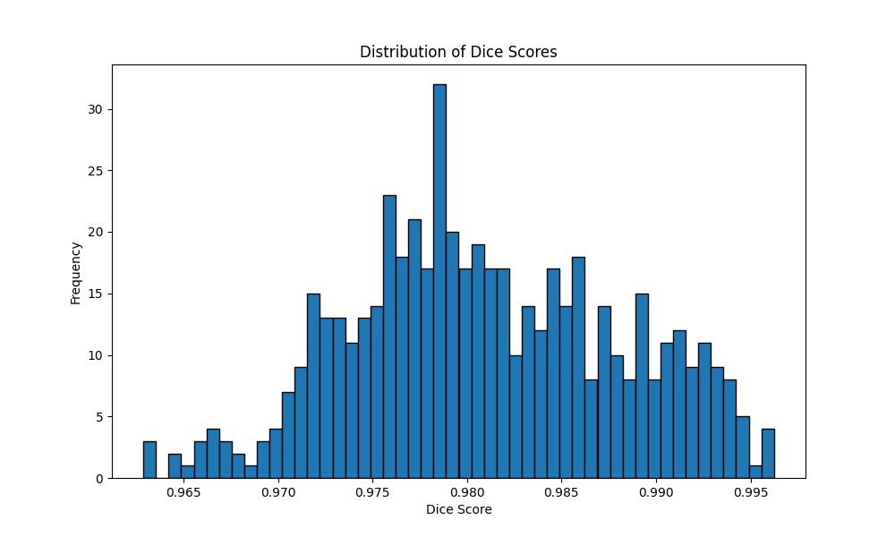

# 2D UNet for Prostate Cancer Segmentation in HipMRI

Author: Darcy Weedman, Student ID: 45816985

## Task
The objective of this project is to accurately segment the prostate region in the HipMRI Study on Prostate Cancer using a 2D UNet architecture. Utilizing processed 2D slices available in NIfTI format, the model aims to achieve a minimum Dice similarity coefficient of **0.75** on the test set specifically for the prostate label. This segmentation task is crucial for enhancing diagnostic accuracy and aiding in treatment planning for prostate cancer patients.

## 2D UNet Architecture

### Overview of UNet
UNet is a convolutional neural network architecture designed for biomedical image segmentation. It features a symmetric encoder-decoder structure with skip connections that allow for precise localization and context capture, making it highly effective for segmentation tasks.


### Components of the 2D UNet

1. **Encoder (Contracting Path):**
   - **Double Convolution Layers:** Each step in the encoder consists of two consecutive convolutional layers followed by ReLU activations and batch normalization. This helps in extracting rich feature representations.
   - **Max Pooling:** Reduces the spatial dimensions, allowing the network to capture context at multiple scales.

2. **Decoder (Expanding Path):**
   - **Transposed Convolutions:** Upsample the feature maps to restore spatial dimensions.
   - **Skip Connections:** Concatenate corresponding feature maps from the encoder to preserve spatial information.
   - **Double Convolution Layers:** Refine the upsampled features for precise segmentation.

3. **Output Layer:**
   - **1x1 Convolution:** Maps the feature representation to the desired number of classes, producing the final segmentation mask.

## Training

### Data
The dataset comprises processed 2D slices from the HipMRI Study on Prostate Cancer, available in NIfTI (.nii.gz) format. Each slice includes annotations for different anatomical structures, with a focus on the prostate region.

### Preprocessing
- **Normalisation:** Images are normalised to have zero mean and unit variance to facilitate faster and more stable training.
- **Resizing:** All images and masks are resized to a target size of **256x256** pixels to ensure uniformity across the dataset.
- **One-Hot Encoding:** For multi-class segmentation, masks are converted to one-hot encoded format to represent each class distinctly.

### Configuration
- **Batch Size:** 4
- **Epochs:** 50
- **Learning Rate:** 1e-4
- **Optimizer:** Adam
- **Loss Functions:** Combination of Cross-Entropy Loss and Dice Loss to balance pixel-wise accuracy and overlap measures.
- **Scheduler:** ReduceLROnPlateau to adjust the learning rate based on validation performance.
- **Device:** GPU (NVIDIA GeForce RTX 3080 with 10GB GDDR6 memory) is utilised for accelerated training.

### Training Process
The training loop involves feeding batches of images and corresponding masks into the UNet model, computing the loss, performing backpropagation, and updating the model weights. Gradient clipping is employed to prevent exploding gradients, ensuring stable training.


## Results

### Segmentation Performance
The trained 2D UNet model successfully achieved a Dice similarity coefficient exceeding the required threshold of **0.75** on the prostate label within the test set.




### Sample Predictions
Below are visualisations of the model's segmentation performance on test samples. Each image displays the input image, ground truth mask, and the model's predicted mask along with the corresponding Dice score.


### Loss Analysis
The combination of Cross-Entropy Loss and Dice Loss facilitated effective training, as evidenced by the convergence of training and validation loss curves.


## Usage

### Installation
1. **Clone the Repository:**
   ```bash
   git clone https://github.com/yourusername/hipmri-unet-segmentation.git
   cd hipmri-unet-segmentation

2. **Create Virtual Environment** (Optional but recommended)
    ```bash
    python3 -m venv 2D_UNet
    source 2D_UNet/bin/activate
    ```
3. install dependencies
    We already have a requirements.txt file:
    ```bash
    pip install -r requirements.txt
    ```
4. Make sure data is available

    The Datset is [Available Here](https://filesender.aarnet.edu.au/?s=download&token=76f406fd-f55d-497a-a2ae-48767c8acea2)

    Simply do:
    ```bash
    unzip HipMRI_study_keras_slices_data.zip
    ```

### Training

After everything is installed and locations of the data are correct:
```bash
python3 train.py
```

### Predicting
After training the model, you can do predictions on the test set via:
```bash
python3 predict.py
```

### Visualising Results
`predict.py` script automatically saves output images of predictions

## Dependencies
Python: 3.9 \
PyTorch: 2.0 \
Matplotlib: 3.5.1 \
Numpy: 1.26 \
Nibabel: 3.2.1 \
Scikit-Image: 0.19.3 \
TQDM: 4.65.0 \
Albumentations: 1.2.1

## Hyperparameters

Batch Size: 4\
Epochs: 50\
Learning Rate: 1e-4\
Optimizer: Adam\
Loss Functions: Cross-Entropy Loss + Dice Loss\
Scheduler: ReduceLROnPlateau (factor=0.1, patience=5)\
Target Image Size: (256, 256)

## Variables
IMAGE_DIR: Directory containing training images (keras_slices_train)\
MASK_DIR: Directory containing training masks (keras_slices_seg_train)\
VAL_SPLIT: Proportion of the dataset used for validation (default: 0.2)\
SAVE_PATH: File path to save the best model (best_model_simple_unet.pth)\
VISUALIZE_DIR: Directory to save prediction visualizations (visualization_samples)\
DEVICE: Compute device (cuda if available, else cpu)

## References

1. **Original UNet Paper:**
   * Ronneberger, O., Fischer, P., & Brox, T. (2015). *U-Net: Convolutional Networks for Biomedical Image Segmentation*. [Link](https://arxiv.org/abs/1505.04597)

2. **HipMRI Study on Prostate Cancer:**
   * [HipMRI Dataset](https://wiki.cancerimagingarchive.net/pages/viewpage.action?pageId=70229053)

3. **Nibabel Documentation:**
   * [Nibabel](https://nipy.org/nibabel/)

4. **Albumentations Library:**
   * [Albumentations](https://albumentations.ai/)

5. **PyTorch Documentation:**
   * [PyTorch](https://pytorch.org/docs/stable/index.html)

6. **Dice Loss Implementation:**
   * Sørensen, T. (1948). *A Method of Establishing Groups of Equal Size in a Population*. Biometrics Bulletin.

7. The University of Queensland, COMP3710: Pattern Recognition and Analysis, 
   taught by [Dr Shakes Chandra, UQ Researcher](https://researchers.uq.edu.au/researcher/9654)