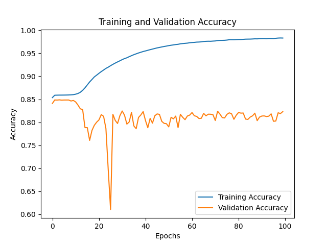

# Hip MRI Segmentation Using 2D U-Net 
## Description of Algorithm
This project implements a 2D U-Net model for segmenting MRI scans of the hip. The problem being solved is the segmentation of regions in MRI images, specifically identifying and separating target areas (such as muscles or bones) from the surrounding tissues.

In the example below, the left side shows an input MRI image, and the right side shows the corresponding segmentation mask produced by the U-Net model. The goal is to label each pixel as either part of the region of interest (white) or as background (black).

## How the 2D Unet works

The U-Net model is designed for image segmentation tasks and follows an encoder-decoder architecture with skip connections between corresponding layers in the encoder and decoder. The key steps of the U-Net model are:

1. **Contracting path (Encoder)**: The input MRI image is passed through multiple convolutional and max-pooling layers to capture spatial context and reduce the dimensionality of the feature maps. In the case of my Unet, there will be 4 of these convolutional blocks, each with 2 convolutional layers using ReLU activation and the second with batch normalisation, and a max pooling layer.
2. **Bottleneck**: At the bottleneck, the deepest part of the network, the model captures the most abstract and meaningful features.
3. **Expanding path (Decoder)**: The feature maps are then upsampled using transposed convolutions, and merged with high-resolution features from the encoder to recover spatial details.
4. **Output**: The final layer uses a sigmoid activation function to generate a binary segmentation mask where each pixel is classified as part of the target region or background.

These key segments of the model can be seen in the [diagram below](https://towardsdatascience.com/unet-line-by-line-explanation-9b191c76baf5).

## Dependencies 
The following dependencies are required to run the project:

- **Python**: 3.9
- **TensorFlow**: 2.7.0 (with GPU support)
- **CUDA**: 11.2
- **cuDNN**: 8.1
- **NumPy**: 1.18+
- **Matplotlib**: 3.x
- **tqdm**: 4.x
- **OpenCV**: 4.x 
- **nibabel**: 3.x 

For reproducability of results, set the np and tf random seeds to 42 as in train.py

## Example Inputs and Outputs, and Dice similarity coefficient
### Input:
The algorithm takes 256x128 grayscale MRI images as input, which have been pre-processed and normalised to the range [0, 1].
### Ouput:
The output is a binary segmentation mask of the same dimensions (256x128), where each pixel is classified as either 0 (background) or 1 (target region), which are visualised as black and white respectively.
In the figure below, an example input and output mask generated by the model are shown, with the true mask for comparison.

### Dice similarity coefficient:
The Dice similarity coefficient of the test set was 0.710.
The below plots show the accuracy and loss for both the training and validation sets against epochs.

## Pre-processing and Data Splits
### Pre-processing
- **Input Normalisation**: The pixel values of the input MRI images were normalised to the range [0, 1] to ensure compatibility with the U-Net model.
- **Segmentation Mask Binarisation**: The ground truth masks were binarised to 0 and 1 for compatibility with the binary crossentropy loss function.

### Data Splits:
The dataset was already divided into 11460 train, 660 validation and 540 test samples.
