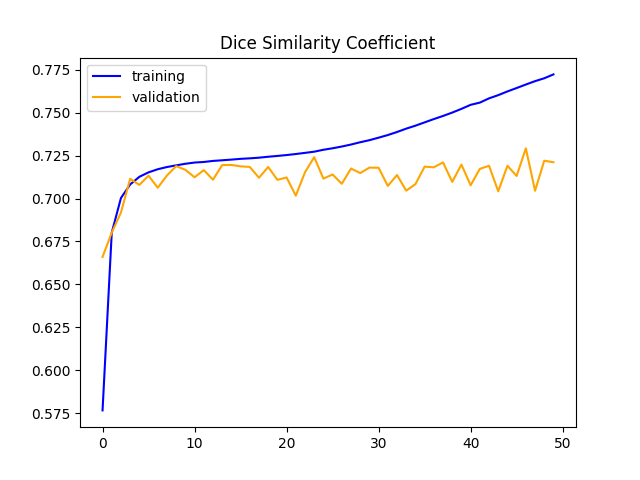

# Segmenting Hip-MRI to identify Prostate Cancer using 2D-UNet
Every year tens of thousands of men are diagnosed with prostate cancer, mostly effecting elderly men[1]. The identification of abnormal or enlarged prostates in a HipMRI could therefore be useful for assisting doctors in early detection.

## 2D UNet
[2]

The UNet is a model mostly used for segmenting images and is especially effective on small datasets, which are common in medical imaging[3]. The model consists of an encoding network which extracts features from the input followed by a decoding network which creates the segmentation mask[2]. A key difference between the UNet earlier image segmentation models is that the UNet utilises skip connections which allow for finer details in the original image to be carried through the model into the segmentation mask.

## Implementation
This model is design to be used on 2D slices of HipMRI data which can be found [here](https://data.csiro.au/collection/csiro:51392v2). The dataset was preprocesses into 2D-Slices. Some images were of different sizes so each image was normalised to a size of 256x256 and the pixel values normalised 0-1. The preprocessing already separated the data into train, validate and test sets which were of size 11640, 660 and 540 respectively. Using this distribution aims to maximise the available data for training while still providing enough data for testing and validation. The model itself was adapted from [this](https://github.com/shakes76/PatternFlow/tree/master/recognition/MySolution) source, modifying the output layers and filter size for this problem. 

## Results

After some tuning, a preliminary test run of 50 epochs shows only a slight increase in accuracy for the validation data while the training data improves significantly. This disparity could be a result of overfitting, although due to the variance in the validation data it also seemed likely that the learning rate was too high.

In hopes to improve this the learning rate was lowered from $10^{-3}$ to $10^{-4}$ giving the following result.

As expected the training data is learned slower, however there is not a clear difference in results for the validation data. In both instances the validation dice score roughly oscillates between 0.7 and 0.725. 

The higher learning rate gave a slightly better evaluation on the test set with a dice score of 0.7507 compared to 0.7462. Which is not significant enough to suggest the learning rate is a meaningful factor in the models lack of accuracy. Regardless the first (higher) learning rate is used for model evaluation. Other hyperparameters were tested with other values such as filter size, batch size and number of epochs. However they gave similarly ineffective results with the validation data stagnating quickly.

Running inference on this iteration of the model gives these segmentation masks for each class

  
  
  
  
  
  

Clearly this result leaves much to be desired and while the model may not be very useful in its current state it provides a starting point for further study.

## Dependencies and Reproducibility
The model is implemented using tensorflow 2.17.0 utilising the nibabel library to read nifti images. The parameters in the provided model are the same that were used to retrieve the displayed results. Which should allow the results to be reproduced or built upon if desired.

## References
[1] https://www.cancer.org.au/cancer-information/types-of-cancer/prostate-cancer

[2] https://medium.com/analytics-vidhya/what-is-unet-157314c87634

[3] https://github.com/NITR098/Awesome-U-Net