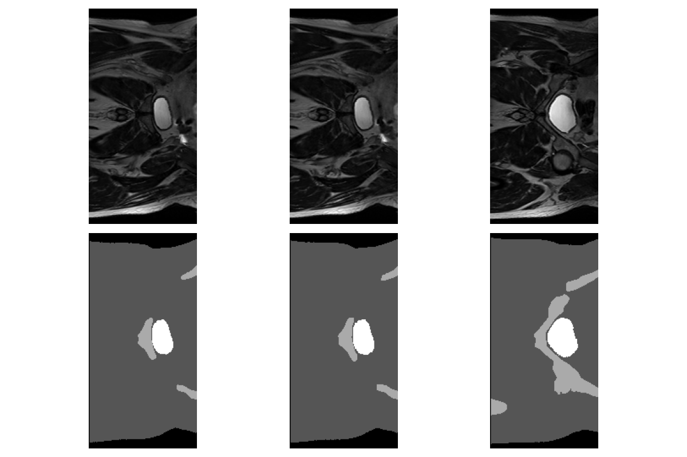
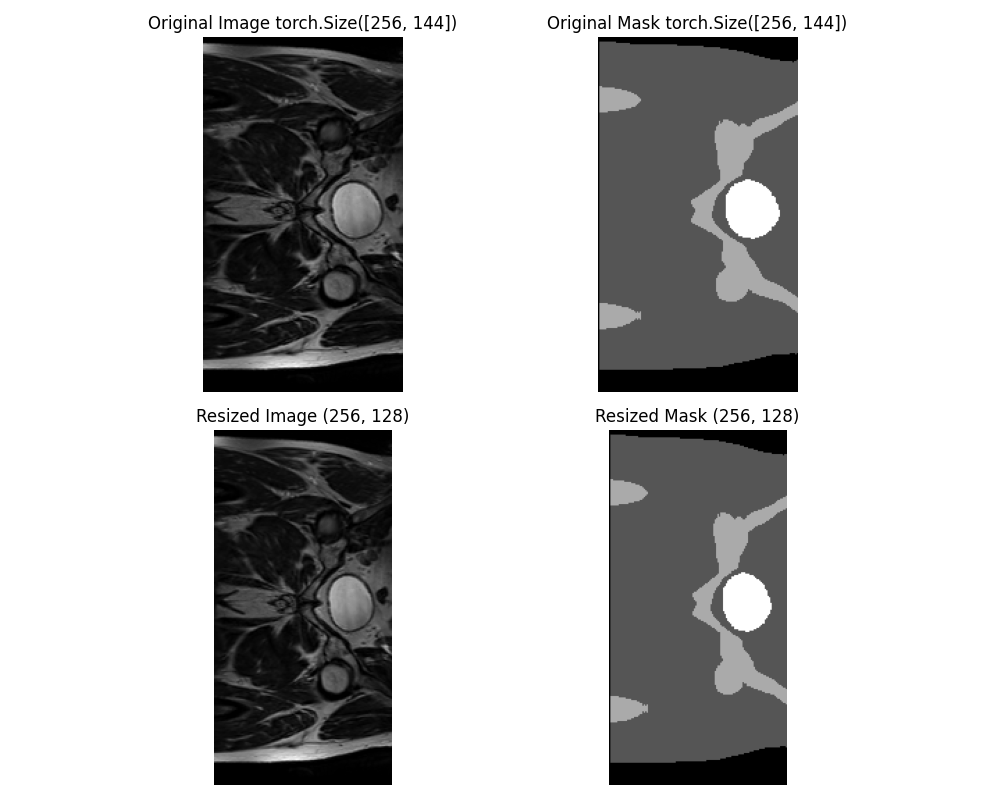
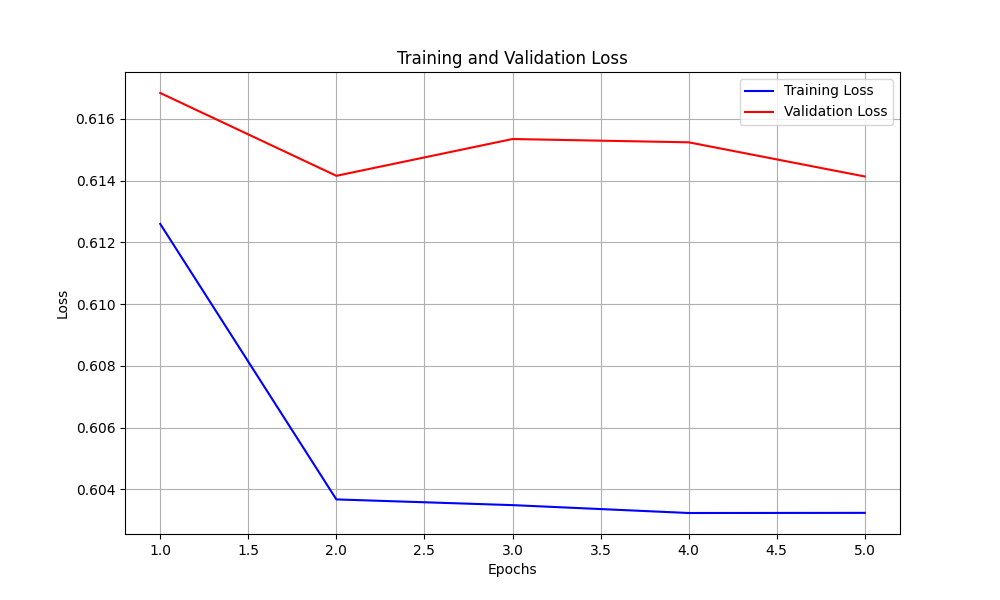
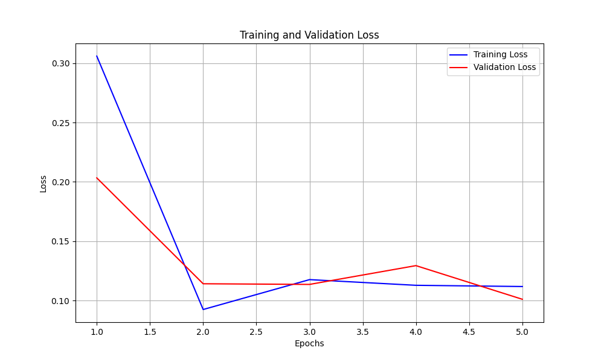
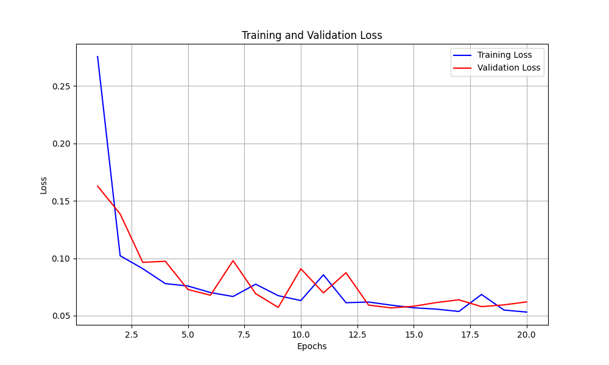
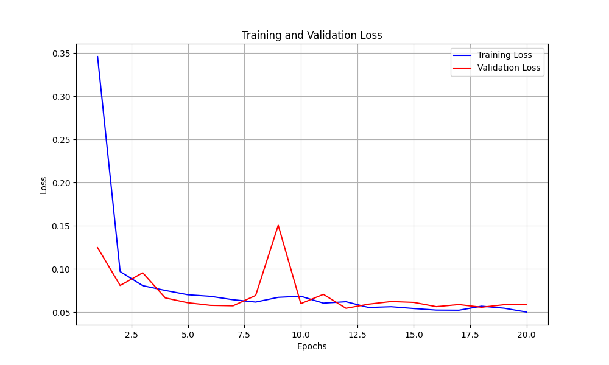
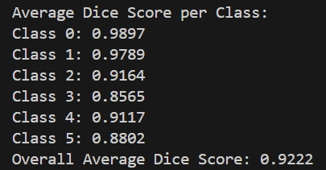
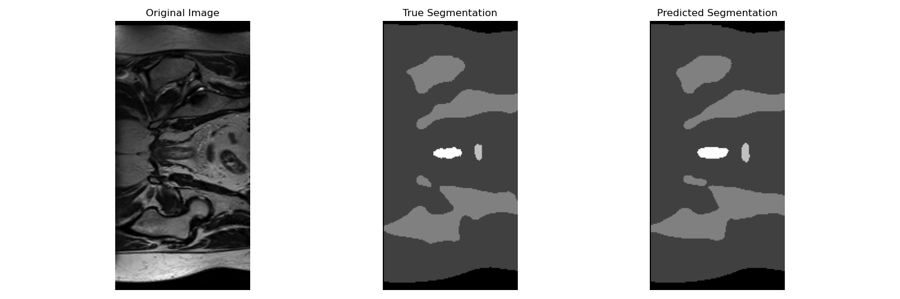
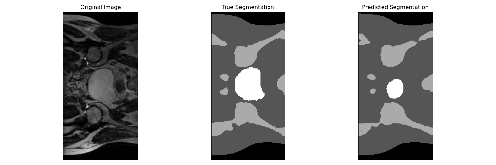

# 2D Segmentation of Prostate Cancer HipMRI Data

## Author
Roman Kull (s4809773)

## Task, and model choices

The goal of this project was to create a model that would be able to take in 2D slices of MRI data from a prostate cancer study, and produce a segmentation of this data into 6 classes, emulating the segmentation produced by a professional in the field. The model architecture chosen was a **UNet** as it excels at tasks where the structure of the original input needs to be preserved in some way. The loss used was **Dice loss**, as the goal was to match the true segmentation provided as closely as possible, meaning that an approach that does pixel-wise intersection between true and predicted segmentation would be effective. 

Other significant choices were to use **batch normalization** and the **AdamW optimizer**, both intended to improve generalizability, and **gradient clipping** and **Kaiming Normal Initialization** (a form of weight initialization), both intended to prevent gradient vanishing/exploding problems.

## Data

The data for this project comes in the form of pre-processed **Nifti MRI images** and their corresponding true segmentations. The data is already split into train, test, and validation folders, so no decisions about train-test splits had to be made.

The data and the true segmentations look like this:

The only pre-processing necessary for the data was due to some portion of the dataset being of size **256x128**, while another was of size **256x144**. To resolve this, **bilinear** and **nearest neighbor interpolation** were used to resize all images to a size of **256x128**. See an example of this below:

## Training Challenges and Solutions

The next problem encountered was that the original UNet design had issues with **vanishing gradients**, where after the first epoch, both the training and test loss would plateau at a very high Dice loss. See the graph below:

To resolve this, as well as mitigate future possible issues with the gradient exploding/vanishing, **batch normalization**, **gradient clipping**, and **Kaiming Normal Initialization** were implemented and used. This was the effect on the loss curve:

## Learning Rate Experimentation

Since the model was now training successfully, it was trained for **20 epochs**, initially with a learning rate of **0.002**, which produced the following graph:

Further experimenting with a **0.001 learning rate** produced a notably smoother curve (excluding the singular outlier spike in the test loss), with the training and test loss being closer together. This was ultimately the selected hyperparameter for the model:

## Evaluation and Results

Using this finalized model, it was tested against the validation dataset, producing its average **Dice coefficient** scores against the true segmentation for each of the segmentation classes, as well as the average accuracy:

Additionally, here are two examples of the model's performance - the first being fairly accurate, and the second demonstrating that it still has trouble capturing the desired level of detail and accuracy when compared to a trained professional:

## Installing Dependencies

pip install numpy matplotlib tqdm torch torchvision nibabel
