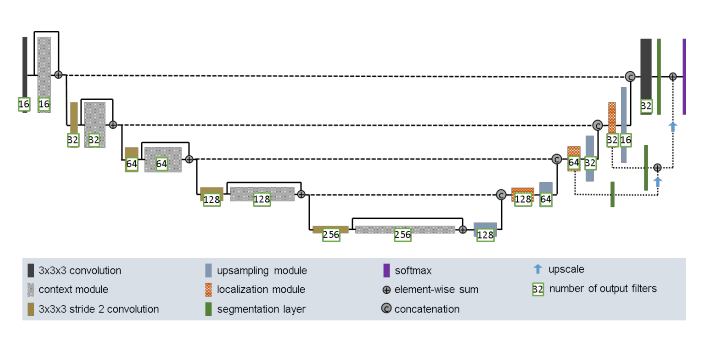
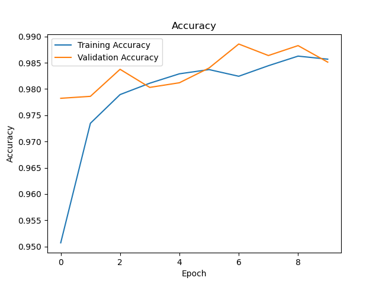
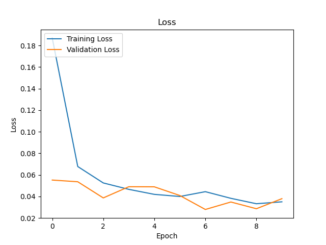
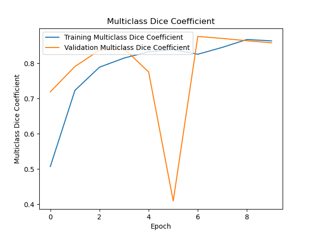
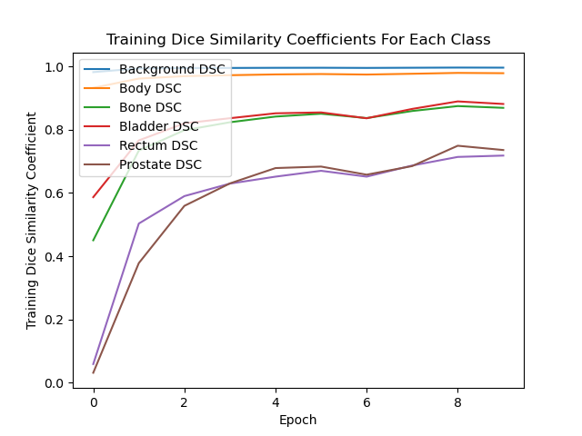
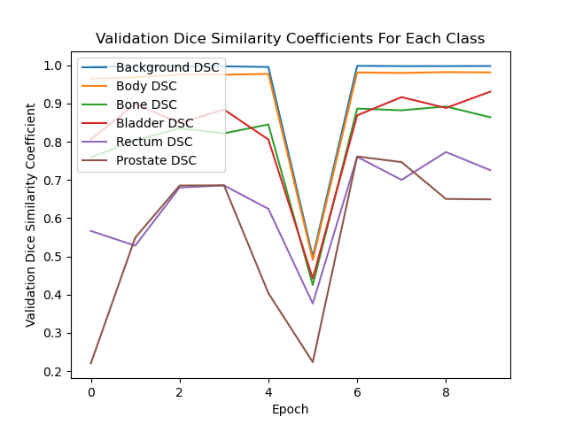
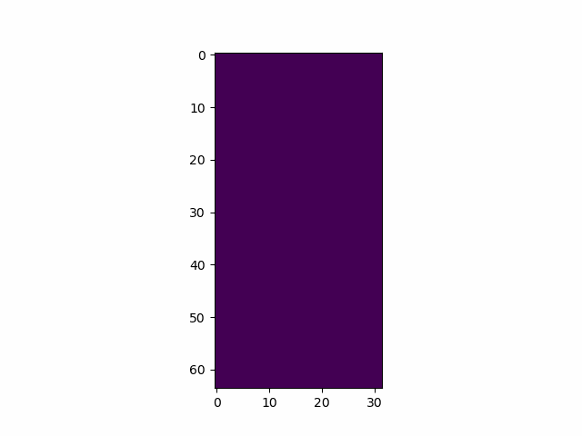

# Image Segmentation Of 3D Prostate MRI Data Using The 3D Improved UNet Model
## 3D Improved UNet
The UNet model is a popular multi-layer deep learning architecture, which is primarily used for image segmentation problems. The UNet model consists of an input level followed by several downsampling layers (encoder), a bottleneck, several upsampling layers (decoder) and then a segmented output. The output of the UNet model is an image where each pixel is classified using a set of labels or classes. The encoder and decoder are linked by several skip connections at each level, where the feature maps of each downsampling layer are linked to the feature maps of the corresponding upsampling layer using concatenation. The inclusion of skip connections enables the preservation of spatial information and gradients that would otherwise be lost or diluted.

| 3D Improved UNet (Isensee, Kickingereder, WIck, Bendszus, & Maier-Hein, 2018) |
| --- |
|  |

The [3D Improved UNet](https://arxiv.org/abs/1802.10508v1) (Isensee, Kickingereder, Wick, Bendszus, & Maier-Hein, 2018) segments 3D volumetric data, and is widely used in medical imaging tasks. The 3D Improved UNet model builds upon the structure of the normal UNet model with the addition of context modules, localisation modules and multiple segmentation layers. This model also uses Leaky ReLU with a negative slope of 0.01 as an activation function and uses instance normalisation instead of batch normalisation. Furthermore, the uses a batch size of 2 and employs the Adam optimiser. Although the [referenced paper](https://arxiv.org/abs/1802.10508v1) used multiclass dice loss, categorical cross entropy loss was used instead since it produced faster training and higher dice similarity coefficients when testing the trained model.

### Downsampling path
The downsampling path consists of repeated context layers, each doubling the number of filters from 16 to 256. Each context layer consists of a 3x3x3 stride-2 convolutional layer (except the first context layer which uses a stride of 1), followed by a context module which is then added back to the convolutional layer. The context module is a residual block that consists of a pre-activation residual block with two 3x3x3 convolutional layers and a dropout layer (drop percentage of 30%) between both convolutional layers. The purpose of the context layer is to aggregate high-level information into abstract representations.

### Upsampling path
The upsampling path consists of repeated upsampling layers, also referred to as the localisation pathway. Each upsampling layer halves the number of filters from 256 to 16 and uses information from the corresponding downsampling layer, and the last three upsampling layers provide information to the corresponding segmentation layer. Each upsampling layer consists of a upsampling module (2x2x2 upscaling layer followed by a 3x3x3 convolutional layer) which is concatenated with the output of the corresponding downsampling layer, following by a localisation module (except for the last upsampling layer which uses a 3x3x3 convolutional layer instead). The localisation module is a 3x3x3 convolutional layer followed by a 1x1x1 convolutional layer, which halves the number of feature maps. The purpose of the upsampling layer is to precisely localise the abstract aggregations produced by the downsampling layers, to locate structures of interest.

### Segmentation Layers
The purpose of having multiple segmentation layers is to employ deep supervision throughout the localisation pathway. Each segmentation layer is a 1x1x1 convolutional layer, where the lowest two segmentation layers connect from the localisation module on their corresponding level to the next highest segmentation layer via upscaling followed by element-wise addition.

### Output
The output layer of the 3D Improved UNet is a softmax layer which provides the final segmentation of the 3D image.

## Dataset
For this project, the 3D Improved UNet model was employed on the [3D Prostate MRI dataset](https://data.csiro.au/collection/csiro:51392v2?redirected=true) (Dowling & Greer, 2021) which contains male pelvis MRI data from 38 patients with 211 volumetric MRI images, labelled with the background, body, bone, bladder, rectum and prostate regions by an MR physicist possessing more than 10 years of experience. The goal of the project was to obtain a dice similarity coefficient of at least 0.7 for all six label classes from the segmentation produced by the 3D Improved UNet model.

Regarding the dataset split into training, testing and validation sets, an effective split for UNet use is 80% training, 10% testing and 10% validation (Palominocobo, 2024). Therefore, this split was utilised for the 3D Improved UNet model. After 80% of the data was allocated to the training set, the training data was augmented using reflections in all 3 dimensions (8 combinations), which significantly increased the size of the training set. In addition, the 3D MRI data was downscaled by a factor of 4 in each dimension to reduce training time and computational load.

## Usage
### Dependencies
The following dependencies are required.
```
matplotlib 3.8.4
nibabel 5.2.1
numpy 1.26.4
tensorflow 2.17.0
```
### Reproducing results
To reproduce the results displayed at the end of this file, [download the data](https://data.csiro.au/collection/csiro:51392v2?redirected=true), install the required dependencies and download modules.py, dataset.py, train.py and predict.py files from this repository. In train.py, change the value of ```SAVED_RESULTS_PATH``` to the path that should save all plots, example visualisations and the trained model. Also, in train.py, change the value of ```DATA_PATH``` to the path to the 'HipMRI_study_complete_release_v1' folder, and restructure the data folder structure to match the file structure below.

```
> HipMRI_study_complete_release_v1
__> seg
____> Case_042_Week0_SEMANTIC_LFOV.nii
______> Case_042_Week0_SEMANTIC_LFOV.nii
____> Case_041_Week0_SEMANTIC_LFOV.nii
______> Case_041_Week0_SEMANTIC_LFOV.nii
____ .
____ .
____ .
____> Case_004_Week1_SEMANTIC_LFOV.nii
______> Case_004_Week1_SEMANTIC_LFOV.nii
____> Case_004_Week0_SEMANTIC_LFOV.nii
______> Case_004_Week0_SEMANTIC_LFOV.nii
__> non_seg
____> Case_042_Week0_LFOV.nii
______> Case_042_Week0_LFOV.nii
____> Case_041_Week0_LFOV.nii
______> Case_041_Week0_LFOV.nii
____ .
____ .
____ .
____> Case_004_Week1_LFOV.nii
______> Case_004_Week1_LFOV.nii
____> Case_004_Week0_LFOV.nii
______> Case_004_Week0_LFOV.nii
```

To train, validate, test and save the 3D Improved UNet model as well as plot and save statistics, run the following command.
```
python train.py
```
To load and test the trained 3D Improved UNet model as well as plot and save examples, run the following command.
```
python predict.py
```
## Training and Validation Results
The model was trained for 10 epochs, and the training and validation accuracy was plotted for each epoch, which is shown below. As expected, the accuracy increased during training.



Additionally, the training and validation losses are plotted below. As expected, the loss decreased during training.



The training and validation multiclass dice similarity coefficients are plotted below. As expected, the multiclass dice similarity coefficient increased during training.



The training and validation dice similarity coefficients for each class are plotted below. As expected, the dice similarity coefficients for each class all increased during training.

 | 
--- | ---

## Testing
Three randomly chosen examples were tested in predict.py and the results are tabulated below.

Input | True | Predicted | Statistics
--- | --- | --- | ---
 |  |  | Multiclass DSC: 0.86728907<br>Background DSC: 0.99759686<br>Body DSC: 0.9824694<br>Bone DSC: 0.8701283<br>Bladder DSC: 0.8650742<br>Rectum DSC: 0.7252475<br>Prostate DSC: 0.76321846
 |  |  | Multiclass DSC: 0.8768958<br>Background DSC: 0.9988788<br>Body DSC: 0.9823527<br>Bone DSC: 0.86266273<br>Bladder 0.9058001<br>Rectum DSC: 0.75025904<br>Prostate DSC: 0.7614214
 |  |  | Multiclass DSC: 0.89011025<br>Background DSC: 0.99636555<br>Body DSC: 0.97573507<br>Bone DSC: 0.85350984<br>Bladder DSC: 0.91508657<br>Rectum DSC: 0.7640095<br>Prostate DSC: 0.83595514

As can be seen above, all of the dice similarity coefficients for the examples are above 0.7, indicating good performance of the 3D Improved UNet model.

The overall dice similarity coefficients for the test set are tabulated below.

Multiclass | Background | Body | Bone | Bladder | Rectum | Prostate
--- | --- | --- | --- | --- | --- | ---
0.8625 | 0.9911 | 0.9741 | 0.8620 | 0.8717 | 0.7443 | 0.7318

As seen above, all of the dice similarity coefficients for the test set are above 0.7, indicating the 3D Improved UNet segments the 6 classes effectively.

## References
Dowling, J., & Greer, P. (2021, September 20). Labelled weekly MR images of the male pelvis. Retrieved from CSIRO: https://data.csiro.au/collection/csiro:51392v2?redirected=true

Isensee, F., Kickingereder, P., WIck, W., Bendszus, M., & Maier-Hein, K. (2018, February 28). Brain Tumor Segmentation and Radiomics Survival Prediction: Contribution to the BRATS 2017 Challenge. Retrieved from https://arxiv.org/abs/1802.10508v1: https://arxiv.org/abs/1802.10508v1

Palominocobo, F. (2024, April 25). Mastering U-Net: A Step-by-Step Guide to Segmentation from Scratch with PyTorch. Retrieved from Medium: https://medium.com/@fernandopalominocobo/mastering-u-net-a-step-by-step-guide-to-segmentation-from-scratch-with-pytorch-6a17c5916114
