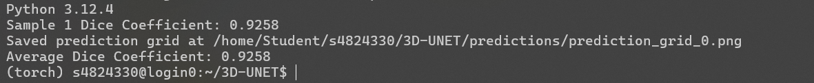
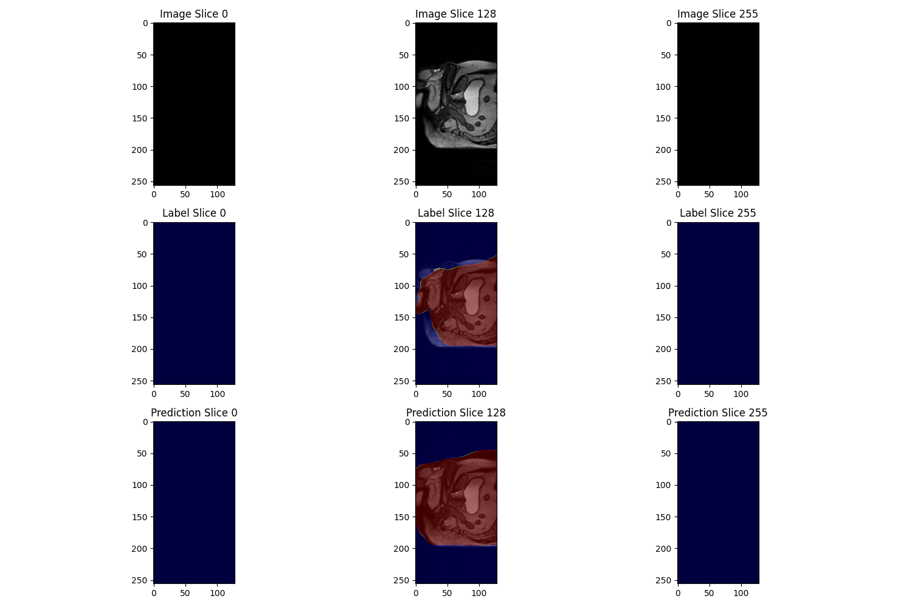

###**3D-UNet for the HipMRI Study on Prostate Cancer**

##**Project Overview**

The goal of the project is to perform segmentation on 3D medical images.it used the dataset of contains MRI scans and corresponding segmentation labels. Training the U-Net model on the scans to learn the segmentation task and then predicting accurate segmentation masks to evaluate.

##**dataset**

The dataset consists of:

    input:	3D MRI scans in NIFTI format(extension .nii or .nii.gz).
	
    lables:	corresponding binary segmentation masks, 1 is prostate tissue, 0 represents non-prostate tissue.
	
##**Data Preprocessing**

    #Normalization: 
    
        Every image is normalized to standatdize intensity values and improve impove model stability.
	
    #label Binarization: 
    
        labes are binarized to ensure all non-zero values are treated as prostate tissue, while 0 values represent the background. the function to_channels coverts label data into a multi-channel format, where each unique label value is represented as a separate channel. 

##**Model Architecture**

The project uses a 3D U-Net architecture, which is widely used for medical image segmentation due to its ability to capture both low-level spatial features and high-level contextual information. 

The network architecture is :

    input channels: 	1	(grayscale MRI scans)
    Output channels:	1	(binary segmentation mask)
    base feature size:	32			

#**Architecture:**

The model consists of two paths:
	
    encoder(downsampling): extracts hierarchical features through convolutional layers followed by max pooling.

    decoder(upsampling): recover spatial resolution using transposed convolutions, with skip connections from the encoder to retain spatial information.

#**Loss Funciton:**

    the model is optimized using binary cross-entropy loss to handle binary classification for segmentation.
	
#**Optimizer:**

    adam optimized is used with a learning rate of 0.001
	
#**Evaluation metric:**

DICE Coefficient: measures the overlap between the predicted segmentation mask and the truth. A higher DICE score indicateds better segmentation accuracy. 

##**Dependences**

```
python			3.8+
pytorch			1.9+
TorchVision		0.10.0+
NumPy			1.19+
nibabel			3.2.1+ (for reading NIFTI files)
tqdm			4.61+  (for progress tracking)
matplotlib		3.4.3  (for visualization)
```

##**Reproducibility**

    1. install the dependences
    2. download the dataset and place the MRI volumes and segmentation labels in the approptiate diectories.
    3. using the train.py to train the model and save the trained model.
	
		python train.py
		
   4. predict segmentation masks using the predict.py
	
		python predict.py
	
	
##**Result**

#evaluation metric:
    using the DICE Coefficient to evaluate the model
	
        the result is:	0.9258
 
  
	
#segmentation output:

  

##**Reference**

1.Çiçek, Ö., Abdulkadir, A., Lienkamp, S. S., Brox, T., & Ronneberger, O. (2016). 3D U-Net: Learning dense volumetric segmentation from sparse annotation. *arXiv*. https://doi.org/10.48550/arXiv.1606.06650

2.OpenAI. (2024). ChatGPT [Large language model]. https://chatgpt.com
3.Dowling, Jason; & Greer, Peter (2021): Labelled weekly MR images of the male pelvis. v2. CSIRO. Data Collection. https://doi.org/10.25919/45t8-p065
