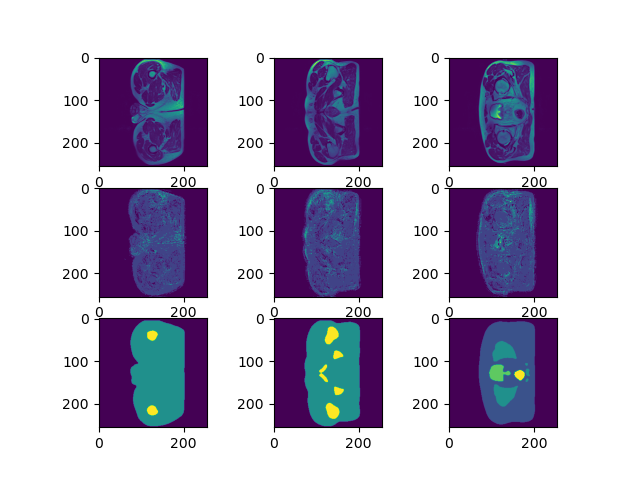
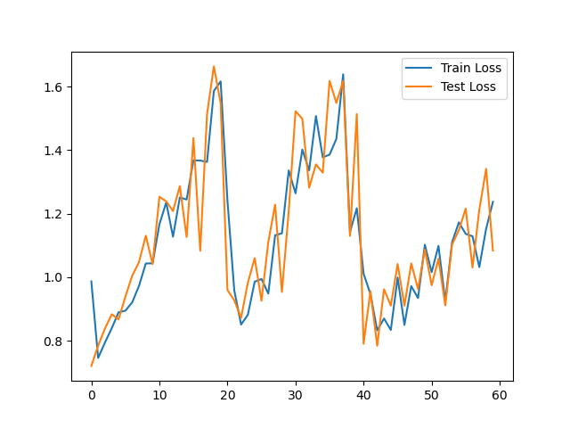

# 3D UNet William Mercado
> Student ID: 47707434

This is a 3D UNet Implementation written with pytorch.

3D UNet is a segmentation algorithm for 3 dimensional data. It is named this way due to the structure of the encoding algorithm, as It starts high with a low number of layers, then gets compressed into a smaller 3D image with many layers, then is re-expanded to the original size of the image. The compression stage is called the analysis while the expansion stage is the synthesis. Data is shared across these stages with shortcut layers to maintain data across many computations.

In this case, this algorithm was tested on HipMri data with unsatisfactory results. However that should just be hyper-parameter problems. The UNet can be used in plenty of other ways. One common usage is for segmenting 2D images. Due to its structure, instead of creating boxes around classification targets, segmentation labels every pixel in a target image making it ideal to calculate more precise boundaries between objects.

## Test Results
As mentioned above the code was tested on the [HipMRI](https://data.csiro.au/collection/csiro:51392v2) dataset with classifying the prostate in mind. The output images below were generated by the `predict.py` code. This file can be examined to create ones own use of a model.\
\
This is an example of the output from a model trained for 60 epochs on randomly rotated data with cross-entropy loss and ADAM optimizer. The top row is the input, the middle is the model's output, and the bottom is the target output. Each column is a reference slice set in the `predict.py` file. It is plain to see that the model has not been trained enough yet. For better performance it is recommended that the model be trained without random rotation, as this should remove some randomness from the input.

\
This is the training and test loss of each epoch. As it can be seen something is definitely wrong with the training as it stands. It is possible that the learning rate is too high, on top of the random rotation set before. Currently it is at $1\times 10^{-3}$. If looking to improve the performance, it is reasonable to reduce this to $1\times 10^{-4}$ or smaller.

## Setup
All environment constants are written in `const.py`, alter variables there to alter different constants as necessary.

A couple packages are required to run the model. [Pytorch](https://pytorch.org/) should be installed following instructions from their website. The following are pip commands to install the remaining required packages:
```
pip install nibabel numpy scikit-learn tqdm pandas
```
This was created and tested with Python 3.12.7 so newer or older installations may cause runtime errors. These can be fixed at ones own discretion.

The `predict.py` uses an extra package matplotlib which can be installed as follows:
```
pip install matplotlib
```

The `const.py` file has one important, and undefined constant, `DATASET_PATH`, which should be set to the folder location of the HipMri dataset. Without this, most files will immediately error when ran. Other constants perform as described in `const.py`. As for training, Hyper Parameters are set at the top of the `train.py` file. Their names should be descriptive enough for anyone to change them as they see fit.

## Usage
Once the setup is complete simply running `python train.py` should be enough to run the training. This will run with the default hyper parameters specified in the file, and save data according to the variables in `const.py`. By default this will run with a learning rate of $1 \times 10^{-3}$, 20 epochs, a batch size of 1, 6 output classes, and no random rotation. The batch size of 1 is due to the high memory consumption. From testing, any larger batch size will cause the gpu to run out of memory.

> !! WARNING !!\
> If the program runs out of storage space while saving a checkpoint in the `NET_OUTPUT_DIR` folder, it will not save any of the loss data to the `ACCURACY_DATA_TARGET` csv. Make sure you have enough storage before running.
