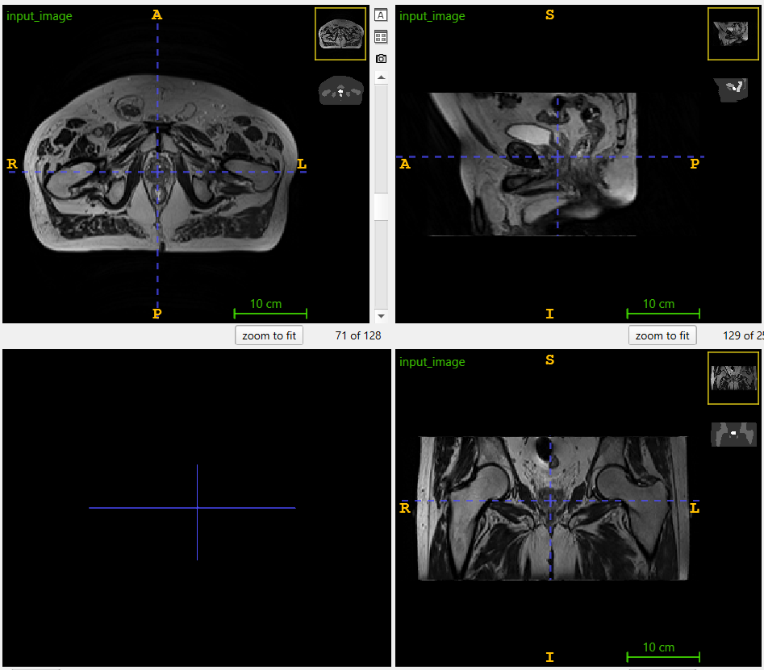
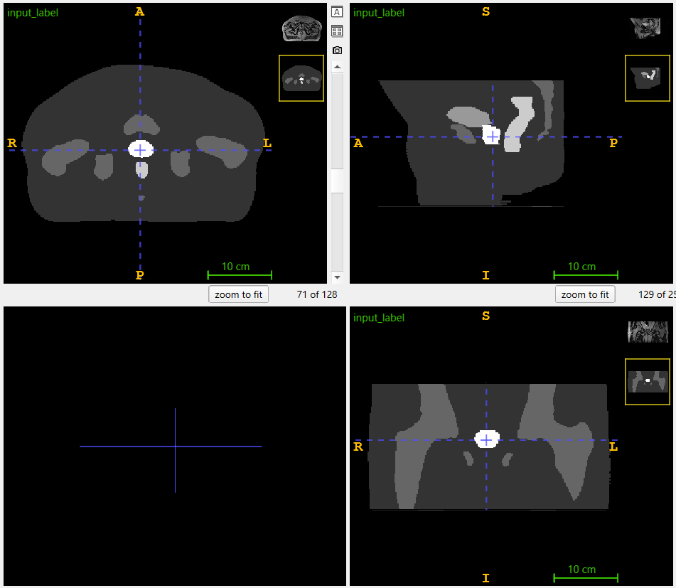
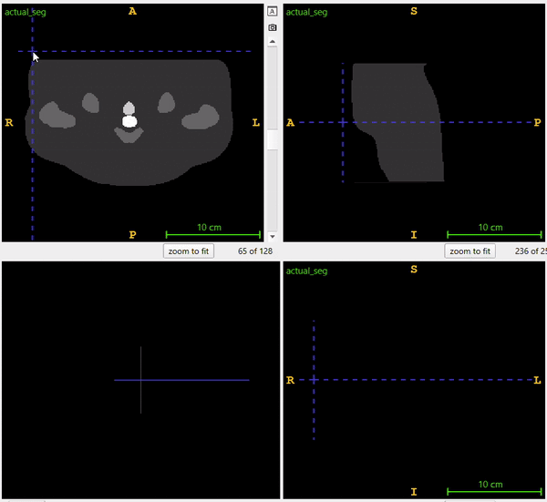
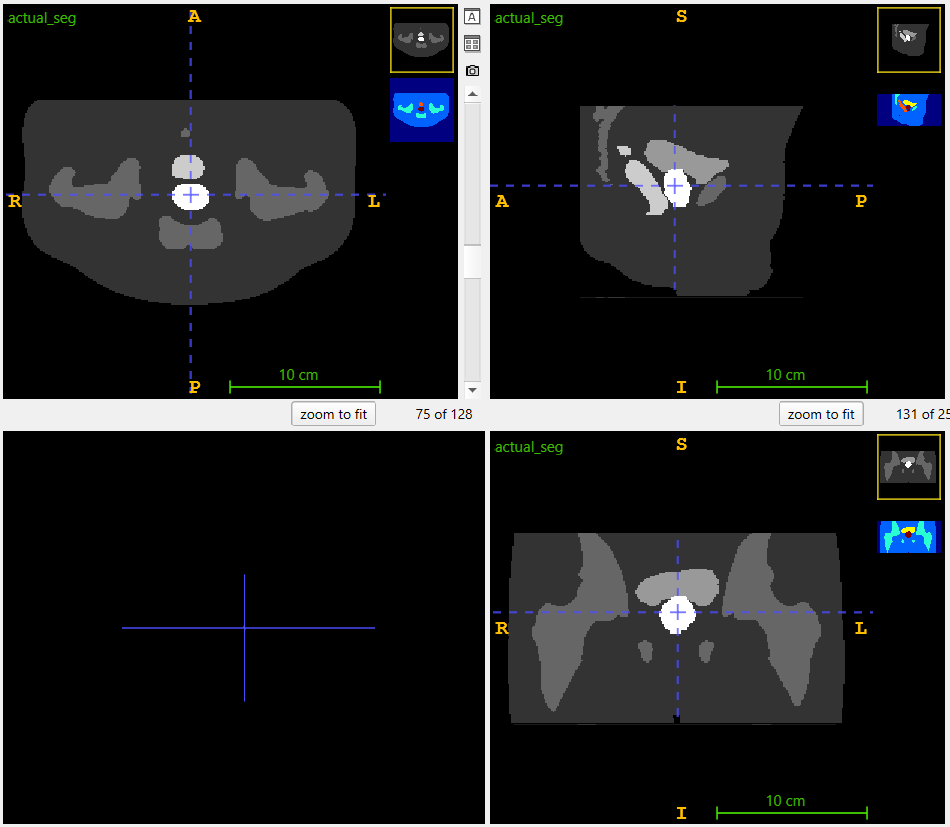
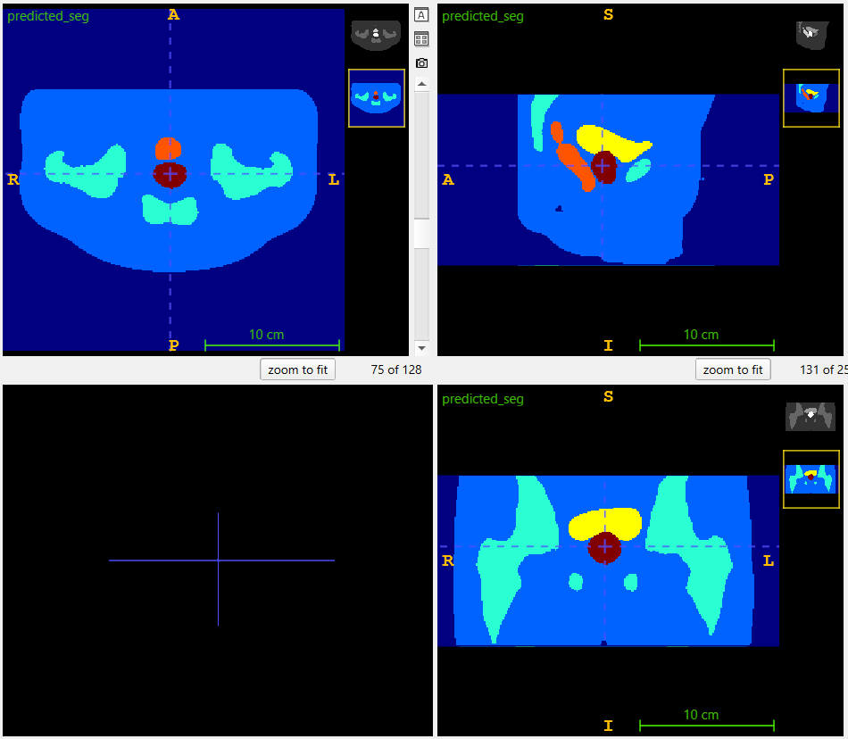
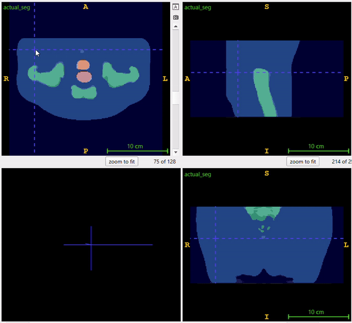

# Segmentation using 3DUnet

By Joseph Savage s4647117

## 3DUnet

### Algorithm description and problem it solves:

The 3D U-Net is a deep learning model specifically designed for the task of segmenting 3D volumetric data. It is an extension of the 2D U-Net, adapted to handle 3D data such as medical scans like MRI or CT, where each scan consists of multiple slices representing the volume of a structure.

The problem it solves is efficient and accurate segmentation of anatomical structures in 3D medical imaging. This is particularly useful in the context of prostate cancer radiotherapy, where accurate segmentation of the prostate gland is essential for treatment planning. Manually delineating the prostate in 3D is time-consuming and prone to errors. The 3D U-Net automates this process by learning from annotated scans, enabling faster, more consistent segmentation that can be used in clinical workflows.

In this instance, the model is trained to segment the following 6 classes: Background, Body, Bones, Bladder, Rectum, Prostate.

### How it works:
<div align="center">
    
</div>

The 3D U-Net follows an encoder-decoder architecture, designed to process and segment volumetric (3D) medical data. This structure allows the network to learn rich features at multiple scales while preserving spatial information, which is essential for accurate segmentation.

#### 1. Encoder Path (Contracting Path):

The encoder path is responsible for extracting increasingly complex features from the input volume (e.g., 3D medical scans). It does this through multiple stages of convolutional layers followed by downsampling operations (usually max-pooling).

-   Convolutional Layers: Each stage of the encoder applies a series of 3D convolutional filters. These filters scan the input volume and generate feature maps that capture local patterns, such as edges, textures, and eventually more abstract structures.

-   Non-Linearity and Normalisation: After each convolution, non-linear activation functions (e.g., ReLU) are applied to introduce non-linearities, which help the model learn complex relationships. Batch normalisation is often applied to stabilise and accelerate training.

-   Max Pooling: After the convolutional layers in each stage, 3D max pooling is applied to reduce the spatial dimensions of the feature maps. This downsampling operation retains the most prominent features while discarding finer details, allowing the model to capture larger contextual information and reduce computational cost.

-   Hierarchical Feature Extraction: As we move deeper into the encoder, the receptive field increases, allowing the network to learn features at multiple scales. Early layers focus on low-level features (edges, textures), while deeper layers capture higher-level semantic information (e.g., object parts and context).

The goal of the encoder path is to gradually compress the input data into a compact representation, while retaining important spatial and structural information.

#### 2. Bottleneck (or Latent Space):

The bottleneck is the narrowest point in the U-Net architecture and represents the latent space of the input data. At this stage, the model has drastically reduced the spatial dimensions of the input but has captured high-level, abstract feature representations.

-   Abstract Feature Learning: The bottleneck focuses on encoding high-level information from the input data. It doesn't directly capture fine details but encodes the most significant structural and spatial patterns that are useful for the segmentation task.

-   Dimensionality Reduction: Since the bottleneck has the fewest number of voxels (3D pixels), it is computationally efficient while still holding important global information about the structure being segmented. This helps the network understand the overall context of the prostate or any other anatomical structure.

-   Information Bottleneck: It plays a critical role in compressing the information, ensuring that the network doesn’t overfit by only focusing on high-level features and discarding irrelevant details.

#### 3. Decoder Path (Expanding Path):

The decoder path is responsible for reconstructing the segmentation map from the compressed features learned by the encoder and bottleneck. The goal is to restore the spatial dimensions of the input volume while maintaining accurate segmentation of target structures.

-   Transposed Convolutions (Upsampling): The decoder begins by upsampling the feature maps from the bottleneck using 3D transposed convolutions (also called deconvolutions). These operations increase the spatial resolution of the feature maps, essentially reversing the downsampling process performed in the encoder.

-   Feature Refinement: As the decoder upsamples the features, it refines the spatial details, making the output feature maps more precise. This process gradually recovers the spatial resolution lost during the encoder's downsampling stages.

-   Skip Connections: One of the key innovations of U-Net is the use of skip connections. At each stage of the decoder, the upsampled feature maps are concatenated with the corresponding feature maps from the encoder path. These skip connections allow the decoder to leverage both low-level features (from early layers of the encoder) and high-level features (from later layers). This helps the model retain fine-grained spatial details, such as boundaries and textures, which are essential for accurate segmentation.

#### Final Output:

The final layer of the decoder typically uses a 1x1x1 convolution to produce an output with the same spatial dimensions as the input, but with a number of channels corresponding to the segmentation task. In this case, the model outputs six channels, providing more flexibility in handling the logits during post-processing. For tasks like prostate segmentation, where the model is trained on 3D medical scans with manually labeled prostate regions, the model predicts pixel-wise classifications for each 3D scan, generating a segmented map of the prostate and other relevant structures (e.g., background, bladder).

### Optimisations / hyperparameters:

#### Loss function:

In this task, a custom loss function, Weighted Dice Loss, was implemented to improve segmentation performance. Initially, the standard unweighted Dice Loss was tested, but it resulted in poor Dice scores for under-represented classes, such as the bladder or the prostate. These smaller classes had a diminished impact on the overall loss due to their lower representation in the dataset.

To address this imbalance, the Dice loss for each class was computed individually and then scaled by a weighting factor, a hyperparameter that determines the relative contribution of each class to the overall loss. The final loss function is the sum of these weighted Dice losses, giving more influence to under-represented classes in the optimisation process.

This approach significantly improved segmentation performance, especially for smaller, less-represented classes.

#### Dice loss class weighting:

After testing more sophisticated methods of obtaining these weights (for example calculating them based on the total number of pixels each class has in the entire dataset), the best performance was found by simply using the following weights:

```plaintext
[0.0476,0.0952,0.1429,0.1905,0.2381,0.2857]
```

(Note that we simply normalised the following to obtain these values: [1, 2, 3, 4, 5, 6]). This way, the less a given class appears, the more weighting it has on the overall loss. Again, this allows smaller classes to not be overlooked in training.

#### Learning rate scheduler:

Another optimisation implemented was the use of a learning rate scheduler. Specifically, PyTorch's OneCycleLR scheduler was employed. Throughout the epochs, this scheduler gradually increases the learning rate to a peak value, then slowly reduces it. This approach helps improve model performance, reduces training time, and increases the likelihood of finding a global minimum.

#### Learning rate scheduler parameters:

-   **optimizer**: The optimizer (Adam) whose learning rate will be modified.
-   **max_lr**: The maximum learning rate, set to (1 × 10⁻³) (0.01).
-   **total_steps**: Total number of training steps used to schedule the learning rate.
-   **pct_start**: Percentage of total steps spent increasing the learning rate, here set to 30%.
-   **anneal_strategy**: Decay method after reaching the max learning rate; 'cos' means cosine annealing.
-   **div_factor**: Initial learning rate calculated as max_lr divided by this factor, resulting in (0.01 / 25 = 0.0004).
-   **final_div_factor**: Final learning rate, which is the initial rate divided by this factor, leading to around (4 × 10⁻⁹).

#### Batch size:

The batch size was kept at 2, since the model is quite memory intensive, and large batch sizes are not viable as a result. It showed a slight improvement in performance over a batch size of 1.

## Project info:

### Dependencies:

-   Python 3.12.4
-   PyTorch 2.4.1+cu118
-   Numpy 1.26.3
-   NiBabel 5.2.1

### File structure:

```plaintext
3DProstateSegment_s4647117/
├── README.md
├── imgs         # Directory to hold images used in README.md
├── dataset.py   # Custom PyTorch Dataset for Loading and Preprocessing NIfTI Files
├── modules.py   # Core components and architecture of the 3DUnet
├── train.py     # Training Script for 3DUNet Model, as well as calculating per-class Dice Score
├── utils.py     # Utility functions such as custom weighted Dice loss and Dice score calculations
└── predict.py   # Shows example usage of trained model. Prints Dice Scores and saves NIfTI files
```

## Input:

Input images have dimensions [256, 256, 128]. Some of the data the model was trained on had dimensions [256, 256, 144], these were trimmed down to [256, 256, 128] to keep resolution consistent.
Here is an example input image:

<div align="left">
    
</div>
For training, each input image has a corresponding label image:

<div align="left">
    
</div>

## Example outputs and Comparison with true labels:

Left is Actual label (ground truth), and right is the predicted label

### Side by side gif:

<div style="display: flex; justify-content: space-around;">
  
  
</div>

### Side by side slice:

<div style="display: flex; justify-content: space-around;">
  
  
</div>

### Overlayed gif:

As above, colored are the predicted labels, and greyscale is actual label

<div align="left">
    
</div>

## Plots and results:

### Training and Validation loss:

<div align="left">
    
</div>
We observed a spike in the validation loss during training, which is not surprising given our choice of a smaller batch size (due to memory limitations), as it tends to introduce more variability in the training process.

### Learning rate:

<div align="left">
    
</div>
We can observe how our learning rate scheduler works from this graph.

### Per-class Dice scores over the test set:

```plaintext
[0.9981201  0.9883934  0.92527676 0.96453923 0.87255245 0.88465655]
```

The Dice score is a metric used to evaluate the similarity between predicted and actual data, commonly in image segmentation tasks. It ranges from 0 (no overlap) to 1 (perfect overlap), where higher values indicate better performance. These scores are good because they show strong overlap between the model's predictions and the actual data, with most scores above 0.9. Even the lowest scores (around 0.87 and 0.88) are still considered strong, indicating that the model performs well across different classes.

## Preprocessing and data splits:

The dataset is divided into training, validation, and test sets to ensure that the model can generalise well to unseen data. The splits are typically chosen based on the size of the dataset and ensuring that each set represents a diverse range of cases. We chose an 70-15-15 split, where 70% of the data is used for training, 15% for validation, and 15% for testing.

-   Preprocessing: Common preprocessing steps included normalisation (scaling pixel intensities) and resizing images to a consistent resolution.
-   Transforms: We did not use any transforms or data augmentation. This could be a potential point of improvement to explore in the future.

These decisions are critical for improving the model's ability to segment the prostate accurately across different patients.

## References:

Içek, O, Abdulkadir, A, Lienkamp, S, Brox, T & Ronneberger, O 2016, 3D U-Net: Learning Dense Volumetric Segmentation from Sparse Annotation, 21 June, viewed 22 October 2024, <https://arxiv.org/pdf/1606.06650>.

Sudre, CH, Li, W, Vercauteren, T, Ourselin, S & Jorge Cardoso, M 2017, Generalised Dice Overlap as a Deep Learning Loss Function for Highly Unbalanced Segmentations, in MJ Cardoso, T Arbel, G Carneiro, T Syeda-Mahmood, JMRS Tavares, M Moradi, A Bradley, H Greenspan, JP Papa, A Madabhushi, JC Nascimento, JS Cardoso, V Belagiannis & Z Lu (eds), Springer Link, Springer International Publishing, Cham, pp. 240–248, viewed 22 October 2024, <https://link.springer.com/chapter/10.1007%2F978-3-319-67558-9_28>.
