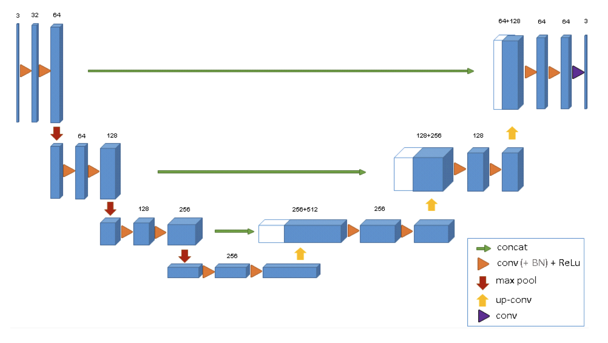
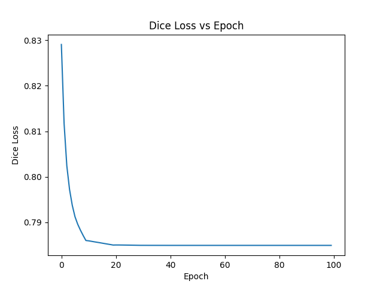
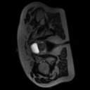
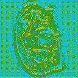

# 3D UNET for Prostate 3D Dataset
## Author

**Name**: Damian Bellew

**Student ID**: 46967697

## Desription

This repository implements a 3D U-Net architecture for medical image segmentation, specifically targeting prostate segmentation from MRI scans. The problem being solved is the segmentation of different regions of human abdomen found in MRI imaging, specifically bone, muscle and organs, during the course of prostate cancer radiation therapy [1]. By using a 3D approach, the network can leverage volumetric information from the entire scan, providing more context compared to traditional 2D methods.

To solve this semantic segmentation problem, a 3D U-Net model was employed. The U-Net model is made up of an encoder-decoder structure with 3D convolutions and skip connections designed specifically for 3D segmentation tasks.   The key component of the U-Net model include:
1. **Encoder Path**: The encoder path is made up of 4 steps, with each step consisting of two convolutional layers with ReLU activation, followed by a max-pooling operation that reduces the spatial dimensions. 
2. **Bottleneck**: The bottleneck connects the encoder and decoder paths, and consists of two convolutional layers with ReLU activation.
3. **Decoder Path**: The decoder path is also made up of 4 steps, with each step consisting of two convolutional layers followed by an upsampling operation. Skip connections between the encoder and decoder layers at the same resolution are also concatenated.
4. **Skip Connections**: Skip connections link corresponding layers in the encoder and decoder paths to retain spatial information that is lost during downsampling.
5. **Output Layer**: The output layer maps the output to the number of segmentation classes

The model is optimized using the Dice coefficient, which is a common loss function in medical image segmentation due to its robustness in handling class imbalance.

*Figure 1: 3D UNet model architecture* [2]



The model was run for 100 epochs with a batch size of 2. The model is saved as `3d_unet_model.pth`

## Repository Layout

```bash
├── modules.py       # the components of the model
├── dataset.py       # the data loader for loading and preprocessing the data
├── train.py         # training, validating and saving the model
├── predict.py       # testing the model, and producing plots
├── utils.py         # constants and helper functions
```

## Dependencies

The following dependencies were used to run the algorithm. They can all be installed with `pip install -r requirements.txt`

- Matplotlib 3.9.2
- Nibabel 5.3.1
- Numpy 1.26.3
- PyTorch 2.4.0
- TorchIO 0.20.1
- tqdm 4.66.5

To ensure reproducibility of results, random seeds are set within the dataset splitting, data loading, and model training steps using a manual seed in PyTorch. This ensures that the same training/validation splits are used and results can be replicated.

## Plots

### Dice Loss Plot

The overall dice loss and the dice loss per class on testing data are as below:

`Average Dice Score: 0.7835453989959899`

`Average Class Losses: [0.8228188753128052, 0.7046192288398743, 0.944815993309021, 0.9893613457679749, 0.9972419738769531, 0.9979994893074036]`

*Figure 2: Dice Loss Plot*



#### Discussion

A dice loss of 0.7835 means the Dice coefficient is 0.2165 (since Dice Loss = 1 - Dice Coefficient), which reflects relatively low overlap between the predicted segmentation and the ground truth. This would suggest that the model is underperforming or struggling with accurate segmentation, likely misclassifying a significant portion of the image.

From the plot of dice loss across epochs, it is clear that there is little to no improvement after approximately 30 epochs, indicating that additional training would not help improve model performance.

### Predicted Masks Plot


The visualisation of the input image, the truth labels and the predicted labels can be seen below:

*Figure 3: Original Image, Original Labels and Prediced Labels*





#### Discussion

It can be seen that the model struggles to accurately perform segmentation. The large region represented by the colour green seems to be the only class which is somewhat represented in the predicted labels. In particular, the smaller region classes do not appear to be represented by the model at all. Additionally, there appears to be significant noise in the all of the regions. This indicates that the model has not performed segmentation successfully.

### Data Preprocessing

**Transformations**: The following transformations were performed on the dataset:
- ZNormalization
- RescaleIntensity (0, 1)
- Resize (128, 128, 128)
- RandomFlip
- RandomAffine (scales=(0.9, 1.1), degrees=10, translation=5)
- RandomElasticDeformation

**Test Train Split**: The dataset was split into a 80/20 test train split


## References
[1] Dowling, J. "Labelled weekly MR images of the male pelvis" (2021) Available at: https://data.csiro.au/collection/csiro:51392v2?redirected=true

[2] Aboussaleh, I. et al. "A 3D hybrid semantic architecture using transformers for brain tumor segmentation with MultiModal MR images"
(2024) Available at: https://doi.org/10.1016/j.rineng.2024.101892