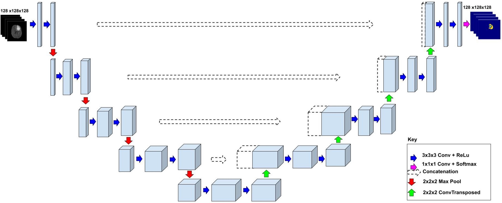

# 3D UNET for Prostate 3D Dataset
## Author

Name: Damian Bellew

Student ID: 46967697

## Desription

This repository implements a 3D U-Net architecture for medical image segmentation, specifically targeting prostate segmentation from MRI scans.

*Figure 1: 3D UNet model architecture* [1]

## Repository Layout

- **modules.py** contains the source code of the components of the model
- **dataset.py** contains the data loader for loading and preprocessing the data
- **train.py** contains the source code for training, validating, testing and saving the model
- **predict.py** contains the source code for testing the model, and producing plots of dice loss and predicted masks
- **utils.py** contains constants and helper functions for preparing the uncompressing the dataset files

## Dependencies

The following dependencies were used to run the algorithm

- PyTorch 2.4.0
- TorchIO 0.20.1
- Nibabel 5.3.1
- Matplotlib 3.9.2
- tqdm 4.66.5

To ensure reproducibility of results, random seeds are set within the dataset splitting, data loading, and model training steps using a manual seed in PyTorch. This ensures that the same training/validation splits are used and results can be replicated.

## Plots

### Dice Loss Plot

### Predicted Masks Plot

## References
[1] [1606.06650] 3D U-Net: Learning Dense Volumetric Segmentation from Sparse Annotation. Available at https://arxiv.org/abs/1606.06650