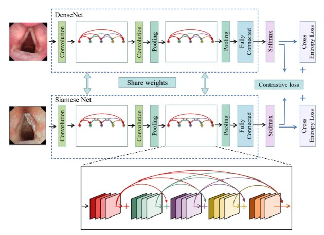

# Siamese based network for ISIC Dataset using contrasitive Loss

## Problem Description
The goal of this project was to develop a siamese network that would perform similarity checks on skin lesions and then extract the embeddings from this network to classify the images into one of the following categories

- `Benign` (skin lesion is not melanoma) with a value of `0`
- `Malignant` (Melanoma Detected) with a value of `1`

## Data
The Dataset provided for this project was the ISIC 2020 Kaggle Dataset. for efficiency a scaled down version of this dataset containing `256x256` images was used and can be found [here](https://www.kaggle.com/datasets/nischaydnk/isic-2020-jpg-256x256-resized/data). One of the primary challenges of this task was the high imbalance of classes, with only ~600 malignant images and ~30,000 benign images typical metrics such accuracy would not be suitable for this task. Thus the solution involved using the metric outlined by Kaggle being the receriver operate under the Receiver Operator Partial Under the Area Curve (roaruc). In additon classification reports were used which would contain metrics such as F1 score, Recall and Precision.

## Preprocessing
To handle the imbalanced dataset the following methods were used:
- importing the excel and dropping the `unamed` and `patient id` columns (We will use ISIC as it is unique and images named by this)
- data augmentation
- normalisd pixel values between `0` and `1`
- using a sampler for each batch to ensure even amounts of both classes (effectively resampling the smaller class several times).

Once this was complete the dataset was split into a `75/15/10` split between training/validation/testing. In addition stratification was used based on class so that subsets have similar proprotions to further balance classes.

As the contrastive loss in pytorch metric learning was used there was no need to to create pairs manually as the method creates these paris internally.Because of this no additional data processing outside of what was done above needed to be done. It should be mentioned that these pairs also help to combat imbalance as the combinations of pariings increases the data the model has to work with.

## Architecture
The final model architecture is based on the [“Vocal Cord Leukoplakia Classification Using Siamese Network Under Small Samples of White Light Endoscopy Images,”](https://aao-hnsfjournals.onlinelibrary.wiley.com/doi/abs/10.1002/ohn.591) by You et al and can be seen below:
 

Figure 1: Siamese Netowrk Architecure [1]

Some modifications have been made such as using Binary Cross Entropy (BCE) Loss using logits. this decision was made as the problem space is binary compared to the multiclassification problem in the report. In additon to this the siamese backbone was implemented using `resnet50`. this approach was taken due to the realtive sucess that was attained in 

## Loss Functions
The key feature this network proposed was in how it computes the loss for the network, instead of treating the classification head and embedded network seperately the network instead computes the loss as follows:

$L = L_CE + L_LP$

where

the sum of the contrasitive loss using `Lp` distance (Euclidean as p=2) and the cross entropy as follows:

Thus it effectively improves the embeddings by minimising distnace whilst also having guidance from a classification perspective, this feature was something I did not see in other papers and lead to good perfomance as can be seen below.

## Model Perfomance

## Dependencies

## Training and Testing
All training and testing of the model is done by one script: 'driver.py'

# References

[1]
Z. You et al., [“Vocal Cord Leukoplakia Classification Using Siamese Network Under Small Samples of White Light Endoscopy Images,”](https://aao-hnsfjournals.onlinelibrary.wiley.com/doi/abs/10.1002/ohn.591) Otolaryngology-head and neck surgery, vol. 170, no. 4, pp. 1099–1108, 2024, doi: 10.1002/ohn.591.

