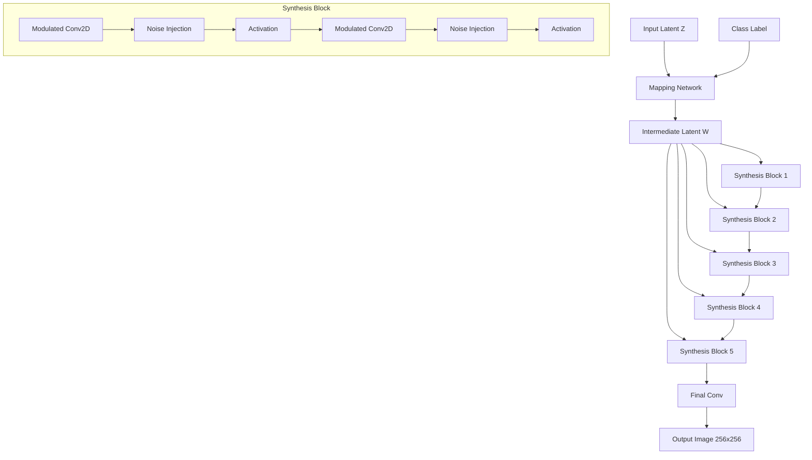
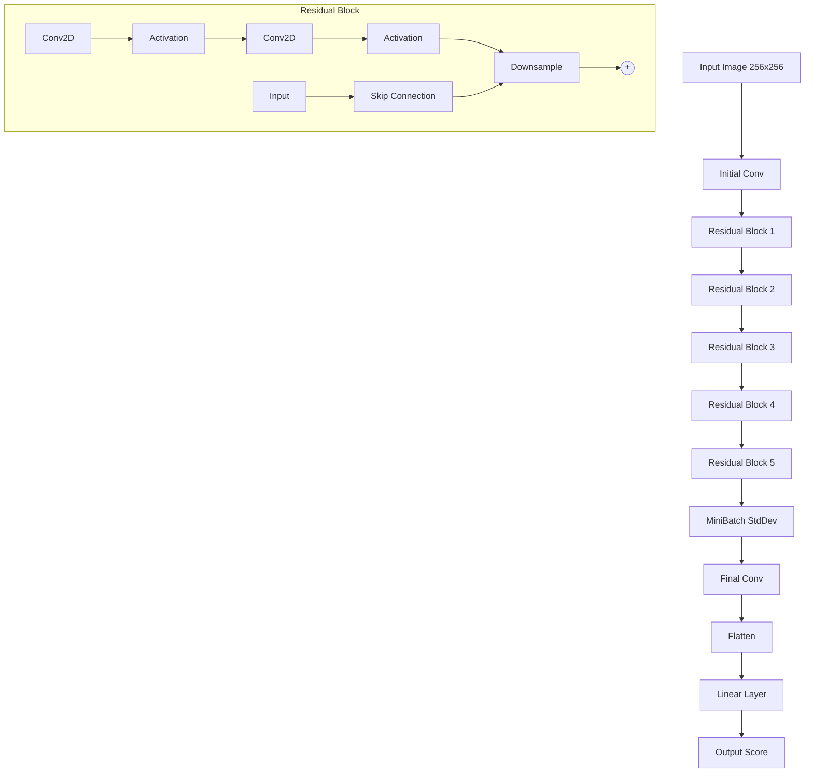

# StyleGAN2 for ADNI Dataset: Alzheimer's and Normal Brain Image Generation

## Problem Statement

This project implements a StyleGAN2 architecture to generate 256x256 pixel grayscale brain images from the Alzheimer's Disease Neuroimaging Initiative (ADNI) dataset. The goal is to create a generator capable of producing realistic brain images for both Alzheimer's Disease (AD) and Normal Control (NC) categories.

StyleGAN2 on the ADNI dataset can contribute to important problems:
1. It can generate synthetic brain images that can be used for data augmentation in medical imaging studies.
2. Its a tool view the latent space of brain images, to see transition phases and structural differences between AD and NC brains.

## StyleGAN2 Architecture and Algorithm

The first StyleGAN introduced the concept of disentangled latent spaces for fine-grain control over image features like style and structure. This was done by separating a mapping network which takes a latent vector z from a standard Gaussian distribution and transforms it into an intermediate latent space w. This makes it easier to control individual attributes (e.g. colour, texture, or shape) without changing others. From w the synthesis network increases the resolution while applying style via Adaptive Instance Normalisation (AdaIN). AdaIN normalises the convolution layer activations using the mean and variance of the feature maps and then scales and shifts them based on learned parameters from the latent vector w.

StyleGAN had some issues with atrifacts in its images. StyleGAN2 extends on StyleGAN by replacing the AdaIN with modulated convolution. Where w is scaled by a learned transform which is then used to scale the kernel weights - this changes layer behavour based on the style vector similarly to AdaIN.

1. **Mapping Network**: Transforms the input latent code and class labels into an intermediate latent space (w).

2. **Synthesis Network**: Generates images. Each block uses modulated convolutions to apply style and upsample.

3. **Discriminator**: Evaluates realism of generated images. It uses downsampling blocks and includes a minibatch standard deviation layer and residual connections.

4. **Progressive Growing**: The network starts generating at a low resolution (8x8) and progressively grows (5 layers) to the final resolution (256x256).

5. **Modulated Convolution**: Used in the synthesis network to apply style information at each layer. Controls the generated images across all resolutions.

The training process involves alternating between generator and discriminator updates. The generator aims to produce increasingly realistic brain images, while the discriminator classifies real and generated images. This aims to remain balanced between the two models so both continue to learn until the generated images are satisfactory.

Below are graphs of the generator and discriminator architectures (IDK if this works):

### Generator Architecture

### Discriminator Architecture

These graphs are the flow of data through the generator and discriminator networks.

## Results
