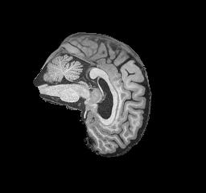
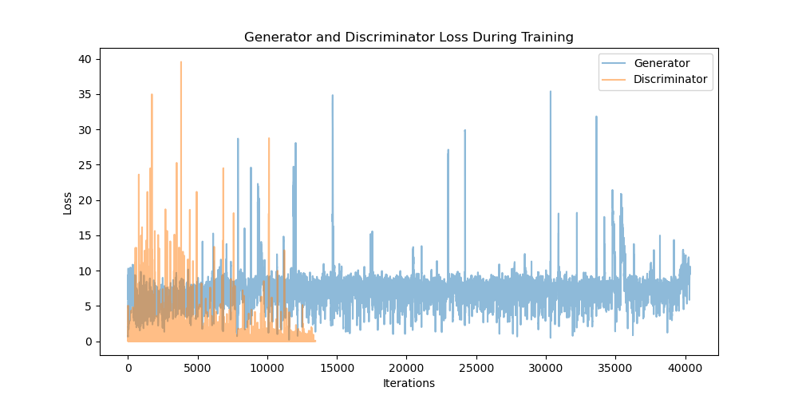

# StyleGAN2 for ADNI Dataset: Alzheimer's and Normal Brain Image Generation

## Problem Statement

This project implements a StyleGAN2 architecture to generate 256x256 pixel grayscale brain images from the Alzheimer's Disease Neuroimaging Initiative (ADNI) dataset. The goal is to create a generator capable of producing realistic brain images for both Alzheimer's Disease (AD) and Normal Control (NC) categories.

StyleGAN2 on the ADNI dataset can contribute to important problems:
1. It can generate synthetic brain images that can be used for data augmentation in medical imaging studies.
2. Its a tool view the latent space of brain images, to see transition phases and structural differences between AD and NC brains.

## StyleGAN2 Architecture and Algorithm

The first StyleGAN introduced the concept of disentangled latent spaces for better control over image features like style and structure. This was done by separating a mapping network which takes a latent vector z from a Gaussian distribution and transforms it into an intermediate latent space w. This makes it easier to control individual attributes (e.g. colour, texture, or shape) without changing others. From w the synthesis network increases the resolution while applying style via Adaptive Instance Normalisation (AdaIN). AdaIN normalises the convolution layer activations using the mean and variance of the feature maps and then scales and shifts them based on learned parameters from the latent vector w.

StyleGAN had some issues with atrifacts in its images. StyleGAN2 extends on StyleGAN by replacing the AdaIN with modulated convolution. Where w is scaled by a learned transform which is then used to scale the kernel weights - this changes layer behavour based on the style vector similarly to AdaIN.

1. **Mapping Network**: Transforms the input latent code and class labels into an intermediate latent space (w).

2. **Synthesis Network**: Generates images. Each block uses modulated convolutions to apply style and upsample.

3. **Discriminator**: Evaluates realism of generated images. It uses downsampling blocks and includes a minibatch standard deviation layer and residual connections.

4. **Progressive Growing**: The network starts generating at a low resolution (8x8) and progressively grows (5 layers) to the final resolution (256x256).

5. **Modulated Convolution**: Used in the synthesis network to apply style information at each layer. Controls the generated images across all resolutions.

6. **Residual Network**: Used in the discriminator to downsample images before classification. Blocks are made up of a convolution layer with leakyReLU activation, added to the input through a skip connection.

The training process involves alternating between generator and discriminator updates. The generator aims to produce increasingly realistic brain images, while the discriminator classifies real and generated images. This aims to remain balanced between the two models so both continue to learn until the generated images are satisfactory.

Below are graphs of the generator and discriminator architectures:

### Generator Architecture

### Discriminator Architecture

## Requirements
| Package     | Version  |
|-------------|----------|
| matplotlib  | 3.9.1    |
| torch       | 2.2.2    |
| torchaudio  | 2.2.2    |
| torchvision | 0.17.2   |
| umap-learn  | 0.5.6    |
| pillow      | 11.0.0   |

## Dataset
The Alzheimer's Disease Neuroimaging Initiative (ADNI) greyscale image dataset is used. The dataset was split into train and test partitions with the training set containing 10,401 Alzheimer's labeled images, and 11,121 normal control images. The test set can be used to evaluate discriminator performance on unseen real images. The test split contains 4,461 Alzheimer's brain images and 4,541 normal brain images. The images are imported to a custom dataset class (dataset.py) in which they are transformed before training. The default transform forces all images to the expected greyscale and size (256x240) - just as a precaution. Then the left and right edges are padded with 8 black pixels each to make the image size 256x256, with both dimensions being a factor of two to be easier to work with. Then the image tensor is normalised with mean and standard deviation of 0.5 to scale the pixel values between -1 to 1. Centered data works better with the activation functions (LeakyReLU and Tanh) used in the network, helping the model converge faster and avoid issues like vanishing or exploding gradients.

Below are an example of an image from the Alzheimer's and Normal classes of the training dataset.

    
     
    AD dataset example

    
     
    NC dataset example

## Results

Through multiple attempts at fixes the training has been unable to be stabilised. After only one batch of the first epoch the discriminator reduces its loss to close to 0 while the generators loss sits in the 8-12 range. This then continues through the rest of training, with the generator only producing black images. Below is an example of the loss plot from a failed training (note discriminator is only being updated once for every three generator updates - this was an attempt to prevent it overpowering the generator).

    
     
    Loss plot of failed training

A number of fixes have been attempted. Some of these were: lowering discriminator learning rate; gradient clipping the discriminator; reducing the number of convolution layers in the residual blocks. None of which worked. Putting debugging print statements in the generators forward pass function has revealed some information. Here is an example from the first forward pass in the first epoch:  

- W stats - min: -0.5029, max: 2.3184, mean: 0.3291
- Const stats - min: -4.3558, max: 3.9382, mean: -0.0023
- Block 0 output - min: -0.5824, max: 2.7969, mean: 0.1913
- Block 1 output - min: -0.2088, max: 1.0293, mean: 0.0760
- Block 2 output - min: -0.0412, max: 0.1953, mean: 0.0196
- Block 3 output - min: -0.0028, max: 0.0141, mean: 0.0010
- Block 4 output - min: -0.0001, max: 0.0005, mean: 0.0000
- Pre-tanh stats - min: -0.0000, max: 0.0000, mean: 0.0000
- Final output stats - min: -0.0000, max: 0.0000, mean: 0.0000

Initially in training the values are getting progressively smaller through each block. By Block 4, values are tiny (around 0.0001-0.0005) and then the final output is essentially zero which explains the black images. Initially vanishing gradients are the issue through the synthesis blocks.

Looking later in that same epoch shows: 

- W stats - min: -0.5317, max: 2.6328, mean: 0.3171
- Const stats - min: -4.3432, max: 3.9339, mean: -0.0031
- Block 0 output - min: -0.7678, max: 11.4550, mean: 0.2891
- Block 1 output - min: -4.8118, max: 54.6300, mean: 1.4092
- Block 2 output - min: -10.8681, max: 83.7554, mean: 4.2039
- Block 3 output - min: -13.6976, max: 66.3221, mean: 4.9582
- Block 4 output - min: -6.7009, max: 40.4881, mean: 1.8513
- Pre-tanh stats - min: -28.8438, max: 0.0753, mean: -8.8984
- Final output stats - min: -1.0000, max: 0.0752, mean: -0.5737

So later in the epoch the network starts producing larger values with significant growth across the blocks. The pre-tanh values are very large (e.g. -28.8438 to 0.0753) indicating the tanh activation is being saturated by exploding gradients, causing most values to be -1 (black) with occasional small positive values. 

The final attempt at fixing this issue was to implement group normalisation after each convolution layer in the generator synthesis blocks. Group normalisation will divide the channels into 8 groups and calculate the mean and standard deviation across the channels in each group. It then normalises to have mean 0 and stddev of 1. The goal was to have group normalisation ensure each block's output maintains a consistent scale to help backwards flow of gradients. 

GroupNorm is particularly useful here because:
1. Independent of batch size (unlike BatchNorm)
2. Preserves spatial information (unlike LayerNorm)
3. Provides stable statistics even when spatial dimensions change due to upsampling
4. Grouping helps maintain feature relationships while still normalising