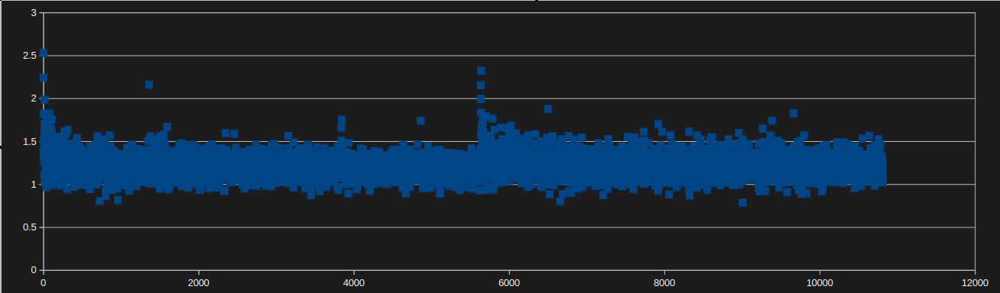

## COMP3710 Project - Topic 6 Siamese Network
## s4642448 Matt Hoffman

This repository involves documentation for a classification model built around the ISIC 2020 Kaggle Challenge dataset containing images of melanoma, specifically using a Siamese network classifier.

Siamese networks involve the use of 'two' CNNs to determine how different images are, and these networks share the same weights - which is where I assume the name comes from. In practice the same network can be used (as it shares the same weights) as long as you feed it two samples in isolation.

Following this, euclidean distance is a fairly standard way of quantifying how different the two images are.

The general process followed for building up the Siamese network is as follows:
1. Construct a Torch Dataset derivative to load the test and train sets
2. Construct a base CNN class to use as the backbone of the network
3. Implement a utility class to take in a pair of images and push them through the network
4. Build a utility class able to calculate the euclidean distance between the output results
5. Construct a utility class to find and pair images with the same labels from the dataset
6. Train the model
7. Test the model

### Test Environment and Dependencies

The training for this model was done on some of the servers I have at home. The GPUs involved were an **NVIDIA GTX 1080 Ti 11GB** using **CUDA** of course, and an **AMD Radeon RX 6900 XT** using **ROCm** as the compute stack.

The 1080 Ti machine is running **Debian 12** on **Python 3.11**, and the 6900 XT machine is running **Arch Linux** on **Python 3.12.7**. The dependencies are:

- CUDA / ROCm and OpenCL (if GPU accelerated compute is desired)
- Torch (pytorch)
- TorchVision
- Pandas
- KaggleHub
- Pillow

The cross-platform python dependencies can be installed with the following pip command:
```
pip install torch torchvision pandas kagglehub pillow
```

Whereas the compute libraries will be more platform-specific, and may require proprietary drivers.

### Editable Parameters

Inside of `train.py` are tweakable parameters that influence the performance of the model. Notably:
- TARGET_EPOCHS is an integer describing how many epochs to train for
- TARGET_LEARNING_RATE adjusts the learning rate of the Adam optimiser

Inside `predict.py`:
- TARGET_SAMPLES changes how many samples to test with when calculating accuracy
- BATCH_SIZE is passed to the DataLoader responsible for yielding the test samples

### Training and Testing the Model

Training the model with default parameters can simply be done by executing:
```
python3 train.py
```
In which case it will train and save a model, 'snetX.pth' where X is the number of epochs specified by TARGET_EPOCHS.

Testing the performance of the model can then be done by:
```
python3 predict.py
```
predict.py will grab the TARGET_EPOCHS from train.py and will load the correct file assuming nothing is changed manually.

### Model Results

The model was trained for 2 and 5 epochs to do a performance comparison. All parameters used for testing are currently set in `train.py` and `predict.py` so they should be reproducible - multiple training runs at these epochs produced similar results.

#### 2 Epoch Performance
The output of `predict.py`:
```
ISIC test data accuracy: 13836 / 16000 - 86.47500000000001%
```
#### 5 Epoch Performance
The output of `predict.py`:
```
ISIC test data accuracy: 27213 / 32000 - 85.040625%5%
```

There was a minimal difference between 2 epochs and 5 epochs, suggesting that either this particular structure has reached a ceiling in terms of performance or that increasing by 3 simply wasn't high enough. If I'd started this less than 2 days before it was due I may have been able to test that :P

#### Loss Plots
Loss was recorded for the 5-epoch training session, and a plot of this can be seen below as training progressed:



It finished around 1.01 - 1.09 as can be seen in the training logs.
