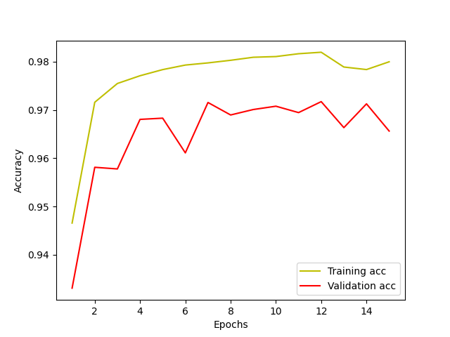

# 2D U-Net Image Segmentation of the HipMRI Prostate MRI Dataset
## Loading dataset
For this example we will use **HipMRI** dataset. It is a set of
- **train** images + segmentation masks
- **validation** images + segmentation masks
- **test** images + segmentation masks
All images are of resolution 256x128 in grayscale.
The complete dataset provided by the CSIRO can be found at https://data.csiro.au/collection/csiro:51392v2?redirected=true

The project used Python 3.10.14. Dependencies can be found in `requirements.txt` and installed using pip via.
```bash
pip install -r requirements.txt
```

## Usage
Run commands from the root directory.

### Downloading data
Download and extract the HipMRI dataset from <https://data.csiro.au/collection/csiro:51392v2?redirected=true>. Place the extracted folder inside the root directory.

The resulting data files should reside inside the root directory like so
```bash
HipMRI_study_complete_release_v1
    keras_train_slices
    keras_seg_train_slices
    keras_validate_slices
    keras_seg_validate_slices
    keras_test_slices
    keras_seg_test_slices
```
Furthermore folders should be created to store the graphics and models produced by train.py
```bash
mkdir plots
mkdir models
```

### Training
To train the model from scratch.
```bash
python train.py
```
After completion the trained model will be saved to the models folder.
### Evaluation
To evaluate the trained trained model and produce all plots in the `plots` folder, run
```bash
python predict.py -d [train/val/test] [image_no]
```
where `image_no` is the index of the image to be segmented from the respective dataset. If no index is supplied, a random image from the provided dataset will be used.
### Example Prediction
To get the prediction for the first 256x128x1 image in the test dataset run
```bash
python predict.py -d test 0
```
which will output the following,


## Problem Overview

Prostate cancer is the second leading cause of cancer in the United States.

State-of-the-art segmentation methods often fail to to produce well-contained segmentation of the prostate zones since certain slices of prostate MRI are harder to segment than other slices [1].

Since 2015, the U-Net neural network architecture has been legendary in its ability to segment high-dimensional input data into multiple classes through a simple encode to decode structure. The original paper describes found at https://lmb.informatik.uni-freiburg.de/people/ronneber/u-net/ [2] describes a network that combines several pairs of convolution layers with max pooling applied to ouput in order to 'decode' the input data into a smaller feature space. Connected by a bridging pair of convolution layers, the filters are then upsampled to decode the data to its original size.
Central to the networks success is the inclusion of skip connections between the decode and encode to preserve the structure of the original data.

[2]

## Dice Loss

There are six classes of tissue that need to be classified in the HipMRI dataset by the segmentation model. These include background, bladder, body, bone, rectum
and prostate.

Calculating the proportion of the images labelled as each class in the segmented training dataset we can see that the classes are distributed the following

| **background (0)** | **bladder (1)** | **body (2)** | **bone (3)** | **rectum (4)** | **prostate (5)** |
|--------------------|-----------------|--------------|--------------|----------------|------------------|
| 0.17               | 0.68            | 0.13         | 0.02         | 0.04           | 0.0004           |


In medical image segmentation, metrics such as accuracy can fail to provide a good measurement of the success model due to some classes being inherently far more prevalent than minority classes in the dataset. In this manner, selecting an accuracy-based loss function such as categorical crossentropy may not provide crisp segmentation boundaries and may overly prioritise true positives over F1 score etc. To combat this, dice loss was used as a replacement of the standard cross-entropy objective. Based on the Sorensen-Dice coefficient, which attaches similar importance to false positives and false negatives, it is more immune to imbalances in the data [3].

## Data Preparation

The dataset contains 11400 images and segmented images each for training, 600 validation images and labels and 540 test images and labels. Images are of resolution 256x128x1, in grayscale formatting. Labels from 0-5 were were one-hot-encoded for use of the softmax activation function in the final layer of the network.

## Training Details
The U-Net was trained using the Adam optimizer with a LR of 0.0001. A batch size of 4 was used to train the network for 15 epochs - few epochs were needed due to the luxury of having a large amount of training data. The loss function selected was the sum of the dice loss and focal loss. While dice loss alone was effective at segmenting the more common classes such as body and bone, it struggled to identify the minority classes such as rectum and prostate. Adding focal loss greatly reduced the validation loss by improving the models identification of minority classes. 

## Results
The model was originally trained for 10 epochs and a learning rate of 0.0001 using
the standard generalised dice loss criterion. The training and validation dice loss, accuracy, and prostate-specific dice similarity can be observed over the course of the training in the following plots. After training the model yourself, similar training plots will appear in the `plots` directory of your environment.

### Dice loss


### Accuracy


### Dice similarity: prostate label


The model quickly obtains a low loss and high accuracy after few epochs. However,
we can see that the dice coefficient for the super minority class being the prostate, quickly reaches its maximum of 0.55. In the context of screening for prostate cancer using an MRI of a patient, this is not enough to be confident in the model segmenting a patient's cancerous prostate.

To improve the model's ability to correctly segment the imbalanced classes, we will introduce a second loss function, being the sum of the dice loss plus the categorical focal loss. Using this loss function, the model was trainied for 15 epochs again with a learning rate of 0.0001 and the following results were obtained:

### Dice loss + focal loss


### Accuracy



### Dice similarity: prostate label


We can see that the combined loss function of dice + focal is more successful at
improving the dice similarity of the prostate class as a minority in the dataset with the dice similarity of the prostate class on the validation dataset reaching a height of 0.84. This comes at a slight trade-off in the overall loss and accuracy of the model. In the case of screening for prostate cancer, where true positive detection of prostate cancer is the most important, this segmentation is much more ideal.

# Evaluation of model on test set

After training the model, the evaluated dice similarity for each class on the test set is given as

| **background (0)** | **bladder (1)** | **body (2)** | **bone (3)** | **rectum (4)** | **prostate (5)** |
|--------------------|-----------------|--------------|--------------|----------------|------------------|
| 0.996              | 0.982           | 0.927        | 0.948        | 0.828          | 0.781            |


## References


<a id="1">[1]</a> Jiang, H., Imran, M., Muralidharan, P., Patel, A., Pensa, J., Liang, M., Benidir, T., Grajo, J. R., Joseph, J. P., Terry, R., DiBianco, J. M., Su, L.-M., Zhou, Y., Brisbane, W. G., & Shao, W. (2024). MicroSegNet: A deep learning approach for prostate segmentation on micro-ultrasound images. Computerized Medical Imaging and Graphics, 112, 102326. https://doi.org/10.1016/j.compmedimag.2024.102326

‌<a id="2">[2]</a> Ronneberger, O., Fischer, P., Brox, T. (2015). U-Net: Convolutional Networks for Biomedical Image Segmentation. Uni-Freiburg.de. https://lmb.informatik.uni-freiburg.de/people/ronneber/u-net/

<a id="3">[3]</a> Li, X., Sun, X., Meng, Y., Liang, J., Wu, F., & Li, J. (2020). Dice Loss for Data-imbalanced NLP Tasks. ArXiv:1911.02855 [Cs]. https://arxiv.org/abs/1911.02855

