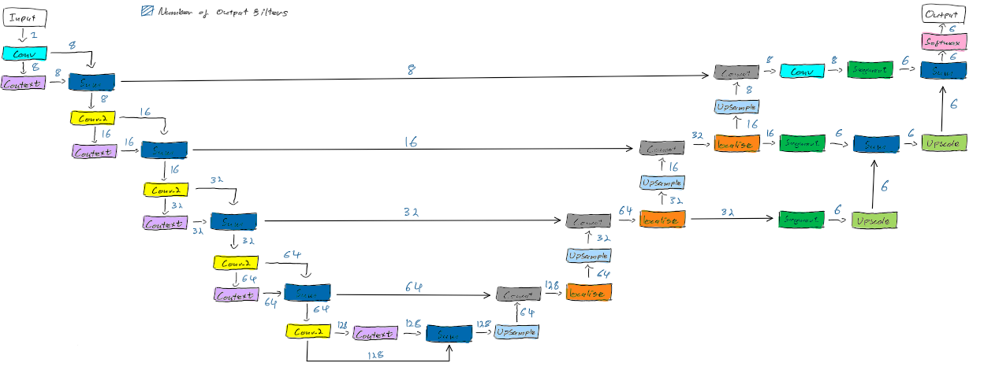

# Improved 3D Unet for Segmenting HipMRI Prostate Dataset

This project is an implementation of the Improved 3D Unet [1] to segment and classify the HipMRI Prostate Dataset, for the purposes of detecting Prostate Cancer [2]. This algorithm provides a form of quantitative assessment of prostate cancer, and hence is an essential part of diagnosis. The model aims to provide a fast, automatic method of segmenting the MRI scans to aid clinicians in their decision making.

## Model Architecture

The model segments the input MRI scans from the dataset into 6 distinct classes: background, bladder, body, bone, rectum, and prostate, numbered 0 to 5 respectively. The input dataset was greyscale, so the number of input channels was 1. The architecture used in this model used a base number of filters as 8 filters, doubling when moving down the encoder side, and halving when moving up the decoder side [1].

The initial input passes through a 3D convolution with kernel size of 3, is passed through a context module, and element-wise summed before continueing. The encoder side uses strided 3D convolutions with a kernel size of 3 and stride of 2, which are element-wise summed with the output of the context modules. The activations in the encoder side are performed by the context modules, which include two 3D convolutions with kernel size of 3, instance normalisation, and leaky ReLU activation layers with a negative slope of 0.01, and a dropout with probability 0.3 in between. The decoder then uses an upsample module that upscales with a factor of 2 and halves the feature maps with a 3D convolution of kernel size 3. These upsampled results are concatenated with the relevant layer from the encoder element-wise sum, and a localisation module combines these together. The localisation module consists of two 3D convolutions, each with instance normalisation and a leaky ReLU activation layer with a negative slope of 0.01, where the first convolution has a kernel size of 3 and halves the concatenated features, and the second is a kernel size of 1 [1]. The strategy proposed by [3] is then used to employ deep supervision, by applying segmentation layers at deeper levels of the decoder, which are propagated upwards to the output. These segmentation modules use a 3D convolution with kernel size of 1, and are then upscaled and element-wise summed with the next layers segmentation. The architecture then uses the softmax to convert the result to probabilities [1].

## Data Preprocessing

The dataset available contained a total of 211 MRI scans and corresponding class labels. The model used 65% of this for training, 20% of this for validation, and 15% of this for testing, to ensure the model had sufficient data to train on, but prevent data leakage in each set. Each image and mask has their intensity rescaled to a range of (0, 1), and are normalised before being processed in the model. For training, data augmentation is applied using standard, but aggressive, pytorch transforms, including random flips, elastic deformation, and random affine transformation.

## Dependencies

All dependencies are listed in the `requirements.txt` file and can be used to install all of them with pip using `pip install -r requirements.txt`.

## Modules

The repository is organised as such:

- `dataset.py` includes the data loader and dataset objects that automatically load the images and masks and apply relevant transformations and data splits.
- `modules.py` contains the classes and actual architecture of the improved 3D Unet model.
- `metrics.py` includes classes for calculating loss metrics and accuracy.
- `train.py` is a script for running the training process and saving the model results.
- `predict.py` is a script for testing a trained (or even unfinished) model to analyse its performance and visualisate its results and metrics.
- `utils.py` contains provided code from the task and miscellaneous plotting and saving functions.

## Usage and Training

To train the model, the file `train.py` can be run with no argumnts. The file paths currently are designed to support UQ's Rangpur, or a local machine where the data is in a local directory. If the data is set up differently to the constants present in `dataset.py`, then these argumnts should be changed. Training parameters such as batch size, epochs, and total number of images to use can be modified using the constants at the top of `train.py`, along with training hyperparameters. It will find the output directory with the name supplied in the constant at the top of `train.py` or the closest one with a count appended to the end of it to save model results. The model can be stopped prematurely and evaluated in `predict.py` as the criterion is saved with the model.

`predict.py` can be run by changing the input model file and output directory in its constants and running the file with no arguments. It will output loss graphs if the training or validation was stopped prematurely, and proceed to test the model, and output loss graphs and visualisations of some images.

Currently the model trains using an Adam optimiser and a custom learning scheduler as used in [1]. It uses the Dice loss for learning, but implementations of Focal Loss and the two cascaded together are also available in `metrics.py` and can be used. Each loss class keeps track of the loss per epoch per iteration, and can be used to plot the average loss over an epoch, loss at the end of each epoch, and complete loss over all iterations and all epochs.

## Sample Results

The following was produced when training over 56 epochs using Dice loss for learning.

## Discussion and Conclusion

The model was unable to adequately identify and differentiate the classes. The Dice losses for some classes that were underepresented were too high, and the used transforms were not aggresive enough to resolve this problem. Suggestions for further improvement include:

- Employing a weighted loss function in cascade with the Dice loss function, to aid in the identification of the underepresented classes
- Applying more aggresive transforms to the more underepresented classes

## References

[1] F. Isensee, P. Kickingereder, W. Wick, M. Bendszus, and K. H. Maier-Hein, “Brain Tumor Segmentation and Radiomics Survival Prediction: Contribution to the BRATS 2017 Challenge,” Feb. 2018. [Online]. Available: https://arxiv.org/abs/1802.10508v1

[2] P. G. Jason Dowling, “Labelled weekly MR images of the male pelvis,” 20 September 2021. [Online]. Available: https://data.csiro.au/collection/csiro:51392v2?redirected=true.

[3] B. Kayalibay, G. Jensen, and P. van der Smagt, “CNN-based segmentation of medical imaging data,” arXiv preprint arXiv:1701.03056, 2017.
