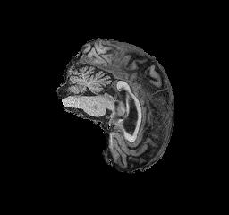
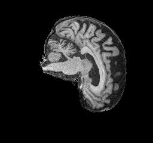
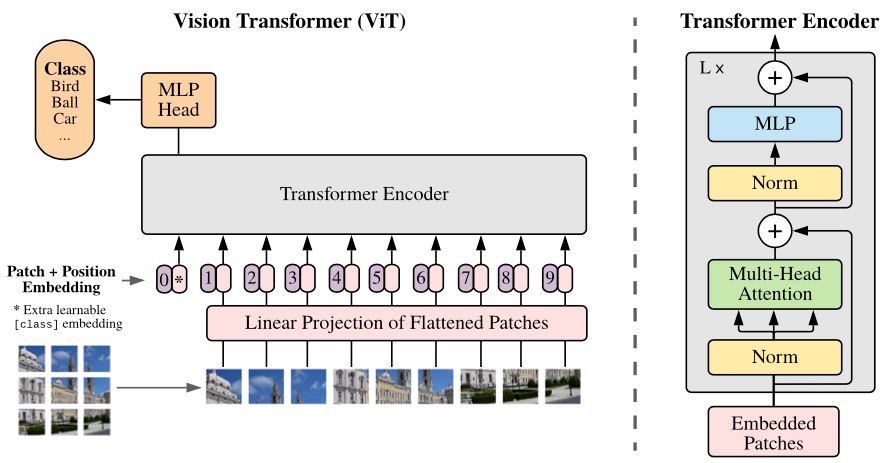
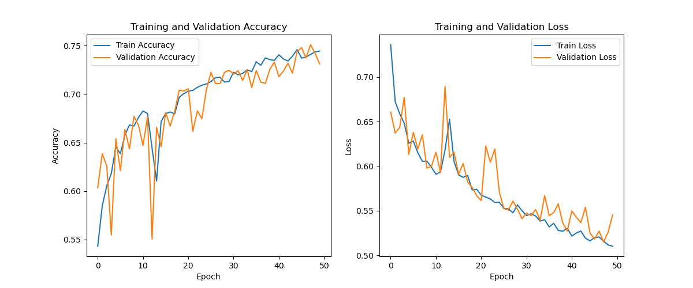
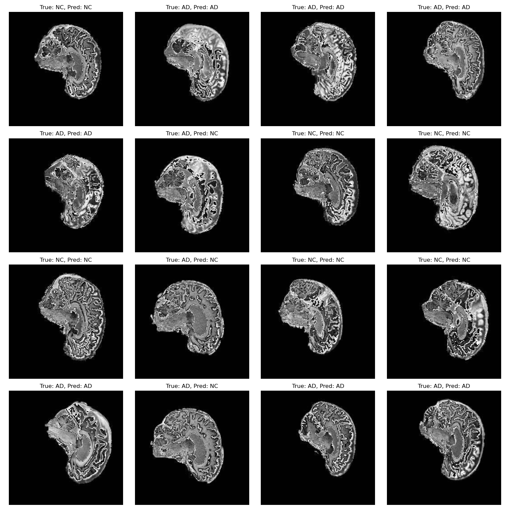

# Implementing a Vision Transformer (ViT) for the [ADNI Dataset](https://adni.loni.usc.edu/)

## Problem Overview
To classify the [ADNI dataset](https://adni.loni.usc.edu/) into two distinct classes, AD or NC (Alzheimer's Disease or Normal Cognitive), using a Vision Transformer to try and achieve a test accuracy of `>0.8`.

This repository contains a deep learning model for classifying Alzheimer's Disease (AD) and Normal Cognition (NC) using MRI scans. This model addresses the critical challenge of early detection and diagnosis of Alzheimer's using the ADNI dataset, which can assist medical professionals by automating the diagnostic process. 

## Dataset Information
The dataset directory is of the following format:
```
AD_NC
├── test
│   ├── AD
│   │   ├── 388206_78.jpeg
│   │   ├── ...│
│   └── NC
│       ├── 1182968_94.jpeg
│       ├── ...│
└── train
    ├── AD
    │   ├── 218391_78.jpeg
    │   ├── ...│
    └── NC
        ├── 808819_88.jpeg
        ├── ...
```
An example of the AD and NC jpeg images are shown below respectively:

 

The dataset undergoes preprocessing before the model is trained on it. Firstly, the training data is labelled according to their true class (`1` for AD, `0` for NC). This implementation is shown below:
```python
# Collect filenames for AD (label 1) and NC (label 0) classes
self.ad_files = sorted(os.listdir(os.path.join(self.root_dir, 'AD')))
self.nc_files = sorted(os.listdir(os.path.join(self.root_dir, 'NC')))

# Create a list of (filename, label) tuples for all images
self.images = [(file, 1) for file in self.ad_files] + [(file, 0) for file in self.nc_files]
```
Then, the images are converted to grayscale:
```python
# Load image and convert to grayscale
image = Image.open(img_path).convert('L')
```
The training data is then augmented using a series of random transforms:
- Randomly flip image horizontally with 50% chance.
* Randomly rotate image angle within range [-30, +30] degrees.
+ Randomly flip image vertically with 50% chance.

No transformations are applied to the test dataset, although both train and test datasets are applied with the following:
- Resizing to a fixed size of `224x224` pixels.
* Convert PIL image into a PyTorch tensor.
+ Normalize image tensor with `mean = 0.5`, `standard deviation = 0.5`.


Finally, a 80/20 train/validation split was used for the training dataset managed by the following:
```python
# Split the training data into training and validation sets
val_size = int(validation_split * len(train_dataset))
train_size = len(train_dataset) - val_size
train_dataset, val_dataset = torch.utils.data.random_split(train_dataset,[train_size, val_size])
```
Within the `train.py` file, the default dataset directory is within the Rangpur HPC:
>base_data_dir = '/home/groups/comp3710/ADNI/AD_NC'

This can be changed to any directory to the dataset, either locally or remotely.
## ViT Model Architecture
The following figure shows the general model architecture of a Vision Transformer taken from "An Image is Worth 16x16 Words" [1]. Initial implementation of the model in `modules.py` was inspired by a webpage from Tin Nguyen, a machine learning engineer, about implementing a ViT from scratch [2]:



The model implemented in this project follows a similar architecture to this using PyTorch, without pre-trained weights. The PyTorch repository for the Vision Transformer is heavily used [3], and a YouTube video [4] was used to implement the MLP block and encoder. A webpage [5] was used to clarify the patch embedding implementation. This section explains how this implementation of the ViT works to classify the two classes.
### Patch Embedding with Convolutional Projection
Initially, the `PatchEmbedding` Layer is inputted with the resized `224x224` pixel images and splits it into non-overlapping patches using a 2D convolutional layer:
```python
self.conv_proj = nn.Conv2d(in_channels, hidden_dim, kernel_size=patch_size, stride=patch_size)
```
With an input image of size `(1, 224, 224)` with patch size `16x16`, the image will be divided into:

$$\frac{224}{16}\times\frac{224}{16}=196 \text{ patches}$$

Then each patch is flattened into a vector of size 768 (hidden dimension):
```python
x = x.flatten(2).permute(0, 2, 1)
```
### Class Token and Positional Embedding
The model adds a class token to this sequence of patches, and will aggregate the information from the patches to be used to classify the classes:
```python
self.class_token = nn.Parameter(torch.zeros(1, 1, hidden_dim))
```
The positional embedding ensures that spatial relationships between patches are retained:
```python 
self.positional_embedding = nn.Parameter(torch.empty(1, self.n_patches, hidden_dim).normal_(std=0.02))
```
### Transformer Encoder Block
The Transformer Encoder Block is the main analyzer of the images. It contains mutli-head attention to capture relationships between parts of the MRI images, the MLP Block to process the attention output with non-linear transformations and layer normalization to stabilize learning:
```python 
self.attention = nn.MultiheadAttention(hidden_dim, num_heads, dropout=attention_dropout, batch_first=True)
self.mlp = MLP(mlp_dim, hidden_dim, dropout)
```
### Classification Head
After passing the patch sequence through the transformer encoder, the class token is passed to the classification head which outputs logits for 2 classes, AD and NC:
```python
return self.classifier_head(x[:, 0])
```
This is the final representation of the class token after passing through the fully connected layer to predict the probability of the two classes.
## Training
Here is a table summarizing the key hyperparameters of the model used in training:

| Hyperparameter | Description | Value |
| --- | --- | ---|
| `num_epochs` | Number of training epochs | 50 |
| `optimizer` | Optimizer used for training | `Adam` |
| `scheduler` | Learning rate scheduler used for training | `ReduceLRonPlateau` |
| `criterion` | Criterion used for training | `CrossEntropyLoss` |
| `image_size` | Size of input image | 224 |
| `patch_size` | Size of each patch | 16 |
| `num_layers` | Number of transformer encoder layers | 12 |
| `hidden_dim` | Embedding dimension for patch embeddings and hidden layers | 768 | 
| `num_classes` | Number of output classes | 2 (AD and NC) |
| `batch_size` | Number of batches for training | 64 |
| `learning_rate` | Initial learning rate for optimizer | 1e-4 |

Using these hyperparameters, the training performance of the vision transformer model is shown below, including training and validation accuracy and loss:



The test accuracy of the model was 66.9%, which unfortunately does not meet the requirement of >80%. This was the best accuracy acheived after training the model on the data after many runs with different parameters and more data augmentation. Although loading the model with pre-trained weights would likely increase the accuracy and decrease the loss of the training, it is not allowed in this project. The validation accuracy and loss seems to be much worse than the training performance, which is usually due to overfitting and difference in data sizes. 
## Results
The model was used to predict 16 images, and the results are shown below:



Across the 16 test images, the model correctly classified 13 out of 16. This small sample of images acheived an accuracy of 81.25%, which is much higher than the test accuracy of 66.9% for the model across the entire test dataset. Although, reproducibility of these results is likely to be closer to this test accuracy.
## How to run the model
Firstly, set the variable `base_data_dir` in `train.py` to wherever you have the ADNI dataset stored. Then, you can train the model using this command in your local terminal:
```
python train.py
```
This also saves the trained model as `best_model.pth` and plots both the accuracy and loss for the train and validate data as well as printing the test accuracy. To test this saved model on 16 unique images in the test dataset, simply run the command:
```
python predict.py
```
This will load the vision transformer model and test on the images. 
## Dependencies needed
The libraries that are needed are listed below:
- `Pillow >= 9.3.0`
* `torch >= 2.1.0`
+ `torchvision >= 0.16.0`
- `python >= 3.11.4`
* `matplotlib >= 3.8.0`
+ `numpy >= 1.25.2` (Optional)

If you wanted to set a seed for reproducibility, you can use NumPy library with the following code at the start of the `train.py` file:
```python
import numpy as np
import random

seed = 42
random.seed(seed)
np.random.seed(seed)
torch.manual_seed(seed)
if torch.cuda.is_available():
    torch.cuda.manual_seed_all(seed)
```
## References
[1] A. Dosovitskiy, L. Beyer, A. Kolesnikov, D. Weissenborn, X. Zhai, T. Unterthiner, M. Dehghani, M. Minderer, G. Heigold, S. Gelly, J. Uszkoreit, and N. Houlsby, "An Image is Worth 16x16 Words: Transformers for Image Recognition at Scale," arXiv:2010.11929 [cs], Oct. 2020. [Online]. Available: https://arxiv.org/abs/2010.11929

[2] T. Tint, "Implementing Vision Transformer from Scratch," GitHub Pages, 2021. [Online]. Available: https://tintn.github.io/Implementing-Vision-Transformer-from-Scratch/

[3] PyTorch, "vision_transformer.py," GitHub, 2023. [Online]. Available: https://github.com/pytorch/vision/blob/main/torchvision/models/vision_transformer.py

[4] Deeplizard, "Transformers for Image Classification – The Vision Transformer (ViT)," YouTube, 2022. [Online]. Available: https://www.youtube.com/watch?v=ovB0ddFtzzA

[5] "Flattening the Patch Embedding with torch.nn.Flatten," Learn PyTorch, 2023. [Online]. Available: https://www.learnpytorch.io/08_pytorch_paper_replicating/#44-flattening-the-patch-embedding-with-torchnnflatten


