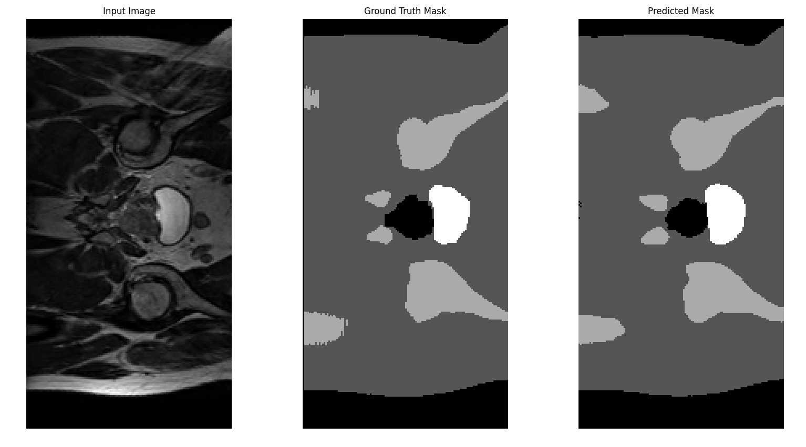
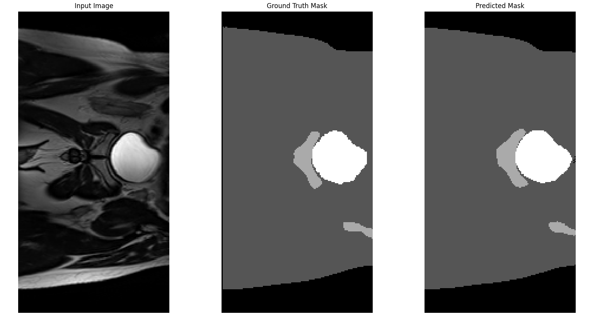
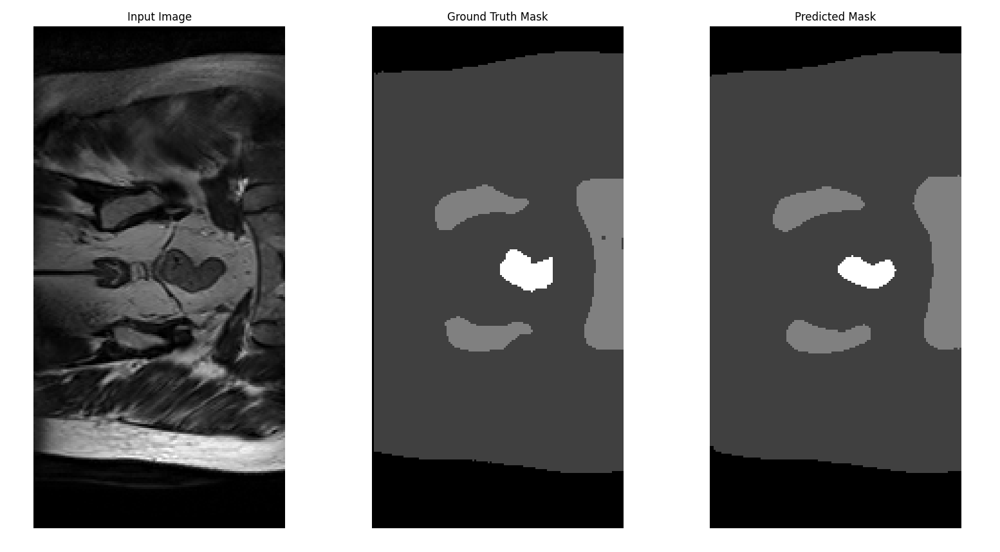
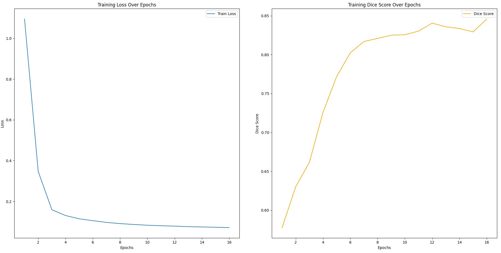

# Prostate Cancer Segmentation using UNet
**Bailey Jarrett - Student Number: 46976916**

## Description
This project implements a UNet based deep learning algorithm to perform multiclass segmentation on prostate MRI scans.
The goal is to accurately identify and seperate various regions of interest within prostate scans

The algorith processes 2D slices of MRI scans and predicts segmentation masks, which can aid in diagnosis and treatment planning

### How It Works
The UNet model consists of a contracting path to capture context and a symmetric expanding path for precise localization. The model takes in 2D grayscale MRI images and outputs a segmentation mask with five classes. Each pixel in the output represents a different region of interest, such as different parts of the background, the body or prostate.

The model was trained on labeled MRI data using cross-entropy loss and Dice similarity coefficient for evaluation. After training, the model can predict segmentation masks for new MRI scans, which can be used to assess the extent and location of prostate cancer.

### The model parameters
The final model had the input parameters:
- Number of Epochs = 16
- Learn Rate = 0.0001
- Batch Size = 16
- UNet model features = [16, 32, 64, 128]

### Dependencies
- Python 3.12.6
- PyTorch 2.5.0+cu124
- Albumentations 1.4.19
- Torchvision 0.20.0
- Numpy 2.1.2
- Nibabel 5.3.1
- Matplotlib 3.9.2
- Tqdm 4.66.5
- Scikit-image (skimage) 0.24.0

## Example Prediction Results
The model trained using the parameters above
The model was then used on an unseen testing set which resulted in the following:
Pixel Accuracy: 96.62 and **Dice Score: 0.9058**
The models predictions, visualised:

These visualisations show:
- The raw input image on the left
- The target segmentation mask for the image in the middle
- The models predicted segmentation mask on the right

When recording the training function loss and dice score accuracy results after each epoch during training the following graphs can be constructed:

These graphs show how the model improves over time. The slight dip in dice score around epoch 13 indicates some overfitting in the model, but the model readjusts

## Files in project
The project folder includes the python files:
- modules.py : contains UNET class and DoubleConv2D class
- dataset.py : contains to_channels and load_data_2D from Appendix B and ProstateCancerDataset class
- train.py : contains main function and train_fn. To run modify DIR variables to desired path to data
- predict.py : contains predict and load_model functions. To run modify saved model path and data paths
- utils.py : contains several functions and used by train.py and predict.py

Images folder: contains the png images used in this README document