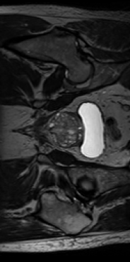

# 2D U-Net to Segment the HipMRI Study on Prostate Cancer

## Author 
Joseph Reid - 46982775

## Contents
- [The Task](#The-Task)
- [Dependencies](#Dependencies)
- [U-Net Algorithm](#U-Net-Algorithm)
- [Usage](#Usage)

## The Task
This project involves implementing a 2D UNet model to perform segmentation on images of the male pelvis before and during prostate cancer radiation therapy. The aim is to achieve a minimum [Dice similarity coefficient](https://en.wikipedia.org/wiki/Dice-S%C3%B8rensen_coefficient) of 0.75 for all labels, but primarily the prostate label. 

The different regions include the following:
- Background
- Body
- Bones
- Bladder
- Rectum
- Prostate 

An example image is shown below:



More information on the data and study can be found on the CSIRO website [here](https://data.csiro.au/collection/csiro:51392v2).

## Dependencies
This project requires the following to run. These dependencies should be installed with the specified versions.
- Python: 3.10.14
- Pytorch: 2.0.1
- Torchvision: 0.15.2
- TorchMetrics: 1.4.2
- Numpy: 1.26.4
- Matplotlib: 3.8.4
- scikit-image: 0.24.0
- NiBabel: 5.3.0
- tqdm: 4.66.5

## U-Net Algorithm
[U-Net](https://en.wikipedia.org/wiki/U-Net) is a convolutional neural network (CNN) developed for image segmentation tasks. In the [original paper](https://arxiv.org/pdf/1505.04597) by Olaf Ronneberger, Philipp Fischer and Thomas Brox, the application of the U-Net architecture revolved around biomedical image processing. Nowadays, U-Net plays a role in many different computer vision tasks.

The architecture consists of an encoder-decoder structure with a bottleneck in between, resembling that of a typical [autoencoder](https://en.wikipedia.org/wiki/Autoencoder). Autoencoders are generally used for dimensionality reduction by representing input data with lesser and more important features. U-Net instead utilises skip connections between the encoding and decoding paths to allow the network to propagate context information to later layers that would otherwise be lost.

The U-shaped architecture comes from the symmetric contracting (encoding) and expansive (decoding) paths, as shown below:


- **Each layer of the contracting path involves:**
    - Two 3x3 unpadded convolutions, each followed by batch normalisation and a ReLU activation function
    - Downsampling via 2x2 max pooling with stride of 2
- **Each layer of the expanding path involves:**
    - Upsampling via 2x2 up-convolutions with stride of 2
    - Concatenation with the cropped feature map from the encoding path
    - Two 3x3 unpadded convolutions, each followed by batch normalisation and a ReLU activation function
- **Final output layer involves:**
    - 1x1 convolution to map the features to the number of classes

## Usage

1. **Clone the repository**
```
git clone https://github.com/Woahseph/PatternAnalysis-2024.git -b topic-recognition --single-branch
```

2. **OPTIONAL: Use Conda to create a virtual environment**
```
conda create -n <env-name>
```

3. **Install dependencies using Conda**
```
conda install python==3.10.14 pytorch==2.0.1 torchvision==0.15.2 torchaudio==2.0.2 torchmetrics==1.4.2 pytorch-cuda=11.8 numpy==1.26.4 matplotlib==3.8.4 scikit-image==0.24.0 nibabel==5.3.0 tqdm==4.66.5 -c pytorch -c nvidia -c conda-forge
```

Note: Different versions of PyTorch and CUDA can be installed as seen on the [PyTorch website](https://pytorch.org/get-started/locally/).


4. **Download HipMRI data**

If available, download the data from the [file exchange](https://filesender.aarnet.edu.au/?s=download&token=76f406fd-f55d-497a-a2ae-48767c8acea2). 

Otherwise, the data can be downloaded from the CSIRO website [here](https://data.csiro.au/collection/csiro:51392v2). It will need to be separated into training and testing splits.

## Reproducibility of Results