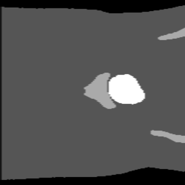

# 2D U-Net to Segment the HipMRI Study on Prostate Cancer

## Author 
Joseph Reid - 46982775

## Contents
- [The Task](#the-task)
- [Dependencies](#dependencies)
- [U-Net Algorithm](#u-net-algorithm)
- [Training Details](#training-details)
- [Results](#results)
- [Usage](#usage)

## The Task
This project involves implementing a 2D UNet model to perform segmentation on images of the male pelvis before and during prostate cancer radiation therapy. The aim is to achieve a minimum [Dice similarity coefficient](https://en.wikipedia.org/wiki/Dice-S%C3%B8rensen_coefficient) of 0.75 for all labels, but primarily the prostate label. 

The different regions include the following:
- Background
- Body
- Bones
- Bladder
- Rectum
- Prostate 

An example image is shown below:


More information on the data and study can be found on the CSIRO website [here](https://data.csiro.au/collection/csiro:51392v2).

## Dependencies
This project requires the following to run. These dependencies should be installed with the specified versions.
- Python: 3.10.14
- Pytorch: 2.0.1
- Torchvision: 0.15.2
- TorchMetrics: 1.4.2
- Numpy: 1.26.4
- Matplotlib: 3.8.4
- scikit-image: 0.24.0
- scikit-learn: 1.5.1
- NiBabel: 5.3.0
- tqdm: 4.66.5

## U-Net Algorithm
[U-Net](https://en.wikipedia.org/wiki/U-Net) is a convolutional neural network (CNN) developed for image segmentation tasks. In the [original paper](https://arxiv.org/pdf/1505.04597) by Olaf Ronneberger, Philipp Fischer and Thomas Brox, the application of the U-Net architecture revolved around biomedical image processing. Nowadays, U-Net plays a role in many different computer vision tasks.

The architecture consists of an encoder-decoder structure with a bottleneck in between, resembling that of a typical [autoencoder](https://en.wikipedia.org/wiki/Autoencoder). Autoencoders are generally used for dimensionality reduction by representing input data with lesser and more important features. U-Net instead utilises skip connections between the encoding and decoding paths to allow the network to propagate context information to later layers that would otherwise be lost.

The U-shaped architecture comes from the symmetric contracting (encoding) and expansive (decoding) paths, as shown below:


- **Each layer of the contracting path involves:**
    - Two 3x3 unpadded convolutions, each followed by batch normalisation and a ReLU activation function
    - Downsampling via 2x2 max pooling with stride of 2
- **Each layer of the expanding path involves:**
    - Upsampling via 2x2 up-convolutions with stride of 2
    - Concatenation with the cropped feature map from the encoding path
    - Two 3x3 unpadded convolutions, each followed by batch normalisation and a ReLU activation function
- **Final output layer involves:**
    - 1x1 convolution to map the features to the number of classes

## Training Details

### Architecture 

The constructed UNet model was chosen to follow the same structure as in the original paper. This includes:
- 5 layers:
    - 9 double convolutions
    - 4 downsamples/upsamples
- No padding on the 3x3 double convolutions
- Square inputs (256 x 256 in this case)
- Cropped concatenations

Other options were tested, such as using padding on the double convolutions and decreasing the number of layers as to not reduce the image size substantially. Ultimately, the above architecture was chosen to represent the original UNet and identify its benefits and downsides. If more time allowed, then further options as well as the previously looked-into options could have been further considered.

### Hyper-parameters

Hyper-parameters chosen include:
- Epochs = 24
- Batch Size = 12
- Learning Rate = 1e-3

### Data Preprocessing

All Nifti files were chosen to be resized to 256 x 256. This was opted for since the previously designed architecture would not work for the previously smaller width of 128 or 144 pixels (the image would become reduced to nothing). A size of 256 x 256 would allow for a relatively sized image by the end 68 x 68. This is still not ideal or perhaps even sufficient, but the trade-off between memory and accuracy was considered and it was decided to not enlarge the images moreso.

The image data was chosen to be normalised with mean 0 and standard deviation 1 as to faciliate quicker and more efficient learning. This is a widely known performance boost in machine learning, and many studies have backed this.

Finally, the loss function was weighted with class weights corresponding to the occurence of each labelled pixel in the training data. This was done to regularise the data for each class as to not sway the loss function inappropriately by prioritising one class over another (though this is indeed what ended up happening).

### Loss Function, Optimiser and Evaluation Metric

The loss criterion was chosen to be the cross entropy loss, with class weights as mentioned above to regularise the data. 

The optimiser chosen was Adam, and the evaluation metric was the Dice Similarity Coefficient due to the project task.

### Example Inputs

Inputs to the model include 256 x 256 image and mask data. The inputs are from each of the three splits: train, test and validate, depending on the situation. This is expanded upon in the next section but for now, an example input (image and mask) is shown below.




### Choice of Data Splits

Naturally, the large training set (~90% of the data) was used to train the model, since more data, in practically all cases, makes the model learn better. It also helps to reduce/prevent overfitting and helps improve the robustness of the model to different inputs when predicting.

The testing set was used after training to evaluate the performance of the model using the Dice Similarity Coefficients of each class, but namely the prostate class. There is largely no difference to the validation and testing data size (660 vs 540) so either could have been used for this purpose. The test set was arbitraily chosen. Different models have been tested on this data and the final performance evaluation on which is the best is based on the resulting score. No model parameters have been actively altered to specifically reduce the error on this specific set of data, so it is still (somewhat) viable to be used as the final testing set for our purposes.

However, if more time allowed, then models could have been iterated on and improved, such as slightly tuning the hyper parameters and weights, rather than changing the architecture to include padding, or resizing the images to 512 x 512, etc. If a good model was found and was iterated upon, then the validation set would need to be saved and used for the final iteration of the decided-upon model to truly assess the model on completely unseen data.

Finally, since the validation set was not being used for any other purpose in my instance, it was chosen to be used for the predictions of the model. Essentially, a completely new set of data that has been unseen is being passed to the model, evaluated upon, then the prediction is being plotted next to the truth.

## Results

### Training Metrics

During training, the predicted labels are compared to the true labels and the cross entropy loss is optimised, with the aim of improving the class dice scores. Due to this, training metrics including the cross entropy loss and prostate dice score were recorded for each epoch. These plots are shown below, with the objective dice score depicted in red in the second image.


After finishing training, the recorded dice scores for the test data were:
```
Dice score for BACKGROUND is 0.9294
Dice score for BODY is 0.9298
Dice score for BONES is 0.7801
Dice score for BLADDER is 0.6142
Dice score for RECTUM is 0.2278
Dice score for PROSTATE is 0.2313
```

As can be seen in the figures, while the cross entropy training loss becomes quite low at high epochs, the same cannot be said for the prostate dice score. It stops increasing at around 20-25%, suggesting that the model has found ways to reduce the cross entropy loss without needing to accurately learn about the prostate class. In the next section however, it can be seen that it can somewhat accurately represent the regions of interest, and that the dice score may in fact be wrong.

### Outputs

The UNet model outputs a one hot encoded predicted mask of size 6 x 256 x 256, where the image size is 256 x 256 and there are 6 channels for the 6 different classes in the data. This has been resized up from a 68 x 68 image after all the convolutions, which is likely a major source of error in the model which should be fixed in future iterations. This is too small an image size for variations in data to be accurately represented. Hence, this model would greatly benefit from either implementing padding to keep the image size large after all the convolutions, or from resizing the image to a greater size before passing it through the model. Unfortunately, due to time, resource and memory constraints, this could not be looked into. The one hot encoded data can either be kept as is, or decoded depending on what is needed for the application (e.g. computing dice scores, visualising, improving memory, etc.)

### Example Prediction

`predict.py` visualises and compares a true mask with the predicted mask for that sample. This is helpful to understand what the model is doing, how it is performing, how to improve it, and to determine if there are any significant errors in the scripts. Several significant example predictions from the validation dataset are shown below, alongside their true masks. The class dice scores follow afterwards:

#### Figure 1: Decent prediction with Dice Score: 0.55


```
Dice score for BACKGROUND is 0.9195
Dice score for BODY is 0.8355
Dice score for BONES is 0.7742
Dice score for BLADDER is 0.0000
Dice score for RECTUM is 0.0000
Dice score for PROSTATE is 0.5481
```
#### Figure 2: Worst prediction with Dice Score: 0.00

```
Dice score for BACKGROUND is 0.7959
Dice score for BODY is 0.7716
Dice score for BONES is 0.5696
Dice score for BLADDER is 0.5613
Dice score for RECTUM is 0.0000
Dice score for PROSTATE is 0.0000
```
#### Figure 3: Best prediction with Dice score: 0.78 > 0.75

```
Dice score for BACKGROUND is 0.9382
Dice score for BODY is 0.9169
Dice score for BONES is 0.8141
Dice score for BLADDER is 0.8819
Dice score for RECTUM is 0.0000
Dice score for PROSTATE is 0.7805
```
These results show that the predicted masks are actually quite well representative of the true mask. It is likely that the dice scores appear low due to a default value of zero when the class does not appear in the sample, when it should definitely be 1.

This does not mean it is perfect or reliable however, since while the final figure has a sufficient prostate dice score of 0.78, the first figure only has a prostate dice score of 0.55. Unfortunately, since this was found quite late into the assignment timeline, it could not be further looked into. The dice score is not used in the training optimisation, so the predictions would not be better after fixing this issue, but the dice scores would much greater reflect the true accuracy of the model.

## Usage

### Getting Started with Installation

1. **Clone the repository**
```
git clone https://github.com/Woahseph/PatternAnalysis-2024.git -b topic-recognition --single-branch
```

2. **OPTIONAL: Use Conda to create and use a virtual environment**
```
conda create -n <env-name>
conda activate <env-name>
```

3. **Install dependencies using Conda**
```
conda install python=3.10.14 pytorch=2.0.1 torchvision=0.15.2 torchaudio=2.0.2 torchmetrics=1.4.2 pytorch-cuda=11.8 numpy=1.26.4 matplotlib=3.8.4 scikit-image=0.24.0 scikit-learn=1.5.1 nibabel=5.3.0 tqdm=4.66.5 -c pytorch -c nvidia -c conda-forge
```

Note: Different versions of PyTorch and CUDA can be installed as seen on the [PyTorch website](https://pytorch.org/get-started/locally/).


4. **Download HipMRI data**

If available, download the data from the [file exchange](https://filesender.aarnet.edu.au/?s=download&token=76f406fd-f55d-497a-a2ae-48767c8acea2). 

Otherwise, the data can be downloaded from the CSIRO website [here](https://data.csiro.au/collection/csiro:51392v2). It will need to be separated into training, testing and validation splits.

Note: The scripts rely on the image directory matching identically to how it is listed in [Directory Structure](#directory-structure). Please either rename and move the files, or adjust the scripts accordingly, as seen in [Using the scripts](#using-the-scripts).

### Directory Structure

#### Scripts

```
├───dataset.py          # Loading datasets
├───modules.py          # UNet model architecture
├───predict.py          # Use trained model to predict
├───train.py            # Train a model and return dice scores
├───utils.py            # Functions that load Nifti files
├───README.md           # Info and usage file
```

#### Images
Ideally keep images in the directory format listed below. Otherwise, the directory constants in the scripts will need to be adjusted according to your specific structure (see [Using the scripts](#using-the-scripts)).

As the folder names suggest, test, train and validate refer to the testing, training, and validation splits of the data, respectively, and seg refers to the segmented data.

For reference, the provided data consisted of 11460 training samples, 660 validation samples, and 540 testing samples.

```
└───recognition
    └───46982775_2DUNet
        └───HipMRI_study_keras_slices_data
            ├───keras_slices_seg_test
            ├───keras_slices_seg_train
            ├───keras_slices_seg_validate
            ├───keras_slices_test
            ├───keras_slices_train
            └───keras_slices_validate
```

### Using the Scripts

1. **Before running the scripts**

Make sure that the data has been saved in the same format as the above directory. Another note is that the current working directory must be `recognition/46982775_2DUNet` when running the scripts.

Otherwise, the constants at the top of `train.py` and `predict.py` will need to be modified as detailed:

In both scripts, `MAIN_IMG_DIR` will need to be changed to the directory containing the six splits of data separated into their own folders. 

`train.py` uses the training and testing images and masks, so the following will need to be changed: `TRAIN_IMG_DIR`, `TRAIN_MASK_DIR`, `TEST_IMG_DIR`, and `TEST_MASK_DIR`.

`predict.py` uses the validation split, so `VALIDATION_IMG_DIR` and `VALIDATION_MASK_DIR` will need to be changed.

The scripts should now be ready to run!

2. **Training**

Train a model using `train.py`. 

This will train the model on the training data and save a model with `MODEL_NAME` in `trained_models`, along with `log.txt` detailing the specifics of the training, and two plots showcasing the loss and dice score vs epoch. The model will then be tested on the test data, and the final dice scores will be saved to the log to evaluate performance.

If desired, hyper-parameters at the top of the script can be adjusted and inputs such as the loss function and optimiser can be adjusted in `main`.

Note that `MODEL_NAME` near the top of the script will need to be changed for each trained model to ensure that the previous model does not get overwritten.

3. **Predicting**

Once a sufficient model has been trained and decided on, it can be used to make a prediction on a random sample in the validation dataset. This can be performed by running `predict.py` as follows:
```
python predict.py 'model_name'
```
`'model_name'` is the name of the saved model in `trained_models` that you wish to use to predict a sample. 

The dice score of all classes in the randomised sample is then printed, and a plot is shown of the chosen sample image, the true mask, and the predicted mask, to visually assess the performance of the model.