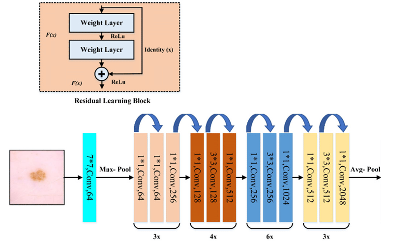
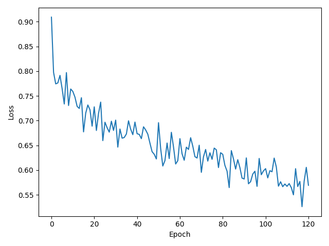
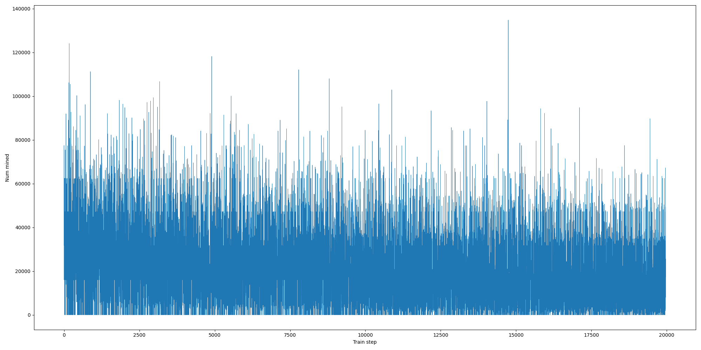
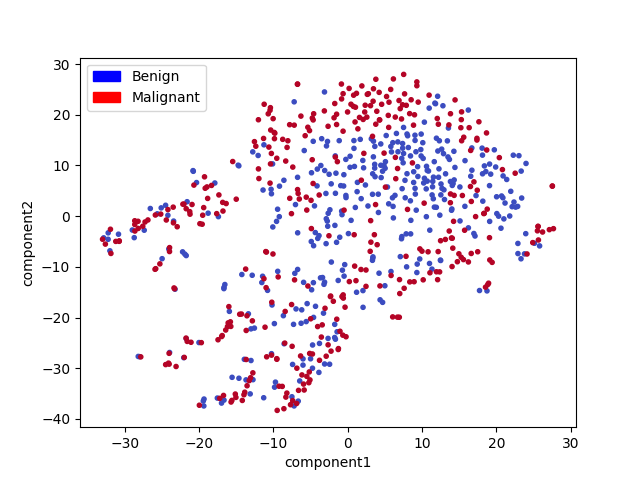

# Detecting Malignant Lesions From Highly Imbalanced Data Using Triplet Loss
## Dependencies
The project used Python 3.12.5. Dependencies can be found in `requirements.txt` and installed using pip via.
```bash
pip install -r requirements.txt
```

## Usage
Run commands from the root directory.
### Directory setup
```bash
mkdir data models plots
```
### Downloading data (<1GB)
```bash
curl -L -o data.7z https://www.dropbox.com/scl/fi/ug3dytouc5khwb2h7yuij/data.7z?rlkey=i6zbmtqegvukkkg6k0bvi3xow&st=vva7vx2k&dl=0
```
### Downloading the trained model (<1GB)
```bash
curl -L -o best.7z https://www.dropbox.com/scl/fi/5g2ixlbrulqa3b3lzbj5d/best.7z?rlkey=hpei7h85kdg30nirr9mcurous&st=9kk0t6k0&dl=0
```
### Moving files into the correct directories.
Extract the downloaded zip files into the following directories.
```
data
----small_images
----all.csv
----test.csv
----train.csv
----val.csv
models
----best.pt
```

### Training
To train the model from scratch.
```bash
python train.py
```
To continue training a model run
```bash
python train.py --load-model most_recent --continue
```
You may replace `most_recent` with the name of any model in the `models` folder (name without file extension).

### Evaluation
To evaluate the final trained model and produce all plots in the `plots` folder, run
```bash
python train.py --load-model best
```
To include test set evaluation run
```bash
python train.py --load-model best --test
```
### Example Prediction
To get the prediction for a 224x224 lesion image run
```bash
python predict.py <path to jpg image file>
```
For example,
```bash
python predict.py data/small_images/ISIC_0015719.jpg
```

## Problem Overview 
The 2020 Kaggle ISIC malignant lesion detection challenge was to correctly classify images of skin lesions as malignant or benign. The dataset is highly imbalanced with approximately 98% of observations being benign and only 2% being malignant. This meant that using naive metrics such as accuracy was undesirable as a predictor which simply always predicted malignant lesions would obtain a score of 98%. Therefore the Kaggle challenge was to achieve a high reciever-operator-curve area-under-the-curve (ROC-AUC) score. Monitoring precision and recall was also a secondary method of evaluation used.

There are a few standard techniques for dealing with highly imbalanced data such as re-sampling and heavy augmentation. Metric learning is another method that alleviates the issue by generating a large amount of training data in the form of observation combinations. Because of the combinatorial explosion of pairings, we can worry less about the class imbalance. Metric learning is the method of directly learning feature embeddings that maximise or minimize some distance between pairs, or in this project's case, triplets, of observations. For our problem, we seek to minimize the distance between observations from the same class and maximize the distance between observations from different classes. 

## The Training Algorithm and Triplet Loss
A triamese network was used with the triplet loss [[5]](#5), an extension of the siamese network popularised for one-shot image recognition [[4]](#4). For this training framework, we first compute feature embeddings outputted by the second last layer of a ResNet50 before softmax is applied. The ResNet architecture can be seen in Figure [1](#fig1). Pre-trained ImageNet weights were not used, as it was thought that features trained on natural objects would not transfer well to lesion images. Pre-trained network weights have been shown to be inflexible in some cases [[3]](#3). 



*Figure <a id=fig1>1</a>: Resnet50 Architecture. Image adapted from [[1]](#1).*

The ResNet50 produced 2048-dimensional features which were then passed through an additional embedding head which created 256-dimensional latent embedding vectors. This embedding head is formed by a ReLU activation, followed by a 1024-dimensional linear layer, ReLU, a 512-dimensional linear layer, ReLU and lastly a 256-dimensional linear layer. The final embedding was then normalized such that it has unit $L_2$ norm. Let the final normalized embedding be given by $f(x)$ where $f$ is the embedding mapping and $x$ is a lesion image. 

Once embeddings are produced they are compared using triplet loss. The triplet loss requires the comparison of three training examples at a time, an anchor example, a positive example from the same class as the anchor, and a negative example from a different class to the anchor. 

Let $l(x^a, x^p, x^n)$ be the loss for a single triplet with anchor $x^a$, positive $x^p$, and negative $x^n$ lesion images. Then $l$ is given by:

$$l(x^a, x^p, x^n) = \mathrm{ReLU}\left(\Vert f(x^a) - f(x^p) \Vert_2^2 - \Vert f(x^a) - f(x^n) \Vert_2^2 + m \right)$$

Where $m$ is some hyperparameter for the desired margin. Note that $\mathrm{ReLU}$ is nothing more than the maximum of its argument and 0, this meant that 0 is the smallest loss possible. The left term of the loss encourages pairs from the same class to be close to each other in the embedding space. The right term encourages pairs from different classes to be far apart in the embedding space. The minimum loss is acquired when the positive example is closer than the negative example and is closer by margin $m$.

One of the most important parts of triplet loss performance is the mining of triplets. This refers to the process of finding difficult triplets to train with, as triplets with zero loss have no learning signal. The most popular mining technique is semi-hard mining as introduced in [[5]](#5). This technique chooses triplets such that the positive example is closer to the anchor than the negative sample but the margin is still violated. These triplets are easier to improve than when the negative example is closer than the positive one but still provide a learning signal. This strategy is often used to improve the stability of learning. However, it was found that with this project's setup, the all-mining strategy worked the best. This strategy selects all triplets that violate the margin, that is, with non-zero loss. Triplets are sampled in an online-fashion from each minibatch as the difficulty of each triplet is highly dependent on the state of the embedding network which changes during training.

After training the embedding network we use embeddings as an input to a separate classifier. For this project three classifiers were tried using sci-kit learn implementations, a K nearest neighbours (KNN), a support vector machine (SVM) and a multilayer perceptron (MLP). The KNN and SVM performed the best.

## Data Preparation
Patient meta-data was not used for simplicity. Although we could incorporate this data by concatenating it to the outputted feature embeddings and applying appropriate normalization.

Data was split into a train, validation and test set. 64% of the data was used for training, 16% was used for validation and 20% was used for testing. Stratified sampling was used to ensure that the ground truth distribution was well represented in each set. This was a fairly important consideration as there was not much data in the minority class, stratification ensured all sets had adequate examples from this class. Model architectures and hyperparameters were only tuned on the validation set to avoid information leakage, with the test set being reserved for the final evaluation.

Images were all processed prior to training by first downsampling them to a 256x256 resolution and then taking a centre crop of 224x224 pixels. This was done to speed up training and make the data compatible with the embedding model architecture. 

Image pixel intensities were rescaled to be in the range [0, 1] by dividing through by the RGB maximum of 255. Images were also augmented in an online-fashion during training with a random horizontal flip with a probability of 0.5 and then a random vertical flip with a probability of 0.5. Colour augmentation was not used as the true colour is a very important feature for the classification of lesions [[2]](#2).

Equal class sampling during embedding network training was tried to help alleviate class imbalance. This is a sampling technique where each minibatch is formed by exactly half of the observations from each class. This was found to perform worse than standard random minibatch sampling which was more representative of the ground truth distribution. However, for classifier training, precision and recall for the malignant class would perform poorly using the whole training set. Instead, for this stage the majority class was undersampled to match the size of the malignant class, which was 374 observations from each class.

## Training Details
The embedding network was trained with Pytorch using the Adam optimizer with a learning rate of $1 \times 10^{-5}$ and weight decay of $1 \times 10^{-6}$. All other Adam hyperparameters were set to the Pytorch defaults. The model was trained for 120 epochs with a batch size of 128. A margin of 1 was used for the triplet loss. The network was trained on a single RTX 3060 GPU.

The KNN used a custom uniform voting from the nearest neighbour and all neighbours that were closer than $m$. The SVM used the default sci-kit learn hyperparameters, most notably a $C$ value of 1 and the Radial Basis Function kernel. 

## Results
The training loss curve for the embedding network can be seen in Figure [2](#fig2).



*Figure <a id=fig2>2</a>: Training loss for the embedding network.*

The number of triplets mined in each minibatch can be seen in Figure [3](#fig3).



*Figure <a id=fig3>3</a>: Number of triplets mined in each minibatch.*

We can visualize the embeddings and formed clusters in a 2-dimensional space by fitting a t-distributed Stochastic Neighbor Embedding (TSNE) model. A plot of this for the undersampled training data can be seen in Figure [4](#fig4).



*Figure <a id=fig4>4</a>: TSNE space projection of undersampled train set embeddings.*

We can see that reasonable separation appears to have occurred.

The best results were achieved using the SVM classifier. Using this classifier, the ROC and AUC for the train, validation and test sets can be seen in Figures [5](#fig5), [6](#fig6) and [7](#fig7) respectively.

_roc.png)

*Figure <a id=fig5>5</a>: ROC for SVM on train set*

_roc.png)

*Figure <a id=fig6>6</a>: ROC for SVM on validation set*

_roc.png)

*Figure <a id=fig7>7</a>: ROC for SVM on test set*

We can see that the ROC was much better for the validation and test set than for the train set. This was possibly because the train ROC was calculated on the undersampled train set, therefore its distribution contained a higher proportion of the likely harder minority class compared to the validation and test sets. When not undersampling the classifier's training set an AUC of 1 was almost always reached on the training set but with bad performance on the others. We can also see that the test ROC was slightly better than the validation ROC, this may just be because there may have been some easier observations in the test set. The target goal of 0.8 AUC was achieved on both the validation and test set.

The classification report for the SVM classifier and the KNN classifier on the test set can be seen in Tables [1](#tab1) and [2](#tab2) respectively. Class 0 and 1 represent the benign and malignant classes respectively. 

*Table <a id=tab1>1</a>: Classification report for SVM on the test set.*
|              | precision | recall | f1-score | support |
|--------------|-----------|--------|----------|---------|
| 0            | 0.99      | 0.91   | 0.95     | 6509    |
| 1            | 0.08      | 0.44   | 0.14     | 117     |
| **accuracy** |           |        | 0.90     | 6626    |
| **macro avg**| 0.54      | 0.67   | 0.54     | 6626    |
| **weighted avg** | 0.97  | 0.90   | 0.94     | 6626    |
| **AUC**      | 0.844     |           |        |          |         |

*Table <a id=tab2>2</a>: Classification report for KNN on the test set.*
|              | precision | recall | f1-score | support |
|--------------|-----------|--------|----------|---------|
| 0            | 0.99      | 0.87   | 0.93     | 6509    |
| 1            | 0.07      | 0.54   | 0.12     | 117     |
| **accuracy** |           |        | 0.86     | 6626    |
| **macro avg**| 0.53      | 0.70   | 0.52     | 6626    |
| **weighted avg** | 0.97  | 0.86   | 0.91     | 6626    |
| **AUC**      | 0.809     |           |        |          |         |

For the problem of malignant lesion detection, it could be argued that recall is more important than precision, as the cost of missing a malignant observation is high. The low precision could be costly too in that a patient may be given unnecessary treatment, however, this could be remedied in a real-world system by having a medical professional verify malignant detections. In the results, we can see that we reach a recall of 44% for SVM, which seems decently high for the 2% minority class in this highly imbalanced problem.


## References
<a id="1">[1]</a> Ali, L., Alnajjar, F., Jassmi, H., Gochoo, M., Khan, W., & Serhani, M. (03 2021). Performance Evaluation of Deep CNN-Based Crack Detection and Localization Techniques for Concrete Structures. Sensors, 21, 1688. doi:10.3390/s21051688

<a id="2">[2]</a> Chen, J., Stanley, R. J., Moss, R. H., & Van Stoecker, W. (2003). Colour analysis of skin lesion regions for melanoma discrimination in clinical images. Skin research and technology : official journal of International Society for Bioengineering and the Skin (ISBS) [and] International Society for Digital Imaging of Skin (ISDIS) [and] International Society for Skin Imaging (ISSI), 9(2), 94–104. https://doi.org/10.1034/j.1600-0846.2003.00024.x

<a id="3">[3]</a> Hermans, A., Beyer, L., & Leibe, B. (2017). In Defense of the Triplet Loss for Person Re-Identification. ArXiv, abs/1703.07737. Retrieved from https://api.semanticscholar.org/CorpusID:1396647


<a id="4">[4]</a> Koch, G.R. (2015). Siamese Neural Networks for One-Shot Image Recognition.

<a id="5">[5]</a> Schroff, F., Kalenichenko, D., & Philbin, J. (2015, June). FaceNet: A unified embedding for face recognition and clustering. 2015 IEEE Conference on Computer Vision and Pattern Recognition (CVPR). doi:10.1109/cvpr.2015.7298682