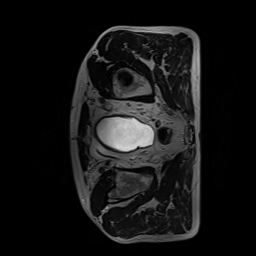
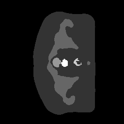

# Prostate 3D data Segmentation with 3D-UNet and Improved 3D-UNet models
## Student information
**Name:** Sara Alaei

**Student number:** 47041437

**Task:** Taks #4 

## 3D U-Net and Improved 3D U-Net architectures 
The use of both the original 3D U-Net by Ozgün Çiçek et al. and the improved 3D U-Net model by Fabian Isensee et al. were investigated within this report. One of the main applications of the 3D U-Net model is medical image segmentation, specifically targeting volumetric data such as MRI scans. It addresses the challenge of identifying anatomical structures or lesions in these images, aiding in the diagnosis, treatment, and monitoring of diseases. 

The original U-Net architecture is a powerful convolutional neural network, featuring a symmetrical structure that includes encoder and decoder paths. The encoder progressively down-samples the input through various convolutional layers to capture context and enable the model to learn the varied features present. The output from the encoder is then reconstructed in the decoder path, wherein skip connections from the encoder enables the model to retain the spatial information and produce accurate segmentations of bodies within the images. 

The improved U-Net is a more complex and modern model that enhances the foundational design of the original U-Net. Improved 3D U-Net uses a deeper architecture with multiple convolutional layers, which enables the model to learn intricate pattern and relationships in the data more effectively. Furthermore, the inclusion of batch normalisation, improved skip connections and up-sampling aid in the stabilisation, generalisation, and the transfer of finer details. Therefore, these enhancements in the improved U-Net model leads to more sophisticated, accurate and high-quality segmentations compared to the original U-Net.


## Algorithm (pre-processing, training and inference)
This report specifically looks at a 3D prostate dataset and attempts to extract the images, train them using both models with the appropriate loss functions (cross-entropy and dice loss) and run inferences from the saved model. 

**dataset.py:** This file includes a class that loads NIfTI images and labels using the nibabel library. .nii.gz files are converted into tensors and are reshaped for the network input [3]. It also includes image augmentation, which includes random cropping, flipping, and applying random bias fields, blurs, or spikes to introduce variability and improve model robustness.

**module_unet3D.py:** Includes a 3D U-Net model[4]


**module_improvedunet3D.py:** Includes an improved 3D U-Net model[3]


**train.py:** The training loop uses the Adam optimiser as well as cross-entropy and dice loss functions for measuring the segmentation accuracy across the 6 labels. The model is trained for 40/45 epochs (U-Net vs improved), where each epoch processes augmented images. After each training epoch, the model's performance is evaluated on a validation set, calculating the Dice Similarity Coefficient (DSC) for each label. The model is saved, and statistics like DSC per label is printed after each epoch, providing insights into the model's performance.


**predict.py:** The saved model is loaded and is used to produce axial 2D images (slices of the 3D image) of the input dataset as well as its segmented output.  


## Parameters and Results
The dataset consisted of prostate 3D MRI data for 3D tasks of 38 patients with 211 3D MRI volumes. The body outline, bone, bladder, rectum and prostate regions are segmented in 3D by a MR physicist with more than 10 years of experience. Thus, a total of 6 labels are present and expected in the output. A batch size of 1 was employed because of the small dataset and to lessen the load on the GPU. An epoch number of 40 was used for the 3D U-Net and 45 for the improved 3D U-Net. 181, 15, 15 images were used for training, validating and testing, respectively. 

The below was inserted into the Rangpur runner file:

```python
export PYTORCH_CUDA_ALLOC_CONF=expandable_segments:True
```

With the 3D U-Net model, all labels achieved a **DSC of at least 0.75.** The plots for the 6 labels can be found below.


<table>
  <tr>
    <td></td>
    <td></td>
    <td></td>
  </tr>
  <tr>
    <td></td>
    <td></td>
    <td></td>
  </tr>
</table>


With the improved 3D U-Net model, all labels achieved a **DSC of at least 0.8.** The plots for the 6 labels can be found below. 


<table>
  <tr>
    <td></td>
    <td></td>
    <td></td>
  </tr>
  <tr>
    <td></td>
    <td></td>
    <td></td>
  </tr>
</table>


Samples **L011_Week0_LFOV.nii.gz** and **L011_Week5_LFOV.nii.gz** were used to generate axial slices of the original image and segemented output. Slices 73, 97 (wk0) and 75 (wk5) were used respectively. Both the original and improved 3D U-Net models produce great results, with the improved 3D U-Net producing comparatively higher quality segmentations (last row).


<table>
  <tr>
    <td></td>
    <td></td>
    <td></td>
  </tr>
   <tr>
    <td></td>
    <td></td>
    <td></td>
  </tr>
  <tr>
    <td></td>
    <td></td>
    <td></td>
  </tr>
<table>
<table>

## Dependencies
The name and version of the packages used are included below.

```python
torch = 2.4.0
torchio = 0.20.1
torchvision = 0.19.0+cu118
nibabel = 5.3.0
numpy = 1.26.3
matplotlib = 3.9.2
pillow = 10.2.0

```


## References
**[1]**: Çiçek, Ö., Abdulkadir, A., Lienkamp, S.S., Brox, T., Ronneberger, O. (2016). 3D U-Net: Learning Dense Volumetric Segmentation from Sparse Annotation. In: Ourselin, S., Joskowicz, L., Sabuncu, M., Unal, G., Wells, W. (eds) Medical Image Computing and Computer-Assisted Intervention – MICCAI 2016. MICCAI 2016. Lecture Notes in Computer Science(), vol 9901. Springer, Cham. https://doi.org/10.1007/978-3-319-46723-8_49

**[2]**: Isensee, F., Kickingereder, P., Wick, W., Bendszus, M., Maier-Hein, K.H. (2018). Brain Tumor Segmentation and Radiomics Survival Prediction: Contribution to the BRATS 2017 Challenge. In: Crimi, A., Bakas, S., Kuijf, H., Menze, B., Reyes, M. (eds) Brainlesion: Glioma, Multiple Sclerosis, Stroke and Traumatic Brain Injuries. BrainLes 2017. Lecture Notes in Computer Science(), vol 10670. Springer, Cham. https://doi.org/10.1007/978-3-319-75238-9_25

**[3]**: Arshad221b (2023). 3D-UNet-Image-Segmentation. GitHub. https://github.com/Arshad221b/3D-UNet-Image-Segmentation

**[4]**: aCoalBall (2022). segmentation-of-3d-prostate. GitHub. https://github.com/aCoalBall/segmentation-of-3d-prostate

