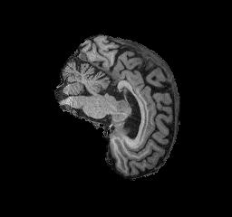
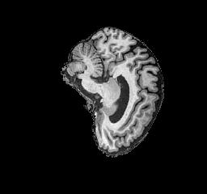
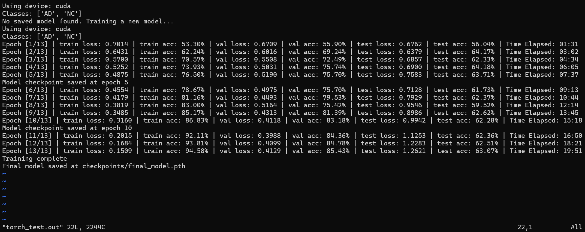
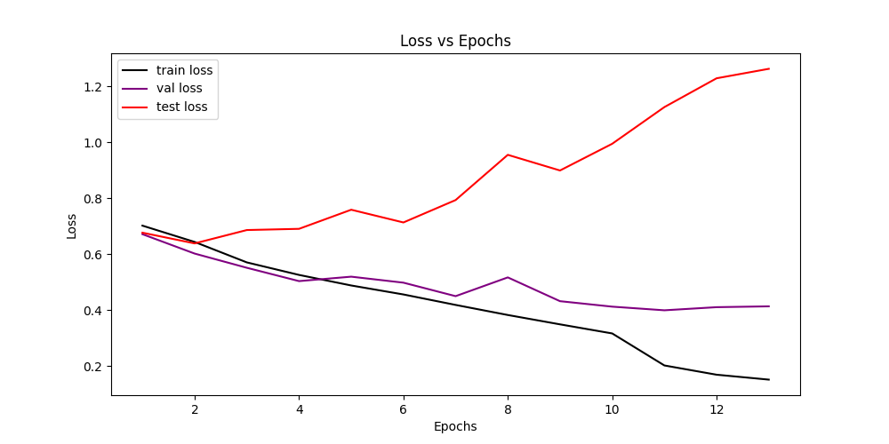
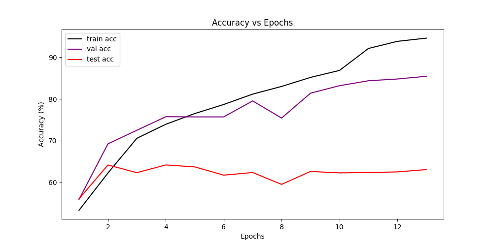
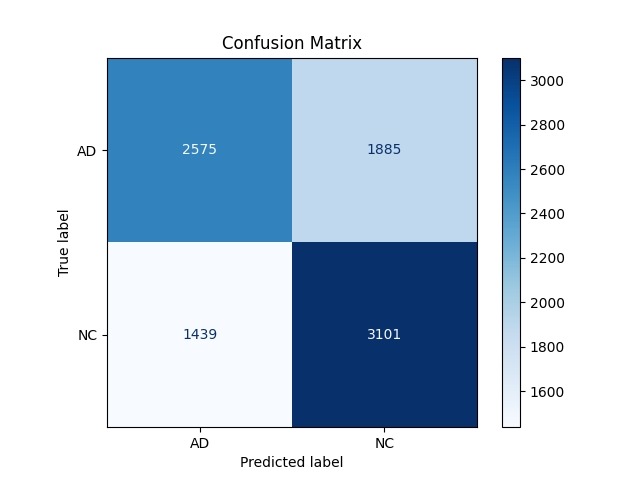

*Praneet Dhoolia (47364417)*

# Classifying Alzheimer’s Disease using a Vision Transformer (ViT)

This project aims to classify Alzheimer’s disease (normal and AD) using ADNI brain data and a Vision Transformer model, specifically `vit_small_patch16_224`. The primary objective is to achieve a test accuracy above 80% on the ADNI test set.
<br>

## Model

### ViT Architecture:
A Vision Transformer (ViT) is a deep learning model that applies the transformer architecture, traditionally used in natural language processing, to image recognition tasks. Unlike conventional convolutional neural networks (CNNs), which analyze image data locally through sliding filters, the Vision Transformer uses self-attention to capture global relationships among image patches.

<p align="center">
    
</p>

- **Patch Embedding Creation:** The input image is split into fixed-size patches, each of which is flattened and transformed into a vector through a linear embedding layer. This process converts each patch into a sequence of embeddings, allowing the image to be represented as a series of tokens (similar to words in text), enabling processing by the transformer.

- **Positional Encoding for Spatial Awareness:** Since transformers lack inherent spatial understanding, positional encodings are added to each patch embedding. These encodings provide information about each patch’s position in the original image, ensuring the model can interpret spatial relationships effectively across patches.

- **Class Token for Image-Level Prediction:** A learnable class token is prepended to the sequence of patch embeddings, representing the overall class of the image. As it passes through the model, this token aggregates information from all patches, enabling it to capture a global representation of the entire image by the model’s end.

- **Self-Attention Mechanism in the Transformer Encoder:** The patch embeddings, along with the class token, pass through multiple layers of transformer encoders. The self-attention mechanism enables the model to capture both local and global dependencies across patches. Unlike CNNs, which primarily capture local features, self-attention allows each patch to relate to every other patch, providing a holistic view of the image.

- **Classification Layer:** After passing through the encoder layers, the class token contains a learned representation of the entire image. This token is then fed into a final linear layer for classification, predicting the image’s class based on the relationships it has learned across patches.
<br>

## Testing and Results

### Training Process
The training dataset contains images labeled as AD (Alzheimer’s Disease) and NC (Cognitive Normal), organized into training, validation, and test sets.

#### Folder Structure

```
AD_NC/
├── train/
│   ├── AD/
│   └── NC/
└── test/
    ├── AD/
    └── NC/
```
<br>

#### Preprocessing:
1. **Data Splitting:**
   - **Training Set:** 80% of the images in the original training folder.
   - **Validation Set:** 20% of the training subset, derived from the training set split.
   - **Testing Set:** A separate test folder, entirely independent of the training/validation split.
   - This setup ensures that the test set remains unseen throughout the training and validation process.

2. **Data Augmentation:**
   - **Training:** Includes random horizontal and vertical flips, random rotations up to 10 degrees, random affine transformations, and color jittering to improve generalization.
   - **Validation and Testing:** Only resized and normalized to ensure consistency and avoid data leakage from augmentations during evaluation.
<br>

#### Hyperparameters:
The following hyperparameters are used in the training process:

| Hyperparameter           | Value              |
|--------------------------|--------------------|
| **Optimizer**            | Adam              |
| **Learning Rate**        | 0.0001            |
| **Scheduler**            | StepLR            |
| **Scheduler Step Size**  | 10 epochs         |
| **Scheduler Gamma**      | 0.1               |
| **Epochs**               | 13                |
| **Batch Size**           | 32                |
| **Mixed Precision**      | Enabled (torch.amp) |
| **Criterion**            | CrossEntropyLoss  |

<br><br>

### Training, Validation, and Testing Results
Below are the plots and statistics from the training process:

- **Alzheimer's Disease (AD) vs Cognitive Normal (NC)**

<p align="center">
  
  
</p><br>

- **Epoch Output**
<p align="center">
    
</p><br>

- **Loss vs Epochs**
<p align="center">
    
</p><br>

- **Accuracy vs Epochs**
<p align="center">
    
</p><br>

- **Confusion Matrix**
<p align="center">
    
</p><br>

### Observations

1. **Loss vs. Epochs:**
   - **Training Loss:** Decreased consistently across epochs, indicating effective learning from the data.
   - **Validation Loss:** Generally decreased but showed occasional fluctuations, suggesting some variability in the model’s generalization.
   - **Testing Loss:** Increased over epochs, which suggests possible overfitting as the model learns more details from the training data, but loses generalization on unseen test data.

2. **Accuracy vs. Epochs:**
   - **Training Accuracy:** Progressively increased, reaching above 94% by the final epoch, showing that the model effectively fits the training data.
   - **Validation Accuracy:** Increased steadily, stabilizing around 85%, which is close to the training accuracy but slightly lower, indicating some overfitting.
   - **Testing Accuracy:** Fluctuated around 60-63%, showing a significant gap between training and test performance. This discrepancy highlights the challenge of generalization and may suggest that the model is learning features that do not transfer well to the test set.

3. **Confusion Matrix:**
   - The model performed better on the NC class, correctly identifying 3101 out of the total NC images, compared to 2575 correctly classified AD images.
   - The misclassification rates (1885 AD images as NC and 1439 NC images as AD) indicate that while the model has some discriminative power, it still struggles with certain cases, potentially due to overlapping features or insufficient training diversity.4
<br>

### Future Improvements

- **Overfitting:**
   - The training accuracy is significantly higher than the test accuracy, suggesting overfitting. Despite the data augmentation, the model may be over-specializing to the training data.

- **Possible Model Adjustments:**
   - **Alternative ViT Architectures:** Trying larger ViT variants or hybrid architectures that combine CNN and transformer layers might improve generalization.
   - **Regularization Techniques:** Applying dropout within the transformer layers or using weight decay in the optimizer could help reduce overfitting.
   - **Hyperparameter Tuning:** Experimenting with learning rates, batch sizes, and other hyperparameters might yield better balance between train and test performance.
   - **Additional Data Augmentation:** Applying more diverse augmentations might help the model generalize better to unseen data.

- **Class Imbalance:**
   - From the confusion matrix, it seems that the model might benefit from techniques to handle class imbalance more effectively (if present in the dataset), such as oversampling, under-sampling, or cost-sensitive learning.
<br>

## Usage
The project requires the following libraries and dependencies:

- **Python** 3.7 or higher
- **PyTorch** 1.7 or higher
- **torchvision** 0.8 or higher
- **timm** (PyTorch Image Models) library
- **NumPy**
- **Matplotlib**
- **scikit-learn**
- **tqdm**
- **OpenCV-Python**

You can install the required packages using:

```bash
pip install -r requirements.txt
```

Alternatively, install them individually:

```bash
pip install torch torchvision timm numpy matplotlib scikit-learn tqdm opencv-python
```

To train the model:
```bash
cd recognition/47364417
python train.py
```

To predict accuracy on the test set using a trained model:
```bash
cd recognition/47364417
python predict.py
```
<br>

## Conclusion

In this project, we applied a Vision Transformer (ViT) model to classify Alzheimer's Disease using brain imaging data from the ADNI dataset. While the model achieved high training accuracy above 94%, the test accuracy plateaued around 60-63%, indicating a significant generalization gap likely due to overfitting and dataset limitations. This highlights the challenges of applying advanced deep learning models to limited imaging data. Future work should focus on implementing enhanced regularization techniques, exploring alternative architectures, improving data augmentation methods, and conducting extensive hyperparameter optimization to improve the model's generalization and reliability on the ADNI dataset for Alzheimer's Disease classification.
<br>

## References

- Y. Rao, W. Zhao, Z. Zhu, J. Zhou, and J. Lu, “GFNet: Global Filter Networks for Visual Recognition,” *IEEE Transactions on Pattern Analysis and Machine Intelligence*, vol. 45, no. 9, pp. 10960–10973, Sep. 2023. [Online]. Available: [https://ieeexplore.ieee.org/document/10091201?denied=](https://ieeexplore.ieee.org/document/10091201?denied=)

- Alzheimer’s Disease Neuroimaging Initiative (ADNI), *Data and Methods for Alzheimer’s Research*, [Online]. Available: [https://adni.loni.usc.edu/](https://adni.loni.usc.edu/)
