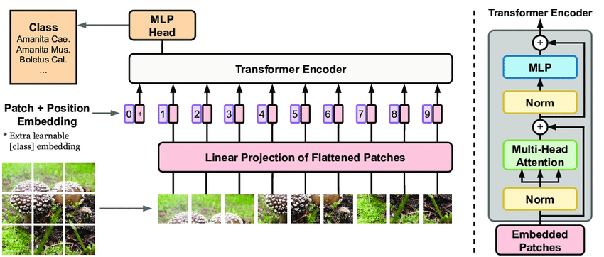

*Praneet Dhoolia (47364417)*
# Classifying Alzheimer’s Disease using a Vision Transformer (ViT)
This project aims to classify Alzheimer’s disease (normal and AD) of the ADNI brain data using one of the latest vision transformers 'vit_small_patch16_224'. The ultimate goal of the project is to achieve a testing accuracy higher than 80% on the ADNI test set.

## Model
### ViT Architecture:
A Vision Transformer (ViT) is a deep learning model that applies the transformer architecture—traditionally used in natural language processing—to image recognition tasks. Unlike conventional convolutional neural networks (CNNs), which analyze image data locally through sliding filters, the Vision Transformer uses self-attention to capture global relationships among image patches.

<p align="center">
    
</p>

**1. Patch Embedding Creation:** The input image is split into fixed-size patches, each of which is flattened and transformed into a vector through a linear embedding layer. This process converts each patch into a sequence of embeddings, allowing the image to be represented as a series of tokens (akin to words in text), enabling it to be processed by the transformer.

**2. Positional Encoding for Spatial Awareness:** Since transformers lack inherent spatial understanding, positional encodings are added to each patch embedding. These encodings provide information about each patch’s position in the original image, ensuring the model can interpret spatial relationships across patches effectively.

**3. Class Token for Image-Level Prediction:** A learnable class token is prepended to the sequence of patch embeddings, representing the overall class of the image. As it passes through the model, this token aggregates information from all patches, enabling it to capture a global representation of the entire image by the model’s end.

**4. Self-Attention Mechanism in the Transformer Encoder:** The patch embeddings (alongside the class token) are passed through multiple layers of transformer encoders, where the self-attention mechanism enables the model to capture both local and global dependencies across patches. Unlike CNNs, which primarily capture local features, self-attention allows each patch to relate to every other patch, providing a holistic view of the image.

**5. Classification Layer:** After passing through the encoder layers, the class token contains a learned representation of the entire image. This token is then fed into a final linear layer for classification, where it predicts the image’s class based on the relationships it has learned across patches.


## Usage
To install required libraries:
```
cd recognition/47364417
pip install -r requirements.txt
```

To train the model:
```
cd recognition/47364417
python train.py
```

To train/use a trained model and predict accuracy on the test set:
```
cd recognition/47364417
python predict.py
```