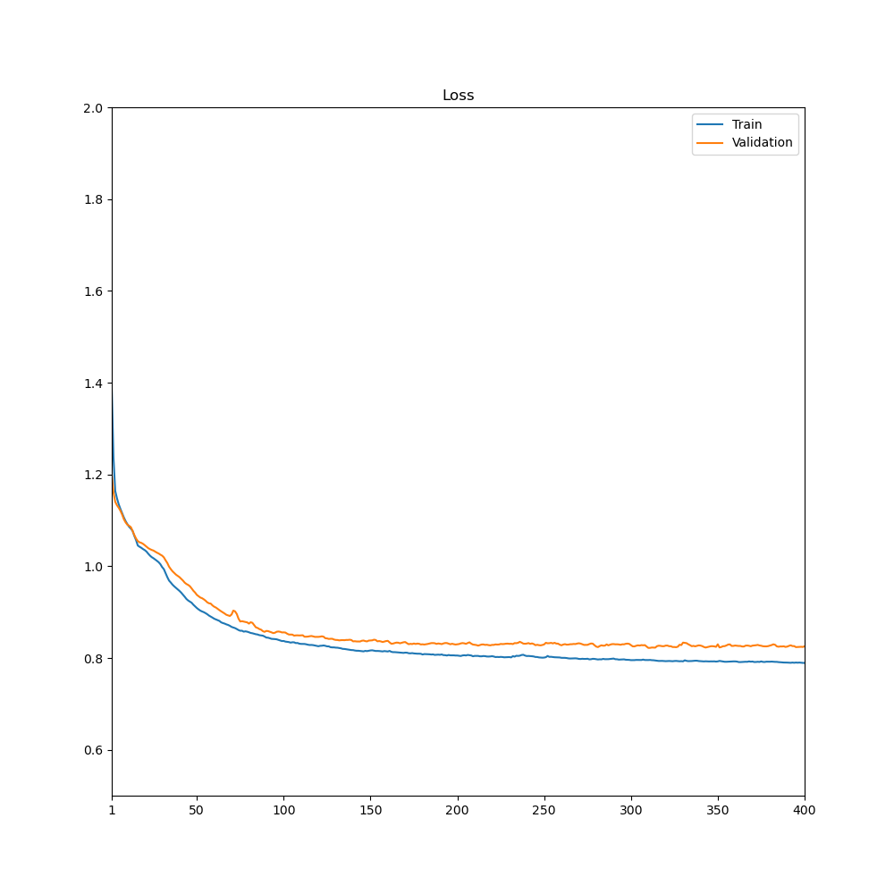

# Multi-layer Graph Convolutional Network for multi-class classification of Facebook large page-page Network.

## Introduction

This is a PyTorch implementation for solving the Facebook large page-page Network multi-class node classification problem. It uses a Graph Convolutional Network approach.  
**Achieved test accuracy:** 92.6%.

## Dependencies

Apart from \`pytorch\` here is the list of required dependencies:

- \`scipy.sparse\` [SciPy \- Installation](https://scipy.org/install/)
- \`sklearn\` [Installing scikit-learn](https://scikit-learn.org/stable/install.html)
- \`matplotlib\` [Installation — Matplotlib 3.9.2 documentation](https://matplotlib.org/stable/install/index.html)

## About the Dataset

The dataset represents a graph, where nodes are verified Facebook pages, and links (edges) are mutual likes between the pages. The features for each node are extracted from the description of the respective page. The dataset was collected in November 2017 using Facebook Graph API and can be accessed here : [Facebook Large Page-Page Network](https://snap.stanford.edu/data/facebook-large-page-page-network.html)

The graph has 22,470 nodes (verified pages), each belonging to one of the four categories:

- TV Show
- Government organization
- Politician
- Company

The graph has 171,002 edges and its density is 0.001. The edges have no direction.

**Notice** that this implementation is using a preprocessed dataset, where the features for each node are 128 dimensional vectors. This dataset can be found here under the name “facebook.npz”: [https://graphmining.ai/datasets/ptg/](https://graphmining.ai/datasets/ptg/)

## Data Preprocessing

First, the data was separated into three parts:

- Training \- 80%
- Validation \- 10%
- Testing \- 10%

Before separation, the dataset was shuffled using the seed 31\.  
The file named \`edges.npy\`, where all edges are stored in the format \`(edge_id, edge_id)\`, was used to create an adjacency matrix with the size 22,470 x 22,470, which will later be used in the Graph Convolutional layers.

## Model Architecture and Hyperparameters

The model is using 3 Graph Convolutional layers, utilizing batch normalization and ReLU between the layers. At the end, Softmax function is used for prediction. Cross entropy function is used to calculate the loss. Dropout with probability 0.5 was introduced in earlier stages of development, but it reduced the validation accuracy by several percent while the test accuracy remained unchanged, so it was discarded from the final version of the model.

The Hyperparameters used by the model are:

- Learning rate: 0.01
- Optimizer: Adam
- Epochs: 400

## Results

Training for 400 epochs has been conducted. At the final stages of training, the training accuracy was **95.7%**, while validation accuracy was **91.9%**. The training progress can be seen on the plot:

It can be noticed that validation accuracy is slightly behind train accuracy throughout the whole process, and experiences slight fluctuations, but generally it is stable. For stabilizing the validation accuracy the learning rate can be further reduced. In general, the accuracy reaches its peak at about 200 epochs, after which it shows a very insignificant growth.

The situation with loss is similar:

The model’s learning is going well until epoch 200\. After that loss is not really decreasing much. Again, validation loss is slightly higher than training.

## Usage

To train the model, first modify the \`FILE_PATH\` variables that lead to the location of the .npz dataset in \`train.py\` and \`predict.py\`. After that run the command: \`python train.py\`, which will perform the training, create and save plots with loss and save the model's best parameters for inference.  
To test the model, run the command: \`python predict.py\`, which will load the previously saved model and test it on the test set, and then display the accuracy.  
**Don’t change the \`SEED\` variable between these steps\!**

## References
