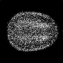
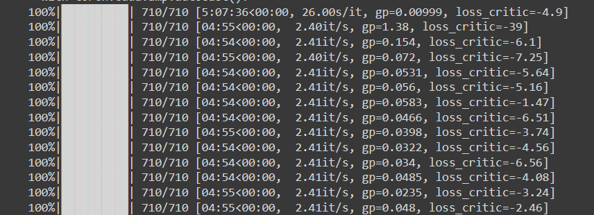
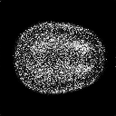
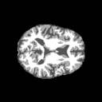
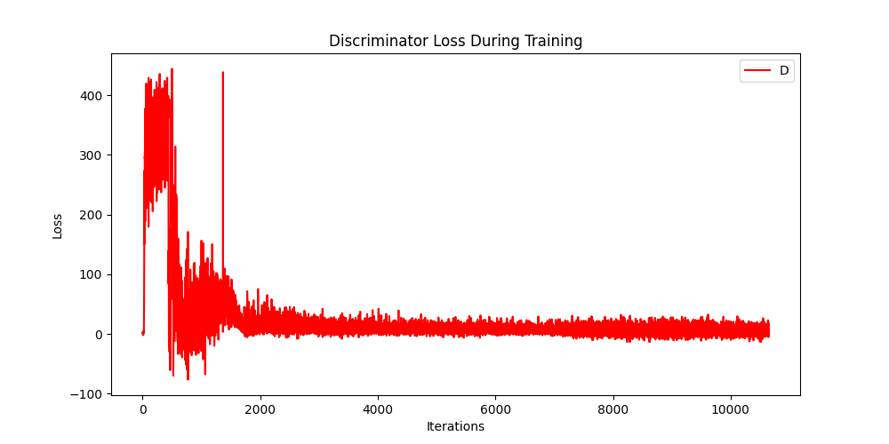
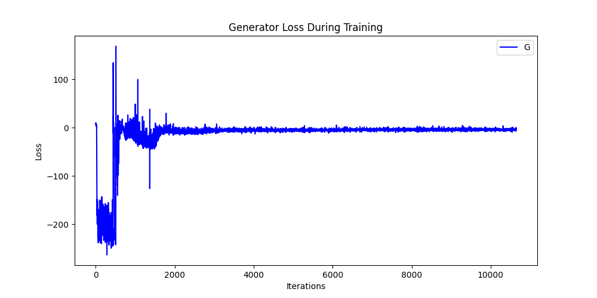
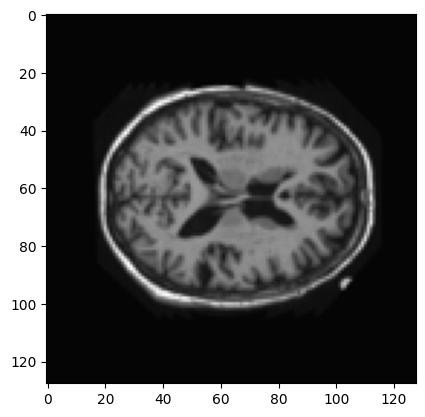
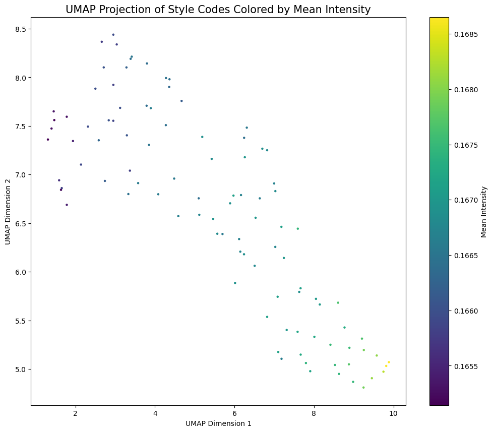
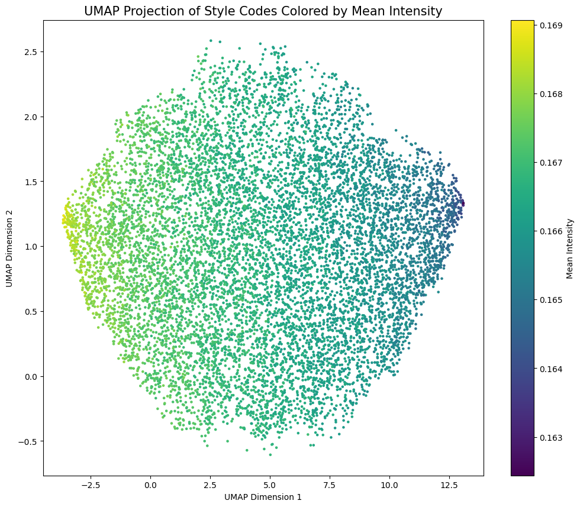

# COMP3710 StyleGAN2 Brain Image Generator
A StyleGAN2 model trained on the OASIS dataset.



## The Problem
Accurate brain images are highly valued in such industries as healthcare and in scientific research. However, due to the threat of compromising patient privacy, generating highly realistic brain images offers a promising alternative. However, StyleGAN2 generated images can be used without compromising privacy, and can also allow for data augmentation as well as more advanced anomaly detection. They are also cost effective, and have an architechture well suited to the modelling and generative problem at hand. The 2D image slices of the brains that need to be generated need to be of sufficiently high quality, and the StyleGAN2 model is one of the best models for high quality image generation, as compared with other models such as DCGAN and VQVAE. This is achieved using the style vector, which controls the styles and features of the generated images. This is particularly important with regards to brain image generation, where capturing specific features which correspond to features of the brain is especially important.

## Objective
The objective is to create a generative model of the ADNI brain data set using a StyleGAN2
that has a reasonably clear image. Furthermore, a UMAP embeddings plot with ground truth in colours 
is included.

## StyleGAN2 - Algorithm Description
### GAN
The goal of the generative model is to learn the underlying distribution of the training dataset. 
The generative adversarial network (GAN) performs a min-max game between two convolutional networks; the 
generator and the discriminator. The generator takes random noise input and outputs a fake image with a 
fake distribution, while the discriminator performs a binary classification task of distinguishing between 
fake and real images. The goal of the generator is to generate a fake image that highly resembles the real 
image.

### StyleGAN
StyleGAN is a generative adversarial network (GAN) architecture that uses a style-based generator for image synthesis.
In contrast to traditional GANs, StyleGAN does not start directly from a random noise vector, but uses a mapping network to
map the noise to an intermediate latent space first. Random vectors from this space and by an affine transformation become style vectors, which represent the dientangled features from the training distribution. Using adaptive instance normalisation (AdaIN),
the style vectors are directly embedded into the intermediate layers of the generator. Stochastic variation control adds 
much finer details into the image through the addition of noise input into the generator similarly using AdaIN blocks.
The StyleGAN allows for style mixing, since the styles are separated across different layers which are progressively trained 
using different data sources. This allowing for better control over high-level and low-level features independently, making it possible to blend, interpolate, or adjust specific aspects of the generated image.


### StyleGAN2
StyleGAN2 builds upon the original StyleGAN architecture by addressing several limitations, such as visible blob-like artifacts on the images and the progressive growing problem. StyleGAN2 removes the blob-like artifacts by replacing the AdaIN layer with weight modulation. Instead of manipulating the feature maps using AdaIN, the convolution kernel weights are scaled
with a style vector in weight modulation and then the kernel is normalised in weight demodulation. This removes the progressive growing problem which introduces the blob-like artifacts. The resulting architecture produces higher quality images than the StyleGAN.

 architecture")

## Data
The dataset that this model is trained on is the publicly available OASIS brain dataset. This dataset contains 2D MRI image slices of brains. The directory structure of this dataset is the following:

```
└───keras_png_slices_data
    ├───keras_png_slices_seg_test
    ├───keras_png_slices_seg_train
    ├───keras_png_slices_seg_validate
    ├───keras_png_slices_test
    ├───keras_png_slices_train
    └───keras_png_slices_validate
```

This model trains on images taken from all the folders, i.e. the dataloader does not discriminate between images in the train, test, or validate directories. This is so that this model can train on more diverse images and so be able to generate a wider range of images. It is a potential limitation that this solution has not been implemented such that the model trains exclusively on the training data.

### Preprocessing
The OASIS brains dataset is already pre-processed so the only preprocessing included was dataset augmentation to the reduce the risk of over-fitting and random vertical flip transform, grayscale (not strictly necessary as the images are already black and white), normalise the images, and resize using bicubic interpolation. Note that even though the training images are already in black and white, grayscale ensures that the images are imported to the dataloader in one channel instead of the default of three (RGB). This allows for greater efficiency in the training. Bicubic interpolation was used instead of the commonly used bilinear interpolation, since bicubic interpolation produces sharper images with more clearly defined, smoother edges (Han, 2013). This is relevant for MRI brain images, which contain smooth, intricate curves that need to be extracted as features. Bicubic interpolation is less efficient than bilinear interpolation, so it is recommended that tests comparing these two interpolation methods for training the StyleGAN2 be performed.

## Requirements
This program has been tested to run on Windows. 64-bit Python3.11 or later is recommended. Anaconda3 or later is recommeded. The required libraries are: 

```
pytorch
torchvision
pytorch-cuda
cudatoolkit
numpy
matplotlib
tqdm
umap-learn
umap-learn[plot]
```

To install umap dependencies, run `pip install umap-learn`

Libraries should use the latest versions.

Ideally run with a NVIDIA A100 GPU with 128GB of DRAM. Testing on other GPUs has not been performed.

### Running the project
To run this project clone the repository and install all the necessary dependencies. It is recommended that you use a `conda` enviroment to do so.
- Change the path to the `data_root` folder in `config.py` as well as any of the other optionally changeable hyperparams (such as `manual_seed`). 
- Change the path to save the trained models in `train.py`. 
- Run `train.py`

## Code Structure

The following files are included in this repository:

```
config.py
dataset.py
modules.py
predict.py
utils.py
colour_umap.py
train.py
```

- `config.py`: Contains all the hyperparameters. Also contains the path to the data directory.
- `dataset.py`: Contains the `get_data` method which preproccesses the data and creates the dataloader. Also contains the `show_imgs` method which displays some of the training images.
- `utils.py`: Contains methods for data augmentation and optimisation.
- `modules.py`: Contains architecture of the mapping network, discriminator and generator.
- `predict.py`: Contains `plot_loss` method for plotting the discriminator and generator loss as well as `generate_examples` method for generating some images using the trained model.
- `colour_umap.py`: Contains methods for UMAP plot and associated UMAP functionality.
- `train.py`: The main file of the project. Contains the functionality for training the models, as well as execute all other functionality of the project. This is the file that is called to run the project.

Note that `assets` directory contains images and graphs for this report. Also, the models are saved in this directory once training is complete under `netD.pth`, `netG.pth` and `netM.pth` for the discriminator, generator and mapping network respectively.

To use pre-trained models instead of training new models, please set the `load_models` hyperparameter in `utils.py` to `True`.
Note that no pretrained models have been included in this repository.

Optionally, a seed for training the model can be set by changing the `manualseed` hyperparameter in `config.py`. Otherwise, a random `manualseed` will be chosen.

## Generated Image Results

### Input
Below are a sample of the training images that the model was trained on.


### Output
When the training is occuring, the output should look something like this:


#### Epoch 0


#### Epoch 10


#### Epoch 20


#### Epoch 30


#### Epoch 40


#### Epoch 50


Comparing this to a real image from the dataset below, we can see that the generated image at the 50th epoch is reasonably clear by comparison.



Hence we can see that by the 50th epoch, the requirement for reasonably clear image generation has been met.

### Loss Graphs
#### Epochs = 15
The graphs below show the loss of the generator and discriminator during their training cycles for 15 epochs (10650 iterations).





#### Epochs = 50
The graphs below show the loss of the generator and discriminator during their training cycles for 50 epochs (35500 iterations).


## UMAP
Uniform Manifold Approximation and Projection (UMAP) is a dimension reduction technique used for visualisation.
In the context of this project, we use UMAP to visualise the high-dimensional style codes in a 2D space, 
with the mean intensities used to colour code the points. This helps in understanding how the style codes relate to the visual characteristics of the generated images. By projecting the high-dimensional style codes (w) into 2D, we can visualise how the generator's latent space is organized. Moreover, by colouring the UMAP plot using the mean intensities of the generated images, we can observe how changes in the latent space relate to changes in the generated images' characteristics. 
We colour by mean intensity since the OASIS dataset lacks ground truth labels, so mean intensity serves as an image-derived attribute that can be used to colour code the embeddings. The lack of ground truth labels in the OASIS dataset made it unclear as to what the ground truth labels should be, and so it was decided that the most appropriate use of UMAP was to visualise the imapact of different style codes/features on the generated images, and hence mean intensity was chosen as a metric for this. Hence it provides an intuitive relation between the latent space and the 
physical characteristics of the generated images.

The method of implementation is as follows: following the training, a sample of the set of style codes `w` is selected from the mapping network, and then images are generated corresponding to the samples style codes. The mean intensity of each generated image with regards to each style is then found, and then UMAP is used to reduce the dimensionality of the style codes from `w_dim` to 2. 
Then a scatter plot where each point represents a style code projected into 2D space.
Each point is coloured based on the mean intensity of the corresponding generated image.

In the plot below, we see an example image from the generated images based on selected style codes. In this case the number of style codes selected was `n = 100`. The corresponding UMAP plot for these style codes is also given below.





In the plot below, we see the UMAP plot for `n = 10000`.



The UMAP seems to indicate a quasi Gaussian distribution of mean intensity to number of style codes captured in an image in that the number of style codes that have very low mean intensity or very high mean intensity are seen in fewer and fewer images as the mean intensity goes very low or very high. This seems to indicate that most of the style of the image is captured by many style codes with moderate intensity rather than a few style codes with high intensity. This could be due to the relatively similar nature of the brain images; there are not very distinctive features that separate images, mostly small changes in features.

## Limitations and Future Investigations
This StyleGAN2 model was trained for a maximum of 50 epochs (35500 iterations), and while this did satisfy the task by generating reasonably clear images, it is expected that had the training been continued even more clarity could have been achieved. Based on similar models, 150 epochs appears to the the point of maximum clarity in the generated images. This is not a fundamental flaw in the implemented solution, it is merely that this number of epochs was not investigated due to the limitations of training time. 
That being said, the images generated after 50 epochs of training were reasonably clear and there would not be significant improvment at 150 epochs. This can be seen from the loss graphs, which indicate that the Discriminator and Generator loss functions are relatively low by 50 epochs.

It is a potential limitation that this solution has not been implemented such that the model trains exclusively on the training data. In future, better data preprocessing is recommended to avoid the model training on all the OASIS data.
A further limitation is that this model does not contain a UMAP embeddings plot. This should be a future extension to this project.

It is unclear whether the decision for using UMAP to plot style codes with mean intensity as the colour coding was an appropriate decision. Further investigations into using UMAP to give greater insight into the impact of style features on the generated images should be given. Alternative approaches could include performing clustering on the embeddings to create pseudo-labels and using these cluster assignments as labels for colouring, or interpolating between different latent vectors, and then using the interpolation steps as labels to show how the embeddings change across interpolations.

## References and Acknowledgements
The model was implmented based on the [StyleGAN2 paper](https://arxiv.org/pdf/1912.04958):

Karras, T. et al., 2020. Analyzing and Improving the Image Quality of StyleGAN. arXiv.

Han, D., 2013. Comparison of Commonly Used Image Interpolation Methods. Paris, Atlantis Press.

Hui, J., 2020. GAN - StyleGAN & StyleGAN2. Medium, 9 March.

Tauil, A. E., 2023. Implementation StyleGAN2 from scratch. [Online] 
Available at: https://blog.paperspace.com/implementation-stylegan2-from-scratch/
[Accessed October 2024].
