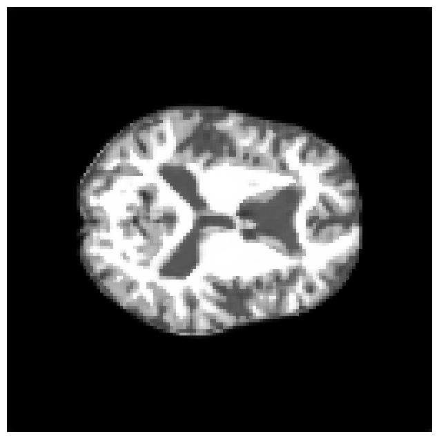
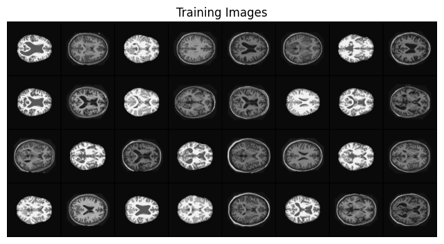
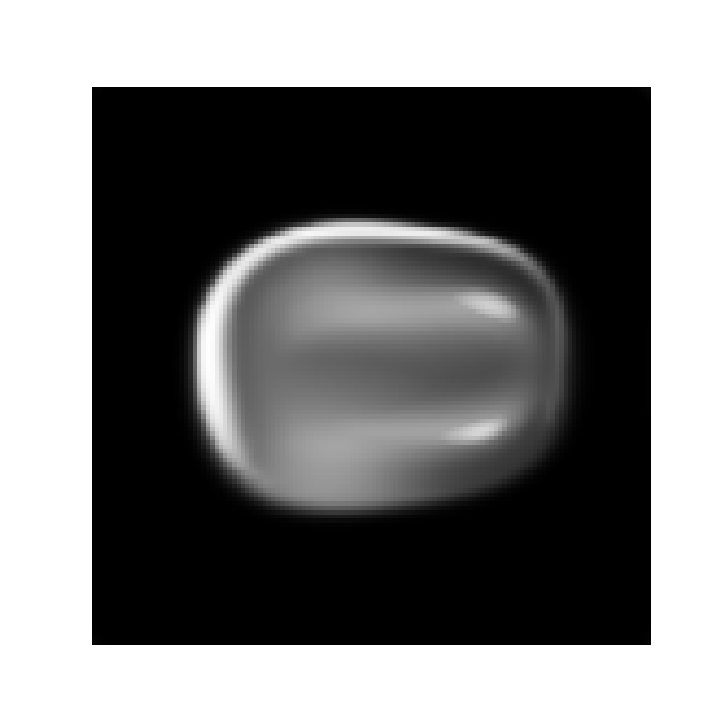
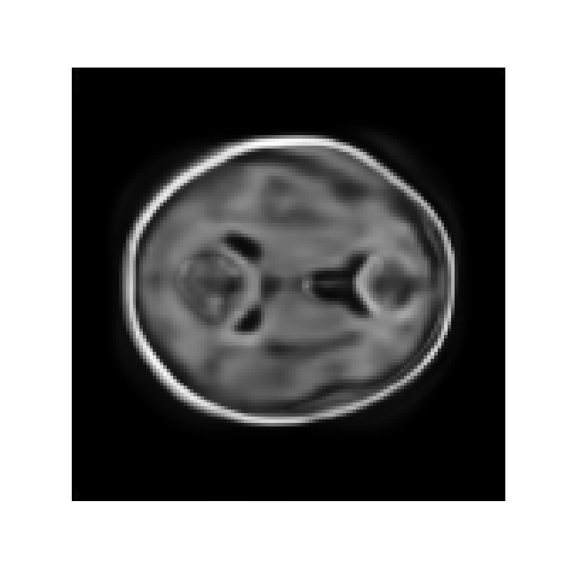
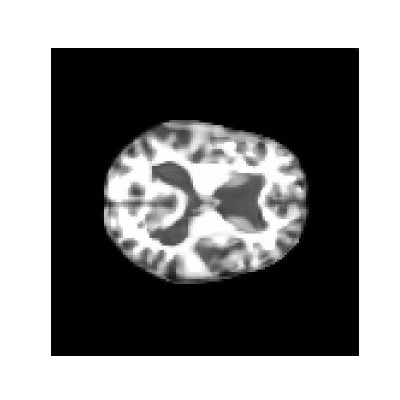
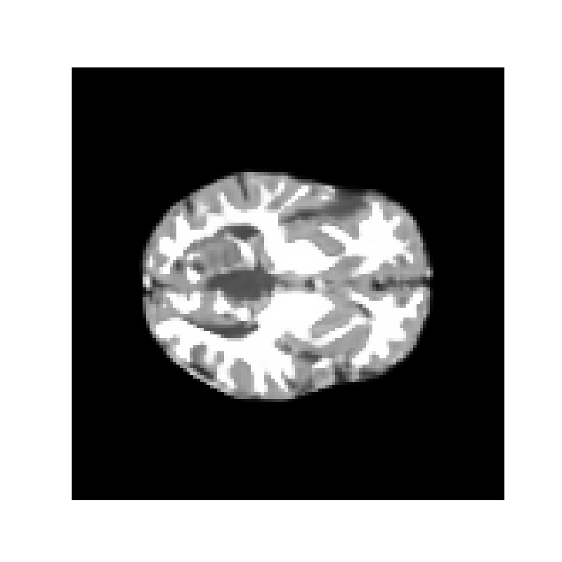
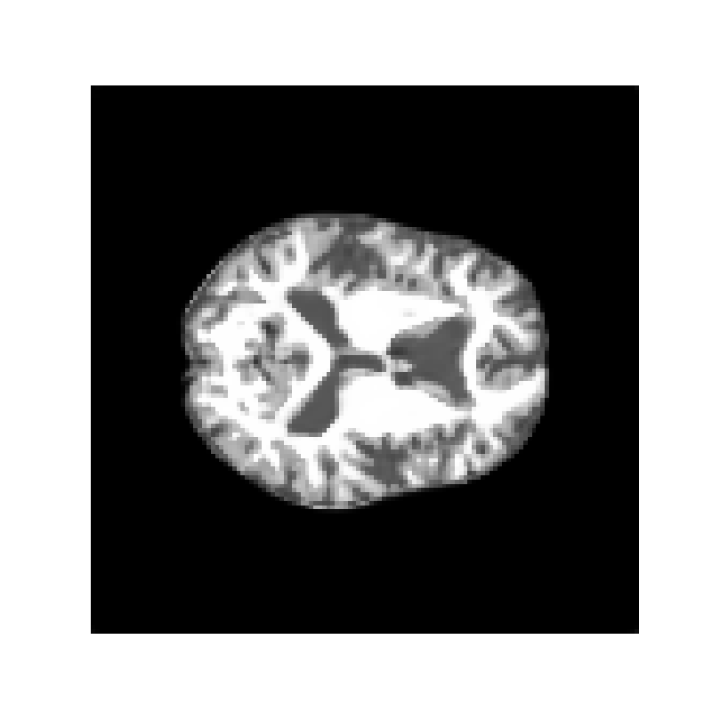
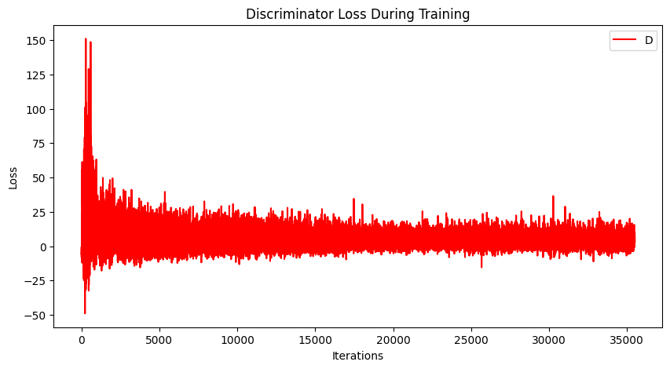
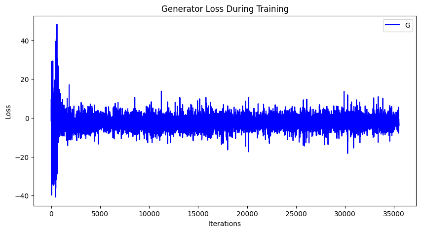
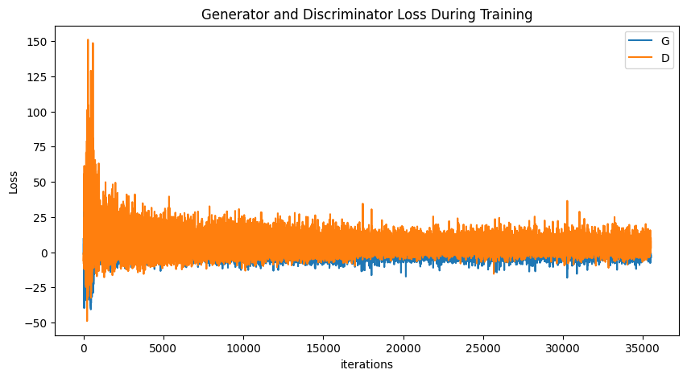

# COMP3710 StyleGAN2 Brain Image Generator
A StyleGAN2 model trained on the OASIS dataset.



## Objective
The objective is to create a generative model of the ADNI brain data set using a StyleGAN2
that has a reasonably clear image. Furthermore, a UMAP embeddings plot with ground truth in colours 
is included.

### The Problem
Accurate brain images are highly valued in such industries as healthcare and in scientific research. However, due to the threat of compromising patient privacy, generating highly realistic brain images offers a promising alternative. However, StyleGAN2 generated images can be used without compromising privacy, and can also allow for data augmentation as well as more advanced anomaly detection. They are also cost effective, and have an architechture well suited to the modelling and generative problem at hand. The 2D image slices of the brains that need to be generated need to be of sufficiently high quality, and the StyleGAN2 model is one of the best models for high quality image generation, as compared with other models such as DCGAN and VQVAE. This is achieved using the style vector, which controls the styles and features of the generated images. This is particularly important with regards to brain image generation, where capturing specific features which correspond to features of the brain is especially important.

## StyleGAN2 - Algorithm Description
### GAN
The goal of the generative model is to learn the underlying distribution of the training dataset. 
The generative adversarial network (GAN) performs a min-max game between two convolutional networks; the 
generator and the discriminator. The generator takes random noise input and outputs a fake image with a 
fake distribution, while the discriminator performs a binary classification task of distinguishing between 
fake and real images. The goal of the generator is to generate a fake image that highly resembles the real 
image.

### StyleGAN
StyleGAN is a generative adversarial network (GAN) architecture that uses a style-based generator for image synthesis.
In contrast to traditional GANs, StyleGAN does not start directly from a random noise vector, but uses a mapping network to
map the noise to an intermediate latent space first. Random vectors from this space and by an affine transformation become style vectors, which represent the dientangled features from the training distribution. Using adaptive instance normalisation (AdaIN),
the style vectors are directly embedded into the intermediate layers of the generator. Stochastic variation control adds 
much finer details into the image through the addition of noise input into the generator similarly using AdaIN blocks.
The StyleGAN allows for style mixing, since the styles are separated across different layers which are progressively trained 
using different data sources. This allowing for better control over high-level and low-level features independently, making it possible to blend, interpolate, or adjust specific aspects of the generated image. 

### StyleGAN2
StyleGAN2 builds upon the original StyleGAN architecture by addressing several limitations, such as visible blob-like artifacts on the images and the progressive growing problem. StyleGAN2 removes the blob-like artifacts by replacing the AdaIN layer with weight modulation. Instead of manipulating the feature maps using AdaIN, the convolution kernel weights are scaled
with a style vector in weight modulation and then the kernel is normalised in weight demodulation. This removes the progressive growing problem which introduces the blob-like artifacts. The resulting architecture produces higher quality images than the StyleGAN.


## Data
The dataset that this model is trained on is the publicly available OASIS brain dataset. This dataset contains 2D MRI image slices of brains. The directory structure of this dataset is the following:

```
└───keras_png_slices_data
    ├───keras_png_slices_seg_test
    ├───keras_png_slices_seg_train
    ├───keras_png_slices_seg_validate
    ├───keras_png_slices_test
    ├───keras_png_slices_train
    └───keras_png_slices_validate
```

This model trains on images taken from all the folders, i.e. the dataloader does not discriminate between images in the train, test, or validate directories. This is so that this model can train on more diverse images and so be able to generate a wider range of images.

## Requirements

This program has been tested to run on Windows. 64-bit Python3.11 or later is recommended. Anaconda3 or later is recommeded. The required libraries are: 

```
pytorch
torchvision
pytorch-cuda
cudatoolkit
numpy
matplotlib
tqdm
```

Libraries may use newer versions.

This should ideally be run with a NVIDIA A100 GPU with 128GB of DRAM. Testing on other GPUs has not been performed.

## Code Structure

The following files are included in this repository:

```
config.py
dataset.py
modules.py
predict.py
utils.py
train.py
```

-`config.py`: Contains all the hyperparameters. Also contains the path to the data directory.
-`dataset.py`: Contains the `get_data` method which preproccesses the data and creates the dataloader. Also contains the `show_imgs` method which displays some of the training images.
-`utils.py`: Contains methods for data augmentation and optimisation.
-`modules.py`: Contains architecture of the mapping network, discriminator and generator.
-`predict.py`: Contains `plot_loss` method for plotting the discriminator and generator loss as well as `generate_examples` method for generating some images using the trained model.
-`train.py`: The main file of the project. Contains the functionality for training the models, as well as execute all other functionality of the project. This is the file that is called to run the project.

Note that `assets` directory contains images and graphs for this report. Also, the models are saved in this directory once training is complete under `netD.pth`, `netG.pth` and `netM.pth` for the discriminator, generator and mapping network respectively.


To use pre-trained models instead of training new models, please set the `load_models` hyperparameter in `utils.py` to `True`.
That is: `load_models = True`.
Also set the `model_path` hyperparameter to the file path of these pretrained models. The pretrained model files 
should be `.pth` files.

Optionally, a seed for training the model can be set by changing the `seed` hyperparameter in `utils.py`. The `seed` should be an integer. Otherwise, a random `seed` will be chosen.

## Running the project

To run this project clone the repository and 


## Results
The images for the 

### Regular Training


### Extended Training

### Input
Below are a sample of the training images that the model was trained on.


### Output
Epoch 10:


Epoch 20:


Epoch 30:


Epoch 40:


Epoch 50:


Hence we can see that by the 50th epoch, the requirement for reasonably clear image generation has been met.

### Loss Graphs
The graphs below show the loss of the generator and discriminator during their training cycles for 50 epochs (35500 iterations).







## Conclusion

## References


