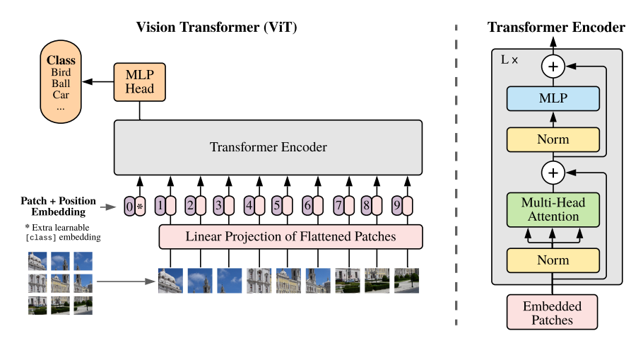

# Classifying Alzheimers using Vision Transformers (ViT)

## Project Overview

This project implements a Vision Transformer (ViT) to classify Alzheimer's disease based on MRI images of brain slices. The model leverages the self-attention mechanism to capture global relationships across the image, offering improved accuracy compared to traditional convolution-based methods. Alzheimer's disease detection is critical for early diagnosis and treatment, and the proposed approach aims to assist in automating this process through advanced machine learning techniques.

### How it works
A Vision Transformer (ViT) adapts the transformer's encoder for image classification. While transformers typically process sequential data like text, ViTs treat images as sequences by dividing them into patches. Positional embeddings are added to maintain spatial information, and a class token is prepended to the sequence to help with image classification.
Each layer applies multi-head self-attention to capture long-range dependencies between patches. The final embeddings are pooled, and a classification head predicts whether the image shows Alzheimer's disease or a normal brain. The model is trained using the [ADNI dataset](https://adni.loni.usc.edu/).


Diagram sourced from (Dosovitskiy, et al., 2020)

The ViT's core component is Multi-Head Self-Attention, which identifies relationships between image patches, much like how transformers link words in sequences. This attention mechanism captures dependencies across pixels, similar to how CNNs recognize spatial patterns in images.
(Vaswani, et al., 2017).


## Dependencies 
- **Python**: 3.12.4
- **NumPy**: 1.26.3
- **Pandas**: 2.2.2
- **Matplotlib**: 3.9.2
- **Torch (PyTorch)**: 2.4.0+cu118

# Usage
## Installation

1. Create a conda environment from `environment.yaml`:
```bash
conda env create -f environment.yaml
conda activate torch
```

## Training The Model Yourself

- Replace  `"TRAIN_DATA_PATH"` and `"TEST_DATA_PATH"` in `dataset.py` with the relevant paths to your dataset.
It should have the following file structure.
```
train/
    AD/
        IMAGES
        ...

    NC/
        IMAGES
        ...
    
test/
    AD/
        IMAGES
        ...
        
    NC/
        IMAGES
        ...
```

- Replace `"PARAM_PATH"` in `train.py` - this is where your model checkpoints are stored.

1. Run the training file
```python train.py```

2. Once you're happy with the trained model, you can evaluate it using the test set:
```python predict.py```

# Model
## The ADNI Dataset
The preprocessed version of the ADNI Alzheimers dataset was downloaded and unzipped into a folder. The data was split into a training and test set,  with each dataset containing a split between alzheimers and normal cognition patients. 


Here is a sample of MRI images, where one has Alzheimers Disease (AD) and the other has Normal Cognition (NC).


## Preprocessing
We used ImageFolder from PyTorch to load the dataset and applied data augmentation using a series of transformations. The augmentations included resizing, grayscale conversion, random rotation, and random resized cropping. By simulating variations in the data that the model may encounter in real-world scenarios, it makes the model more robust to unseen examples and hence generalizes better.

## Splitting for Validation Set
The ADNI dataset only had 2 data splits - between the train and test set. To create a validation set from the training data, we split the dataset to assess the model's performance on unseen data during training, allowing us to tune hyperparameters and monitor progress without relying on the test set for evaluation. This helps prevent overfitting and ensures that the model generalizes well before being evaluated on the final test set.

## Hyperparameters
The following hyperparameters were used to train the final model from epoch 1-50:

```
in_channels = 1
img_size = 224
patch_size = 16
embed_size = 768
num_layers = 12
num_heads = 8
MLP depth = 2048
dropout_rate = 0.1
num_classes = 2
batch_size = 32
learning_rate = 1e-4
weight_decay = 1e-2
```

From epoch 50-300, we decreased the `weight_decay` and increased the `dropout_rate` to improve generalisation and prevent overfitting to the dataset.
```
weight_decay = 1e-4
dropout_rate = 0.2
```
At epoch 250, we reduced the amount of data augmentation on the training set to improve model performance.

After epoch 300, we further increased the `dropout_rate` to prevent overfitting to the training set.
```
dropout_rate = 0.4
```

## Results
After many iterations of hyperparameter tuning, the final model was trained using the selected configuration. We used 80% of the training dataset for training and 20% for validation. The model ran on the UQ's rangpur cluster for 500 epochs, with each epoch taking roughly 120 seconds each. 
Total time taken was roughly 17+ hours.


Overall, the loss generally decreases steadily across all epochs, with a sudden drop in loss at epoch 250 since we reduced the augmentation on our training dataset. There is another spike in loss at epoch 300 when we increased the dropout rate further.
At epoch 500, we achieved a train loss of 0.25 and a validation loss of 0.2201.

Both the validation and train loss decreased steadily which is a good sign that the model is continually learning and getting better. It also suggests that the model is generalizing well to unseen data in the validation set.

The test accuracy achieved by running `predict.py` was 73%. This shows a decent result in the model's performance but we are still slightly overfitting to the training set. Perhaps running the training phase for more epochs could yield a better performance on the training set.

The original ViT paper was trained on datasets with around 300M images, while our dataset was only about 30K images. This significant difference in dataset size highlights one of the key challenges of using transformer models for smaller datasets, as they typically perform best when trained on very large datasets.

## Future Improvements
