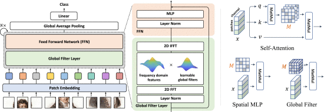
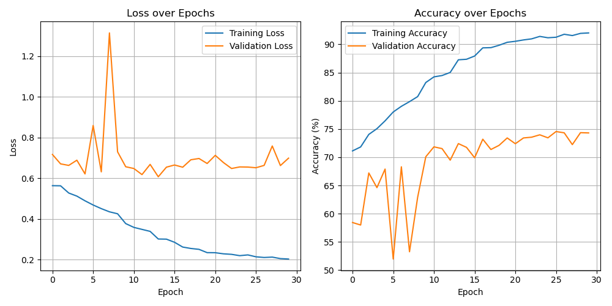
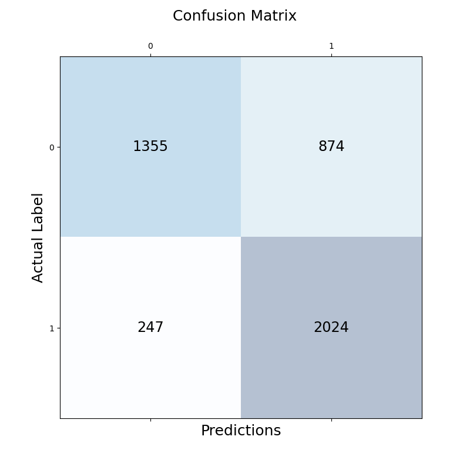

# GFNet Vision Transformer for Alzheimer's Disease Classification

## Author
Chiao-Yu Wang (Student No. 48007506)

## Project Overview
Self-attention and pure multi-layer perceptrons (MLP) models have become increasingly popular for visual recognition tasks due to their ability to achieve high performance with fewer inductive biases. However, when high-resolution features are required, such models become harder to scale up since Vision Transformers rely on self-attention mechanisms to capture long-range dependencies in image data, and the complexity of self-attention and MLP grows significantly as image sizes increase. A new architecture, the Global Filter Network (GFNet), was therefore introduced in 2023 to address this limitation. This project aims to construct a GFNet which follows a similar structure to the original publication that can classify Alzheimer’s disease given a set of MRI brain scans and maintain a minimum accuracy of 80%.

## Global Filter Networks (GFNet)
The GFNet architecture is outlined in the publication ["GFNet: Global Filter Networks for Visual Recognition"](https://doi.org/10.1109/TPAMI.2023.3263824) and shares structural similarities with regular Vision Transformers. The main difference would be the replacement of the self-attention layer with a Global Filter Layer and a Feed Forward Network (FFN). The Global Filter Layer consists of a 2D discrete Fourier transform, an element-wise multiplication between frequency-domain features and learnable global filters, and a 2D inverse Fourier transform. The Feed Forward Network consists of a layer normalisation operation followed by a multilayer perceptron (MLP). The GFNet therefore contains the following layers: a patch embedding layer, Global Filter Layer, Feed Forward Network, Global Average Pooling layer and finally a Linear layer, which determines the class. The GFNet architecture is illustrated below.

<p align="center">
    
</p>

Unlike regular Vision Transformers, GFNets are able to leverage the Fast Fourier Transform to apply global filters in the frequency domain and capture global image features in a more computationally efficient manner. By utilising learnable filters that operate in the frequency space, GFNets can capture both local and global patterns and therefore, reduce the need for complex attention mechanisms in order to maintain its performance. This is particularly useful in classifying MRI scans, and by applying Fourier Transforms and operating on the entire image at once, GFNets can recognize global structural changes associated with Alzheimer's Disease. As such, GFNets can be considered a more resource-efficient alternative to regular Vision Transformers for image classification tasks.

## Project Dependencies
The dependencies listed below are recommended for replicating the results from this project.

- Python 3.11.5
- PyTorch 2.0.1
- TorchVision 0.15.2
- Matplotlib 3.8.4
- NumPy 2.1.2

## Repository Overview

`images/` contains the images used in this README.

`constants.py` contains the defined constants used for specifying data loading and model settings.

`modules.py` contains the components of the Vision Transformer.

`dataset.py` contains the function used for loading the data.

`train.py` contains the functions for compiling and training the model.

`predict.py` contains the functions for predicting on the trained model.

## Using the GFNet
### Parameters/Constants
Before training the model, set the global variables in `constants.py`. The variables are defined as follows:

`IMAGE_SIZE`: Height and width of each image.

`BATCH_SIZE`: Batch size of the training and testing data.

`LEARNING_RATE`: Learning rate of the Adam optimizer.

`NUM_EPOCHS`: Number of epochs to train the model for.

`WEIGHT_DECAY`: Weight decay of the Adam optimizer.

`TRAIN_DATA_PATH`: Path from which the training dataset will be loaded.

`TEST_DATA_PATH`: Path from which the test dataset will be loaded.

`MODEL_SAVE_PATH`: Path at which the trained model will be saved.

`DROPOUT_RATE`: Percentage of units to drop out in Multi-Layer Perceptron.

`SCHEDULER_FACTOR`: Factor by which the scheduler will reduce the learning rate.

`SCHEDULER_PATIENCE`: Number of epochs with no improvement after which the scheduler will reduce the learning rate.

### How to Build and Train the GFNet
- Running `train.py` will automatically train and build a GFNet model. The trained model will then be saved in the directory specified by `MODEL_SAVE_PATH`. Loss and accuracy curves for both training and validation will be plotted by Matplotlib.

- Running `predict.py` will predict results using the trained GFNet model. The trained model will be loaded from `MODEL_SAVE_PATH` and used to evaluate the test set. A confusion matrix will also be plotted by Matplotlib and saved to the working directory.

## Dataset
The preprocessed ADNI brain dataset used within this project can be found [here](https://filesender.aarnet.edu.au/?s=download&token=a2baeb2d-4b19-45cc-b0fb-ab8df33a1a24). The original unprocessed dataset can also be found on the official [ADNI website](https://adni.loni.usc.edu/). The `TRAIN_DATA_PATH` and `TEST_DATA_PATH` variables in `constants.py` can be changed to specify another path from which the training and testing datasets should be loaded.

The dataset has been compiled for binary classification and as such, only consists of two classes: the `AD` class for brains with Alzheimer's Disease and the `NC` class for brains with Normal Cognitive function.

### Training, Validation and Test Splits
The preprocessed ADNI brain dataset consists of 21,520 images in the `train` folder and 9000 images in the `test` folder. Similar to Vision Transformers, GFNets require large amounts of training data to achieve high performance, so the validation set was derived from half of the `test` folder. This results in a dataset split of:
- 21,520 images in the training set
- 4500 images in the validation set
- 4500 images in the test set

An example of a MRI brain image within the ADNI dataset is shown below.

<p align="center">
    
</p>

### Data Augmentation
Before the training data was loaded into the model, augmentation layers including `RandomResizedCrop`, `RandomHorizontalFlip`, `RandomRotation` and `Normalize` were applied. This augmentation process contributed to minimising overfitting when training the model on the relatively small dataset. For reproducibility of augmentation results, a seed was also set.

## GFNet Implementation/Results
While similar to the original GFNet concept, the constructed model differs in its integration of a pretrained ResNet backbone and a Feed Forward Network (FNN) design with normalization and dropout layers. 

The original GFNet architecture incorporates Patch Embedding as its first layer, whereby dividing input images into smaller non-overlapping patches, images can be passed into a transformer encoder and processed as a sequence of tokens. Instead of utilising a Patch Embedding layer, the provided implementation begins with a pretrained ResNet-18 (`resnet-18`) backbone that serves as a feature extractor, extracting hierarchical feature maps from the input image using convolutional layers. These high-level feature maps can then be used to represent complex patterns within the image. Due to the flexibility that comes with convolutional networks, the Patch Embedding layer was substituted with a ResNet-18 backbone.

Similar to the original architecture, the extracted feature maps are then processed by a Global Filter Layer (`GlobalFilterLayer`), which applies a learnable filter in the frequency domain using Fast Fourier Transform (FFT). This allows the model to efficiently capture global image patterns by performing element-wise multiplication between the FFT of the input and the FFT of the learnable filter, followed by an inverse FFT to return the filtered features back to the spatial domain.

The next step involves a Feed Forward Network (FFN), which is a combination of Layer Normalization (`LayerNorm`) and a Multi-Layer Perceptron (`MLP`). The FFN further processes the flattened feature maps by transforming them through linear layers (`Linear`), batch normalisation (`BatchNorm1d`), and GELU activation functions (`GELU`), introducing non-linearity and regularisation through dropout layers (`Dropout`). After passing through the MLP, the features are reshaped and reduced in dimensionality using Global Average Pooling (`AdaptiveAvgPool2d`), which condenses the spatial information from the feature maps into a smaller representation.

Finally, the pooled features are passed to a classifier layer (`Linear`) that maps the features to the target class probabilities. 

With the following hyperparameters:
```
IMAGE_SIZE = 128
BATCH_SIZE = 32
LEARNING_RATE = 0.0005
NUM_EPOCHS = 30
WEIGHT_DECAY = 0.005
DROPOUT_RATE = 0.3
SCHEDULER_FACTOR = 0.5
SCHEDULER_PATIENCE = 1
```
the GFNet model achieved the following classification metrics and results.

### Training and Validation Loss and Accuracy Per Epoch
<p align="center">
    
</p>

### Classification Results
<p align="center">
    
</p>

Through several trials, the selected hyperparameters above achieved the most optimal balance between training and validation loss and accuracy. By lowering the learning rate to 0.0005 and increasing the weight decay to 0.005, the validation loss seemed to stabilise throughout the later epochs instead of continually increasing like other hyperparameter choices. Although the minimum accuracy target of 80% was not achieved, the GFNet model was able to maintain an accuracy of approximately 74% throughout training without experiencing significant overfitting on the data and was also able to classify the test data with 75.11% accuracy, as shown in the confusion matrix above.

## References
[1] GFNet: Global Filter Networks for Visual Recognition, from: https://openreview.net/pdf?id=K_Mnsw5VoOW

[2] TorchVision Models, from: https://pytorch.org/vision/0.8/models.html

[3] TorchVision Transforms, from: https://pytorch.org/vision/0.8/transforms.html

[4] Vision Transformer Implementation, from: https://keras.io/examples/vision/image_classification_with_vision_transformer/

[5] A Detailed Introduction to ResNet and Its Implementation in PyTorch, from: https://medium.com/@freshtechyy/a-detailed-introduction-to-resnet-and-its-implementation-in-pytorch-744b13c8074a