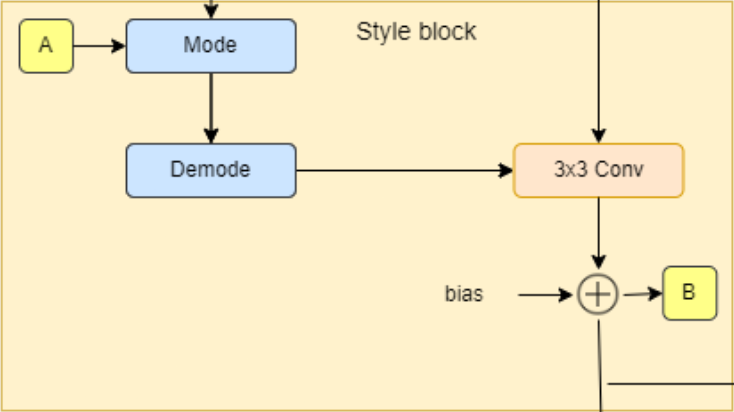
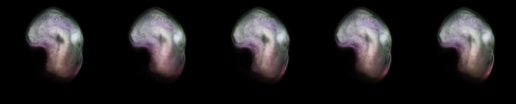
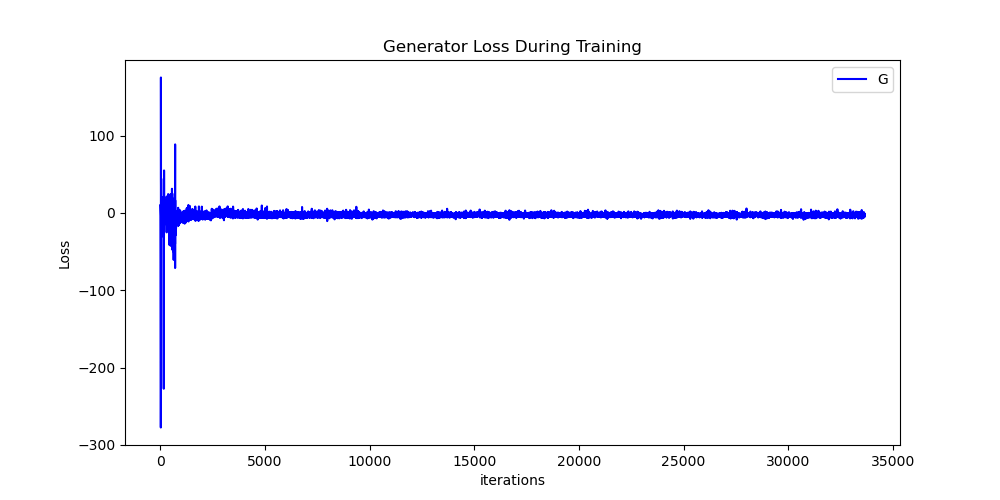
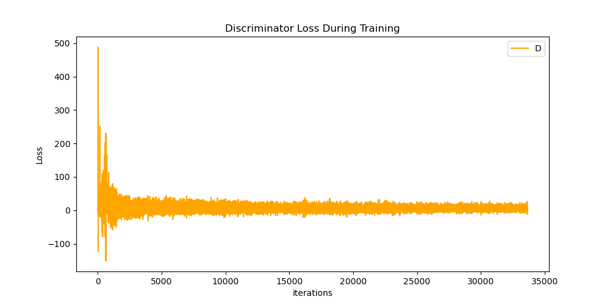
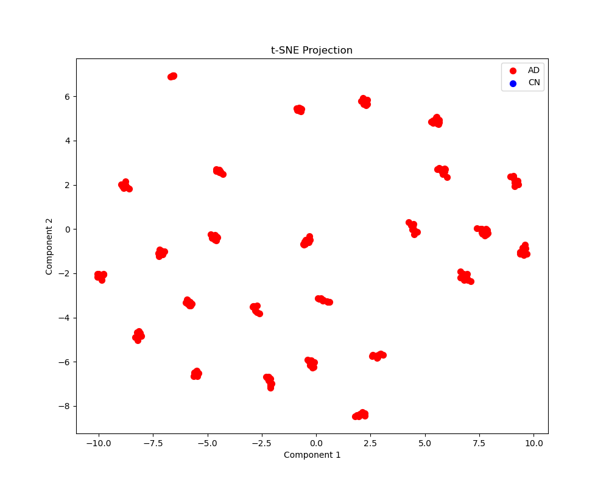

# StyleGAN2-based Image Generation and Feature Embedding for the ADNI dataset

## 1. Overview

This project implements a **StyleGAN2** architecture for high-resolution image generation, with a focus on generating brain scans (ADNI dataset). The project includes the training of the StyleGAN2 model, generating new images using the trained generator, and visualizing learned features of the discriminator using t-SNE embeddings.

### StyleGAN2

StyleGAN2 enhances the original StyleGAN with several key improvements. It replaces adaptive instance normalization with a technique known as weight demodulation. The training process is also refined, maintaining the progressive focus on low to high-resolution images without modifying the network structure during training. Additionally, new regularization methods, such as lazy regularization and path length regularization, are used to improve stability and performance.


**Figure: Generator Block in StyleGAN2**



**Figure: Style Block in StyleGAN2**


**Figure: Discriminator Block in StyleGAN2**


### Problem Description

The algorithm solves the problem of **generating realistic brain images** for **Alzheimer's Disease (AD)** and **Cognitively Normal (CN)** subjects. With the advanced **StyleGAN2** architecture, the model produces high-quality images that can aid in medical research, specifically in augmenting datasets for classification tasks. Additionally, by visualizing the discriminator’s feature space using t-SNE, we can evaluate how effectively the model distinguishes between real and generated images.

### How the Algorithm Works

- The **StyleGAN2 architecture** is used to progressively grow both the generator and discriminator. The generator is responsible for creating new images from random latent vectors, while the discriminator evaluates whether an image is real or generated.
- During training, the generator and discriminator are updated through adversarial training, where the generator tries to produce images that can fool the discriminator, while the discriminator learns to differentiate between real and fake images.
- A **gradient penalty** is applied to the discriminator for regularization, ensuring stable training. A **path length penalty** is used to improve the generator’s style control.
- **t-SNE embeddings** are used to visualize the feature space of the discriminator, helping to understand how the model differentiates between classes.

---

## 2. Dependencies

The following dependencies are required to run the scripts in this project:

- **Python 3.8+**
- **PyTorch 1.9.0+**: For building and training the StyleGAN2 model.
- **torchvision 0.10.0+**: For image transformations and saving generated images.
- **tqdm 4.62.0+**: For progress bars during training.
- **matplotlib 3.4.3+**: For plotting loss curves and visualizing t-SNE embeddings.
- **scikit-learn 0.24.2+**: For performing t-SNE and K-Means clustering.
- **Pillow 8.3.1+**: For handling image saving via `torchvision`.
- **argparse**: For command-line argument parsing (included in Python’s standard library).
- **csv**: For logging training losses (included in Python’s standard library).

To install the necessary packages, you can use the following command:

```bash
pip install torch torchvision tqdm matplotlib scikit-learn Pillow
```

---

## 3. Usage

### Training the StyleGAN2 Model

To train the GAN model using `train.py`, simply run the following command:

```bash
python train.py
```

This script will train the generator and discriminator, saving model checkpoints every 5 epochs. Losses for both the generator and discriminator will be logged and saved in a CSV file.

### Generating Images

After training, you can generate images using the pre-trained generator with the `predict.py` script:

```bash
python predict.py --epoch 75 --n 10
```

This will generate 10 images from the generator saved at epoch 45 and save them in the `generated_images` folder, organized by epoch and latent vector `w` values.

### t-SNE Embeddings

To visualize the t-SNE embeddings of the discriminator's feature space, use `manifold.py`:

```bash
python manifold.py
```

This will load the discriminator, generate embeddings of the feature maps, and apply t-SNE for dimensionality reduction. The result will be a 2D plot showing how the discriminator separates real vs. generated images.

---

## 4. Example Outputs

### Example Image Generation

Below is an example of images generated by the StyleGAN2 model at epoch 75. At epoch 75, the model has started to capture the overall structure of the brain, but the finer details are not yet fully visible, which is expected at this stage of training. As the model continues to train, it is expected that these details will become clearer, producing more realistic brain images.



### Generator Loss

The plot shows the generator loss during the training of a StyleGAN model over approximately 35,000 iterations. Initially, the loss exhibits significant fluctuations, with values ranging from around -300 to over 100, indicating instability in the early stages of training. As the iterations progress, the loss gradually stabilizes, centering closer to zero with much less variance, suggesting that the generator's learning process becomes more consistent. This stabilization after about 5,000 iterations reflects the generator's improved ability to produce more realistic outputs, balancing its performance against the discriminator's feedback.



### Discriminator Loss

The plot illustrates the discriminator loss during the training of a StyleGAN model across approximately 35,000 iterations. In the early stages, the loss is highly volatile, with values spiking up to 500 and dropping as low as -100, reflecting the discriminator's initial difficulty in distinguishing between real and generated samples. As training progresses, the loss stabilizes closer to zero, with much smaller fluctuations after about 5,000 iterations. This stabilization indicates that the discriminator is improving its ability to discern real from generated images, achieving a more balanced adversarial process with the generator. The smoother curve in the later iterations suggests a more stable and consistent learning phase for the discriminator.



### t-SNE Embeddings

This plot shows a t-SNE (t-distributed Stochastic Neighbor Embedding) projection of high-dimensional data into two components for visualization. The data points are color-coded to indicate two distinct classes: AD (Alzheimer's Disease) in red and CN (Cognitively Normal) in blue.

The x-axis and y-axis represent the two components derived from the t-SNE algorithm, which seeks to maintain the relative distances between points, capturing the structure of the data in a reduced 2D space. Clusters of red and blue points indicate distinct groupings, with some separation between the AD and CN classes. However, a few blue points overlap with red clusters, suggesting potential similarities or difficulties in distinguishing between the classes based on the features used. 



---

## 5. Preprocessing and Data Splits

### Preprocessing

Images are preprocessed by resizing them to a resolution of 128x128 pixels using `torchvision.transforms.Resize`. Additionally, they are normalized to a range of [-1, 1], which is standard for GAN training. Data augmentation is applied using random horizontal flips to improve model generalization.

StyleGAN2 is applied to the ADNI dataset to visualize pathological changes in MRIs as the condition progresses from Cognitively Normal (CN) to Alzheimer's Disease (AD). 
The data was already split into 80/20 for train and test. However, only the train data was used to train the model for both AD and NC datasets.

---

## 6. Reproducibility

To ensure the reproducibility of results:
- The **random seed** can be set at the beginning of the scripts to fix the randomness in data shuffling, weight initialization, and latent vector sampling.
- The specific model checkpoints and random latent vectors used to generate images can be saved and reused to obtain the same results.
- Model checkpoints are saved in `.pt` format every 5 epochs to allow for exact replication of the model state.

To reproduce the results from the final model (saved at epoch 45), load the model with:

```bash
python predict.py --epoch 45
```

This will generate the exact images produced during the training process at that epoch.

---

## Acknowledgments

- T. Karras et al., "Analyzing and Improving the Image Quality of StyleGAN," in 2020 IEEE/CVF Conference on Computer Vision and Pattern Recognition (CVPR), Seattle, WA, USA, 2020, pp. 8107-8116, doi: 10.1109/CVPR42600.2020.00813. url: https://doi.ieeecomputersociety.org/10.1109/CVPR42600.2020.00813

- Liu, S. et al. (2023). Style-Based Manifold for Weakly-Supervised Disease Characteristic Discovery. In: Greenspan, H., et al. Medical Image Computing and Computer Assisted Intervention – MICCAI 2023. MICCAI 2023. Lecture Notes in Computer Science, vol 14224. Springer, Cham. url: https://doi.org/10.1007/978-3-031-43904-9_36

- Model implemented from Paperspace. https://blog.paperspace.com/implementation-stylegan2-from-scratch/
