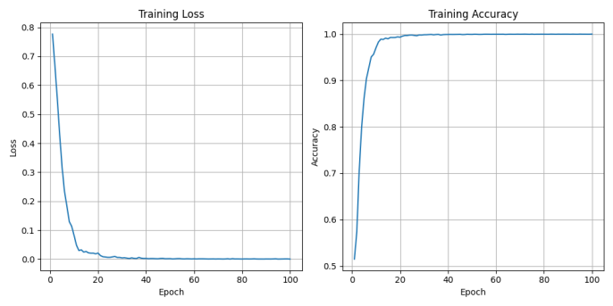

# Alzheimer's Disease Detection Using GFNet

## Project Overview:

The aim of this project is to detect Alzheimer's disease using a trained GFNet model. The task leverages the ADNI dataset to train a binary classification model that distinguishes between Alzheimer's disease (AD) patients and normal cognitive (NC) individuals. Despite achieving a test accuracy of 65%, this project demonstrates the potential of Transformer-based models in medical image classification tasks.

## Dataset:
The project uses grayscale MRI images from the ADNI dataset. The following steps were applied:

1. Cropping and Resizing: The images were cropped to remove unnecessary background regions and resized to 224x224 pixels.
2. Classification and Localization: The images in the AD_NC folder were split into train_loader for training and test_loader for testing.
3. Normalization: Image pixel values were normalized to a range of [-0.5, 0.5].
- Ensure the image data is correctly located in the path /home/groups/comp3710/ADNI/AD_NC/, as obtained from [ADNI website](http://adni.loni.usc.edu/).

## Model Architecture:

The model consists of five key components:

- PatchEmbed: Splits the input image into 16x16 patches and embeds them into a high-dimensional vector space for processing.
- GFNet: The backbone of the model, coordinating all components for image classification.
- Global Filter: Applies a global filter using Fourier Transforms (FFT) to capture long-range dependencies in the image.
- Mlp: Applies non-linear transformations to the extracted features.
- Block: A basic module of the Transformer, combining Mlp and the global filter for feature extraction and processing.

## Training:
1. CrossEntropyLoss: When dealing with binary classification problems, CrossEntropyLoss can effectively calculate the error between the predicted results and the true labels and guide the model to update the weights to minimise the error.
2. Optimiser: The Adam optimiser is capable of fast convergence and is suitable for deep network structures such as GFNet.
3. Scheduler: StepLR Scheduler dynamically reduces the learning rate during training to ensure that the model is able to adjust the weights more finely as it approaches convergence.

## Result:
After 100 epochs of training, the model achieved a test accuracy of 65%. The classification report shows:

- Class 0 (Normal Cognitive):
 Precision: 0.64
Recall: 0.70
F1-Score: 0.67

- Class 1 (Alzheimer’s Disease):
Precision: 0.66
Recall: 0.60
F1-Score: 0.63
Overall Accuracy: 65%

- Macro Average (precision, recall, F1): 0.65

- Weighted Average: 0.65

The loss decreased rapidly within the first 20 epochs, stabilizing close to 0. The training accuracy approached 100%, indicating potential overfitting, as the test accuracy remains lower at 65%.

## Conclusion:
In this model, the final run was only 65% accurate, which I believe is due to the fact that the brain images in the dataset were presented in groups of 20 or 30. It is possible that some of the images of the brains of Alzheimer's patients were the same as those of healthy brains, which led to a decrease in the accuracy of the model. I believe that the accuracy of the model can be improved by using a 3D model training method, or by effectively grouping the images in the dataset.

## Dependencies:
The project requires the following dependencies:
- torch >= 1.9
- torchvision >= 0.11
- timm >= 0.4.5
- Pillow >= 8.3
- Matplotlib >= 3.4
- tqdm >= 4.6
- scikit-learn >= 0.24

## References:
Y. Rao, W. Zhao, Z. Zhu, J. Zhou, and J. Lu, “GFNet: Global Filter Networks for Visual Recognition,” IEEE Transactions on Pattern Analysis and Machine Intelligence, vol. 45, no. 9, pp. 10,960–10,973, Sep. 2023. [Available here](https://ieeexplore.ieee.org/document/10091201).