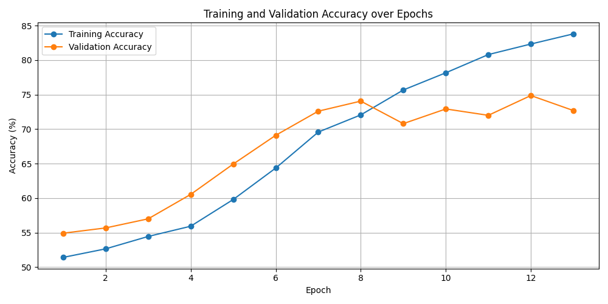
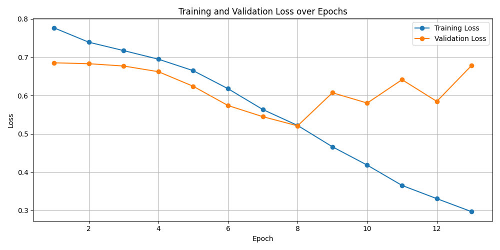
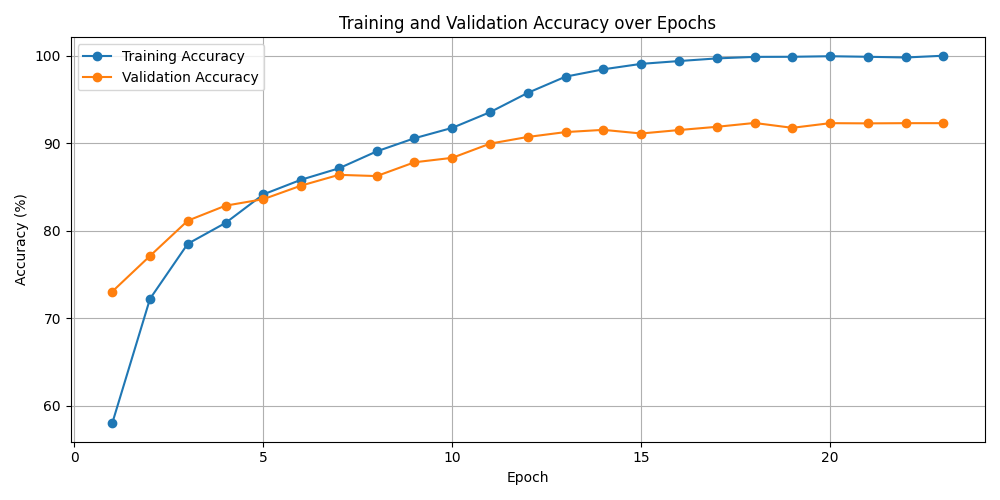
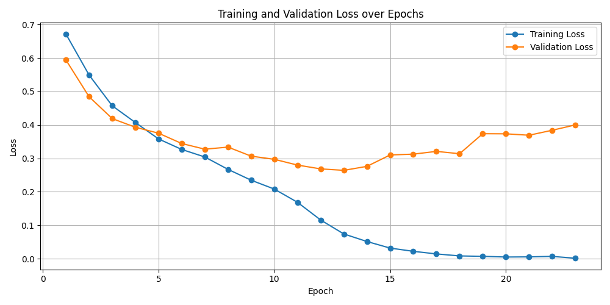
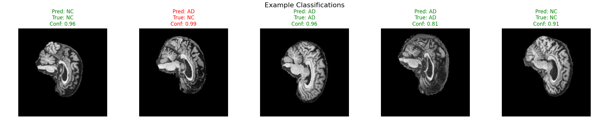
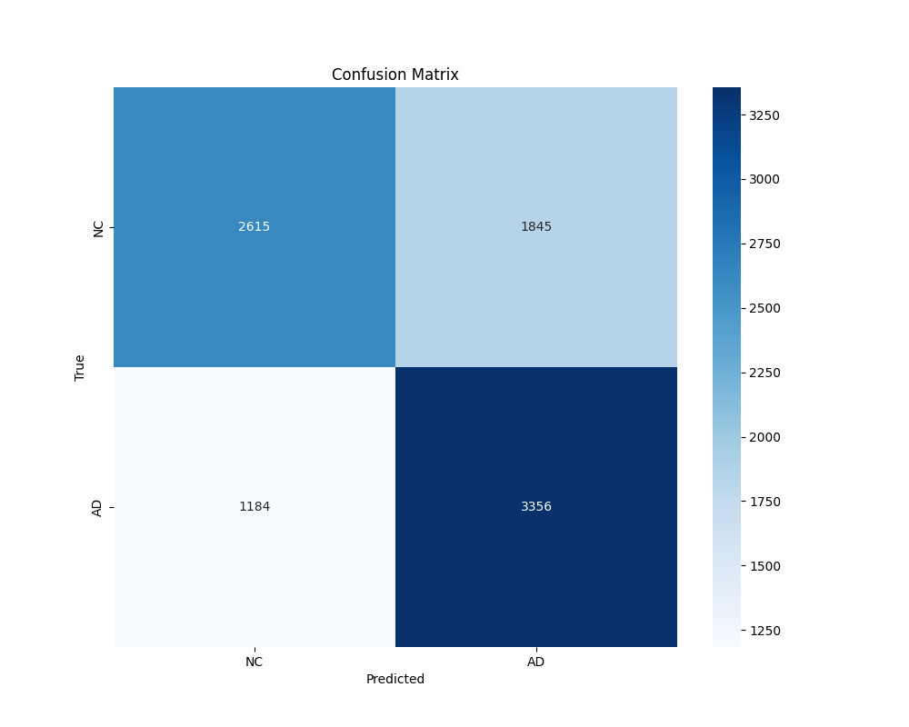
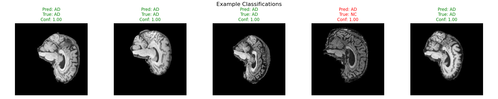
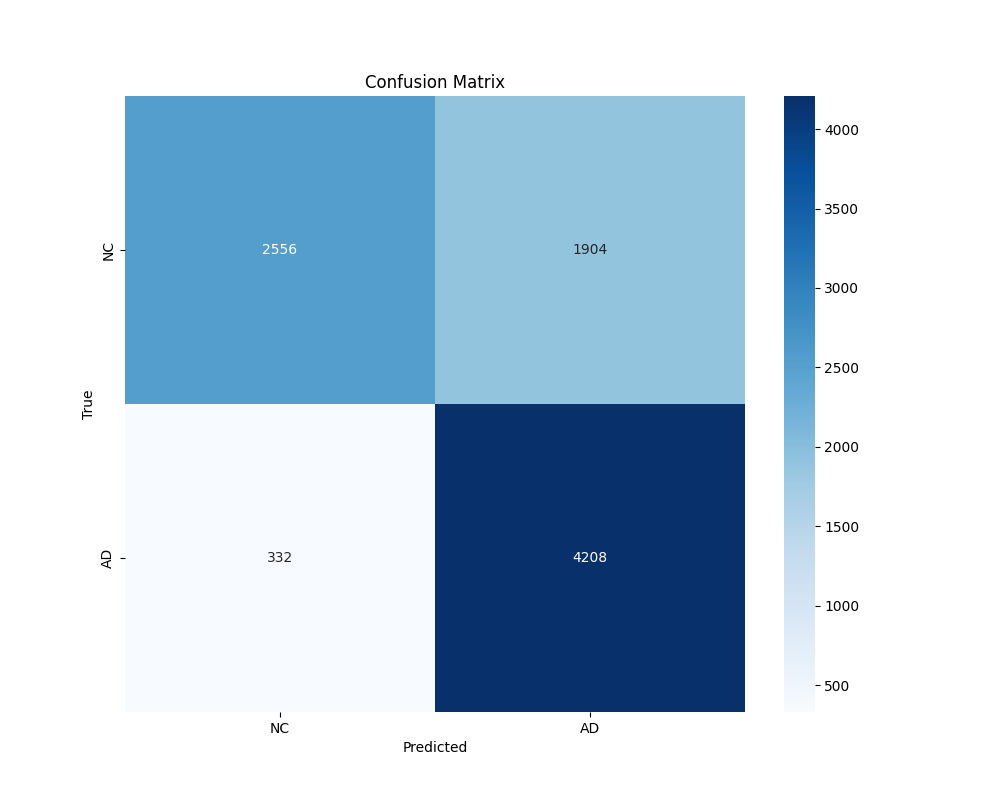

# Alzheimer’s disease Image Classification Task using GFNet
Author: Lok Yee Joey Cheung 

Student ID: 47633542

## Project Overview
This project aims to classify brain images from the Alzheimer's Disease Neuroimaging Initiative (ADNI) dataset into two categories: normal (NC) and Alzheimer's disease (AD) using the Global Filter Network (GFNet). The objective is to understand the use of Transformer model and its effectiveness on image classification. Ultimately, I hope to achieve an accuracy close to 0.8 on the test set. The GFNet architecture is selected for its efficiency and effectiveness in handling image classification tasks using Global Filters.

## Principle of GFNet in Medical Imaging
GFNet is a cutting-edge transformer model that leverage global filter layers to replace self-attention layers in traditional transformer model [1]. It uses Fourier transforms to handle spatial features effectively by converting it to freqeuncy domains. It therefore learns long-term spatial dependencies in images efficiently. Unlike traditional CNNs, which typically depend on local receptive fields, GFNet applies frequency-domain filtering, performing element-wise multiplication between frequency-domain features and the global filter to capture global relationships across an entire image.  The global filtering mechanism allows the model to focus on both fine details and larger structural patterns in brain scans, making it an ideal choice for medical imaging tasks. Its architecture is shown in the below figure. The uses of global features and fourier transform in GFNet reduces the number of parameters and result in faster training times and improved generalization which helps in differentiating the subtle differences between medical images.

Alzheimer's disease is a progressive neurodegenerative disorder that leads to cognitive decline and the dementia symptoms will get worse gradually year by year. Therefore, early and accurate diagnosis is very crucial to identify the cause and utilize effective treatment as early as possible. Traditional models often struggle with the complexity of brain images since minor differences between healthy and diseased brains are hard to capture. This project addresses the challenge of classifying brain images to assist in the diagnosis of Alzheimer's disease using state-of-the-art Transformer model - GFNet. GFNet's ability to leverage global filtering and frequency-domain transformations efficiently process brain images and detect minor differences that are essential to distinguish normal and AD cases. This also provides a valuable tool for clinicians to automate and imrpove efficiency in medical dialogsis in general.


## Usage
### Dependencies
The following Python packages are needed to be installed with specified versions for reproducibility:
  ```
  torch>=2.4.1 
  torchvision>=0.19.1
  numpy>=1.26.3
  scikit-learn>=1.5.2
  matplotlib>=3.9.2
  tqdm>=4.66.5
  pandas>=2.2.3
  pillow>=10.2.0
  seaborn>=0.13.2
  ```
### Directory Structure
```
ADNI_s4763354/
|-- modules.py        # Source code for model components
|-- dataset.py        # Data loader and preprocessing code
|-- train.py          # Code for training, validating, testing, and saving the model
|-- predict.py        # Example usage of the trained model for predictions
|-- README.md         # Project documentation
|-- images/           # Folder for images 
```
### Reproduction
Perform training in `recognition/ADNI_s4763354`: 
```
python train.py  
```
Perform inference in `recognition/ADNI_s4763354`: 
```
python predict.py  
```

(Optional) If you would like to work with transfer learning and fine-tune pretrained model, download the pre-trained [GFNet_H_TI](https://drive.google.com/file/d/1Nrq5sfHD9RklCMl6WkcVrAWI5vSVzwSm/view?usp=sharing) and [GFNet_H_B](https://drive.google.com/file/d/1F900_-yPH7GFYfTt60xn4tu5a926DYL0/view?usp=sharing) and place them in the `ADNI_s4763354/` directory. Then, update the commands in the main function of train.py as follows:
```    
train_and_evaluate(
        train_dir='/home/groups/comp3710/ADNI/AD_NC/train', 
        test_dir='/home/groups/comp3710/ADNI/AD_NC/test',
        pretrained=True, # Set pretrained to be True
        model_name='gfnet_h_b', # Specify the model, choose from modules.py
        pretrained_model_path='gfnet-h-b.pth'  # Specify the path to the pretrained model
    )
```


## Data Pre-processing 

### Dataset
The [ADNI brain dataset](https://adni.loni.usc.edu/) is used. It consists of 2D MRI slices labeled as either normal or Alzheimer's disease. Each 2D image is 256 x 240 pixels and represents one of 20 slices from a MRI scan collection. 

### Preprocessing
For the pre-processing stage, it is carried out in 'dataset.py'. 
1. **Transformations** on training set to ensure model robustness:
   - **Resize**: All images are resized to 224x224 pixels to match the input size required by the GFNet model.
   - **Data Augmentation**: Random horizontal flipping, random rotations, and color jittering by adjusting brightness are used.
   - **Normalization**: Pixel values are normalized to standardize the input. 

   For the validation and test datasets, only resizing and normalization are applied, as no augmentation and shuffling is necessary for evaluation.<br>
 Below shows the transformed image examples: 
 


2. **Train-validation split**: Patient-wise splitting approach is used. Data is split based on unique patient IDs so that all images from the same patient do not appear in both sets. This prevents overfitting. The train-validation ratio is 8:2. 

3. **Train-test split**: The dataset available in Rangpur is already divided into train and test sets, with 21520 and 9000 images respectively.  

4. **(Optional) Balanced Sampling**: Below shows the class distribution of the original training dataset which is slightly imbalanced, with more NC samples than AD samples. To balanace the training set, class weights are first calculated based on the frequency of each class in the training set and a weighted random sampler is used to reduce the overrepresented class (NC) and to slightly increase the representation of the underrepresented class (AD) relative to the total. 
```
Class distribution before balancing:
------------------------------------
  Class 'AD' (Index 0): 10400 samples
  Class 'NC' (Index 1): 11120 samples
Total samples: 21520

Class distribution after balancing:
------------------------------------
  Class 'AD' (Index 0): 8563 samples
  Class 'NC' (Index 1): 8637 samples
Total samples: 17200
```


## Training and Validation
### Approach 1
I initially trained the GFNet model using the [pre-existing GFNet classes](https://github.com/raoyongming/GFNet) on the preprocessed ADNI images. There are two functions to define the model, `GFNet` and `GFNetPyramid`. The `GFNet` function implements the core architecture of the Global Filter Network while GFNetPyramid introduces a pyramid structure that processes features at multiple scales. I used `GFNet` as it has a simplier model architecture which prevents overfitting and is well-suited for small dataset. Here is the model parameters:
```
- Image size: 224x224    #Pixels for input brain scan images.
- Patch size: 16x16      #Image is divided into patches for processing.
- Embedding dim:512      #Define the feature map sizes at different stages.
- Depth: 19              #Number of transformer blocks in each stage
- MLP ratio:4            #A multiplier for the hidden dimension size in the MLP layers
- Normalization layer    #Stabilize training.
- Dropout rates: 0.25    #Prevent overfitting by randomly drop some connections or neurons
```
But I quickly realized that the performance was suboptimal due to the relatively small data size to a Transformer model, reaching 66% test accuracy. Transformer model usually requires a substantial amount of data for robust performance. Initially, my model overfitted with training accuracy around 96.77% but only 78.33% and 57.41% for validation and test accuracy respectively. I adjusted hyperparameters to deal with overfitting as follows. The training and validation accuracy is 83% and 72%, with 66% test accuracy.
```
 Dropout:0.7
 Weight decay: 1e-2
 Learning rates: 1e-4
 Batch Size: 64
 Epochs: Early stopped at 13 epochs whenever the validation loss starts to increase
 optimizer: AdamW          
 scheduler: CosineAnnealingLR    
 loss_criterion: CrossEntropyLoss
 ```
 Figure 1 and 2 show the training loss and accuracy of Approach 1:

<p>
    
    
</p>


### (Optional) Approach 2
While I have already trained my model using pre-existing GFNet model, I would like to compare it with pre-trained models as an additional experiemnt. I applied transfer learning by loading a pretrained GFNet and fine-tuned it on my dataset. I trained the GFNet_H_Ti and GFNet_H_B model. This approach yielded an improvement in test accuracy, reaching over 75%. To address overfitting, I set dropout rate set to 0.5, used CosineAnnealingLR scheduler with 5e-6 learning rate, set weight_decay to 1e-2, applied early stopping and more. However, the results are not favourable. Further adjustment and regularization on overfitting problem is need for such complex pretrained models. 

**Fine-tuned pre-trained gfnet_h_ti model:**

<p>
    
    
</p>


**Fine-tune pretrain GFNet_H_B model:**

<p>
    
    
</p>

## Prediction Results and Analysis

### Approach 1 with GFNet: 



<p style="text-align: center;">
    
</p>


> **Test accuracy: 66.34%**  
> **Recall: 72.9%**

### Approach 2 with Fine-tuned gfnet_h_b model: 



<p style="text-align: center;">
    
</p>


> **Test accuracy: 75%**  
> **Recall: 92.6%**

### Discussion  
In the prediction results of approach 1, even though four of the five randomly chosen predictions correctly identified the slices with high confidence, the recall (TP/(TP+FN)) in the confusion matrix is only 73.9% where the model fails to identify all of the diseased patients. Recall is important as it calculates the number of correctly identifed cases among all the people who actually have Alzheimer's Disease. Missed diagnoses may cause severe consequences since this can delay treatment and care. As for the results of approach 2, the recall reaches 92.6%.  
Based on the above results, we observe that the pre-trained model performs far better than the vanilla model on testing set. However, complex pre-trained models are usually prone to severe overfitting. Large numbers of parameters allows them to easily fit noise and anomalies in the training set, rather than improving generalization.

## References
- [1] Rao, Y., Zhao, W., Zhu, Z., Lu, J., & Zhou, J. (2021). Global filter networks for image classification. Advances in neural information processing systems, 34, 980-993.


