# Alzheimer's Disease Detection using Vision Transformer (ViT)
Yuvraj Fowdar, 47538209.

## Project Overview

This project focuses on using Vision Transformers (ViT) for the detection of Alzheimer's Disease from MRI brain scans, leveraging the ADNI dataset. The goal is to classify brain images into two categories:

- Alzheimer's Disease (AD)
- Healthy (No Alzheimer's)

The Vision Transformer model is utilized to process brain images and make predictions with a target test accuracy of 80%. This project includes dataset preprocessing, augmentation, and the implementation of a Vision Transformer architecture for image classification.


## Usage 
### Repository Structure

- `predict.py`: Contains the code for making predictions using the trained ViT model. Softmax is applied externally for generating probability distributions for predictions. Can either generate classification report, or a  
- `dataset.py`: Handles dataset loading and augmentation techniques. This includes resizing the images to 224x224 and applying normalization based on empirical statistics or ImageNet statistics.
- `modules.py`: Includes the implementation of the Vision Transformer model and the necessary transformer blocks.
- `train.py`: The main training script to run experiments with different configurations such as number of transformer layers and batch size.

```
/
├── dataset.py
├── modules.py
├── train.py
├── predict.py
├── logs/
├── models/
├── plots/
```

### Install
**Set up your environment**:
- Create a virtual environment using venv or conda.
- Install the necessary dependencies:
```bash
pip install -r requirements.txt
```
### Training

Run the following command to train the model, adjusting the hyperparameters and dataset path as needed:

```bash
python train.py --transformer_layers 8 --num_epochs 50 --embedding_dims 256 --mlp_size 1024 --num_heads 8 --exp_name "your_experiment_name" --path "/path/to/dataset"
```
Or a simpler command to use transformer defaults:
```bash
python train.py --exp_name "your_experiment_name" --path "/path/to/dataset"
```

After training, the model, logs, and plots will be saved in the respective directories (`models/`, `logs/`, `plots/`), with names with respect to `--exp_name`. Each run, a single model will be saved to save on space, and this model corresponds to the model that had the highest validation accuracy during training under the name `{exp_name}best_model.pth`.


### Testing
On predict.py, use the following terminal command to test the model and perform one of two actions:

- `--run predict`: Get the test loss/accuracy of the trained model. (Default if --run is not specified).
- `--run brain-viz`: Visualize model predictions and display image grids with predicted labels and probabilities.

Examples:

Assuming there were no changes in model architecture (i.e defaults were used for train.py), 
then to **drive** a model and use it for prediction on batches, use the following: 
```bash
python predict.py --model_path models/best_model.pth
```

If the trained model used different architectures (via --arg lines), the same changes must be put for the prediction.

```bash
python predict.py --model_path models/v10best_model.pth --run predict --num_transformer_layers 16
```
This command loads a model saved as v10best_model.pth (which was trained with 16 transformer layers, and the rest as transformer defaults) and outputs the test loss and accuracy as well as a classification report saved under `/plots`.

Examples are located in Experiments and Results.

For image visualisation:
```bash
python predict.py --model_path models/v10best_model.pth --run brain-viz --num_transformer_layers 16
```
This visualizes the predictions for a batch of test images, displaying both true labels and predicted probabilities (using softmax). 

Example output.
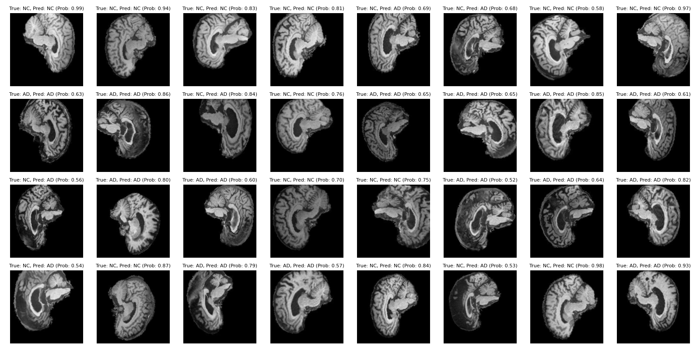


## Vision Transformer Architecture
{INFO ABOUT VIT; CITE THE REFERENCES HERE. ADD IMAGES. YAY.}

Initially developed for natural language processing tasks, transformers have now been successfully applied to vision tasks by treating image patches as tokens, similar to words in a sentence. 
They are competitive against CNNs as transformers have no inductive bias and can learn from patches due to their attention mechanism, although this makes them
data hungry (Ballal, 2023). 
## Preprocessing: Dataset Loading + Augmentation
To ensure optimal performance and prevent data leakage, the dataset is split into training, validation, and test sets. The following preprocessing steps are applied:

1. Dataset Organization
The dataset, sourced from the ADNI database, is structured into two primary categories—Alzheimer’s Disease (AD) and No Alzheimer’s (NC)—for both training and test sets. The directory structure is as follows:
```
ADNI/
├── train/
│   ├── AD/
│   └── NC/
└── test/
    ├── AD/
    └── NC/
```
Each subdirectory (AD and NC) contains brain MRI images that are categorized accordingly.

2. Image Size and Normalization
After experimenting with different data augmentations (no normalisation, only normalisation, and aggressive augmenting + normalising), we found aggressive augmenting to work best.

The original vision transformer uses 16x16 image patches, and as our images are by default 256x256, we resize them to 224x224 pixels. Additionally, normalization is applied based on statistics computed from the training dataset to stabilize the model during training. These statistics include the mean (0.1156) and standard deviation (0.2229) for each RGB channel (in this case, all channels have equivalent statistics as they are greyscale images). Normalization ensures that the pixel values fall within a similar range, which helps the model converge faster.

Mean and standard deviation are computed only on the training dataset to avoid **data leakage** and are then applied consistently across training, validation, and test sets.

3. Data Augmentation
Data augmentation techniques were applied to the training dataset to improve the model’s robustness and generalization by artifically constructing more data for the model to train from. These include:

- Random Horizontal Flip: Randomly flips the image horizontally with a 50% probability.
- Random Rotation: Randomly rotates the image by small angles (up to ±10 degrees).
- Random Resized Crop: Randomly crops the image and resizes it to the target dimensions (224x224), using a scale of 0.8 to 1.0 of the original image size.
- Center Crop: A smaller center crop (224 // 1.2) is applied after resizing.

All these were applied before normalisation. The aggressive data augmentation was also applied on the test set, although whether to do this or only apply normalisation is subject to debate (Edstem #427, Google, Eureka Labs). For our case, we will apply the transformations onto the test set, as this more resembles the data trained on and thus the model should perform better. Ideally, this would not need to be applied as augmentation is meant to help the model generalise but this only occurs if the models are trained for enough epochs (which may not be the case due to resource constraints).

## Experiments and Results

The following experiments were conducted using different configurations of the Vision Transformer (ViT) architecture, varying parameters such as the number of transformer layers, embedding dimensions, MLP size, and other settings. The test accuracy results were recorded for each configuration, however some experiments were not mentioned as they had a model error, ran out of time, or were accidentally overwritten.

Initially, we implemented the Vision Transformer (ViT) based on Akshay Ballal's (2023) blog, using custom modules for the attention heads, MLP blocks, and patch embeddings, with default hyperparameters (number of transformer layers, embedding dimensions, heads, etc..) taken from the ViT paper by Dosovitskiy et al (2020).

As we progressed, we tried substituting PyTorch's default MultiheadAttention layers in v3 (LearnPytorch.io, 2023). However, this approach destabilized our training, leading to poor results (effectively 50% accuracy), likely due to discrepancies in how dropout and normalization were handled within PyTorch’s implementation. v3 demonstrated a drop in accuracy, suggesting that using the pre-built TransformerEncoderLayer might not align well with our custom architecture.

Recognizing this issue, we reverted to Akshay’s original design in v5, but retained the embedding dropout layer (recommended in Appendix B of the ViT paper). This setup marked a significant improvement in performance. Further experimentation with v6 and v7 introduced aggressive data augmentation and a learning rate scheduler (ReduceLROnPlateau). These additions helped stabilize training and improved generalization, with v7 reaching a stable test accuracy of around 66% (see table and v7 graph below).
<p float="left">
  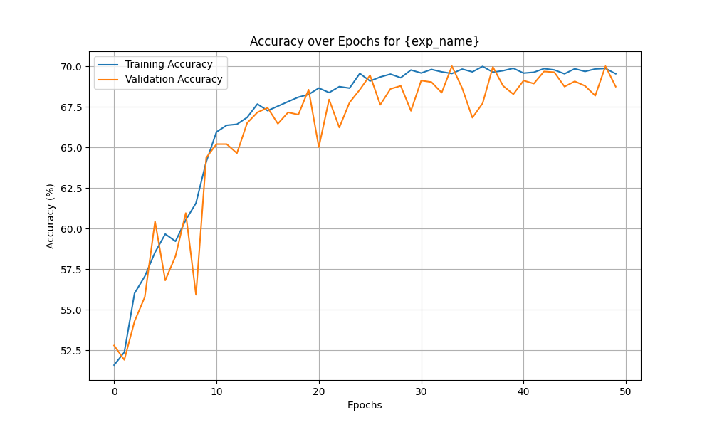
  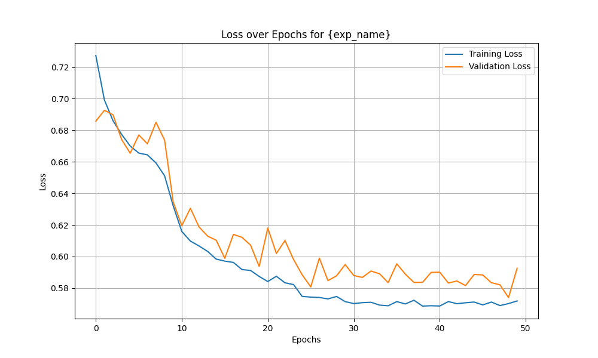 </p>
<small> (Forgive the graph name) </small>.


The scheduler adjusted the learning rate dynamically based on the validation loss, which helped prevent overfitting, while the aggressive transformations forced the model to become more robust to input variations. Subsequent larger models like v10 and v13 showed promising results as well.

The following table summarizes the experiments and test accuracies achieved across various configurations.


| **Version** | **Transformer Layers** | **Embedding Dims** | **MLP Size** | **Num Heads** | **Epochs** | **Batch Size** | **Learning Rate** | **Scheduler** | **Transforms**        | **Test Accuracy** |
|-------------|------------------------|--------------------|--------------|---------------|------------|----------------|-------------------|---------------|-----------------------|-------------------|
| **v0**      | 12                     | 768                | 3072         | 12            | 30         | 32             | 3e-4              | No            | Normalization          | **59.05%**         |
| **v1**      | 12                     | 768                | 3072         | 12            | 50         | 32             | 3e-4              | No            | Normalization          | **51.69%**         |
| **v0_noAug**| 12                     | 768                | 3072         | 12            | 30         | 32             | 3e-4              | No            | No Normalisation        | **52.54%**         |
| **v3**      | 12                     | 768                | 3072         | 12            | 30         | 32             | 3e-4              | No            | Only Normalisation   | **50.40%**         |
| **v4**      | 12                     | 768                | 3072         | 12            | 30         | 32             | 3e-5              | No            | Only Normalisation                   | **49.60%**         |
| **v5**      | 12                     | 768                | 3072         | 12            | 30         | 32             | 3e-4              | No            | Only Normalisation           | **65.73%**         |
| **v6**      | 12                     | 768                | 3072         | 12            | 30         | 32             | 3e-4              | Yes           | Only Normalisation           | **61.54%**         |
| **v7_Aggro**| 12                     | 768                | 3072         | 12            | 30         | 32             | 3e-4              | Yes           | Aggressive Transforms  | **65.79%**         |
| **v11**     | 8                      | 768                | 3072         | 8             | 50         | 32             | 3e-4              | No            | Aggressive Transforms          | **66.59%**         |
| **v13**     | 12                     | 256                | 1024         | 8             | 50         | 32             | 3e-4              | Yes           | Aggressive Transforms           | **66.80%**         |
| **v14**     | 8                      | 256                | 1024         | 8             | 50         | 32             | 3e-4              | Yes           | Aggressive Transforms           | **67.93%**         |
| **v15**     | 12                     | 256                | 1024         | 8             | 100        | 32             | 3e-4              | Yes           | Aggressive Transforms           | **67.28%**         |

Aggressive transforms simply means the current transformations within dataset.py (with image rotation, random cropping, etc.).
#### Examples of experiment results
All plots are located within `/plots`.

v0 Experiment: 
<p float="left">
  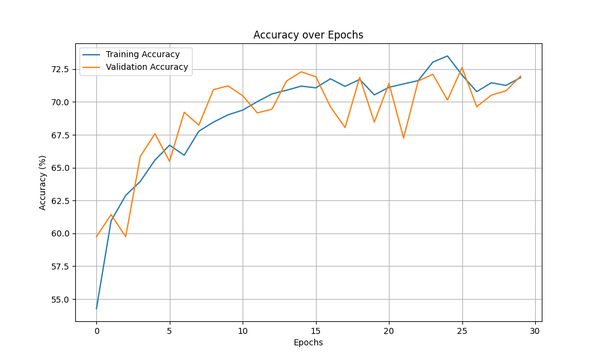
  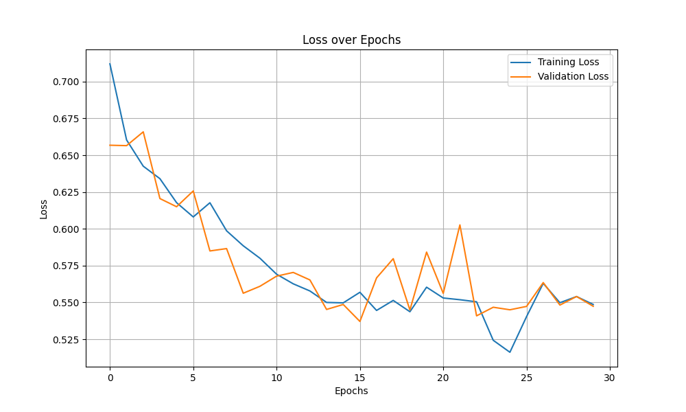
</p>

v3: Changed transformer encoder to be pytorch's default encoderlayer. Added embedding dropout layer as ViT paper has it in Appendix B (Dosovitskiy et al., 2020). Re-implementing normalisation but without other data augmentation.
<p float="left">
  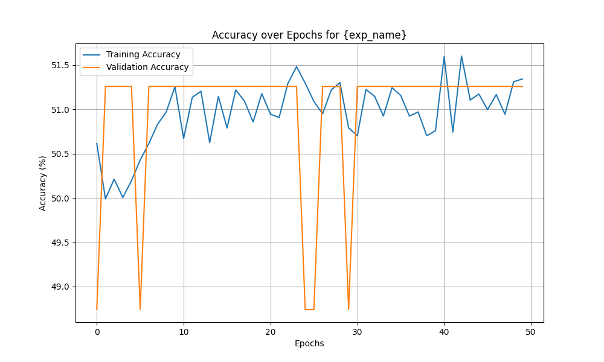
  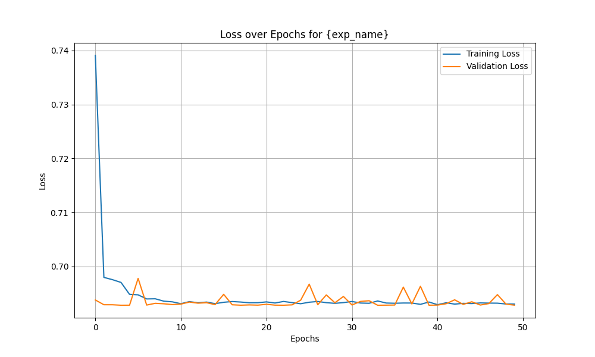
</p>


v14: Seeing as 13 performed well with reducing the complexity of the model, v13 reduces the complexity even more by reducing the number of transformer layers, heads in each layer, nlp size and embedding dims. It also is the best performing model thus far.
<p float="left">
  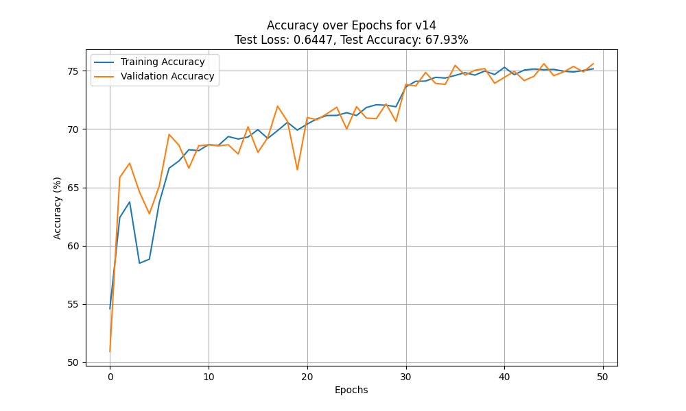
  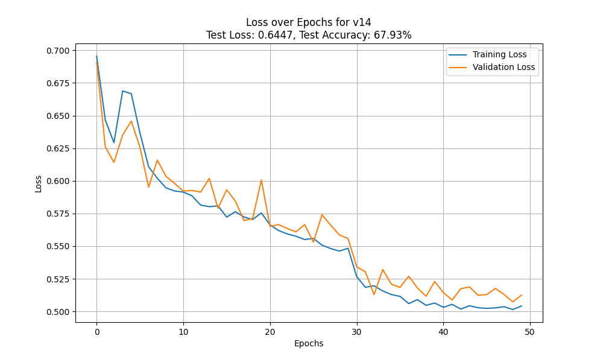
</p>


### Best Model Results
From the test accuracy, we see that our best model was v14 with a test accuracy of 67.93%. When running predict.py for both `predict` and `brain-viz`, we see:

```
              precision    recall  f1-score   support

          AD     0.6939    0.6097    0.6491      4458
          NC     0.6571    0.7356    0.6941      4534

    accuracy                         0.6732      8992
   macro avg     0.6755    0.6726    0.6716      8992
weighted avg     0.6754    0.6732    0.6718      8992
```
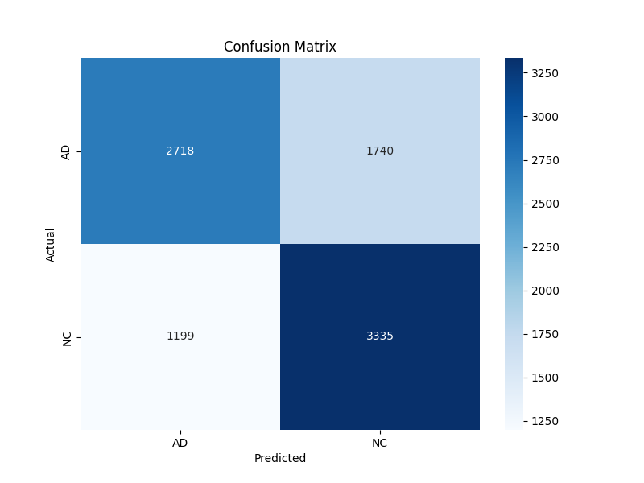.

#### Sample predictions from v14 (best model)


### Future Extensions
For future research, trying out other transformer architectures and different data augmentation styles may lead to better results. GFNets are a promising area, but also, based on some of the loss plots certain models were not actually trained to the asymptote line (see v13 plot below). This suggests that longer training times may result in better accuracies.
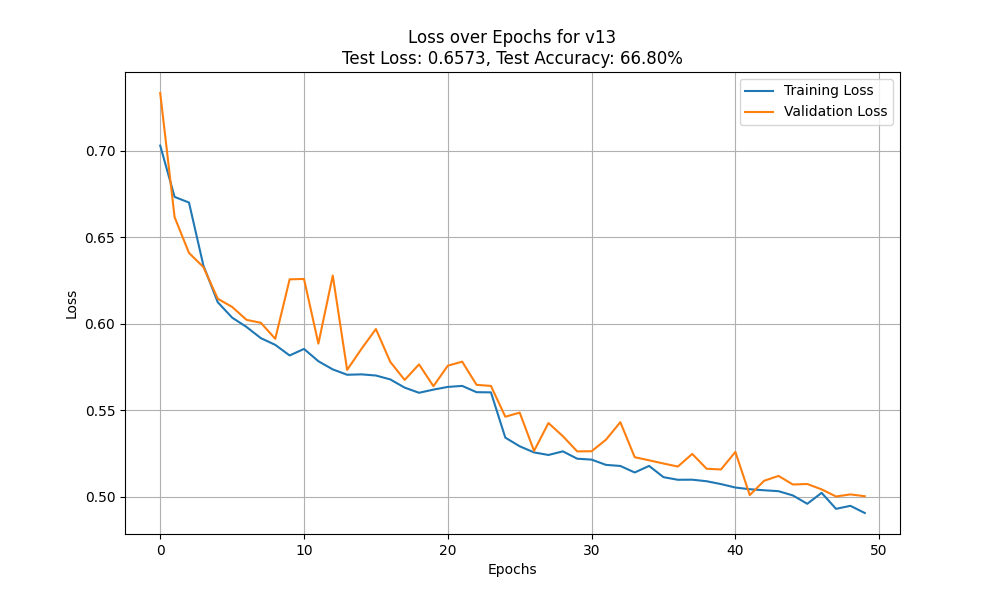
## References

Ballal, A., 2023. Building a Vision Transformer from Scratch in PyTorch, Available at: https://www.akshaymakes.com/blogs/vision-transformer [Accessed 21 October 2024].

Dosovitskiy, A., et. al., 2020. An Image is Worth 16x16 Words: Transformers for Image Recognition at Scale. Available at: https://arxiv.org/pdf/2010.11929.pdf [Accessed 21 October 2024].

Learnpytorch.io, 2023. PyTorch Paper Replicating. Available at: https://www.learnpytorch.io/08_pytorch_paper_replicating/#8-putting-it-all-together-to-create-vit [Accessed 21 October 2024].


Lightning.ai, 2023. Vision Transformer (ViT) - PyTorch Lightning Tutorial. Available at: https://lightning.ai/docs/pytorch/stable/notebooks/course_UvA-DL/11-vision-transformer.html [Accessed 21 October 2024].
