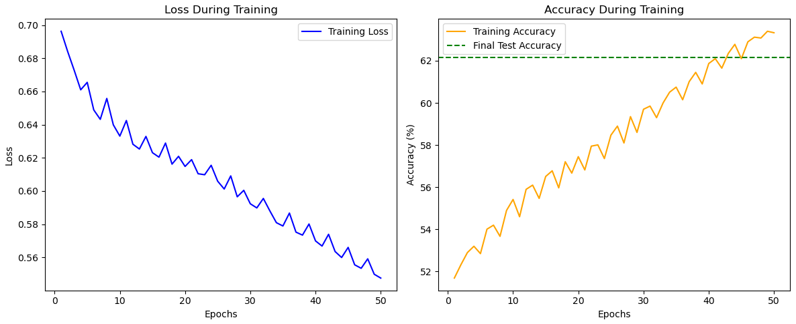

# Alzheimer’s Disease Classification Using Vision Transformer (46991656)

## Description
This project aims to identify Alzheimer’s disease (AD) using brain images from the Alzheimer’s Disease Neuroimaging Initiative (ADNI). Our goal is to distinguish between healthy individuals and those diagnosed with Alzheimer's disease. To achieve this, we use the Vision Transformer, a modern machine learning model known for its ability to analyze images effectively. By training this model, we hope to reach an accuracy of 80% in classifying the images, which can aid in early diagnosis and better treatment options for patients.

<br>

## How It Works
The Vision Transformer model processes brain images by breaking them down into smaller sections, called patches. Each patch is then transformed into a format that the model can understand. We also add a special token to represent the overall image, along with information about where each patch is located.

The model uses a series of layers that work together to recognize patterns and features in the images, which helps it determine whether an image shows a healthy brain or one affected by Alzheimer’s. Finally, the model outputs a prediction based on what it has learned from the images.

An image showing the breakdown of this is underneath. (Source: https://paperswithcode.com/method/vision-transformer)


<br>

## Dependencies
To run this code, ensure you have `Python >= 3.1`, `PyTorch >= 1.9.0`, `torchvision >= 0.10.0`, and `matplotlib >= 3.4.3` installed. To do this, you can use the `pip install` or `conda install` commands.

Ensure that the four files, `train.py`, `modules.py`, `train.py`, and `predict.py`, are all in the same working directory. The `train.py` file has imports from both `dataset.py` and `modules.py`, to access the dataloaders and the vision transformer model. Make sure to update the filepath of the `train_dataset` and `test_dataset` to where the image files are.

Run `train.py` to train the model, and save it inside of the current directory. Once finished, run the `predict.py` file to get the accuracy of the model, ensuring that the name of the saved model is kept consistent between both files.

Note that this project involves some randomised processes (such as random weight initialisation and data shuffling) which may result in slightly different outputs or model performance on each run. Therefore, the behaviour of the model, including accuracy and metrics, may vary.

## Example Usage
The only inputs to the model are the training images and testing images. These are located in the filepaths set up in `dataset.py`, so ensure that you change this based on where your images are located locally.

After running the `train.py` file, it will print out statements of the loss and accuracy corresponding to each epoch, and then run a test on it. Finally, it will save the vision transformer model in the same directory.

```
Running main loop now.
Beginning training now.
Epoch [1/50], Loss: 0.6963, Accuracy: 51.69%
Epoch [2/50], Loss: 0.6841, Accuracy: 52.32%
Epoch [3/50], Loss: 0.6728, Accuracy: 52.90%
Epoch [4/50], Loss: 0.6610, Accuracy: 53.20%
Epoch [5/50], Loss: 0.6655, Accuracy: 52.85%
Epoch [6/50], Loss: 0.6489, Accuracy: 54.01%
Epoch [7/50], Loss: 0.6432, Accuracy: 54.20%
Epoch [8/50], Loss: 0.6558, Accuracy: 53.67%
Epoch [9/50], Loss: 0.6399, Accuracy: 54.90%
Epoch [10/50], Loss: 0.6331, Accuracy: 55.42%
Epoch [11/50], Loss: 0.6425, Accuracy: 54.60%
Epoch [12/50], Loss: 0.6282, Accuracy: 55.90%
Epoch [13/50], Loss: 0.6253, Accuracy: 56.10%
Epoch [14/50], Loss: 0.6329, Accuracy: 55.47%
Epoch [15/50], Loss: 0.6231, Accuracy: 56.51%
Epoch [16/50], Loss: 0.6204, Accuracy: 56.78%
Epoch [17/50], Loss: 0.6289, Accuracy: 55.97%
Epoch [18/50], Loss: 0.6162, Accuracy: 57.21%
Epoch [19/50], Loss: 0.6209, Accuracy: 56.67%
Epoch [20/50], Loss: 0.6148, Accuracy: 57.45%
Epoch [21/50], Loss: 0.6189, Accuracy: 56.82%
Epoch [22/50], Loss: 0.6104, Accuracy: 57.95%
Epoch [23/50], Loss: 0.6098, Accuracy: 58.01%
Epoch [24/50], Loss: 0.6155, Accuracy: 57.36%
Epoch [25/50], Loss: 0.6059, Accuracy: 58.47%
Epoch [26/50], Loss: 0.6012, Accuracy: 58.90%
Epoch [27/50], Loss: 0.6091, Accuracy: 58.10%
Epoch [28/50], Loss: 0.5965, Accuracy: 59.35%
Epoch [29/50], Loss: 0.6004, Accuracy: 58.60%
Epoch [30/50], Loss: 0.5923, Accuracy: 59.70%
Epoch [31/50], Loss: 0.5898, Accuracy: 59.85%
Epoch [32/50], Loss: 0.5955, Accuracy: 59.30%
Epoch [33/50], Loss: 0.5880, Accuracy: 60.00%
Epoch [34/50], Loss: 0.5809, Accuracy: 60.51%
Epoch [35/50], Loss: 0.5789, Accuracy: 60.75%
Epoch [36/50], Loss: 0.5867, Accuracy: 60.15%
Epoch [37/50], Loss: 0.5752, Accuracy: 61.01%
Epoch [38/50], Loss: 0.5734, Accuracy: 61.45%
Epoch [39/50], Loss: 0.5801, Accuracy: 60.90%
Epoch [40/50], Loss: 0.5699, Accuracy: 61.87%
Epoch [41/50], Loss: 0.5668, Accuracy: 62.10%
Epoch [42/50], Loss: 0.5739, Accuracy: 61.65%
Epoch [43/50], Loss: 0.5635, Accuracy: 62.35%
Epoch [44/50], Loss: 0.5599, Accuracy: 62.78%
Epoch [45/50], Loss: 0.5660, Accuracy: 62.10%
Epoch [46/50], Loss: 0.5555, Accuracy: 62.90%
Epoch [47/50], Loss: 0.5534, Accuracy: 63.12%
Epoch [48/50], Loss: 0.5591, Accuracy: 63.08%
Epoch [49/50], Loss: 0.5498, Accuracy: 63.40%
Epoch [50/50], Loss: 0.5475, Accuracy: 63.33%
Begin testing now.
Test Loss: 0.5592, Test Accuracy: 62.17%
Model saved with Test Accuracy: 62.17%
```

Unfortunately the model was not able to get up to the desired 80%, but it was able to achieve an accuracy close to 2/3.

An output from the training is a measure of the loss and accuracy.



<br>

## Data Pre-processing

In this project, the training data went under many pre-processing steps to enhance the model performance and generalisation.

All the images were resized to 224x224 pixels to maintain a consistent input size for the Vision Transformer model. Data augmentation was applied as well, introducing random horizontal flips, random rotations, and colour disfigurations. The images were also normalised using the mean and standard deviation of the ImageNet dataset, to ensure that pixel values are scaled to a standard range and improve convergence during training.

The testing set only used resizing and normalisation, since the data augmentation could lead to ambiguous evaluation metrics. As two separate directories were provided for training and testing, the split between them was quite obvious, but in cases where all the data is combined, roughly 80% of the data should be used for training and the other 20% for testing. This helps mitigate issues like overfitting, by confirming that the model's performance is validated on a separate dataset.

<br>

## Future Recommendations
While the model did not achieve the target of 80%, there are a few things that can be done to help improve the accuracy. For instance, experimenting with different hyperparameters, such as adjusting the learning rate, batch size, and dropout rates, may lead to better model performance. Additionally, exploring alternative model architectures could provide a more robust feature extraction capability. Another approach could be to increase the size of the training dataset by incorporating more diverse samples, which may help the model generalise better to unseen data. Lastly, implementing techniques like cross-validation could provide a more accurate assessment of the model’s performance and guide further improvements.

