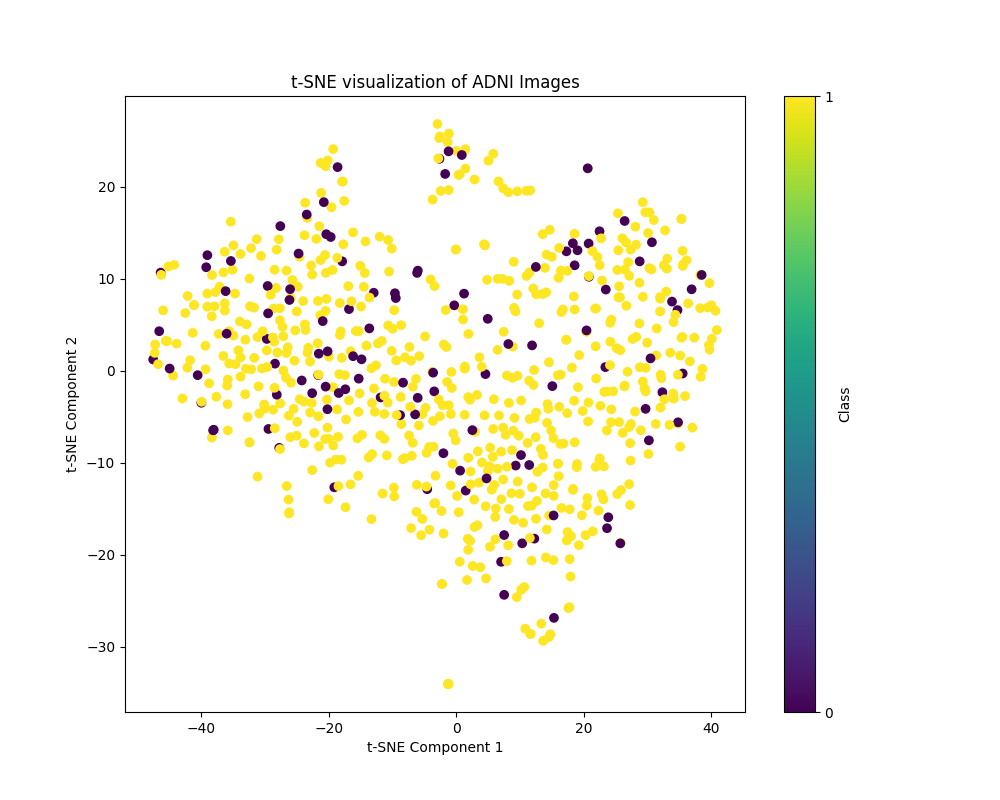

# Denoising Diffusion on ADNI Dataset
Denoising diffusion probabilistic model is a generative deep learning model that 
can create data, images in this case. This is done by gradually adding noise to the source 
or training images and then attempting to learn how to remove noise through a machine
learning model. The diffusion model consists of two elements - diffusion process and reverse process.[^1]
Diffusion models are capable of creating high quality generated images as well as
diverse samples at the expense of slower sampling time[^5]. Compared with other generative models,
GANs generally output high quality images and are fast and sampling, but have low diversity.
VAEs have fast sampling and high diversity, but suffer from lower quality samples, mostly due
to blurring.

This project implements a denoising diffusion model using PyTorch to analyze the Alzheimer’s 
Disease Neuroimaging Initiative (ADNI) dataset, which includes images from patients diagnosed with 
Alzheimer’s Disease (AD) and cognitively normal (CN) individuals. The goal is to enhance image quality 
by reducing noise, thereby improving the accuracy of subsequent analyses, such as classification or segmentation tasks. 
The diffusion process iteratively refines the images, effectively recovering meaningful features that may be obscured by
noise, which is crucial for reliable diagnostic tools in Alzheimer's research.

## Requirements
This project requires several Python packages to function properly. 
It is assumed that torch with gpu and cuda is used.
Below is a list of the required packages along with their specified versions:

- **einops**: `0.8.0` - A flexible and powerful library for manipulating tensor shapes.
- **matplotlib**: `3.9.2` - A plotting library for creating static, animated, and interactive visualizations in Python.
- **scikit-learn**: `1.5.2` - A library for machine learning that provides simple and efficient tools for data mining and data analysis.
- **timm**: `1.0.10` - A library that provides PyTorch image models, including many popular pre-trained models.
- **torch**: `2.4.0` - The core library for PyTorch, a deep learning framework.
- **torchvision**: `0.19.0` - A library that provides computer vision functionalities in PyTorch, including datasets, model architectures, and image transformations.
- **tqdm**: `4.66.5` - A fast, extensible progress bar for Python.

### Installation

To install the required packages, you can use the following command:

```bash
pip install -r requirements.txt
```
## Theory & Implementation
### Diffusion process
The diffusion process or forward process is a Markov chain that adds noise to the data. The
noise is samples from a Gaussian distribution. The Markov chain is a stochastic process that 
only depends on probability and the last state. The transition from noise states at some time $`t`$ can be expressed as
```math
q(\mathbf{x}_t | \mathbf{x}_{t-1})=\mathcal{N}(\mathbf{x}_t;\sqrt{1-\beta_t}x_{t-1};\beta_t\mathbf{I}).
```
The forward process variances $`\beta_t`$ are fixed to be small so only a small amount of noise is added each time.
So $`q(\mathbf{x}_{1:T}|\mathbf{x}_0)`$ is the diffusion process. We can make use of reparametrisation to introduce
$`\alpha_t=1-\beta_t`$ and $`\bar{\alpha}=\prod_{s=1}^t\alpha_s`$ to get
```math
q(\mathbf{x}_t|\mathbf{x}_0)=\mathcal{N}(\mathbf{x}_t;\sqrt{\bar\alpha}\mathbf{x}_0,(1-\bar{\alpha}_t)\mathbf{I}).
```

### Reverse process
The goal of denoising diffusion is to sample images from noise to generate a new image. 
So the reverse process utilises another deep learning model to denoise the images. Diffusion
models are latent variables of the form 
```math
p_\theta(\mathbf{x}_\theta)=\int p_\theta(\mathbf{x}_{0:T})\ d\mathbf{x}_{1:T}.
```
So the reverse process is concerned with the joint distribution $`p_\theta(\mathbf{x}_{0:T})`$.

### Training algorithm
To train a denoising diffusion model, a training data point is sampled at some random time step $`t\in[1,T]`$.
Noise is sampled and the diffusion process step is computed.
This results in an image with some amount of noise and the algorithm has a record of the amount of noise
added. The algorithm calls on the implemented machine learning model to estimate the value of
noise added to this image. The loss between the estimated noise and real noise can be
calculated by using mean-squared error loss as KL divergence approximation. 
This loss can then be used to optimise the model's parameters.


### Sampling
With a model that can successfully predict the amount of noise at some time step of the forward process,
then the reverse process can be applied. Sampling consists of starting with a random image at time $`T`$
and then going through the reverse process to $`t=0`$ where the result is a generated sample. At each
time step $`t-1`$, a small amount of noise is added to keep the process stable.


### Parameters
The number of time steps $`T`$ is a hyperparameter that must be pre-decided. Here, we will set $`T=1000`$
to match the authors of the original denoising diffusion paper. 

We are left with a seemingly large number of parameters still to choose like $`\beta, \alpha, \bar{\alpha}`$.
Because $`\alpha`$ and $`\bar\alpha`$ arise from reparametrisation of $`\beta`$, in reality we only
have one parameter to be concerned with. In essence, $`\beta`$ dictates the amount of noise to be added
at each step. This means that the performance of the algorithm is highly dependent on a good choice for $`\beta`$.
Once again, we will match the original paper by setting $`\beta_1=10^{-4}`$ and $`\beta_T=0.02`$ with all
intermediate $`\beta_i`$ set to increase linearly. 

There are still many remaining parameters and hyperparameters left in the model to choose and justify.
Many of these values were set to match the original paper: the learning rate $`\varepsilon=2\times10^{-5}`$, 
the dropout probability was set to $`0.1`$. We also made use of the Adam optimiser. The algorithm also utilises
exponential moving average which was set to $`0.9999`$. EMA offers smooth model updates by applying more weight to
recent data points as opposed to older. The values from the original paper were matched because the original
denoising diffusion model was trained on multiple well-known datasets such as CIFAR10. These datasets
can be classified as quite complex and so the values are likely to work with the ADNI data at hand. 

Some parameters we set, however, did diverge from the original paper. This was usually for reasons of 
computation time and complexity, particularly during the training process. The input images were scaled down
to $`64\times64`$ which resulted in output samples of the same size. A (reduced) batch size of 28 images was used.
We also specified 32 groups and 8 heads for attention. Finally, we trained for 100 epochs.

### UNet
Much like the authors of the original paper, the UNet model will be used as the deep learning model to
predict the noise for the reverse process. The UNet was chosen because it was originally developed
and optimised for biomedical image segmentation which fits with the ADNI dataset[^2]. The UNet used resembles
closely the UNet implemented in the original paper. 

The UNet model saw massive gains in performance when self-attention and Transformer sinusoidal position embeddings
were utilised[^3]. These two factors meant that the UNet was able to process and interpret
information effectively. The sinusoidal embeddings gave the UNet additional positional 
information by adding sine and cosine curves of differing frequencies. The attention is useful
for analysing interactions and relationships in features that can capture complex structures and
patterns. The attention block works by representing the input as a vector and outputting query, key,
value vectors and attention scores and a weighted sum.

The residual blocks in each layer of the UNet match the original paper by using group normalisation,
ReLU activation, dropout, $`3\times 3`$ same convolution and a skip-connection. The scheduler handles
the linearly increasing for $`\beta`$ values and returns both the $`\beta`$ and $`\alpha`$ result.

### Data Pre-processing
There is minimal data pre-processing required. The input training images were downsized to 
$`64\times64`$ dimensions as previously explained. Random horizontal flips of the training images 
were also used in an attempt to improve the generated sample quality, as the original DDPM paper
found. Finally, the images were normalised and then converted to a tensor. 

## Results
### Training
An example batch of training images is displayed below.


$`t`$-distributed stochastic neighbor embeddings is a non-linear dimensionality reduction technique
used to visualise high-dimensional data[^4]. $`t`$-SNE measures similarity between data points by joint
probabilities and then attempts to minimise the KL-divergence between the joint probabilities
of the low-dimensional embedding and the high-dimensional data. Here we have performed dimensionality reduction
down to just two dimensions. We have two classes of data: 0 - AD and 1 - CN. The embedding plot shows
a high overlap between the two classes which indicates similarity between the classes.
AD data in particular is fairly sparsely populated. This shows that the relationship between CN
and AD is extremely complex, and it would be difficult to classify and make predictions between the two classes
at least for these two dimensions.


*t-SNE embedding plot of ADNI images*

### Sampling
The loss function after 100 epochs looks like:


We show a plot of 9 generated images. These are not very photo-realistic at this stage,
but it is a starting point to go from.


In addition, we can show the reverse process in action for some of the samples:


[^1]: Denoising Diffusion Probabilistic Models https://arxiv.org/abs/1706.03762
[^2]: U-Net: Convolutional Networks for Biomedical Image Segmentation https://arxiv.org/abs/1505.04597
[^3]: Attention Is All You Need https://arxiv.org/abs/1706.03762
[^4]: Visualizing Data using t-SNE https://jmlr.org/papers/volume9/vandermaaten08a/vandermaaten08a.pdf
[^5]: Denoising Diffusion Model from scratch using PyTorch https://medium.com/@mickael.boillaud/denoising-diffusion-model-from-scratch-using-pytorch-658805d293b4