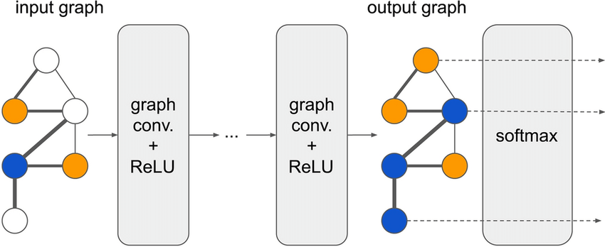
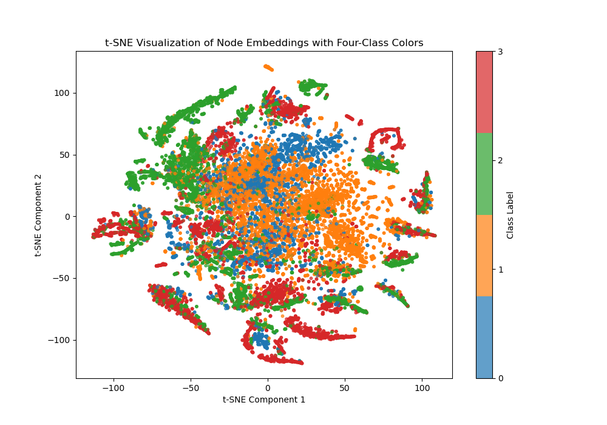

# GCN On Facebook Dataset (47801725)

## Overview 
 Graph Convolutional Networks (GCNs) are used for node classification by combining both labeled and unlabeled data within a graph to categorize nodes. These networks learn a function that maps each node's features and its topological strucutre within the graph to a corresponding label. Training involves using the known labels of a subset of nodes to refine the classification function, while also taking into account the  feature similarities with neighboring nodes. This method helps the model generalize and accurately predict the labels of nodes that lack labels, making it particularly useful when labeled data is limited.

In this report, we apply a GCN to the partially processed facebook dataset, where nodes represent official Facebook pages and edges denote mutual likes between these pages, in this specific dataset we have 4 categories and our task is to classify each node into a specfic category. 

## Description of the model 
This model is a Graph Convolutional Network (GCN) with three hidden layers and a customizable output layer for node classification on graph data. It consists of:

GCN Layers: Three GCNConv layers, each followed by ReLU activation and dropout for regularization. These layers aggregate information from neighboring nodes to capture local graph structure.
Dropout: Applied after each layer to prevent overfitting, with a configurable dropout rate.
Output Layer: A final GCN layer for classification, with output dimensions matching the number of classes.
This architecture enables flexible learning on node-based datasets by processing input features based on graph connectivity.

## Data Preprocessing 
This code preprocesses graph data for training with PyTorch Geometric. It loads data from a .npz file, extracting edges, features, and labels, and converts them to PyTorch tensors. Node features are standardized using scikit-learn's StandardScaler to improve model performance. A Data object is created, storing the processed features, edge connections, and labels. Finally, RandomNodeSplit is used to generate train, validation, and test masks, splitting nodes into subsets for training and evaluation.
## Training And Validation with Visualization

### t-SNE Plot Before Training

- **Clustering**: The untrained model shows no clear separation among classes. Nodes are scattered with overlapping clusters, indicating limited class distinction.
- **Class Distribution**: Nodes of different classes (red, green, blue, and orange) are interspersed, suggesting that the initial embeddings lack meaningful information for classification.

### t-SNE Plot After Training

- **Clustering and Separation**: After training, the embeddings form distinct clusters, with each class occupying separate regions, indicating that the GCN has learned to differentiate classes based on features and graph structure.
- **Class Distinction**: Nodes of the same class are cohesive with minimal overlap, showcasing that the trained GCN has effectively grouped similar nodes, capturing the underlying graph structure.

### Accuracy and Loss Plots

#### Validation and Test Accuracy Plot

- **Initial Training Phase**: The accuracy improves significantly within the first 25 epochs, indicating efficient learning.
- **Plateau Phase**: After reaching around 90% accuracy, the values stabilize, with minor fluctuations. Validation and test accuracies converge closely, indicating good generalization without overfitting.

#### Training and Validation Loss Plot

- **Initial Learning**: Both training and validation losses drop rapidly within the first 25 epochs, showing effective learning.
- **Convergence**: The losses approach low values with minimal discrepancies, indicating effective learning with minimal overfitting. Slight end-of-training fluctuations suggest a good balance between learning rate and model stability.

## Files Included 
- **`data.py`**: Contains the data loader, transforming the Facebook dataset into a `torch_geometric` dataset.
- **`modules.py`**: Contains the GCN model architecture.
- **`train.py`**: Script for training, validating, testing, and saving the model.
- **`predict.py`**: Provides example usage of the trained model.
- **`README.md`**: This documentation file.
- **`images/`**: Folder containing images used in the README.

## Conclusion 

The Graph Convolutional Network (GCN) model achieved a notable **best accuracy of 94.97%** on the Facebook dataset, demonstrating its strong generalization capability. The accuracy plot reveals rapid improvement in the initial training epochs, followed by a smooth convergence as the model refines its predictions. This steady convergence, accompanied by closely aligned training and validation losses, indicates effective learning with minimal overfitting.

The transformation of node embeddings observed in the t-SNE visualizations illustrates the GCN’s ability to learn meaningful representations. Before training, nodes from different classes were intermixed without clear separation. However, post-training, the t-SNE plot shows distinct clusters for each class, underscoring the model’s effectiveness in capturing both feature and structural information within the graph. This high accuracy, along with clear embedding separation and stable convergence, demonstrates the model’s robustness and effectiveness for complex node classification in graph-structured data.

## Dependencies 
- **Python**: 3.8
- **PyTorch**: 2.0.0+cpu
- **scikit-learn**: 1.3.2
- **scipy**: 1.11.3
- **matplotlib**: 3.8.0
- **numpy**: 1.24.1
## References 

1. **Kipf, T. N., & Welling, M. (2017).** [*Semi-Supervised Classification with Graph Convolutional Networks*](https://arxiv.org/abs/1609.02907). *arXiv preprint arXiv:1609.02907.*  
   This foundational paper introduces the Graph Convolutional Network (GCN) model and its application to semi-supervised learning on graph-structured data.

2. **Hamilton, W., Ying, Z., & Leskovec, J. (2017).** [*Inductive Representation Learning on Large Graphs*](https://papers.nips.cc/paper/2017/hash/5dd9db5e033da9c6fb5ba83c7a7ebea9-Abstract.html). *Advances in Neural Information Processing Systems.*  
   This paper presents GraphSAGE, an approach to learning node embeddings in large graphs, introducing new techniques for efficient GCN training and generalization.
