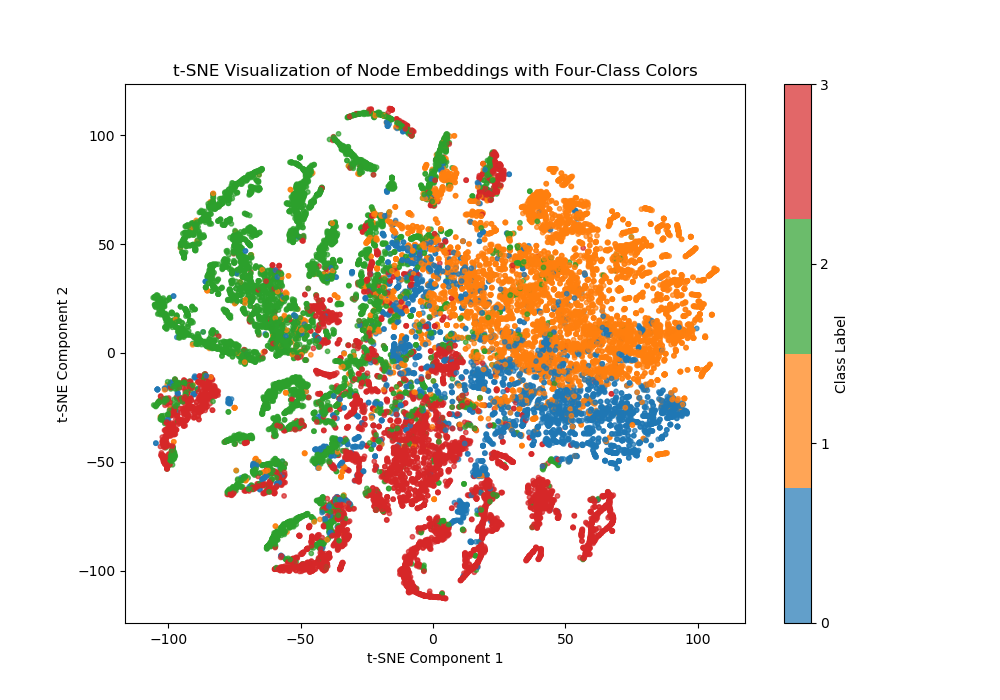

# GCN On Facebook Dataset (47801725)

## Overview 
 Graph Convolutional Networks (GCNs) are used for node classification by combining both labeled and unlabeled data within a graph to categorize nodes. These networks learn a function that maps each node's features and its topological strucutre within the graph to a corresponding label. Training involves using the known labels of a subset of nodes to refine the classification function, while also taking into account the  feature similarities with neighboring nodes. This method helps the model generalize and accurately predict the labels of nodes that lack labels, making it particularly useful when labeled data is limited.

In this report, we apply a GCN to the partially processed facebook dataset, where nodes represent official Facebook pages and edges denote mutual likes between these pages, in this specific dataset we have 4 categories and our task is to classify each node into a specfic category. 

## Description of the model 
This model is a Graph Convolutional Network (GCN) with three hidden layers and a customizable output layer for node classification on graph data. It consists of:

GCN Layers: Three GCNConv layers, each followed by ReLU activation and dropout for regularization. These layers aggregate information from neighboring nodes to capture local graph structure.
Dropout: Applied after each layer to prevent overfitting, with a configurable dropout rate.
Output Layer: A final GCN layer for classification, with output dimensions matching the number of classes.
This architecture enables flexible learning on node-based datasets by processing input features based on graph connectivity.

## Data Preprocessing 
This code preprocesses graph data for training with PyTorch Geometric. It loads data from a .npz file, extracting edges, features, and labels, and converts them to PyTorch tensors. Node features are standardized using scikit-learn's StandardScaler to improve model performance. A Data object is created, storing the processed features, edge connections, and labels. Finally, RandomNodeSplit is used to generate train, validation, and test masks, splitting nodes into subsets for training and evaluation.
## Training And Validation with Visualization

t-SNE Plot (Before Training)
Clustering: In the untrained model, there is no clear separation among the different classes. The nodes are scattered across the plot with overlapping clusters, showing limited class distinction.

Class Distribution: Nodes of different classes (colored in red, green, blue, and orange) are interspersed, indicating that the initial embeddings do not contain meaningful information for classifying the nodes correctly.

t-SNE Plot (After Training)
Clustering and Separation: After training, the embeddings exhibit clear clusters, with each class forming more distinct regions. This indicates that the GCN has learned to differentiate the classes based on node features and graph structure.

Class Distinction: The nodes of the same class are much more cohesive, with less overlap between different colors. This shows that the trained GCN has successfully grouped similar nodes together, capturing the underlying structure and relationships in the graph.

Validation and Test Accuracy Plot:

The model's accuracy improves significantly during the initial epochs, with rapid gains in performance within the first 25 epochs. This quick rise suggests that the model is effectively learning from the data.
After reaching around 90% accuracy, the accuracy values start to plateau and stabilize, with minor fluctuations. Both the validation and test accuracies converge closely, indicating that the model generalizes well without overfitting.
This stability towards the end of training suggests that the model has learned the underlying patterns effectively, achieving consistent high performance across both validation and test sets.

raining and Validation Loss Plot:

Similar to the accuracy plot, the training and validation losses drop quickly in the first 25 epochs, showing that the model learns efficiently during the initial phase.
Both losses approach low values as the training progresses, converging closely with minimal discrepancies. This convergence indicates effective learning with minimal overfitting, as the validation loss follows the training loss closely.
Slight fluctuations towards the end of training are observed, but they remain minimal, indicating a good balance between learning rate and model stability.

## Files Included 
Dataset.py: Containing the data loader for transforming the Facebook dataset into torch_geometric Dataset.
modules.py: Contains the GAN model
train.py: Contains the source code for training, validating, testing and saving your model.
predict.py: Shows example usage of your trained model
README.md: This file provides an overview of the project, the dataset, training details, discussions and the results obtained.
Images: Images used in the README.md

## Conclusion 

## Dependencies 
Python 3.8 
Pytorch: 2.0.0+cpu
scikit-learn 1.3.2 
scipy 1.11.3 
matplotlib 3.8.0 
numpy 1.24.1
## References 
