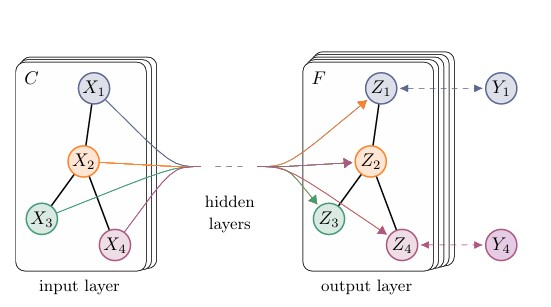
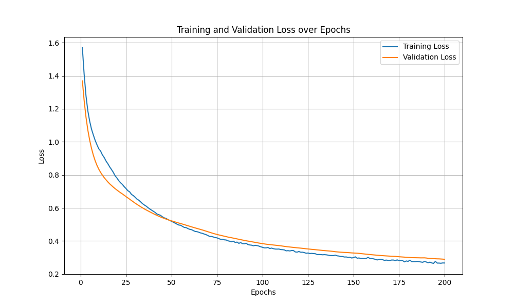
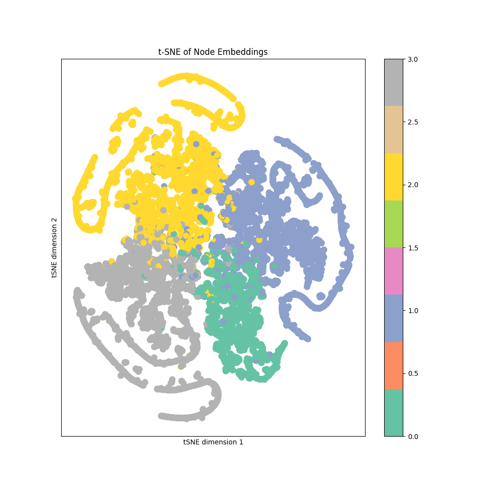

# Semi supervised multi-class node classification of Facebook Large Page-Page Network dataset using GCN
## Dataset Overview 
The Facebook Large Page - Page Network Dataset was used in this project. The dataset is a page-page graph of verified facebook sites. Nodes extracted from the site descriptions that the page owners created to summarize the purpose of the site represent the official facebook pages whereas the edges represent the links between them. The sites belong to four categories namely Politicians , Governmental Organisations, Television Shows and Companies. The dataset has 22,470 nodes and 171,002 edges. A preprocessed version of the dataset facebook.npz was used for the multiclass classification that contained features in the form of 128 dimensional vectors. 

## Algorithm Used 
This project utilises Graph Convolutional Network (GCN) to perform the semi supervised multiclass classicification of the facebook sites into the above mentioned categories. A t-SNE plot is also plotted to visualise the node embeddings learned by the model in two dimensions. 

## The Problem that it solves 
Graphical data is very insighful becuase it has the ability to capture the inherent structural relationships in the data and in hence widely used in various real-world application domains such social media analysis, medical imaging of molecular structures and transportation system. Traditional CNN's fail to work on graphical data that is where GCN's come in. The identification of classes in the facebook data using GCN can provide great insights into consumer behaviour like help in providing targetted recommendations to customers based on usage history etc.

## How it works 
GCN works by learning fatures by aggregating information from the neighbouring nodes. Each layer in the GCN performs convolution and updates the representation of a node based on its features as well as the features of the neighbours it is connected to. This project utilised [PyTorch Geometric GCN model](https://pytorch-geometric.readthedocs.io/en/latest/generated/torch_geometric.nn.models.GCN.html) to build a two layer GCN based on [arXiv:1609.02907 ](https://arxiv.org/pdf/1609.02907) as shown in the image below 


## Description of Architecture 
The model itself consists of two GCN layers defined using GCNConv. The first layer takes in the node features and the edges as the input and performs convolution to update the feature nodes. Batch normalisation was applied after this layer to help stabalise the training process. ReLu activation was also applied to introduce non lineraity. After the first layer a dropout layer was also added to prevent overfitting. The second and final layer takes in the output of the first layer as input applies further agrregation from the neighbours and produces the final node embeddings used for the classification of the sites and for plotting the t-SNE plot.

## Data pre processing steps 
The features, edges and target numpy vectors from facebook.npz file are loaded to tensors to ensure compatibility with the GCNlayers. The data was also split into training, validation and test sets using boolean tensors to define the indices of points belonging to each set. 

## Dependencies 

```
torch:2.5.0+cu121
torch_geometric:2.6.1
numpy:1.26.4
matplotlib:3.8.0 
scikit-learn:1.3.1
```

## Design choices 
### Data Splits 
Various combinations of data splits were tried as follows: 

```
Data split    Test Accuracy
60:20:20      0.9248
70:15:15      0.93
80:10:10      0.9332
```
The 80:10:10 split was chosen as having more training data can help expose the algorithm to more information about the graph structure and the neigbouring nodes information. The 10% validation and testing sets provide sufficient data for testing performance as facebook dataset is substantial in size. 

## Results 
The design successfully achieved an accuracy of 93.37% on the test set. The training and validation losses are shown in the figure below over 200 epochs. The loses significantly decrease from 1.4 to around 0.1 over the first 150 epochs then the plot platues and there isn't much improvement. To counter this early stopping could be implemented. Also there is a small consistent gap between the validation loss and the training loss indicating slight overfitting further hyperparameter tuning and l2 regularisation can be used to further reduce the gap. Overall, the model is generalising well. 


The scatter plot below presents the tSNE node embeddings of the model in two dimensions. The colours corresponding to labels 0, 1, 2 and 3 represent the four classes in the Facebook Dataset. 



## Conclusion 

## References 
Articles read to gain understanding of GCN and for ReadMe description: 
[Graph Convolutional Networks (GCN) Explained At High Level](https://towardsai.net/p/l/graph-convolutional-networks-gcn-explained-at-high-level)
[A Comprehensive Introduction to Graph Neural Networks (GNNs)](https://www.datacamp.com/tutorial/comprehensive-introduction-graph-neural-networks-gnns-tutorial)

The model architecture and tSNE visualisation is based on code from [A Comprehensive Introduction to Graph Neural Networks (GNNs)](https://www.datacamp.com/tutorial/comprehensive-introduction-graph-neural-networks-gnns-tutorial)

and uses the prebuilt [Pytorch Geometric GCN model for the layers](https://pytorch-geometric.readthedocs.io/en/latest/generated/torch_geometric.nn.models.GCN.html)

The data preprocessing code is inspired from [pytorch-geometric example](https://github.com/pyg-team/pytorch_geometric/blob/master/torch_geometric/utils/mask.py#L41)

The training and testing loops are inspired and adapted from code at [pytorch-gcn.py](https://github.com/pyg-team/pytorch_geometric/blob/master/examples/gcn.py#L81)
