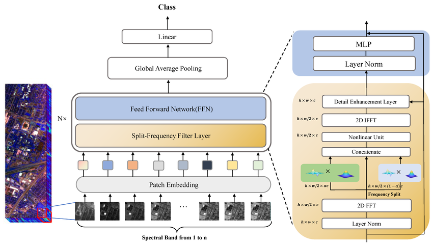

# GFNet for ADNI Brain Data

## Description
A Global Filter Network (GFNet) is a type of deep learning architecture used in computer vision. A **Fourier Transform** is applied to the input data resulting in operation in the **frequency domain**. This enables the use of global filtering operations, which make the network more efficient at handelling larger scale patterns. Instead of using localised filters (as with CNNs), a **Global Filter** is implemented which spans the entire input space. This allows the processing of infomation globaly without requiring deeper convolutional layers or attention mechanisms. These traits prove to be suitible for use in the task of classifying and diagnosing Alzheimer's from brain scans in the ADNI dataset.


Visualisation of GFNet ([ResearchGate, 2023](https://www.researchgate.net/figure/An-overview-of-the-split-frequency-filter-network-Our-network-structure-based-on-GFNet_fig1_372975394))

## Dependencies
The following dependencies are required: m
* torch >= 1.8.0
* torchvision

*Note:* To use the required `rffnt` and `irfftn` function from PyTorch, verion 1.8.0 or greater is required.

*Note:* The results generated from this model may differ between runs as the filters are set randomly. With the same hyperparamters, similar results could be achieved.

## Example Model - Training

### Inputs
These are the parameters specified for the model:
```
GFNet(embed_dim=384, img_size=224, patch_size=16, in_chans=3, mlp_ratio=4, depth=4, num_classes=1000)
```
*Note:* These parameters are the defaults for the GFNet.

### Outputs
[Example Model Output](readme_support/train_output.txt)

## Example Model - Prediction
*Not yet implemented*

### Inputs
*Not yet implemented*

### Outputs
*Not yet implemented*

## Pre-Processing
The data was already split into a test and train set so no splitting of the data was required.

The images were resized to 224x224 to match the standard for GFNet.

## References
[1] “An overview of the split-frequency filter network.” ResearchGate, 2023. https://www.researchgate.net/figure/An-overview-of-the-split-frequency-filter-network-Our-network-structure-based-on-GFNet_fig1_372975394

‌[2] “External-Attention-pytorch/gfnet.py” bianxs, 2024. http://111.229.202.238:1118/bianxs/External-Attention-pytorch/src/commit/789e3a17dd393007369525d308fb056293078d09/model/attention/gfnet.py