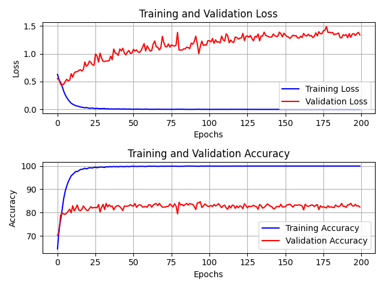

# Classifying Alzheimer's Disease with a Vision Transformer

As the life expectancy of humans across the world rise, the chances of Alzheimer's Disease have also increased, putting an extra burden on doctors and specialists. The advent of AI has brought many new methods to assist with diagnoses. This repository contains the code used to train one of the latest vision transformers, known as the GFNet, to identify Alzheimer's Disease in 2D slices of MRI brain scans. The data used comes from the [ADNI dataset](https://adni.loni.usc.edu/), which is split into two classes: AD (Alzheimer's Disease) and NC (Normal Control). The model architecture is based on the innovative work of Rao, et al [1].

## The Global Filter Network (GFNet)
In a typical vision transformer, an image is broken up into smaller patches, representing the tokens that are fed into the transformer. A self-attention block then seeks to learn the relationship between all the patches, in a way that is free from inductive biases. Traditional methods like convolutional neural networks (CNNs) often contained spatial biases, a product of the convolution operation, making them less generalisable. While vision transformers are effective at learning the true distribution without inductive biases, the self-attention block is computationally expensive, running at $O(n^2)$ complexity.

The Global Filter Network improves this upon this. The self-attention layer is replaced with the global filter layer, which includes a Fast Fourier transform to convert the patches to the frequency domain. A learnable filter with weights across different frequencies is multiplied to the result, and finally an inverse Fourier Transform is used to return it to the spatial domain. The filter can be thought of as emphasising relevant features in the frequency domain, and attenuating other less relevant features. This layer is summarised in the pseudocode shown below:
```
X = rfft2(x, dim=(1, 2))
X_tilde = X * K
x = irfft2(X_tilde, dim=(1, 2))
```
All of this can be thought of as the mixing of tokens that is normally seen in the self-attention layer in vision transformers.

Because a Fast Fourier Transform is used to convert to the frequency domain, the algorithmic complexity decreases from $O(n^2)$ to $O(n\log(n))$, significantly speeding up training and also allowing for higher resolutions (i.e., more patches). 

The typical features associated with vision transformers like dense linear layers for classification are applied afterwards. The overall architecture of the Global Filter Network can be seen in the diagram below.


## Dependencies
| Dependency | Version |
|------------|---------|
| torch      | latest  |
| torchvision| latest  |
| timm       | latest  |
| scikit_learn| latest |
| Pillow     | latest  |
| numpy      | latest  |
| matplotlib | latest  |
| pandas     | latest  |

## Usage

### Files
This repository contains the following files:
- `modules.py`: This file contains the source code for the GFNet model. It is largely based on the code written by Rao., et al. [[2]](https://github.com/raoyongming/GFNet/blob/master/gfnet.py)
- `dataset.py`: This file contains the data loader for the ADNI dataset. It also performs pre-processing on the dataset, detailed [here](#pre-processing).
- `train.py`: This file contains the code used to train, validate and test the GFNet model. The best model is also saved to be used in inference in desired. Relevant plots are also generated here.
- `predict.py`: This file contains the code used to run inference on the trained model on unseen test data.
- `utils.py`: This file contains utility functions useful across the multiple files. Specifically, functions to get the current device and also dataset root.


### Running the Algorithm
1. Clone the repository:
```
git clone https://github.com/Kevin-Gu-2022-UQ/PatternAnalysis-2024.git
cd PatternAnalysis-2024/recognition/GFNet-4743888
```

2. Download the [dataset](https://adni.loni.usc.edu/), ensuring it matches the structure shown above.

3. Setup the environment. To quickly install all relevant dependencies, run the following command.
```
python -m pip install -r requirements.txt
```

4. Train the model by running the following command:
```
python train.py
```
This will train the model on 210 epochs. Every time the model improves in accuracy, it will be saved to `model_checkpoint.pth`, which can be used with `predict.py` to obtain a classification accuracy on the test set. 

5. Run inference on test dataset:
```
python predict.py
```
This will print the test accuracy based on the ADNI test set.


## Dataset
The downloaded ADNI dataset follows the directory structure below:
```
│AD_NC/
├──test/
│  ├── AD
│  │   ├── 1003730_100.jpeg
│  │   ├── 1003730_101.jpeg
│  │   ├── ......
│  ├── NC
│  │   ├── 1182968_100.jpeg
│  │   ├── 1182968_101.jpeg
│  │   ├── ......
├──train/
│  │   ├── 218391_78.jpeg
│  │   ├── 218391_79.jpeg
│  │   ├── ......
│  ├── NC
│  │   ├── 1000359_100.jpeg
│  │   ├── 1000359_101.jpeg
│  │   ├── ......
```
The files are named as `patientID_sliceID.jpeg`, where `patientID` represents brains belonging to the same patient and `sliceID` represents the 2D slice number of a 3D MRI brain scan. 

### Data Split
The ADNI dataset is already split into two sets for training and testing. Since a validation set was not provided, a portion of the training data was used for validation; specifically, 10% of the images in the provided train set was used. This split gives as much data for training as possible, improving upon its accuracy and generalisability.

The training data contained multiple slices of the same brain of patients.
To ensure no data leakage between the training and validation sets, the data had to be split on a patient level. This was done by looking at the names of the files, extracting the `patientID`, and assigning patients to either the training or validation set. 

After this, another split had to be done to ensure the equivalent distribution of classes in the training and validation set. This gives the model a better chance to learn the difference between the two classes. After performing all of the above splits, the validation set contained a roughly equal mix of 1120 and 1040 images for the AD and NC classes respectively. For the training set, the NC class contained 10000 images, while the AD class contained 9360.

### Pre-processing
Pre-processing was then performed on the data before training. Augmentation was necessary as the ADNI dataset is not particularly large, and generally for deep learning models, the more data there is, the better the outcome. The following transformations were done on the training data:
1. The images were centre cropped to 224 x 224, to align with the suggested sizes proposed by Rao., et al. [1]. 
2. Random vertical flips were added to the data. This helps the model be more generalisable, improving upon its accuracy on unseen data.
3. Gaussian noise was added to the images. Again, this helps with generalisability, but it also represents something that occurs in real life. Practical signals like those from MRIs are will always have some degree of noise associated with it.
4. Finally, the data was also normalised. A simple script (not in repository) was used to estimate the mean and standard deviation of the ADNI dataset. The mean was found to be  ~0.1156 and the standard deviation ~0.2199.

Note: The augmentation techniques applied above only applied to the training set. The validation and test sets only had the centre crop and normalisation applied.

After the pre-processing was complete, the data was loaded into a `DataLoader` object. This allowed for the efficient batch loading and preprocessing of the data. 


## Inputs
The following images show some examples of input images fed into the model.
#### Example Input for Brain with Alzheimer's Disease

#### Example Input for Brain without Alzheimer's Disease


## Training
### Learning Rate Scheduler
The `ReduceLROnPlateau` learning rate scheduler from Pytorch was used to adjust the learning rate depending on the validation loss. Starting at a learning rate of 0.00001, when the validation loss plateaued, the learning rate was multiplied by a factor of 0.6, slowly decreasing it as it got closer to the minimum.

### Training and Validation Loss and Accuracy Plots

The model was trained for 210 epochs. The maximum validation accuracy from training was **82.7%**, which is impressive, as it was based on unseen data. From the plots, it appears the validation accuracy has somewhat plateaued, however, training the model for longer may yield higher accuracies. Due to limitations with compute resources, this was not achieved. 

## Results
After training, the model was tested on the ADNI test dataset. This contained 4460 images of AD classes, and 4540 images of NC classes. It was found from running `predict.py` that the accuracy of the model tested on the unseen test set was **62.4%**. 

To improve this, some of the data from the test set could have been allocated to training, exposing the model to more variation. 


# References
[1] Y. Rao, W. Zhao, Z. Zhu, J. Lu, J, Zhou. (2021, October). "Global Filter Networks for Image Classification." [Online]. Available: https://arxiv.org/pdf/2107.00645

[2] Y. Rao, W. Zhao, Z. Zhu, J. Lu, J, Zhou. (2021, December. 7). *GFNet* [Online]. Available: https://github.com/raoyongming/GFNet