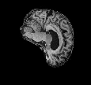
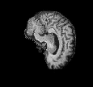
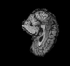
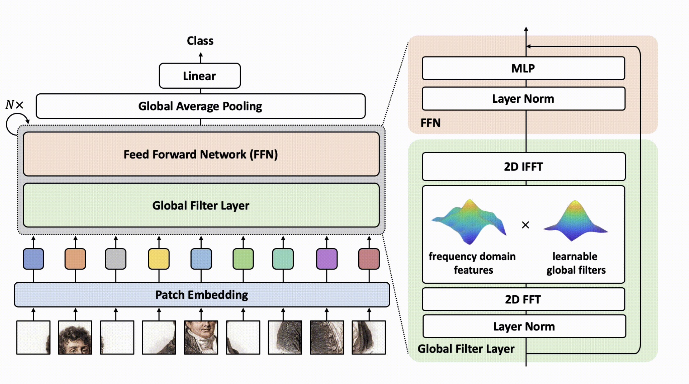
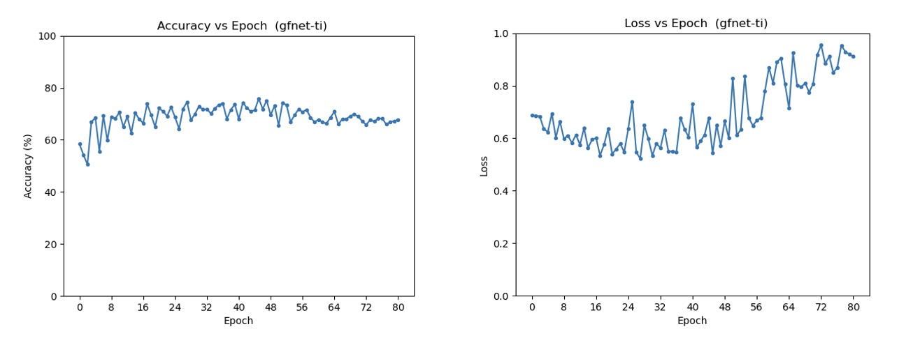
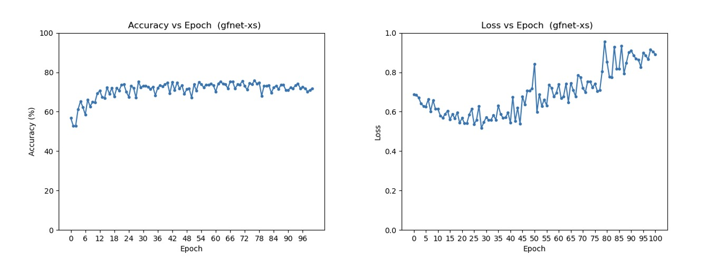
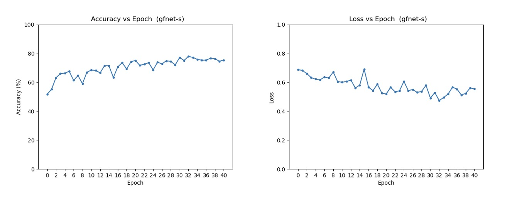
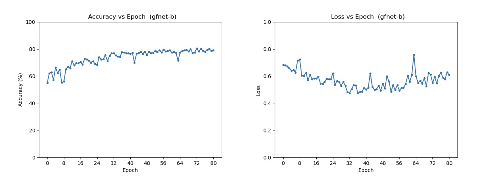
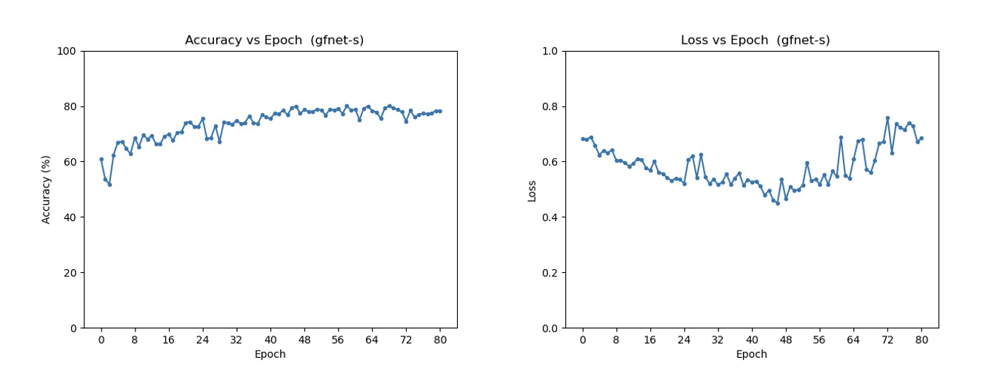
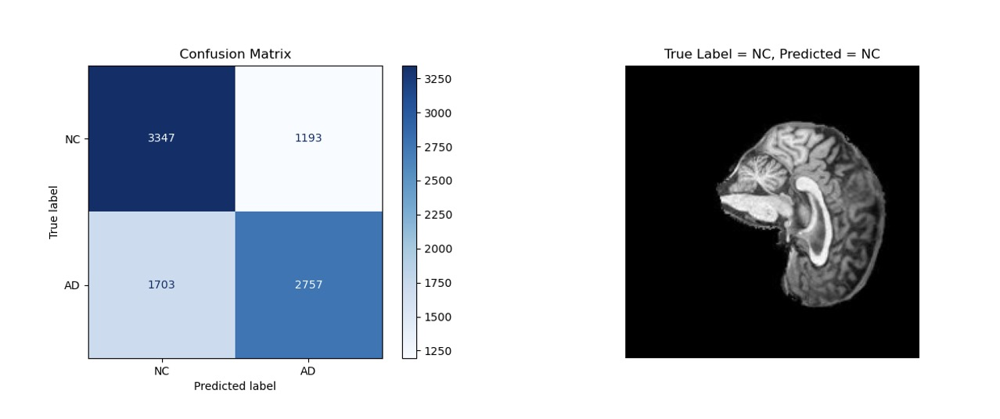

# GFNet-ADNI
This repository contains the code for training a custom-made **GFNet** [1] model used to identify Alzheimer's disease in 2D sliced MRI brain scans. The model was trained on the Alzheimer's Disease Neuroimaging Initiative (ADNI) dataset, which contains a number of sliced MRI brain scan images categorised into Normal Control (NC) and Alzheimer's Disease (AD) classes. The model architecture is based on GFNet, an adapted vision transformer with global filtering designed to efficiently extract spatial patterns from images for classification.

  

## The GFNet Algorithm
GFNet is a sophisticated neural network architecture that replaces the self-attention layers found in traditional vision transformers with global filters operating in the frequency domain. This approach allows GFNet to efficiently and effectively capture both local and global image features.



A key innovation of GFNet is its use of the Fast Fourier Transform (FFT) to perform global filtering. The network first applies a 2D discrete Fourier transform (DFT) to the spatial features of the input images, transforming them into the frequency domain. Within this domain, learnable global filters are applied via element-wise multiplication, allowing the network to capture spatial dependencies on a global scale. After the filtering is complete, the inverse 2D Fourier transform (IFFT) returns the processed features to the spatial domain. By leveraging the FFT, GFNet reduces the computational complexity to log-linear (O(L log L)), in contrast to the quadratic complexity (O(L²)) characteristic of traditional self-attention mechanisms. This makes GFNet highly efficient while retaining the ability to model both long-range and short-range interactions within the data.

## Custom model dependencies
- Python 3.11.5
- torch>=2.4.1
- torchvision>=0.19.1
- timm>=1.0.10
- Pillow>=8.2.0
- scikit-learn>=0.24.2
- matplotlib>=3.4.2

### Development and testing environment
This project was developed on an Apple Macbook Pro with 32 GB of RAM and an M1 Max Chip. All device calls were implemented in a platform-agnostic manner, while CUDA-specific modifications from the original GFNet codebase were retained.

## Dataset
The dataset utilised in this project is a [pre-processed](https://filesender.aarnet.edu.au/?s=download&token=a2baeb2d-4b19-45cc-b0fb-ab8df33a1a24) version of the Alzheimer's Disease Neuroimaging Initiative (ADNI) dataset. The ADNI dataset contains MRI scans contributed longitudinally by over 2,500 participants from across the U.S. and Canada. These scans are classified into two main categories:

* Alzheimer's Disease (AD)
* Normal Control (NC)   

The pre-processed ADNI dataset contained 30,520 images and was obtained with the following structure:   
```
AD_NC/
   ├── train/        
   │   ├── AD/
   │   └── NC/
   ├── test/
       ├── AD/
       └── NC/
```
where the train and test split was approximately 70/30. The AD and NC classes within train and test were split roughly 50/50.

A validation dataset was also created by randomly removing 10% of the images from the
training set resulting in the following dataset structure:
```
data/
   ├── train/
   │   ├── AD/
   │   └── NC/
   ├── val/
   │   ├── AD/
   │   └── NC/
   └── test/
       ├── AD/
       └── NC/
```

### Data pipeline
To use the ADNI dataset a custom PyTorch dataset class was created for loading images and applying any necessary transformations such as resizing, normalisation, and data augmentation.

The follow preprocessing techniques were used for all datasets:
- image resizing to 224x224 (as specified in the GFNet paper)
- data normalisation (based on each dataset's mean and standard deviation)

Data augmentation, applied only to the training set to improve model generalisability, included:
- Random resizing and cropping
- Random sharpness adjustments
- Random horizontal flipping


## To use this model:
1. Clone the repository:
```
git clone https://github.com/shakes76/PatternAnalysis-2024
cd PatternAnalysis-2024/recognition/GFNet-48336813
```

2. Download dataset:

Download the [pre-processed](https://filesender.aarnet.edu.au/?s=download&token=a2baeb2d-4b19-45cc-b0fb-ab8df33a1a24) ADNI dataset.

3. Ensure the following folder structure:
```
GFNet-48336813/
             ├──dataset.py
             ├──modules.py
             ├──train.py
             ├──predict.py
             ├──utils.py
             ├──README.md
             ├──resources/
             ├──outputs/
             ├──plots/
             ├──data/
                ├── test/
                │   ├── AD/
                │   └── NC/
                ├── train/
                │   ├── AD/
                │   └── NC/
                └── val/
                    ├── AD/
                    └── NC/
```

4. Train the Model:

```
python train.py
```
This will train the custom **GFNet** model on the ADNI dataset and save the best model to outputs/checkpoint_best.pth. During training for each epoch a summary of model statistics is printed as a single line in outputs/log.txt. Training loss and accuracy plots are saved in the plots/ directory.

4. Predict Disease:

```
python predict.py
```
This will use the best model from the previous training iteration against the test dataset and print the accuracy of the model and produce and save a confusion matrix. Then a single prediction is made by the model on one image selected at random from the test dataset. This image is saved to outputs with its true class label and the model's predicted class label.   

## Results
Several pre-configured versions of the GFNet model were tested, including:

| Configuration | embed_dim  | Depth  |
|---------------|------------|------- |
| GFNet-ti      | 256        | 12     |
| GFNet-xs      | 384        | 12     |
| GFNet-s       | 384        | 19     |
| GFNet-b       | 512        | 19     |
These configurations differ in two key parameters: embedding dimension and depth, which influence the model's complexity, capacity, and training time. For each configuration, the following hyperparameters were used:

* Optimizer = adamw
* Epochs >= 40
* Batch size = 64
* Learning rate = 0.0005
* Learning rate scheduler = cosine
* Dropout = 0.0

For each of these training runs the following accuracy and loss plots were generated:

### GFNet-ti
Max training accuracy reached: **75.84%**   
Test accuracy: **62.23%**   


### GFNet-xs
Max training accuracy reached: **75.79%**   
Testing accuracy: **63.91%**   


### GFNet-s
Max training accuracy reached: **77.93%**   
Test accuracy: **67.94%**   


### GFNet-b
Max training accuracy reached: **80.30%**   
Testing accuracy: **67.70%**   
  

We observed that GFNet-b achieved the highest training accuracy (80.30%), but GFNet-s produced the best test accuracy at 67.94%. This suggests that the larger model may not generalise as well. Additionally, loss plots showed an upward trend in loss after approximately 40 epochs, prompting modifications to GFNet-s.   

### GFNet-s 2.0
To address the increase in loss, we modified the GFNet-s model by introducing a 10% dropout rate, reducing the batch size to 32, and adjusting the weight decay interval to 20. The results for this modified model are as follows:   

Max training accuracy reached: **80.11%**   
Testing accuracy: **70.82%**   


**Confusion Matrix and a Predicted Image**   



We can see that the modified gfnet-s model did improve on test accuracy, achieving 70.82%. However, during training it was observed that the loss was getting worse after about 48 epochs. A confusion matrix was created after the model was tested and we can see that it correctly classified NC (3347) quite a bit more than AD (2757). From a medical point of view the most critical area is False-Negatives (incorrectly identifying people with a condition as healthy) and in this case there were 1703 AD images classified as NC which is more than the False-Positives.

## Future work
Future improvements could include training the model for more epochs—300 is typical for transformer architectures. Additionally, experimenting with more advanced data augmentation techniques and learning rate schedules may further enhance performance. While the GFNet algorithm performed well, there is still room for improvement, particularly in generalisation.

## Acknowledgements
[1] Y. Rao, W. Zhao, Z. Zhu, J. Lu, and J. Zhou, “Global Filter Networks for Image Classification,” Oct. 26, 2021, arXiv: arXiv:2107.00645. Accessed: Oct. 16, 2024. [Online]. Available: http://arxiv.org/abs/2107.00645


