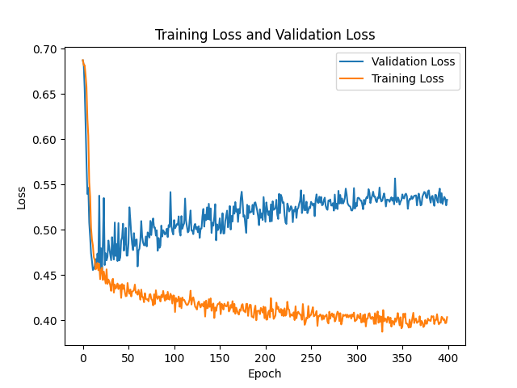

# Alzheimer's Disease Classification using GFNet

## Project Overview
This project tackles the classification of Alzheimer's Disease (AD) and Normal Control (NC) using MRI brain images from the ADNI dataset. Leveraging the Global Filter Network (GFNet), a cutting-edge vision transformer model architecture, a model was trained to distinguish between images of brains affected by Alzheimer's and those without. This model is specifically optimized to capture global and local features in the frequency domain, making it well-suited for medical image analysis.

## GFNet Introduction
The Global Filter Network (GFNet) is an efficient neural architecture that substitutes the self-attention mechanism in vision transformers with a Global Filter Layer, which operates in the frequency domain using fast Fourier transforms. This approach allows GFNet to capture long-range spatial dependencies with log-linear computational complexity, making it more efficient for high-resolution images. By leveraging frequency domain features with learnable global filters, GFNet offers faster processing and reduced computational load, potentially outperforming traditional transformers in speed and resource use. GFNet is computationally efficient, making it an ideal choice for high-resolution image classification tasks, trained on medium / limited hardware.

An animation of the structure and function of the GFNet (taken from a paper done by Rao et al, 2021) can be found below.


## Project Structure
- `dataset.py`: Data loading and pre-processing script for ADNI data.
- `modules.py`: Contains the GFNet architecture and related modules.
- `train.py`: Script to train the GFNet model on the ADNI dataset, logging metrics and saving checkpoints.
- `predict.py`: Inference script to evaluate model performance on the test set.
- `utils.py`: Helper functions, including data visualization and device management.

## Dataset and Directory Structure
The ADNI dataset should follow this structure:
```
AD_NC/
├── train/
│   ├── AD/
│   └── NC/
└── test/
    ├── AD/
    └── NC/
```
The dataset is organized with separate directories for training and testing, each containing "AD" (Alzheimer’s Disease) and "NC" (Normal Control) subdirectories.

### Example input images from datasets

 - Example patient image with Alzeimers disease (`388206_78.jpeg`)


 - Example patient image without Alzeimers disease (`1182968_94.jpeg`)


## Data Pre-processing
This code splits data by subject ID to ensure that no single patient's data appears in both the training and validation sets, preventing data leakage and improving model generalization. First, it extracts unique subject IDs from the file names, which contain identifiers. It then uses `train_test_split` to separate subjects into training and validation groups. Paths and labels are filtered according to the assigned group, creating separate datasets and data loaders for training and validation. This approach helps maintain subject-wise independence between the splits.

Data pre-processing and augmentation were performed in `dataset.py`:
1. **Resizing**: Images resized to 224x224 pixels.
2. **Normalization**: Standardization with mean and standard deviation derived from the dataset.

## Training
Training was conducted for 400 epochs with an 80-20 split between training and validation sets. Hyperparameters were tuned to improve classification accuracy and include:
- **Batch Size**: 32
- **Learning Rate**: 0.0005
- **Optimizer**: AdamW
- **Scheduler**: CosineLRScheduler

### Command to Run Training
```bash
python train.py --output_dir logs/gfnet-adni-xs --batch-size 32 --epochs 50 --data-path < path-to-adni-dataset >
```

### Model Checkpoints and Logging
The `train.py` script logs metrics after each epoch, saves checkpoints of the best-performing model, and generates a `log.txt` file containing epoch-wise metrics.

### Command to Run Inference
```bash
python predict.py
```

## Evaluation and Results
After training, the model achieved a validation accuracy of approximately 78%. Evaluation on the test set using `predict.py` yielded the following results:

### Performance Plots
- **Validation Accuracy Plot**:


  
- **Training and Validation Loss Plot**:



The model exhibited stable convergence, though there is some room for improvement in validation performance. Further fine-tuning of hyperparameters or extending the training period could enhance accuracy.

### Test Set Accuracy

The now pre-trained model was run through predict.py, and received a score of roughly 64% on the test set. 

## Dependency and Environment Setup
To reproduce this project, install the following dependencies:
- `python`: 3.12.7
- `torch`: 2.4.1
- `timm`: 1.0.9
- `numpy`: 1.26.4
- `matplotlib`: 3.9.2

## Conclusion
This project demonstrates the effectiveness of GFNet for medical image classification, achieving satisfactory results on a challenging dataset. The model shows promise in assisting early Alzheimer's diagnosis by automating the analysis of MRI scans.

## References
- raoyongming/GFNet: [NeurIPS 2021] [T-PAMI] Global Filter Networks for Image Classification. (n.d.). Retrieved October 27, 2024, from https://github.com/raoyongming/GFNet/tree/master
- Yongming Rao, Wenliang Zhao, Zheng Zhu, Jiwen Lu, & Jie Zhou. (n.d.). GFNet. Retrieved October 27, 2024, from https://gfnet.ivg-research.xyz/

