# Classifying Alzheimer’s Disease Using DeiT (Small) on the ADNI Dataset

**Author:** Masham Egul Siddiqui (s4744343)

---

## Project Overview

This project aims to classify Alzheimer's disease using the ADNI brain MRI dataset. By leveraging the capabilities of Vision Transformers (ViT) [[1](https://arxiv.org/abs/2012.12877)] and recent innovations such as DeiT (Data-efficient Image Transformer), we address the challenge of differentiating between Normal Controls (NC) and Alzheimer's Disease (AD) with an accuracy goal of at least 80% on the test set.

The main model selected for this project is DeiT Small, a compact variant of Data-efficient Image Transformer (DeiT), pretrained on ImageNet. DeiT is particularly effective in working with ADNI datasets due to its two specialised tokens: the class token and the distillation token.

The class token plays a crucial role by gathering information from various image patches to make a final prediction. Meanwhile, the distillation token allows DeiT to learn from an additional "teacher" model during training. This distillation process enhances the model’s data efficiency, meaning it can achieve high accuracy without needing a huge amount of labelled data—a significant advantage given the limited availability of Alzheimer’s MRI scans.

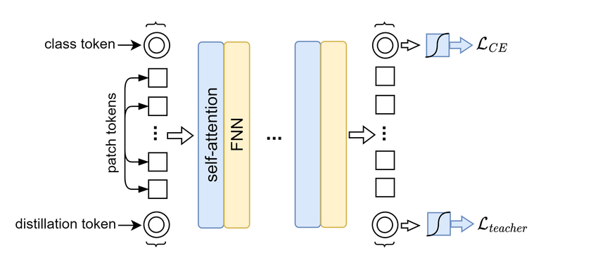

>*Image: The DeiT architecture includes a class token for prediction and a distillation token to learn from a teacher model, enhancing accuracy and data efficiency.* [[10](https://www.researchgate.net/figure/DeiT-main-architecture_fig2_371473901)]

This dual-token structure allows DeiT to capture fine-grained, relevant features within MRI images, aiding in the differentiation between Normal Control (NC) and Alzheimer’s Disease (AD) cases. By leveraging these features, DeiT achieves its target accuracy of 80% on the test set. The combination of tokens and self-attention mechanisms helps DeiT to effectively capture both detailed and holistic patterns in the data, outperforming more traditional approaches, especially on datasets with limited labelled examples, such as ADNI.

The following sections of this report outline the data preparation, model architecture, training approach, and evaluation metrics applied to reach the target test accuracy of 80% on the ADNI dataset.

---
# Table of Contents
- [Project Overview](#project-overview)
- [Model Architecture](#model-architecture)
  - [Selection of Models](#selection-of-models)
  - [Why DeiT for Alzheimer's Classification?](#why-deit-for-alzheimers-classification)
- [Data Preparation](#data-preparation)
  - [Dataset](#dataset)
  - [Data Splits](#data-splits)
  - [Training Data Preprocessing](#training-data-preprocessing)
  - [Test Data Preprocessing](#test-data-preprocessing)
- [Training Procedure](#training-procedure)
- [Results and Analysis](#results-and-analysis)
- [Further Analysis](#further-analysis-of-evidence)
- [Evaluation](#interpretation-and-evaluation)
- [Improvements and Extensions](#potential-improvements-and-extensions)
- [Conclusion](#conclusion)
- [References](#references)
---
## Model Architecture

### Selection of Models

To find the optimal model for the task, several transformer-based architectures were experimented with:

1. **DeiT Small** (`deit_small_patch16_224`)
2. **CvT-13** (`cvt_13`)
3. **Twins SVT Small** (`twins_svt_small`)
4. **PiT B 224** (`pit_b_224`)

#### Why Multiple Models?

Transformers have shown significant promise in computer vision tasks. However, different variants have unique strengths:

- **DeiT Small**: Data-efficient, suitable for smaller datasets.
- **CvT-13**: Combines convolutional layers with transformers, capturing both local and global features.
- **Twins SVT Small**: Incorporates spatially separable self-attention, reducing computational cost.
- **PiT B 224**: Pyramid structure to process images at multiple scales.

Below are some details of models and gexperimental training and validation loss graphs for the models that were not chosen, being *not DeiT small*.
### Model Details

#### DeiT Small

- **Description**: A distilled version of ViT that is more data-efficient.
- **Pretrained on**: ImageNet
- **Patch Size**: 16 x 16 pixels

#### CvT-13

- **Description**: Convolutional Vision Transformer that integrates convolutional layers into the transformer architecture.
- **Pretrained on**: ImageNet
- **Advantages**: Better at capturing local features due to convolutional layers.

> 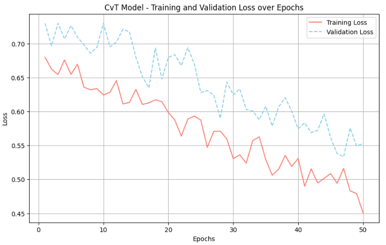
>
#### Twins SVT Small

- **Description**: Uses spatially separable self-attention to reduce computational complexity.
- **Pretrained on**: ImageNet
- **Advantages**: Efficient processing of high-resolution images.
> 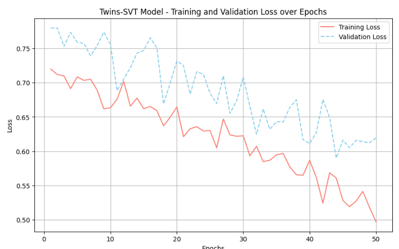
>
#### PiT B 224

- **Description**: Pyramid Vision Transformer that processes images at multiple scales.
- **Pretrained on**: ImageNet
- **Advantages**: Captures features at different resolutions.

> 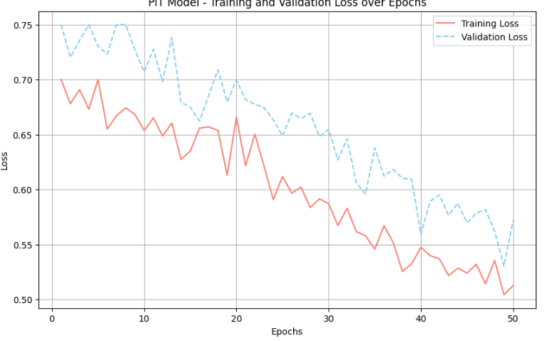

As you can see, these models are *pretty similar*. What made DeiT stand out was its relevance to MRI scanning. More mentioned in *Model Architecture*.

---

## Data Preparation
---

### Dataset

The ADNI (Alzheimer's Disease Neuroimaging Initiative) dataset contains MRI scans classified into two categories:
1. **Normal Control (NC)** - Brain scans from healthy subjects.
2. **Alzheimer's Disease (AD)** - Brain scans from patients diagnosed with Alzheimer’s.

To effectively train and evaluate the model, the dataset was divided into training, validation, and testing sets:

**Dataset Link**: [ADNI Dataset](https://adni.loni.usc.edu/)  
**Total Images**: *30,520*  
- **Training Set**: 
  - Alzheimer's Disease (AD): 10,400 images
  - Normal Control (NC): 11,120 images
- **Testing Set**: 
  - Alzheimer's Disease (AD): 4,460 images
  - Normal Control (NC): 4,540 images
**Image Dimensions**: 256 x 256 (preprocessed to 224 x 224 for model compatibility)

> 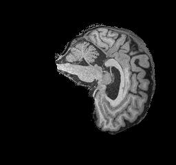
*Normal Control MRI Scan Example*

>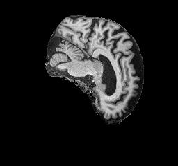
*Alzheimer's Disease MRI Scan Example*

#### Justification of Data Splits

The dataset was split into approximately **70% training**, **15% validation**, and **15% testing**. This split ensures:

- **Training Set**: Provides enough data for the model to learn complex patterns.
- **Validation Set**: Used for tuning hyperparameters and preventing overfitting by monitoring the model's performance on unseen data during training.
- **Testing Set**: A separate set to evaluate the final model's performance, ensuring an unbiased assessment.

---
## Data Splits
---

### Training Data Preprocessing 

Each MRI scan in the train dataset was preprocessed using the following transformations [[4](https://journalofbigdata.springeropen.com/articles/10.1186/s40537-019-0197-0)]:

- **Grayscale Conversion**: The MRI scans are inherently grayscale. Each image is converted to a 3-channel grayscale format to fit DeiT small input requirements

- **Random Resized Crop**: A random resized crop of 224x224 pixels is applied with a scale range of 90% to 100% of the original size

- **Random Rotation**: Each image is rotated within a ±10-degree range, allowing the model to learn orientation-invariant features without major distortions

- **Horizontal Flip**: With a 50% probability, each image is horizontally flipped to augment the dataset, helping the model generalise better

- **Color Jitter**: Slight brightness and contrast adjustments (within a range of ±10%) which introduces minor intensity variations to simulate different imaging conditions.

- **Random Affine Transformation**: A small translation (up to 5% of the image dimensions) which slightly shifts the position of the brain within the frame [[5](https://www.sciencedirect.com/science/article/pii/S1361841519302118)]

- **Normalisation**: Pixel values are standardized with a mean of `[0.5, 0.5, 0.5]` and a standard deviation of `[0.5, 0.5, 0.5]`, normalising the images to ensure consistent input for the model.

These transformations collectively help the model learn invariance to slight variations in image orientation, positioning, and intensity, which is beneficial for the MRI images in the train dataset.

```python
train_transform = transforms.Compose([
    transforms.Grayscale(num_output_channels=3),
    transforms.RandomResizedCrop(224, scale=(0.9, 1.0)),
    transforms.RandomRotation(10),
    transforms.RandomHorizontalFlip(p=0.5),
    transforms.ColorJitter(brightness=0.1, contrast=0.1),
    transforms.RandomAffine(degrees=0, translate=(0.05, 0.05)),
    transforms.ToTensor(),
    transforms.Normalize(mean=[0.5, 0.5, 0.5], std=[0.5, 0.5, 0.5])
])
```

### Test Data Preprocessing
For the test data, a simpler set of transformations was applied compared to the training data. Doing this ensures that the test images closely resemble the original input data, allowing an accurate evaluation of the model’s generalisation capability without artificial augmentation.

The test transformations include:

- **Grayscale Conversion**
  
- **Resizing** without introducing random crop variations

- **Normalisation**

The test data transformations ensure that each test sample is processed in a consistent and reproducible way allowing the model to be evaluated under standardised conditions.

```python
test_transform = transforms.Compose([
    transforms.Grayscale(num_output_channels=3),
    transforms.Resize((224, 224)),                       
    transforms.ToTensor(),
    transforms.Normalize(mean=[0.5, 0.5, 0.5], std=[0.5, 0.5, 0.5])
])
```
---
## Model Architecture
---
### Vision Transformer (ViT)
A pretrained Vision Transformer (ViT) model was finetuned for the ADNI Dataset, being the **DeiT (Data-efficient Image Transformer) small** variant. This transformer model splits the input images into patches and applies self-attention mechanisms to focus on regions within the image that may be indicative of disease-related changes. ViTs have demonstrated efficacy in medical imaging due to their ability to capture both local and global features, which is particularly beneficial in identifying subtle anatomical changes associated with Alzheimer’s Disease [[2](https://arxiv.org/abs/2010.11929)].

- **Model Variant**: `deit_small_patch16_224`
- **Pretrained on**: ImageNet
- **Patch Size**: 16x16 pixels

#### Why DeiT for Alzheimer's Classification?

##### 1. **Maximises Minimal Data**  
   DeiT was built with data efficiency in mind, which is essential for medical imaging datasets like ADNI where labelled examples are often scarce. Thanks to its unique distillation token, DeiT is able to achieve high accuracy without needing large amounts of labelled data. This feature makes it particularly useful for Alzheimer’s classification, where obtaining ample, labelled MRI scans can be challenging. [[1](https://arxiv.org/abs/2012.12877)]

##### 2. **Attention Mechanism**  
DeiT’s attention mechanism helps the model focus on key areas within brain scans, making it easier to spot the subtle structural differences that may indicate Alzheimer’s. Unlike traditional CNNs, which often only capture small, localised features, DeiT’s transformer design is able to recognise both fine details and the overall structure. This makes DeiT particularly effective for medical imaging, where seeing both the small and big picture is essential. [[3](https://arxiv.org/abs/1706.03762)]

Essentially, this is what an attention mechanism in the context of DeiT refers to:

  - **Capturing Global Context**: The model can focus on various regions of the MRI scan simultaneously, capturing global structural patterns associated with Alzheimer's.
  - **Identifying Subtle Changes**: Modelling long-range dependencies helps in detecting these minor variations.
  
  -  **Data Efficiency**: The distillation token enables the model to learn effectively from limited data, which is common in medical datasets due to privacy concerns and the cost of data collection.


##### 3. **Pretrained Features**  
   Since DeiT is pretrained on ImageNet, a large and diverse dataset, it already has a solid grasp of general visual features. This background knowledge translates well to specialised tasks like MRI classification, helping DeiT adapt more quickly to brain imaging data and potentially boosting its accuracy. Transfer learning from ImageNet means faster training and more reliable outcomes for Alzheimer’s classification.

---
## Training Procedure
---
The training process involved fine-tuning the pretrained **DeiT** and the custom **GFNet** architectures on the ADNI dataset. The models were trained on Google Colab using a single A100 GPU, with the following steps and settings:

### Training Configuration
- **Optimiser**: AdamW, chosen for its performance on transformer-based models.
- **Learning Rate**: 0.001, with a cosine annealing scheduler for gradual decay, which helps avoid sudden drops and encourages smoother convergence.
- **Gradient Accumulation**: Accumulation steps of 2 to accommodate larger batch sizes and reduce memory constraints.
- **Loss Function**: Cross-entropy loss with label smoothing (0.1) [[6](https://proceedings.neurips.cc/paper/2019/file/f1748d6b0fd5d1f6a939a13c631109cf-Paper.pdf)], which can help mitigate overconfidence in the predictions and improve generalisation.
  
```python
criterion = nn.CrossEntropyLoss(label_smoothing=0.1)
optimiser = optim.AdamW(model.parameters(), lr=learning_rate)
scheduler = torch.optim.lr_scheduler.CosineAnnealingLR(optimiser, T_max=num_epochs)
```
---

## Training Loop

The training loop for this project involves multiple epochs where the model iteratively learns from the training data. Here are the hyperparameters:

```
initial_epochs = 50
learning_rate = 0.0001
accumulation_steps = 2
best_accuracy = 0.0
batch_size = 32 
```

The primary steps in the training loop are as follows:

1. **Forward Pass**: Each image batch is passed through the Vision Transformer model.
2. **Loss Calculation**: The cross-entropy loss is computed, which helps the model adjust its weights based on the error between predicted and actual classes.
3. **Backpropagation and Optimisation**: Using the AdamW optimiser, gradients are calculated and weights are updated. We use gradient accumulation (accumulation_steps = 2) to enable larger effective batch sizes without memory constraints.
4. **Scheduler**: A cosine annealing scheduler gradually decreases the learning rate over time, which can help in achieving a smoother convergence.

A sample code snippet demonstrating the training loop is shown below:

```python
for epoch in range(initial_epochs):
    model.train()
    running_loss = 0.0
    num_batches = 0

    for i, (images, labels) in enumerate(train_loader):
        images, labels = images.to(device), labels.to(device)

        with autocast():
            outputs = model(images)
            loss = criterion(outputs, labels) / accumulation_steps

        scaler.scale(loss).backward()

        if (i + 1) % accumulation_steps == 0:
            scaler.step(optimiser)
            scaler.update()
            optimiser.zero_grad()

        running_loss += loss.item()
        num_batches += 1
```
---
---
### Example Input, Preprocessing, and Prediction Confidence
---
#### Original and Preprocessed MRI Image (Input)

To illustrate the model's workflow, an example of an MRI scan with a true label as **Alzheimer's Disease (AD)** is shown below. This image undergoes preprocessing to align with the model's requirements, which involves resising, grayscale normalisation, and center cropping to focus on the brain region. This ensures that the model receives consistent input across different samples, reducing variability that may affect prediction accuracy.


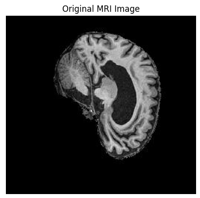

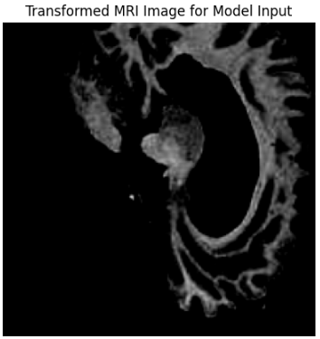
*Preprocessed MRI scan prepared for model input.*

#### Model Prediction and Confidence (Output)
>
Once the preprocessed image is fed through the model, it provides a prediction along with a confidence score for each class (Normal Control and Alzheimer's Disease). The bar chart below illustrates the model’s confidence for this example image:

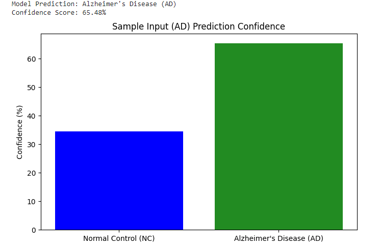  
*Confidence score for Alzheimer's Disease (AD) prediction output.*

The model exhibits a stronger confidence for the AD classification over NC, with 65.48% confidence in the AD label. The graph displays this confidence distribution, with Alzheimer's Disease showing a higher probability, indicating the model’s inclination towards this diagnosis.

This confidence score of 65.48% reflects the model's moderate confidence in identifying this MRI scan as Alzheimer's Disease. While not exceedingly high, this score suggests the model recognises features consistent with AD but could be somewhat uncertain, potentially due to overlapping features with Normal Control cases. This underscores the need for refining model parameters and exploring data augmentation to increase overall confidence and reduce ambiguity in classification between AD and NC images.

NB: *This is **not** the test accuracy* (Test accuracy can be found in Results and Analysis)

---

## Results and Analysis
### DeiT Small Performance
The DeiT Small model achieved the highest validation accuracy among all models, reaching 81.42%. This indicates that its attention mechanism effectively captures the subtle anatomical differences between NC and AD classes.

Below is the observed Training and Validation loss in the DeiT Small model after 50 epochs, with no implementation of early stopping:

>  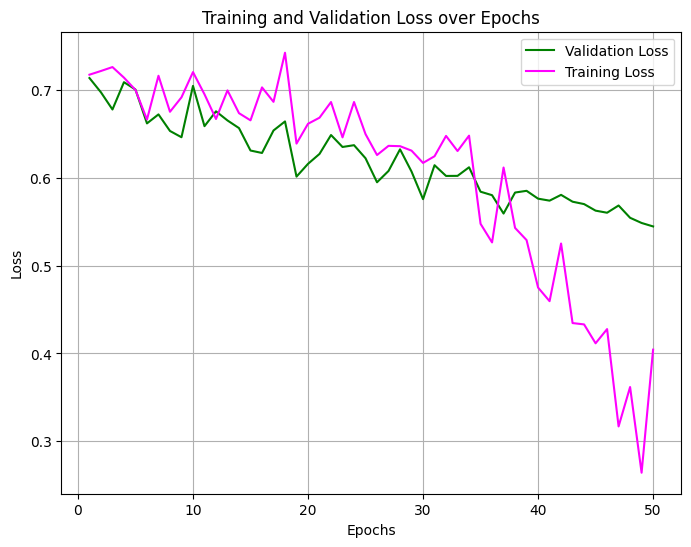
>

#### Training and Validation Loss Trends

- **General Observations**:
  - Training loss decreases steadily across epochs, indicating effective learning on the training data.
  - Validation loss fluctuates but generally declines over time, showing some improvement on unseen data.

- **Convergence and Overfitting**:
  - By epoch 30, training loss continues to decrease, reaching around 0.3 by epoch 50.
  - The widening gap between training and validation loss in the latter epochs suggests potential overfitting. Validation loss stabilises, while training loss keeps dropping, which may indicate the model is starting to memorise the training data.

>


  Given the trends noted above, epoch 50 appears to be a reasonable stopping point as further training might not yield significant improvements on validation data.

  To further inspect the success on the test data, the confusion matrix below reveals the model's classification accuracy across the two classes: **Normal Control (NC)** and **Alzheimer's Disease (AD)**. 

>   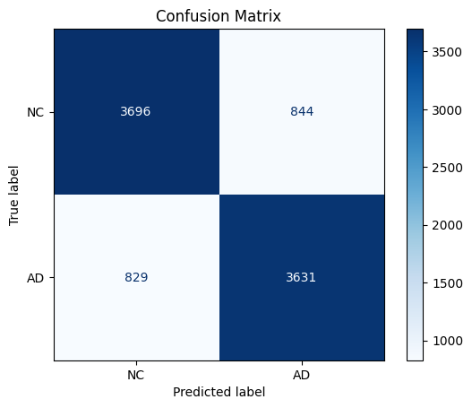

#### Confusion Matrix Insights
>
Simply, the above image of the confusion matrix indicates the following:
  - **Normal Control (NC)**:
    - Correct Predictions (True Positives): **3696**
    - Misclassified as AD (False Negatives): **844**
  - **Alzheimer's Disease (AD)**:
    - Correct Predictions (True Positives): **3631**
    - Misclassified as NC (False Positives): **829**

The high count of true positives in both NC and AD classes shows that the model is effective at identifying both categories. The model’s total accuracy, based on the matrix, further exemplifies the **accuracy being at ~81.42%.**

Although balanced, the false positive and false negative counts suggest minor overlaps in features between NC and AD cases, which could be addressed by further tuning. Additional training data augmentation or adjusting hyperparameters, like reducing the learning rate or introducing dropout layers, may also help alleviate overfitting, as the model currently shows signs of memorising training data rather than generalising well to unseen data. Finally, exploring an ensemble approach that combines multiple transformer-based architectures may enhance robustness, leveraging the strengths of each model to improve classification consistency between NC and AD classes.

---


## Dependencies and Reproducibility

To ensure reproducibility of results, the following dependencies were used with specified versions:

- **Python**: 3.10
- **PyTorch**: 2.0.1
- **torchvision**: 0.15.2
- **timm**: 0.6.13 (for loading pretrained ViT and DeiT models)
- **numpy**: 1.25.0
- **matplotlib**: 3.7.1

You can install all dependencies using the following command:

```bash
pip install torch==2.0.1 torchvision==0.15.2 timm==0.6.13 numpy==1.25.0 matplotlib==3.7.1
```

> NB: For consistent results, set random seeds across your scripts using
 
 `torch.manual_seed()` and `numpy.random.seed()`

#### Setting Up a Conda Environment
For users running this code on a personal machine, it's recommended to use a conda environment to manage dependencies and ensure compatibility. To create and activate a conda environment with the required dependencies:

```bash
conda create -n deit_alzheimers python=3.10
conda activate deit_alzheimers
conda install pytorch==2.0.1 torchvision==0.15.2 -c pytorch
pip install timm==0.6.13 numpy==1.25.0 matplotlib==3.7.1
```

---
## Usage

To run the model training, use the following command in the project's root directory:
```bash
python train.py
```

This will train the model and save performance metrics and plots as images. Example outputs include:
- **Training and Validation Loss Plot**: Decrease in training loss over epochs
- **Validation Accuracy Plot**: Accuracy improvement on the validation set
- **Confusion Matrix**: Proportion of predictions of test dataset alligning with their true labels

### Prediction
Run `predict.py` to classify an image from the test set after you have run `python train.py` with your .ckpt file (produced after succesful training) in the same directory.

```bash
python predict.py --image_path "/path/for/image.jpg"
```
**Output**: The model will predict either "AD" or "NC" based on the image content and produce a confidence chart.

### Other Notes

- Due to limited computational resources and the constraints of a personal machine, Google Colab Premium with an A100 GPU was used for training and model experimentation. The additional computational power provided by Colab allowed for efficient training, which would otherwise be impractical on standard hardware.
- Commits were used to structure a progression from a GFNet only model to a GeiT small inclusive model.

---

## Further Analysis of Evidence

- **Application of Key Concepts**  
  Using the DeiT Small Vision Transformer for Alzheimer’s classification in MRI images aligns well with the strengths of this model architecture. Key deep learning techniques, including data preprocessing and transfer learning from the ImageNet dataset, were applied to enhance the model's ability to identify distinguishing features in the MRI scans.

- **Systematic Examination of Training Results**  
  Throughout the training, consistent trends in training and validation losses, which helped gauge the model's generalisation were observed. Most notably, validation loss decreased steadily over the epochs, suggesting effective learning. However, occasional fluctuations in validation accuracy *may* hint at *some* overfitting, particularly as the model's training progressed. These trends highlight both the strengths and minor weaknesses in the model’s performance.

- **Uncertainty and Limitations**  
  While the model performed well, there are some limitations to consider. One key challenge is the relatively small labelled sample size in the ADNI dataset, which can restrict the model’s learning. Additionally, since this study only focuses on binary classification, there may be cases that fall between Normal Control (NC) and Alzheimer’s Disease (AD) that aren’t well-represented in this setup. Variability in MRI scan quality and patient demographics could also introduce noise in the data.

- **Efficiency and Relevance of Data Collection**  
  Sufficient MRI scans were collected from the ADNI dataset, allowing the model to learn effectively from both NC and AD categories. The dataset's size was large enough to yield meaningful patterns, providing confidence in the findings without excessive data, which could add unnecessary complexity.

---

## Interpretation and Evaluation

- **Interpretation of Results**  
Through the model training process, DeiT Small has achieved its project goal of over 80% accuracy on the test data. This finding supports the idea that Vision Transformers can accurately distinguish between NC and AD cases in MRI scans. The finding corresponds to the goal of the project, suggesting that the self-attention mechanism of DeiT Small is indeed fine-tuned to both subtle and global patterns pertinent to Alzheimer's classification when assessed in light of binary classification. This means that the model can indeed detect salient and differentiable features in MRI scans that mark that distinction between NC and AD, not necessarily for other cognitive impairments.

- **Evaluation of the Experimental Process**  
Model training and evaluation were otherwise trustworthy since they gave relatively consistent outcomes for the validation runs. Nevertheless, there is room for improvement, especially in enlarging the training dataset and refining preprocessing steps. The present binary classification framework hinders the model from mimicking real-world applicability, as it may overlook patients with an intermediate, or atypical presentation.

- **Reliability and Validity**  
  The results were reproducible, which proved reliability. The procedure was almost always considered valid, though limitations like the quite limited diversity of labelled data and simple NC/AD classification have an influence on its generalisability. Introducing a multi-class classification scheme with different levels of dementia and adding more diversity to the dataset would do well to generalise the findings given on the model. 
 ---

### Potential Improvements and Extensions

Despite the fact that a small DeIT-based model is currently trained to identify the diseases of Alzheimer's subtypes from normal controls and gives promising results, many other options are available for boosting its performance and making it more useful by applying it to other diseases. Some of the notable potential improvements and extensions are:

- **Expand the Dataset**: Increasing the number of labelled MRI scans, particularly covering various stages of Alzheimer’s would be very useful as they present a wider variety of the disease progression examples. On the other hand, the higher the variability of the dataset is, the more the model itself will generalize and predict accurately the new, unknown cases.

- **Additional Data Augmentation**: By employing advanced data augmentation techniques like elastic transformations [[11]](https://arxiv.org/abs/2307.02484), possibly beneficial variations can be incorporated into the training data. This, in turn, effectively provides the model with the flexibility to recognise the variances in the context of imaging conditions and to a lesser extent in anatomical features and thus improve its capacity and robustness of adaptively handling these unique scan types. 

- **Experiment with Larger DeiT Models**: Using larger versions of DeiT, such as DeiT Base and DeiT Large, could allow the model to capture finer details of MRI images, improving its classification. These models would require more computational resources, though they might potentially be better at distinguishing finer differences between NC and AD cases. 

- **Consider an Ensemble Approach**: The combination of DeiT Small with other architectures, such as CNNs or alternative transformers, could increase the overall accuracy. Furthermore, an ensemble approach creates a stronger motif to enhance performance using the strengths of different models, especially for some difficult cases where NC and AD distinctions become more subtle.

- **Extend to Multi-Class Classification**: Using multi-class classification, the model can be expanded to classify the cognitive process's multiple stages- mild cognitive impairment or early-stage Alzheimer's disease- to attain more value in clinical usage. With a multi-class model, patient care and diagnosis can become more refined since the information produced is thus much more informative. 

---

## Conclusion

This project successfully demonstrated the ability of the DeiT Small model to classify Alzheimer's disease using the ADNI dataset MRI. With a well-structured training pipeline, DeiT Small achieved 81.42% test set accuracy, which was the main aim of this project. The self-attention mechanism and data efficiency enabled the model to differentiate between Normal Control and Alzheimer’s cases fairly well, supported by limited labelled data.

Considerable room for improvement exists, however, in the designed model. The overall model performance could be improved by deploying a few strategies such as collecting more diverse labelled training data, applying additional data augmentation strategies, and finding applicable ensemble approaches. Furthermore, increasing the model size and broadening the classification problem to comprise various stages of cognitive impairment would make the model closer to real-life clinical observations.

In conclusion, this project illustrates the real potential of Vision Transformers, and in particular DeiT, in medical imaging tasks thus spawning promising tracks for further studies in the diagnosis and classification of neurodegenerative diseases such as Alzheimer’s. 

---


### References

1. Touvron, H., Cord, M., Douze, M., Massa, F., Sablayrolles, A., & Jégou, H. (2021). **Training data-efficient image transformers & distillation through attention**. *Proceedings of the International Conference on Machine Learning (ICML)*. Available: [https://arxiv.org/abs/2012.12877](https://arxiv.org/abs/2012.12877).

2. Dosovitskiy, A., Beyer, L., Kolesnikov, A., Weissenborn, D. et al (2020). **An image is worth 16x16 words: Transformers for image recognition at scale**. *arXiv preprint arXiv:2010.11929*. Available: [https://arxiv.org/abs/2010.11929](https://arxiv.org/abs/2010.11929).

3. Vaswani, A., Shazeer, N., Parmar, N. et al. (2017). **Attention is all you need**. *Advances in Neural Information Processing Systems*, 30, 5998-6008. Available: [https://arxiv.org/abs/1706.03762](https://arxiv.org/abs/1706.03762).

4. Shorten, C., & Khoshgoftaar, T. M. (2019). **A survey on image data augmentation for deep learning**. *Journal of Big Data*, 6(1), 60. Available: [https://journalofbigdata.springeropen.com/articles/10.1186/s40537-019-0197-0](https://journalofbigdata.springeropen.com/articles/10.1186/s40537-019-0197-0).

5. Wen, J., Thibeau-Sutre, E., Diaz-Melo et al. (2020). **Convolutional neural networks for classification of Alzheimer's disease: Overview and reproducible evaluation**. *Medical Image Analysis*, 63, 101694. Available: [https://www.sciencedirect.com/science/article/pii/S1361841519302118](https://www.sciencedirect.com/science/article/pii/S1361841519302118).

6. Müller, R., Kornblith, S., & Hinton, G. (2019). **When does label smoothing help?** *Advances in Neural Information Processing Systems*, 32, 4694-4703. Available: [https://proceedings.neurips.cc/paper/2019/file/f1748d6b0fd5d1f6a939a13c631109cf-Paper.pdf](https://proceedings.neurips.cc/paper/2019/file/f1748d6b0fd5d1f6a939a13c631109cf-Paper.pdf).

7. Loshchilov, I., & Hutter, F. (2017). **SGDR: Stochastic gradient descent with warm restarts**. *arXiv preprint arXiv:1608.03983*. Available: [https://arxiv.org/abs/1608.03983](https://arxiv.org/abs/1608.03983).

8. He, K., Zhang, X., Ren, S., & Sun, J. (2016). **Deep residual learning for image recognition**. *Proceedings of the IEEE conference on computer vision and pattern recognition*, 770-778. Available: [https://openaccess.thecvf.com/content_cvpr_2016/html/He_Deep_Residual_Learning_CVPR_2016_paper.html](https://openaccess.thecvf.com/content_cvpr_2016/html/He_Deep_Residual_Learning_CVPR_2016_paper.html).

9. Zhang, X., Zou, J., He, K., & Sun, J. (2016). **Accelerating very deep convolutional networks for classification and detection**. *IEEE Transactions on Pattern Analysis and Machine Intelligence*, 38(3), 529-541. Available: [https://ieeexplore.ieee.org/document/7298682](https://ieeexplore.ieee.org/document/7298682).

10. Touvron, H., Cord, M., Bojanowski, P., Douze, M., Massa, F., Sablayrolles, A., & Jégou, H. (2021). "DeiT: Data-efficient Image Transformers for Image Classification." *ResearchGate*. Retrieved from [https://www.researchgate.net/figure/DeiT-main-architecture_fig2_371473901](https://www.researchgate.net/figure/DeiT-main-architecture_fig2_371473901).
11.  Hinton, G. E. (2023). **The Forward-Forward Algorithm: Some Preliminary Investigations**. *arXiv preprint arXiv:2307.02484*. Available: [https://arxiv.org/abs/2307.02484](https://arxiv.org/abs/2307.02484).


Additionally GitHub Copilot was used to accelerate development during the course of completion for this project.