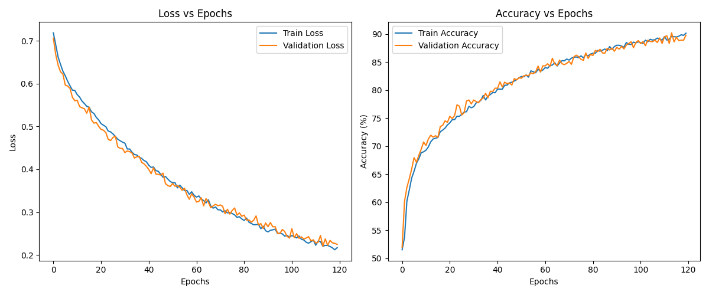
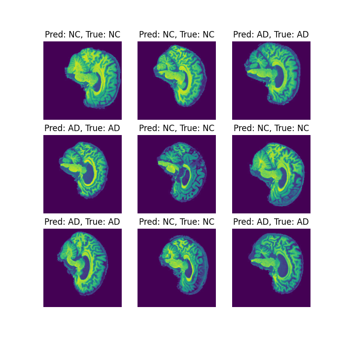

# Alzheimer's disease classification using GFNet
Alzheimer's disease is a degenerative brain disorder primarily characterized by memory loss and cognitive decline. Early diagnosis and classification of Alzheimer's disease are crucial for effective treatment and care. The aim of this project is to develop a vision transformer capable of classifying Alzheimer's disease based on brain MRI scans. For this purpose, we utilize GFNet (Global Filter Networks), a specialized architecture designed for medical imaging tasks. The model was trained on the Alzheimer's Disease Neuroimaging Initiative (ADNI) dataset and achieved a test accuracy of 76.57%.

## Model Architecture
The overall architecture of the Global Filter Network can be seen in the following illustration:

GFNet (Global Filter Networks) is a vision transformer architecture designed for image classification tasks. 
Its key features include:

Patch Embedding: 
GFNet divides the input image into non-overlapping patches of size 𝐻 × 𝑊. 
Each patch is flattened into a vector, creating 𝐿 tokens with a dimension of 𝐷.
This process allows the model to capture local features while reducing computational complexity.

Global Filter Layer:
GFNet replaces the self-attention layer in ViTs with three key operations: a 2D discrete Fourier transform, an element-wise multiplication between frequency-domain features and learnable global filters, and a 2D inverse Fourier transform. The overall
complexity time of this operation is (O(L log L))

FFN:
The output tokens from the Global Filter Layer are processed by a Feedforward Network, consisting of a Multi-Layer Perceptron (MLP) and undergoing layer normalization.

Global Average Pooling and Linear Classifier:
After the FFN, a global average pooling layer summarizes the output tokens into a single feature vector. This vector is then passed to a linear classifier, producing the final predictions for the classification task.

## Data Loading and Preprocessing
### ADNI Dataset
The preprocessed ADNI dataset comprises a total of 30,520 brain MRI images, which are divided into training and testing folders. Each folder contains subfolders for Alzheimer's Disease (AD) and Cognitive Normal (NC) categories. The dataset structure is as follows:

Testing Set
    - AD: 4,460 images
    - NC: 4,540 images

Training Set
    - AD: 10,400 images
    - NC: 11,120 images

Note, each image is a grayscale representation of a brain MRI.

### Data Loading
The ADNI dataset can be loaded from the following path on the Rangpur HPC:

`/home/groups/comp3710/ADNI/AD_NC`

The custom `ADNIDataset` class allows for loading both training and testing datasets. Each image in the dataset is labeled as either:
- `1` for Alzheimer's Disease (AD)
- `0` for Normal Control (NC)

When calling the `__getitem__` method, images are opened as grayscale images. 
The default split for training and validation datasets is set to 80% training and 20% validation.

### Preprocessing and Augmentation
The following augmentations are applied to the training set:
    RandomRotation(degrees=10),
    RandomResizedCrop(size=224),
    ColorJitter(brightness=(0.8, 1.2)), 
    ToTensor(),
    Normalize(mean=[0.0062], std=[0.0083])

The testing set undergoes the following preprocessing:
    Resize(256),
    CenterCrop(224),
    ToTensor(),
    Normalize(mean=[0.0062], std=[0.0083])

Note: the normalization values were calculated based on the ADNI preprocessed dataset.

## Training and Testing
### Training Outputs
The GFNet model is trained under the below hyperparameters in train.py:

| Hyperparameter                | Value        |
|-------------------------------|--------------|
| Batch Size                    | 8            |
| Base Learning Rate            | 0.0001      |
| Number of Epochs              | 120          |
| Criterion                     | CrossEntropyLoss |
| Optimizer                     | Adam         |
| Scheduler                     | CosineAnnealingWarmRestarts |
| Scheduler - T_0              | 10           |
| Scheduler - T_mult           | 2            |
| Scheduler - eta_min          | 1e-6         |

Under the specified hyperparameters, the trained model achieved 90% accuracy on both training and validation datasets. The training and validation accuracies remained within 1% of each other, showcasing the model's good generalization capabilities, absence of overfitting, and overall robustness. Despite the lack of early stopping, these results indicate that the model effectively learned from the training data while maintaining its performance on unseen validation data. 

### Testing Outputs
Predictions are computed in predict.py.

The trained model achieved an accuracy of 76.57% on the ADNI test set, indicating a reasonable level of performance in making predictions based on unseen data. This accuracy reflects the model's ability to generalize well beyond the training and validation datasets, though there remains room for improvement.

To visualise the model's performance, the do_prediction() function's output is shown below. This function performs a random sampling of nine images from the test set and processes each image through the trained model. The output of this function is a visual representation that displays both the predicted labels and the ground truth labels for each sampled image.

## Dependencies and Reproducibility
### Dependencies
To ensure the proper functioning of the GFNet model, please install the following dependencies:
- `timm`
- `torchvision`
- `torch >= 1.8.0`
- `Python 3.12.7`
- `Matplotlib`

For consistent results, it is recommended to create a virtual environment and install the specified dependencies using a package manager like `pip` or `conda`.

### How to Run Code
Change directory to your desired dataset.
Note: If you are running a seperate dataset from ADNI, you may have to change the normalization values in train.py.

On Local Machine:
1. Run train.py
2. Run Predict.py

On Rangpur:
1. Copy and paste the files onto the Rangpur
2. Make seperate file for slurm script
3. Run slurm file

## References
mildlyoverfitted. (2021, March 5). Vision Transformer in PyTorch. YouTube. https://www.youtube.com/watch?v=ovB0ddFtzzA

Rao, Y., Zhao, W., Zhu, Z., Zhou, J. and Lu, J. (2023). GFNet: Global Filter Networks for Visual Recognition. IEEE Transactions on Pattern Analysis and Machine Intelligence, 45(9), pp.10960–10973. doi:https://doi.org/10.1109/tpami.2023.3263824.

raoyongming. (2021). GitHub - raoyongming/GFNet: [NeurIPS 2021] [T-PAMI] Global Filter Networks for Image Classification. GitHub. https://github.com/raoyongming/GFNet

‌